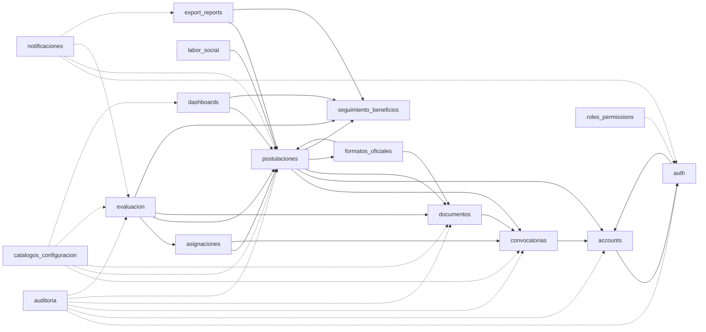
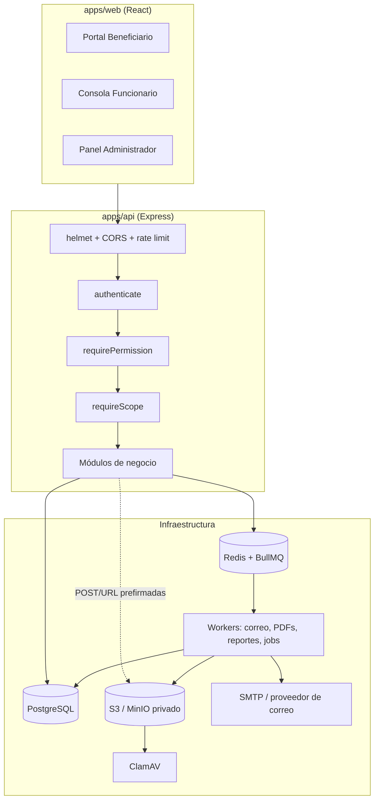

# Plan de Desarrollo Modular — Plataforma FOEST
## Fondo para la Educación Superior de Tocancipá
### Especificación Técnica y Arquitectura Unificada (v2)

Este documento centraliza la arquitectura, las convenciones y la hoja de ruta de la plataforma web del **Fondo para la Educación Superior de Tocancipá (FOEST)**, bajo el Acuerdo Municipal 023 de 2025 (con concordancia a verificar con el Acuerdo 037 de 2025).

Documentos de apoyo:
- [DECISIONES.md](./DECISIONES.md): decisiones canónicas compartidas (estados, permisos, reglas transversales). **Si un módulo la contradice, gana ese documento.**
- [PENDIENTES.md](./PENDIENTES.md): puntos abiertos que requieren validación jurídica o del FOEST.
- [CAMBIOS_V2.md](./CAMBIOS_V2.md): qué cambió respecto de la v1 y por qué.

---

## 1. Stack Tecnológico

| Capa | Tecnología | Notas |
|---|---|---|
| Backend | Node.js 20+ LTS, TypeScript, Express (modular por capas) | `apps/api` |
| Base de datos | PostgreSQL 15+ administrado (Supabase solo como hosting) | JSONB para formularios; triggers para estados terminales; sin Supabase Auth |
| ORM | Prisma | Migraciones declarativas |
| Autenticación | JWT RS256 (access 15 min) + refresh rotativo en cookie `httpOnly; Secure; SameSite=Strict` | bcrypt 12 rondas; ver `auth.md` |
| Archivos | S3 compatible (MinIO en desarrollo), bucket privado con cifrado en reposo | POST prefirmado de carga, URL prefirmada de lectura de 5 min, antivirus ClamAV |
| Colas | Redis + BullMQ | Correos (outbox), PDFs, reportes, jobs programados, refresco de vistas |
| Documentos | Puppeteer + Handlebars, pdf-lib, ExcelJS, qrcode | Formatos GE-F041, GE-F043, GE-F038 |
| Frontend | React 18 + TypeScript + Vite, TanStack Query, Tailwind, Recharts | `apps/web`; mobile-first, WCAG AA |
| Validación | Zod | Esquemas compartidos en `packages/shared` |
| Pruebas | Jest + Supertest, Vitest + RTL, Playwright (E2E), k6 (carga) | Matriz de acceso rol×endpoint automática |

Estructura del repositorio:

```
apps/api/src/modules/<modulo>/     # backend por módulo
apps/api/src/shared/               # mailer, storage, audit, outbox, business-days, errors, crypto
apps/web/src/modules/<modulo>/     # frontend por módulo
packages/shared/src/<modulo>/      # esquemas Zod, enums y tipos compartidos
docs/                              # esta especificación
```

---

## 2. Convenciones Globales

Resumen; el detalle normativo está en [DECISIONES.md](./DECISIONES.md).

1. **API**: prefijo `/api/v1`, HTTPS obligatorio, `helmet`, error estándar `{ code, message, details? }`, paginación `?page&page_size`.
2. **Códigos de acceso**: `401` sin sesión, `403` si el **rol** no tiene el permiso, `404` si el recurso es ajeno/no asignado, `409`/`422` por reglas de negocio.
3. **Máquina de estados de postulación**: `BORRADOR → PENDIENTE → EN_EVALUACION → (APROBADA | RECHAZADA | EN_CORRECCION)`; `EN_CORRECCION → PENDIENTE` por subsanación; `DESISTIDA`. `APROBADA`, `RECHAZADA` y `DESISTIDA` son terminales. Definición única en `postulaciones.md`.
4. **Notificaciones**: siempre al correo principal y al alternativo/acudiente, por **outbox transaccional**; avisos in-app para los tres roles. Hacia el beneficiario el evaluador es anónimo ("Equipo FOEST").
5. **Auditoría**: todo evento relevante se registra dentro de la misma transacción de negocio (`auditoria.md`), incluidas lecturas de datos sensibles.
6. **Fechas**: `timestamptz`; reglas de plazo en `America/Bogota`; días hábiles con el calendario de festivos de Colombia.
7. **Formatos oficiales de la Alcaldía**: **GE-F041** (solicitud), **GE-F043** (pagaré con carta de instrucciones), **GE-F038** (certificación de labor social).

---

## 3. Matriz de Módulos

| Fase | Archivo | Módulo | Responsabilidad principal |
|:---:|---|---|---|
| **P0** | [catalogos_configuracion.md](./modules/catalogos_configuracion.md) | Catálogos y Configuración | Parámetros del sistema, festivos, catálogo SNIES, declaraciones juramentadas, texto de consentimiento |
| **P0** | [auditoria.md](./modules/auditoria.md) | Auditoría | Bitácora append-only en la misma transacción, lecturas sensibles, eventos de seguridad |
| **P0** | [notificaciones.md](./modules/notificaciones.md) | Notificaciones y Correo | Outbox transaccional, worker de correo, notificaciones in-app para todos los roles, recordatorios |
| **P1** | [auth.md](./modules/auth.md) | Autenticación y Sesiones | JWT RS256, refresh rotativo con ventana de gracia, invitaciones, anti-fuerza-bruta |
| **P1** | [accounts.md](./modules/accounts.md) | Cuentas y Perfiles | Funcionarios por invitación, perfil del beneficiario, consentimiento y habeas data |
| **P1** | [roles_permissions.md](./modules/roles_permissions.md) | Roles y Permisos | Matriz completa de permisos y alcance, respuestas 403/404 |
| **P1** | [convocatorias.md](./modules/convocatorias.md) | Convocatorias | Ciclo de vida, suspensión, ampliación, archivo, comité, cupos y presupuesto |
| **P1** | [documentos.md](./modules/documentos.md) | Gestión Documental | Carga a S3 con POST prefirmado, antivirus, versionado, matriz de requisitos |
| **P1** | [formatos_oficiales.md](./modules/formatos_oficiales.md) | Formatos GE-F041 y GE-F043 | Generación previa al envío, vínculo con soportes firmados, verificación pública |
| **P1** | [postulaciones.md](./modules/postulaciones.md) | Postulaciones | Formulario GE-F041, máquina de estados, envíos por ciclo, subsanación |
| **P2** | [asignaciones.md](./modules/asignaciones.md) | Asignación de Expedientes | Tomar/liberar/reasignar, conflicto de interés, bandeja mínima |
| **P2** | [evaluacion.md](./modules/evaluacion.md) | Evaluación | Chequeo por tipo de documento, dictamen por beneficio, ciclos |
| **P2** | [labor_social.md](./modules/labor_social.md) | Labor Social | Registro de horas y certificado GE-F038 |
| **P2** | [seguimiento_beneficios.md](./modules/seguimiento_beneficios.md) | Seguimiento de Beneficios | Otorgamientos, desembolsos, revocación, cupos, elegibilidad de renovación |
| **P2** | [beneficiario_dashboard.md](./modules/beneficiario_dashboard.md) | Portal del Beneficiario | Línea de tiempo, acciones pendientes, descargas |
| **P2** | [dashboard_funcionario.md](./modules/dashboard_funcionario.md) | Dashboard Funcionario | Métricas con vistas materializadas de grano correcto y k-anonimato |
| **P2** | [admin_dashboard.md](./modules/admin_dashboard.md) | Dashboard Administrador | Alertas operativas, carga del comité, visores de auditoría y configuración |
| **P3** | [export_reports.md](./modules/export_reports.md) | Reportes y Exportaciones | Resumen, consolidados XLSX/CSV, jobs asíncronos |

### Hitos sugeridos

1. **Hito 1 (P0 + P1)**: un estudiante puede registrarse, diligenciar la solicitud, generar y firmar los formatos, cargar soportes y enviar.
2. **Hito 2 (P2 núcleo)**: `asignaciones`, `evaluacion` y `seguimiento_beneficios` cierran el recorrido hasta la aprobación y el desembolso.
3. **Hito 3**: `labor_social` y dashboards.
4. **Hito 4 (P3)**: reportes y consolidados.

El hito 1 no es útil sin el recorrido de evaluación del hito 2; se recomienda planificar ambos como un mismo lanzamiento.

---

## 4. Dependencias entre módulos

Sin ciclos. La flecha indica "usa a". Detalle en [DECISIONES.md §16](./DECISIONES.md).



(`ACC ↔ AUTH` es la única dependencia bidireccional permitida y se resuelve con `SessionService` dentro de `auth`.)

---

## 5. Arquitectura global



---

## 6. Puntos abiertos

Los puntos que requieren decisión jurídica o del FOEST (pagaré y codeudor, acto administrativo del rechazo, retención de datos, reglas de renovación/reintegro, texto oficial de declaraciones, entre otros) están en [PENDIENTES.md](./PENDIENTES.md). Cada módulo marca con "a confirmar" los valores que dependen de ellos y los deja **parametrizados** en `catalogos_configuracion.md`, sin cablearlos en código.
