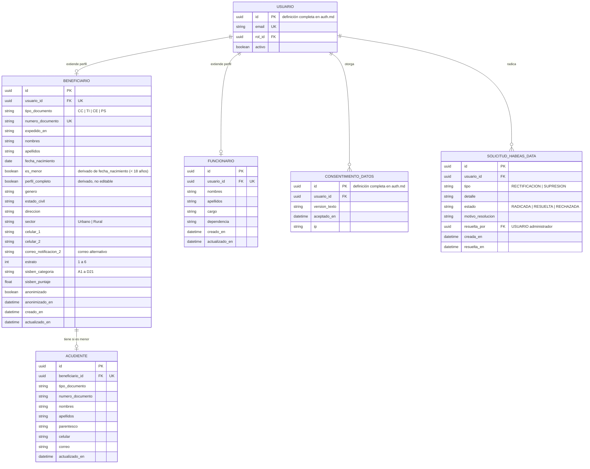

# Módulo: Accounts — Cuentas de Funcionarios y Perfiles de Beneficiarios

**Fase:** P1

## Objetivo
Administrar el ciclo de vida de las cuentas para los tres roles: alta de funcionarios por **invitación**, consulta, edición y deshabilitación de funcionarios y beneficiarios por el Administrador, y gestión del perfil personal del beneficiario (incluido el acudiente de menores de edad). Separa los datos de perfil de las solicitudes: la información editable reside aquí, mientras que cada postulación enviada conserva una copia inmutable (`perfil_snapshot`) como soporte probatorio. Implementa los derechos de Habeas Data (Ley 1581 de 2012): acceso, rectificación, supresión/anonimización y retención, y el registro del consentimiento.

`Funcionario` y `Administrador` son **perfiles de rol**: el funcionario tiene la tabla `FUNCIONARIO`; el administrador es únicamente un `USUARIO` con rol `ADMINISTRADOR` (no existe tabla `ADMINISTRADOR`). `USUARIO` se define una sola vez en `auth.md`.

## Archivos del Módulo

### Backend (`apps/api/src/modules/accounts/`)
- `accounts.model.ts` — Tipos Prisma/TypeScript: `Beneficiario`, `Acudiente`, `Funcionario`, `SolicitudHabeasData` (referencia a `Usuario` de `auth`).
- `accounts.service.ts` — Alta de funcionarios por invitación, edición, deshabilitación con revocación de sesiones, protección del último administrador, perfil del beneficiario (cálculo de `es_menor` y `perfil_completo`), deshabilitación/reactivación de beneficiarios, corrección de documento, habeas data.
- `habeas-data.service.ts` — Exportación de datos del titular, rectificación, anonimización y reglas de retención.
- `reasignacion.port.ts` — Interfaz `ReasignacionPendientePort { contarPendientes(funcionarioId) }` que `asignaciones` implementa y registra al arrancar; evita que `accounts` importe de `asignaciones` (el grafo de `DECISIONES §16` no lo permite).
- `accounts.controller.ts` — Controladores para `/funcionarios`, `/administradores`, `/beneficiarios` y `/habeas-data`.
- `accounts.routes.ts` — Rutas bajo `/api/v1/funcionarios`, `/api/v1/administradores`, `/api/v1/beneficiarios`, `/api/v1/habeas-data`.
- `accounts.middleware.ts` — Verificación de propiedad (`/beneficiarios/me`) y alcance de lectura de perfiles ajenos (asignación propia, activa o histórica).
- `__tests__/accounts.test.ts` — Pruebas unitarias e integración (Jest + Supertest).

### Compartido (`packages/shared/src/accounts/`)
- `accounts.schemas.ts` — Zod: `CrearFuncionarioDto`, `ActualizarFuncionarioDto`, `CambiarEstadoDto` (con `motivo`), `ActualizarPerfilBeneficiarioDto`, `AcudienteDto`, `CorregirDocumentoDto`, `SolicitudHabeasDataDto`.
- `accounts.types.ts` — Enums `TipoDocumento` (`CC | TI | CE | PS`), `Parentesco`, `TipoSolicitudHabeas` y utilidad `esMenor(fecha_nacimiento)`.

### Frontend (`apps/web/src/modules/accounts/`)
- `components/FuncionarioList.tsx` — Tabla administrativa con búsqueda, filtros por dependencia/estado y acciones.
- `components/FuncionarioModal.tsx` — Alta (por invitación) y edición de funcionarios.
- `components/ReasignacionRequeridaDialog.tsx` — Muestra el aviso `REASSIGNMENT_REQUIRED` y lleva al flujo de reasignación masiva (→ `asignaciones.md`).
- `components/BeneficiarioList.tsx` — Búsqueda y acciones del Administrador (deshabilitar/reactivar, corregir documento).
- `components/CorregirDocumentoModal.tsx` — Cambio de número de documento con motivo obligatorio.
- `components/BeneficiarioProfileForm.tsx` — Perfil del estudiante (Sección 1 de GE-F041) con bloque de acudiente cuando `es_menor`.
- `components/PerfilCompletoBanner.tsx` — Indicador de `perfil_completo` y campos faltantes.
- `components/ConsentimientoDatos.tsx` — Visualización y re-aceptación del texto vigente.
- `components/MisDatosPanel.tsx` — Solicitudes de acceso, rectificación y supresión.
- `hooks/useFuncionarios.ts`, `hooks/useBeneficiarioProfile.ts`, `hooks/useHabeasData.ts`.
- `services/accountsApi.ts` — Cliente HTTP.
- `types/accounts.types.ts` — Interfaces del dominio.

## Endpoints Propuestos

| Método | Ruta | Descripción | Auth Requerida | Roles Permitidos |
|---|---|---|:---:|:---:|
| `POST` | `/api/v1/funcionarios` | Crea el funcionario (`USUARIO` + `FUNCIONARIO`) y genera la `INVITACION` de 72 h; el correo sale por outbox | Sí | `ADMINISTRADOR` |
| `GET` | `/api/v1/funcionarios` | Listado paginado con filtros de búsqueda, dependencia y estado | Sí | `ADMINISTRADOR` |
| `GET` | `/api/v1/funcionarios/:id` | Detalle del funcionario y conteo de asignaciones pendientes | Sí | `ADMINISTRADOR` |
| `PATCH` | `/api/v1/funcionarios/:id` | Edita datos institucionales (nombres, cargo, dependencia) | Sí | `ADMINISTRADOR` |
| `PATCH` | `/api/v1/funcionarios/:id/estado` | Activa o deshabilita (`{ activo, motivo }`); deshabilitar con pendientes responde `409 REASSIGNMENT_REQUIRED` | Sí | `ADMINISTRADOR` |
| `POST` | `/api/v1/funcionarios/:id/invitacion/reenviar` | Invalida la invitación anterior y emite una nueva (solo si el funcionario no la ha aceptado) | Sí | `ADMINISTRADOR` |
| `POST` | `/api/v1/funcionarios/:id/restablecer-clave` | Restablecimiento manual: genera clave temporal mostrada **una sola vez** al Administrador, activa `forzar_cambio_clave` y revoca sesiones | Sí | `ADMINISTRADOR` |
| `GET` | `/api/v1/administradores` | Lista las cuentas con rol `ADMINISTRADOR` (correo, estado, último login) | Sí | `ADMINISTRADOR` |
| `PATCH` | `/api/v1/administradores/:id/estado` | Activa/deshabilita una cuenta administradora (`{ activo, motivo }`); protege al último administrador | Sí | `ADMINISTRADOR` |
| `GET` | `/api/v1/beneficiarios/me` | Perfil completo del estudiante en sesión, con `es_menor`, `acudiente` y `perfil_completo` | Sí | `BENEFICIARIO` |
| `PUT` | `/api/v1/beneficiarios/me` | Actualiza datos personales, contacto, residencia, SISBEN/estrato y acudiente (si es menor). **No** modifica el documento de identidad | Sí | `BENEFICIARIO` |
| `GET` | `/api/v1/beneficiarios` | Búsqueda paginada de beneficiarios (por documento, nombre, correo, estado) | Sí | `ADMINISTRADOR` |
| `GET` | `/api/v1/beneficiarios/:id` | Perfil de un beneficiario. Funcionario: solo con asignación propia activa o histórica (solo lectura); fuera de alcance → `404`. Genera `LECTURA_SENSIBLE` | Sí | `ADMINISTRADOR`, `FUNCIONARIO` (alcance) |
| `PATCH` | `/api/v1/beneficiarios/:id/estado` | Deshabilita o reactiva la cuenta (`{ activo, motivo }`); revoca sesiones al deshabilitar | Sí | `ADMINISTRADOR` |
| `PATCH` | `/api/v1/beneficiarios/:id/documento` | Corrige tipo/número de documento (`{ tipo_documento?, numero_documento, motivo }`, motivo mínimo 15 caracteres), con auditoría antes/después | Sí | `ADMINISTRADOR` |
| `GET` | `/api/v1/beneficiarios/me/consentimientos` | Historial de consentimientos y versión vigente pendiente de aceptar | Sí | `BENEFICIARIO` |
| `POST` | `/api/v1/beneficiarios/me/consentimientos` | Registra la aceptación de la versión vigente del texto | Sí | `BENEFICIARIO` |
| `GET` | `/api/v1/beneficiarios/me/datos` | Derecho de acceso: descarga de los datos personales del titular (genera `EXPORTACION`) | Sí | `BENEFICIARIO` |
| `POST` | `/api/v1/habeas-data/solicitudes` | Radica una solicitud de `RECTIFICACION` (campos no editables) o `SUPRESION` | Sí | `BENEFICIARIO` |
| `GET` | `/api/v1/habeas-data/solicitudes` | Bandeja de solicitudes (el titular ve las propias) | Sí | `ADMINISTRADOR`, `BENEFICIARIO` (propias) |
| `POST` | `/api/v1/habeas-data/solicitudes/:id/resolver` | Resuelve la solicitud (`{ decision, motivo }`); la supresión ejecuta la anonimización | Sí | `ADMINISTRADOR` |

## Modelos de Datos

Notas:
- El estado activo/inactivo vive **solo** en `USUARIO.activo` (por eso `FUNCIONARIO` no repite el campo).
- `es_menor` se recalcula al guardar el perfil y por un job diario (un menor que cumple 18 años deja de requerir acudiente; el registro de `ACUDIENTE` se conserva).
- `perfil_completo = true` cuando: están diligenciados todos los campos obligatorios de la Sección 1 de GE-F041, existe correo alternativo, si `es_menor` hay `ACUDIENTE` completo, y el consentimiento de la versión vigente está aceptado. `postulaciones` lo exige al enviar (`422 PERFIL_INCOMPLETO`).
- Perfil y SISBEN/estrato viven **solo** en `BENEFICIARIO` y entran al `perfil_snapshot` de cada envío.

## Flujo de Usuario Crítico

### Flujo A: Alta de funcionario por invitación
1. El Administrador selecciona "Nuevo Funcionario" y diligencia nombres, apellidos, correo institucional, cargo y dependencia.
2. El sistema valida la unicidad del correo (`409` si existe).
3. En una transacción se crea `USUARIO` (`rol = FUNCIONARIO`, `activo = true`, `email_verificado = false`, sin contraseña utilizable), `FUNCIONARIO`, `INVITACION` (token de un solo uso, hash en BD, vigencia 72 h), el evento de auditoría `FUNCIONARIO_CREADO` y el evento de outbox del correo de invitación.
4. El funcionario abre el enlace y define su contraseña con `POST /auth/invitacion/aceptar` (→ `auth.md`), lo que marca `email_verificado = true`. Si la invitación vence, el Administrador usa `…/invitacion/reenviar`.
5. `forzar_cambio_clave` **no** se usa en el alta; solo tras `restablecer-clave` manual.

### Flujo B: Mantenimiento del perfil por el beneficiario
1. El estudiante accede a "Mi Perfil" y diligencia los campos de la Sección 1 de GE-F041 (identificación, contacto, residencia, SISBEN, estrato).
2. Si por `fecha_nacimiento` es menor de edad (`es_menor = true`) debe registrar el bloque de acudiente (documento, nombres, parentesco, celular, correo).
3. El sistema valida formato de documento, teléfonos y la existencia de dos correos (el de la cuenta y `correo_notificacion_2`); con menores, las notificaciones se envían también al correo del acudiente (→ `notificaciones.md`).
4. Se recalculan `es_menor` y `perfil_completo`. El perfil queda listo para que cada nuevo envío congele el `perfil_snapshot`.
5. El número y tipo de documento no se editan aquí; su corrección es una acción del Administrador (Flujo D).

### Flujo C: Deshabilitar un funcionario (REASSIGNMENT_REQUIRED)
1. El Administrador envía `PATCH /funcionarios/:id/estado { activo: false, motivo }`.
2. `accounts` consulta `ReasignacionPendientePort.contarPendientes()` (implementado por `asignaciones`): asignaciones `ACTIVA` y expedientes en `PENDIENTE`/`EN_EVALUACION` del funcionario.
3. Si hay pendientes: respuesta `409` con `{ code: "REASSIGNMENT_REQUIRED", details: { pendientes, asignaciones_activas } }` y **no se deshabilita**. La UI muestra `ReasignacionRequeridaDialog`, que dirige a la **reasignación masiva** definida en `asignaciones.md`; esa operación libera/reasigna los expedientes y, al terminar, completa la deshabilitación llamando a `accounts` (`deshabilitarFuncionario`) dentro de la misma transacción.
4. Si no hay pendientes: `activo = false`, `SessionService.revocarTodas()`, auditoría `FUNCIONARIO_DESHABILITADO` y aviso por outbox al funcionario.
5. La reactivación (`activo: true`) no requiere reasignación; el funcionario conserva su historial.

### Flujo D: Gestión de beneficiarios por el Administrador
1. **Deshabilitar/reactivar:** `PATCH /beneficiarios/:id/estado { activo, motivo }`. Al deshabilitar se revocan sesiones y se audita `BENEFICIARIO_DESHABILITADO` / `BENEFICIARIO_REACTIVADO`. Las postulaciones existentes no cambian de estado automáticamente.
2. **Corregir número de documento:** `PATCH /beneficiarios/:id/documento` con `motivo` obligatorio (≥ 15 caracteres). Valida unicidad (`409 DOCUMENTO_DUPLICADO`), guarda el valor anterior y el nuevo en la auditoría (`DOCUMENTO_IDENTIDAD_CORREGIDO`) y notifica al titular por outbox. Los `perfil_snapshot` anteriores permanecen intactos; los formatos generados con el documento antiguo quedan desactualizados y obligan a regenerarlos antes del próximo envío (`422 FORMATOS_DESACTUALIZADOS`, → `formatos_oficiales.md`).

### Flujo E: Habeas data
1. **Acceso:** `GET /beneficiarios/me/datos` entrega perfil, acudiente, consentimientos y listado de postulaciones propias; se audita `EXPORTACION`.
2. **Rectificación:** campos editables, directamente en `PUT /beneficiarios/me`; campos no editables (documento) mediante `POST /habeas-data/solicitudes` tipo `RECTIFICACION`, que el Administrador atiende con el Flujo D.
3. **Supresión:** solicitud tipo `SUPRESION`. Si el titular tiene postulaciones no terminales (`PENDIENTE`, `EN_EVALUACION`, `EN_CORRECCION`) o un `OTORGAMIENTO` `ACTIVO`/`SUSPENDIDO` → `409 SUPRESION_NO_PROCEDE` con el motivo. En otro caso el Administrador resuelve y se ejecuta la **anonimización**: `USUARIO` se desactiva y su correo se reemplaza por un identificador irreversible, `BENEFICIARIO` y `ACUDIENTE` pierden los datos personales (`anonimizado = true`), se revocan sesiones y se purgan los documentos cargados que no estén sujetos a retención.
4. **Retención:** los `perfil_snapshot` de postulaciones enviadas, los formatos generados, el hash de documentos y la auditoría se conservan durante `CONFIG.RETENCION_DOCUMENTOS_ANIOS` (valor definido por jurídica) por su carácter de soporte de actuaciones administrativas; vencido el plazo, un job los anonimiza o purga. Esto se informa al titular al resolver la solicitud.

## Casos de Uso Especiales y Reglas de Negocio

- **Deshabilitación en lugar de eliminación física:** las cuentas nunca se borran; se usa `USUARIO.activo = false`. La única excepción es la anonimización por supresión.
- **Revocación de sesiones:** toda deshabilitación invoca `SessionService.revocarTodas()` de `auth` (→ `auth.md`).
- **Protección del último administrador:** un administrador no puede deshabilitar su propia cuenta (`409 AUTODESHABILITACION_NO_PERMITIDA`) ni deshabilitar al único administrador activo (`409 ULTIMO_ADMINISTRADOR`). El primer administrador se crea con `npm run seed:admin`.
- **Doble correo obligatorio:** correo de la cuenta más `correo_notificacion_2`; para menores también el correo del acudiente.
- **Menores de edad:** `es_menor` obliga a diligenciar el acudiente; el bloque de codeudor/acudiente del formato GE-F043 depende de `CONFIG.PAGARE_REQUIERE_CODEUDOR_MENORES` (pendiente de validación jurídica; → `formatos_oficiales.md`). El consentimiento de un menor registra los datos del acudiente que lo otorga.
- **Alcance de lectura de perfiles (Habeas Data):** el titular, el Administrador (lectura global, auditada) y el Funcionario con asignación propia activa o histórica. Cualquier otro caso → `404`. Cada lectura ajena genera `LECTURA_SENSIBLE` (→ `auditoria.md`).
- **Consentimiento:** el registro exige aceptar la versión vigente del texto. Si la versión cambia, el titular debe re-aceptar antes de su próximo envío (`422 CONSENTIMIENTO_REQUERIDO`, verificado por `perfil_completo`). Los registros de `CONSENTIMIENTO_DATOS` son inmutables.
- **Datos de pago:** los datos cifrados de transporte no pertenecen a este módulo (→ `seguimiento_beneficios.md`).
- **Auditoría:** todas las acciones administrativas sobre cuentas llaman a `auditar(tx, …)` en la misma transacción (→ `auditoria.md`); los correos van por outbox (→ `notificaciones.md`).
- **Respuestas de acceso:** se aplica la tabla de `DECISIONES §2` (rol sin permiso → `403`; perfil ajeno → `404`; conflicto de estado → `409`; datos inválidos → `422`).

## Dependencias entre Módulos
- **`auth.md`**: define `USUARIO`, `INVITACION` y `CONSENTIMIENTO_DATOS`; `accounts` usa `SessionService` para revocar sesiones y `auth` lee el estado de la cuenta.
- **`roles_permissions.md`**: roles y permisos (`funcionario:*`, `beneficiario:*`, `habeas_data:*`).
- **`asignaciones.md`**: reasignación masiva ante `REASSIGNMENT_REQUIRED` (vía `ReasignacionPendientePort`, sin import directo) y alcance de lectura de perfiles por asignación.
- **`auditoria.md`**, **`notificaciones.md`**, **`catalogos_configuracion.md`** (versión del texto de consentimiento, `RETENCION_DOCUMENTOS_ANIOS`, `PAGARE_REQUIERE_CODEUDOR_MENORES`).
- Consumidores de este módulo: `convocatorias.md`, `formatos_oficiales.md`, `postulaciones.md` y `labor_social.md` (lectura de perfil y `perfil_completo`).

## Dependencias Externas
- `@prisma/client` — persistencia.
- `zod` — validación de documentos y teléfonos colombianos (esquemas en `packages/shared`).
- `apps/api/src/shared/outbox`, `shared/audit`, `shared/crypto` — infraestructura transversal.

## Pruebas de Aceptación
- [ ] Solo `ADMINISTRADOR` crea funcionarios; `FUNCIONARIO` y `BENEFICIARIO` reciben `403`.
- [ ] Crear un funcionario con correo existente responde `409`.
- [ ] Al crear un funcionario se genera una `INVITACION` de 72 h y un evento de outbox; no se envía ninguna contraseña por correo.
- [ ] Tras aceptar la invitación el funcionario inicia sesión con `email_verificado = true` y `forzar_cambio_clave = false`.
- [ ] `restablecer-clave` activa `forzar_cambio_clave`, revoca sesiones y exige cambio de contraseña en el siguiente login.
- [ ] Deshabilitar un funcionario sin pendientes revoca sus sesiones y recibe `403 CUENTA_INACTIVA` en la siguiente petición.
- [ ] Deshabilitar un funcionario con expedientes pendientes responde `409 REASSIGNMENT_REQUIRED` con el conteo y no lo deshabilita; tras la reasignación masiva (`asignaciones.md`) la deshabilitación se completa.
- [ ] Un administrador que intenta deshabilitarse a sí mismo recibe `409 AUTODESHABILITACION_NO_PERMITIDA`; deshabilitar al único administrador activo recibe `409 ULTIMO_ADMINISTRADOR`.
- [ ] Un beneficiario actualiza celulares, dirección y estrato en `PUT /beneficiarios/me`, pero no puede cambiar su número de documento por esa vía (`422`).
- [ ] Un beneficiario con `fecha_nacimiento` de menor de 18 años tiene `es_menor = true`; sin acudiente completo `perfil_completo = false`.
- [ ] `perfil_completo` pasa a `true` al completar campos obligatorios, correo alternativo, acudiente (si aplica) y consentimiento vigente.
- [ ] Un beneficiario que consulta `/beneficiarios/:id` de otro recibe `404`; sin el permiso de rol recibe `403`.
- [ ] Un funcionario consulta el perfil de un beneficiario con asignación propia (activa o histórica) y recibe `200` con evento `LECTURA_SENSIBLE`; sin asignación propia recibe `404`.
- [ ] El Administrador deshabilita y reactiva un beneficiario con motivo; las sesiones se revocan al deshabilitar y ambos eventos quedan auditados.
- [ ] El Administrador corrige un número de documento con motivo de al menos 15 caracteres; la auditoría guarda valor anterior y nuevo; un documento duplicado responde `409`; los `perfil_snapshot` previos no cambian.
- [ ] `GET /beneficiarios/me/datos` devuelve los datos del titular y registra `EXPORTACION`.
- [ ] Una solicitud de supresión con postulaciones no terminales responde `409 SUPRESION_NO_PROCEDE`; sin ellas, al resolverla se anonimizan `BENEFICIARIO` y `ACUDIENTE`, se revocan sesiones y se conservan los snapshots bajo retención.
- [ ] Cada cambio de cuenta o perfil administrativo genera su evento mediante `auditar(tx, …)` y cada correo sale del outbox.
