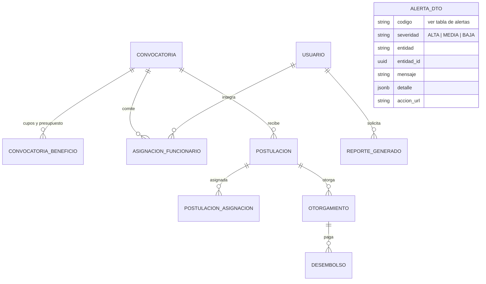

# Módulo: Admin Dashboard — Panel Gerencial y Alertas Operativas

**Fase:** P2 – Evaluación y seguimiento

## Objetivo
Proveer al Administrador una consola gerencial de solo lectura para el monitoreo global del FOEST: totales transversales, estado de convocatorias, **alertas operativas** con umbrales configurables, métricas comparativas por periodo (incluidos montos otorgados), carga comparativa nominal por evaluador, y las interfaces de usuario (visor) para la auditoría y la edición de configuración. Este módulo **no contiene lógica de auditoría ni de configuración propia**: la consulta de la bitácora vive en `auditoria.md`, la edición de parámetros en `catalogos_configuracion.md`, y el listado de postulaciones en `postulaciones.md`.

Los dashboards solo leen: este módulo no escribe en tablas de otros módulos.

## Archivos del Módulo

### Backend
- `apps/api/src/modules/admin_dashboard/admin_dashboard.service.ts` — Agregaciones gerenciales (resumen, convocatorias, métricas por periodo, carga nominal) y caché Redis (TTL 60 s).
- `apps/api/src/modules/admin_dashboard/alertas.service.ts` — Motor de alertas: un detector por código de alerta, con umbrales leídos de configuración y cálculo de días hábiles con la utilidad `business-days` (`FESTIVO`).
- `apps/api/src/modules/admin_dashboard/alertas.detectores/` — Un archivo por detector (`cierre_proximo.ts`, `sin_comite.ts`, `sobrecarga.ts`, `pool_sin_tomar.ts`, `subsanaciones_por_vencer.ts`, `cupos_presupuesto.ts`, `funcionarios_inactivos.ts`, `trabajos_fallidos.ts`).
- `apps/api/src/modules/admin_dashboard/admin_dashboard.controller.ts` — Handlers Express.
- `apps/api/src/modules/admin_dashboard/admin_dashboard.routes.ts` — Rutas bajo `/api/v1/dashboard/admin`.
- `apps/api/src/modules/admin_dashboard/admin_dashboard.dto.ts` — Esquemas Zod (`periodo_a`, `periodo_b`, filtros de alertas), reexportados desde `packages/shared/src/admin_dashboard/`.
- `apps/api/src/modules/admin_dashboard/__tests__/admin_dashboard.test.ts` — Pruebas de alertas, alcance y carga.

### Frontend
- `apps/web/src/modules/admin_dashboard/components/GlobalKPISummary.tsx` — Tarjetas: beneficiarios registrados, funcionarios activos, convocatorias habilitadas, postulaciones totales.
- `apps/web/src/modules/admin_dashboard/components/AlertasOperativasPanel.tsx` — Panel de alertas agrupadas por categoría y severidad (ver tabla de alertas), con enlace de acción a la pantalla que las resuelve.
- `apps/web/src/modules/admin_dashboard/components/ConvocatoriasStatusTracker.tsx` — Avance de cada periodo académico.
- `apps/web/src/modules/admin_dashboard/components/ComparativaPeriodosCard.tsx` — Comparación de postulaciones y montos entre dos periodos.
- `apps/web/src/modules/admin_dashboard/components/CargaEvaluadoresTable.tsx` — Tabla nominal de carga por evaluador.
- `apps/web/src/modules/admin_dashboard/components/ConfirmacionCriticaModal.tsx` — Modal de doble intención reutilizable para acciones críticas.
- `apps/web/src/modules/admin_dashboard/components/AuditoriaLogViewer.tsx` — **Solo UI**: tabla con visor diferencial (`antes` vs `después`) que consume el endpoint de consulta definido en `auditoria.md`.
- `apps/web/src/modules/admin_dashboard/components/ConfiguracionEditor.tsx` — **Solo UI**: formulario de edición que consume los endpoints de `catalogos_configuracion.md`.
- `apps/web/src/modules/admin_dashboard/hooks/useAdminDashboard.ts` — Resumen y alertas con revalidación periódica.
- `apps/web/src/modules/admin_dashboard/services/adminDashboardApi.ts` — Cliente HTTP.

## Endpoints Propuestos

Endpoints propios (rol `ADMINISTRADOR`, permiso `dashboard:admin`):

| Método | Ruta | Descripción |
|---|---|---|
| `GET` | `/api/v1/dashboard/admin/resumen` | Usuarios por rol, convocatorias por estado y volumen de postulaciones por estado |
| `GET` | `/api/v1/dashboard/admin/alertas` | Lista de alertas activas (ver sección de alertas); filtros opcionales `codigo`, `severidad` |
| `GET` | `/api/v1/dashboard/admin/convocatorias` | Convocatorias con plazos, comité, conteo de postulaciones y ocupación de cupos/presupuesto |
| `GET` | `/api/v1/dashboard/admin/metricas/periodo` | Comparativo entre dos periodos (`periodo_a`, `periodo_b` con formato `AAAA-S`, p. ej. `2026-1`): postulaciones por estado y **montos** |
| `GET` | `/api/v1/dashboard/admin/carga-evaluadores` | Carga comparativa **nominal** por evaluador (solo administrador) |

Endpoints que la UI consume pero **pertenecen a otros módulos** (no se redefinen aquí):

| Funcionalidad | Dónde se define |
|---|---|
| Listado de postulaciones | `GET /api/v1/postulaciones` en `postulaciones.md` |
| Consulta de auditoría (filtros por actor, entidad, acción y fechas) | `auditoria.md` |
| Edición de parámetros de configuración (con control de versión) | `catalogos_configuracion.md` |
| Deshabilitar funcionario, reasignación masiva, suspender/ampliar convocatoria, revocar otorgamiento | `accounts.md`, `asignaciones.md`, `convocatorias.md`, `seguimiento_beneficios.md` |

Códigos de acceso (DECISIONES §2): `FUNCIONARIO` o `BENEFICIARIO` → `403`.

### Respuesta de `GET /alertas`
```json
{
  "generado_en": "2026-10-06T15:04:05Z",
  "total": 3,
  "alertas": [
    { "codigo": "CIERRE_PROXIMO", "severidad": "ALTA", "entidad": "CONVOCATORIA", "entidad_id": "uuid",
      "mensaje": "La convocatoria 2026-2 cierra en 3 dias", "detalle": { "dias_restantes": 3 },
      "accion_url": "/admin/convocatorias/uuid" }
  ]
}
```

## Modelos de Datos

El módulo **no define tablas propias**. Lee `USUARIO`, `CONVOCATORIA`, `CONVOCATORIA_BENEFICIO`, `ASIGNACION_FUNCIONARIO`, `POSTULACION`, `POSTULACION_ASIGNACION`, `OTORGAMIENTO`, `DESEMBOLSO`, `REPORTE_GENERADO`, `EVENTO_OUTBOX`, `FESTIVO` y `CONFIG`; para conteos por estado puede apoyarse en la vista `mv_postulacion_envio` (objeto de BD definido en `dashboard_funcionario.md`, solo lectura).



`ALERTA_DTO` es un objeto calculado en cada lectura (no se persiste).

## Alertas operativas (`GET /alertas`)

Backend y panel frontend comparten el mismo catálogo de códigos (enum en `packages/shared/src/admin_dashboard/`). Todos los umbrales se leen de `CONFIG` (valores por defecto entre paréntesis, editables en `catalogos_configuracion.md`). Los "días hábiles" se calculan con `business-days` y la tabla `FESTIVO`.

| Código | Condición | Umbral en `CONFIG` | Grupo del panel | Acción |
|---|---|---|---|---|
| `CIERRE_PROXIMO` | Convocatoria `HABILITADA` cuyo cierre ocurre en menos de N días naturales | `ALERTA_CIERRE_DIAS` (7) | Convocatorias | Ir a la convocatoria (posible ampliación) |
| `SIN_COMITE` | Convocatoria `HABILITADA` sin ningún funcionario en `ASIGNACION_FUNCIONARIO`. **No** se alerta en `BORRADOR` | — | Convocatorias | Asignar comité |
| `SOBRECARGA` | Funcionario con más de N asignaciones `ACTIVA` sin ninguna revisión (actividad de evaluación) en los últimos M días hábiles | `ALERTA_SOBRECARGA_ASIGNACIONES` (50), `ALERTA_SOBRECARGA_DIAS_HABILES` (5) | Carga y comité | Reasignar |
| `POOL_SIN_TOMAR` | Postulaciones `PENDIENTE` sin asignación `ACTIVA` por más de X días hábiles desde `enviado_en` | `ALERTA_POOL_DIAS_HABILES` (3) | Carga y comité | Ver pool / notificar al comité |
| `SUBSANACION_POR_VENCER` | Postulaciones `EN_CORRECCION` cuya `fecha_limite_subsanacion` vence en menos de N días hábiles | `ALERTA_SUBSANACION_DIAS_HABILES` (2) | Plazos | Informativo (el vencimiento lo ejecuta el job del sistema) |
| `CUPOS_SUPERADOS` | Suma de `OTORGAMIENTO` (no `REVOCADO`) por beneficio supera `cupos_estimados` (100 %) o la suma de `monto_aprobado` supera `presupuesto_asignado`; aviso previo (severidad media) desde el porcentaje de `ALERTA_CUPO_AVISO_PCT` | `ALERTA_CUPO_AVISO_PCT` (90) | Cupos y presupuesto | Revisar con comité / ampliar presupuesto |
| `FUNCIONARIO_INACTIVO_CON_ASIGNACIONES` | Funcionario con `activo = false` que aún tiene asignaciones `ACTIVA` | — | Cuentas | Reasignación masiva |
| `TRABAJO_FALLIDO` | `REPORTE_GENERADO` en `FALLIDO` o `EVENTO_OUTBOX` agotado/fallido en las últimas `ALERTA_TRABAJOS_HORAS` horas (24) | `ALERTA_TRABAJOS_HORAS` (24) | Operación | Reintentar desde el módulo propietario |

Reglas del motor:
- Cada detector se ejecuta con consultas indexadas; el resultado completo se cachea en Redis 60 s.
- Severidad por defecto: `CUPOS_SUPERADOS` y `SIN_COMITE` → `ALTA`; `CIERRE_PROXIMO`, `SOBRECARGA`, `FUNCIONARIO_INACTIVO_CON_ASIGNACIONES`, `TRABAJO_FALLIDO` → `ALTA`/`MEDIA` según cercanía o cantidad; `POOL_SIN_TOMAR`, `SUBSANACION_POR_VENCER` → `MEDIA`.
- Si un detector falla, se registra en logs y se devuelve el resto de alertas con un indicador `detectores_con_error`; nunca `500` por un detector.
- Los avisos de convocatoria por cerrar dirigidos al staff por correo son un recordatorio programado de `notificaciones.md`, independiente de este panel.

## Casos de Uso Especiales y Reglas de Negocio

- **Carga comparativa nominal:** `GET /carga-evaluadores` devuelve por funcionario activo `{ funcionario_id, nombre, asignaciones_activas, dictaminadas_periodo, pendientes_pool_del_comite }`. Es **exclusiva del Administrador**; el funcionario solo ve su carga propia y el promedio del comité en `dashboard_funcionario.md`. La lectura nominal se audita como `LECTURA_SENSIBLE` solo cuando se consulta el detalle por persona.
- **Métricas por periodo y montos:** `metricas/periodo` compara dos periodos (`anio`, `semestre`) con: postulaciones por estado y tipo de trámite, aprobaciones totales y parciales, `monto_aprobado_total` y `monto_aprobado_por_beneficio` calculados desde **`OTORGAMIENTO`** de `seguimiento_beneficios.md` (excluyendo `REVOCADO`), y `monto_desembolsado` desde `DESEMBOLSO` en `PAGADO`. Aplica el mismo k-anonimato (`KANON_UMBRAL`) a los desgloses por beneficio y tipo de trámite.
- **Listado de postulaciones:** el panel enlaza a la vista de `GET /postulaciones` (`postulaciones.md`) con filtros precargados; el módulo no implementa su propio listado.
- **Auditoría (solo UI):** `AuditoriaLogViewer` consume el endpoint de `auditoria.md`; el módulo no define modelos, filtros ni lógica de registro. La inmutabilidad, el registro en la misma transacción y la exclusión de campos sensibles son responsabilidad de `auditoria.md`.
- **Configuración (solo UI):** `ConfiguracionEditor` consume los endpoints de `catalogos_configuracion.md` (incluido el control de versión: edición con versión desactualizada → `409`). Los umbrales de alertas se editan ahí.
- **Confirmación explícita (doble intención) en acciones críticas:** `ConfirmacionCriticaModal` se usa en deshabilitar funcionario, reasignación masiva, suspender o ampliar convocatoria, modificar plazos, revocar o suspender un otorgamiento y modificar parámetros críticos. El modal resume el efecto (p. ej. "se reasignarán 37 expedientes"), exige marcar la casilla de comprensión y **escribir una palabra de confirmación** (nombre de la entidad o `CONFIRMAR`); el cliente envía `confirmar: true` en la petición y los endpoints propietarios responden `422 CONFIRMACION_REQUERIDA` si falta. La validación autoritativa está en cada módulo propietario.
- **Segregación de funciones:** el Administrador supervisa y gestiona el sistema, pero no dictamina postulaciones; este módulo no ofrece acciones de dictamen.
- **Sin lógica de auditoría propia:** las acciones críticas disparadas desde este panel se auditan en los módulos propietarios mediante `auditar(tx, evento)`; el panel solo lee.
- **Solo lectura:** ninguna ruta de este módulo escribe en tablas ajenas.

## Dependencias entre Módulos
- **`accounts.md`**: estado de cuentas de funcionarios y conteo de usuarios por rol.
- **`convocatorias.md`**: convocatorias, `CONVOCATORIA_BENEFICIO` (cupos, presupuesto) y `ASIGNACION_FUNCIONARIO`.
- **`postulaciones.md`**: conteos por estado y destino del listado `GET /postulaciones`.
- **`asignaciones.md`**: `POSTULACION_ASIGNACION` para sobrecarga, pool y carga nominal.
- **`seguimiento_beneficios.md`**: `OTORGAMIENTO` y `DESEMBOLSO` para montos y ocupación.
- **`export_reports.md`** y **`notificaciones.md`**: estado de trabajos fallidos (`REPORTE_GENERADO`, `EVENTO_OUTBOX`).
- **`auditoria.md`** y **`catalogos_configuracion.md`**: backend de los visores/editores; `FESTIVO` y umbrales de `CONFIG`.
- **`roles_permissions.md`**: permiso `dashboard:admin` para el rol `ADMINISTRADOR`.

## Dependencias Externas
- `@prisma/client`: consultas de lectura.
- `ioredis`: caché de 60 s.
- `zod`: validación de parámetros.
- `date-fns-tz`: zona horaria `America/Bogota`.
- `recharts` y `@tanstack/react-query`: visualización y revalidación en el frontend.

## Pruebas de Aceptación
- [ ] Un `FUNCIONARIO` o `BENEFICIARIO` que consulte cualquier ruta de `/dashboard/admin` recibe `403`.
- [ ] Una convocatoria `HABILITADA` que cierra en menos de `ALERTA_CIERRE_DIAS` días aparece como `CIERRE_PROXIMO`; al cambiar el umbral en configuración, el resultado cambia en la siguiente consulta (tras caché).
- [ ] Una convocatoria `HABILITADA` sin comité genera `SIN_COMITE`; una en `BORRADOR` sin comité no la genera.
- [ ] Un funcionario con más de N asignaciones `ACTIVA` y sin revisiones en M días hábiles (excluyendo festivos y fines de semana) genera `SOBRECARGA`.
- [ ] Postulaciones `PENDIENTE` sin tomar por más de X días hábiles generan `POOL_SIN_TOMAR`.
- [ ] Una subsanación que vence en menos de N días hábiles genera `SUBSANACION_POR_VENCER`.
- [ ] Superar `cupos_estimados` o `presupuesto_asignado` (con `OTORGAMIENTO` no revocado) genera `CUPOS_SUPERADOS`; revocar un otorgamiento puede cancelar la alerta.
- [ ] Un funcionario inactivo con asignaciones `ACTIVA` genera `FUNCIONARIO_INACTIVO_CON_ASIGNACIONES`.
- [ ] Un `REPORTE_GENERADO` `FALLIDO` o un correo fallido reciente genera `TRABAJO_FALLIDO`.
- [ ] Todo código de alerta que devuelve el backend tiene su grupo y acción en `AlertasOperativasPanel` (prueba de contrato sobre el enum compartido).
- [ ] `metricas/periodo` calcula los montos desde `OTORGAMIENTO` y no cuenta los `REVOCADO`.
- [ ] `carga-evaluadores` devuelve nombres solo al administrador; el funcionario no puede acceder (`403`).
- [ ] Las acciones críticas desde el panel no se envían sin completar el modal de confirmación, y el backend propietario rechaza con `422` una petición sin `confirmar: true`.
- [ ] El panel no incluye endpoints de listado de postulaciones, consulta de auditoría ni edición de configuración propios.
