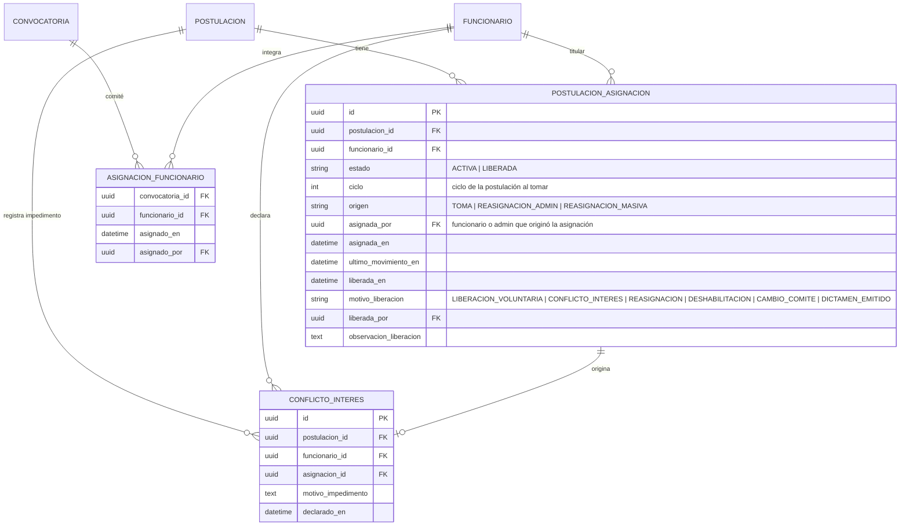
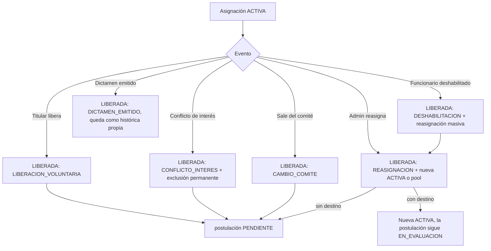

# Módulo: Asignaciones — Asignación de Expedientes a Evaluadores

**Fase:** P2

## Objetivo
Controlar **quién puede ver y dictaminar cada expediente**. Opera en dos niveles: el **comité de la convocatoria** (`ASIGNACION_FUNCIONARIO`, definido en `convocatorias.md`) y la **asignación por expediente** (`POSTULACION_ASIGNACION`, definida aquí). El módulo es dueño de la bandeja de trabajo del funcionario (resumen mínimo sin datos sensibles), de las operaciones `tomar` / `liberar`, del conflicto de interés con exclusión permanente, de la reasignación individual y masiva por el Administrador, de la alerta de asignaciones sin movimiento y del middleware `requireScope` que protege el acceso al expediente (regla de respuestas de `DECISIONES.md` §2: recurso ajeno, no asignado o excluido → `404`).

El módulo **no decide** sobre la postulación: cualquier cambio de estado se solicita a `postulacion.service.transicionar()` (dueño de la máquina de estados). `evaluacion` consume este módulo para exponer las rutas de la consola del evaluador.

## Archivos del Módulo

### Backend
- `apps/api/src/modules/asignaciones/asignacion.model.ts` — Entidades Prisma/TypeScript: `PostulacionAsignacion`, `ConflictoInteres`, enum `EstadoAsignacion` (`ACTIVA | LIBERADA`), enum `MotivoLiberacion`.
- `apps/api/src/modules/asignaciones/asignacion.service.ts` — Lógica de negocio: `bandeja()`, `tomar()`, `liberar()`, `declararConflicto()`, `reasignar()`, `reasignarMasivo()`, `liberarPorDeshabilitacion()`, `sincronizarComite()`, `detectarSinMovimiento()`. Invoca `postulacion.service.transicionar()` dentro de la misma transacción.
- `apps/api/src/modules/asignaciones/asignacion.controller.ts` — Handlers Express de reasignación, alertas e historial de asignaciones (los handlers de `tomar`, `liberar` y `conflicto-interes` se montan en las rutas de `evaluacion` y delegan en este servicio).
- `apps/api/src/modules/asignaciones/asignacion.routes.ts` — Rutas Express bajo `/api/v1/asignaciones`.
- `apps/api/src/modules/asignaciones/asignacion.dto.ts` — Schemas Zod: `TomarDto`, `LiberarDto`, `ConflictoInteresDto`, `ReasignarDto`, `ReasignarMasivoDto`.
- `apps/api/src/modules/asignaciones/asignacion.serializer.ts` — `ResumenBandejaDto`: serializador explícito (lista blanca de campos) de la bandeja.
- `apps/api/src/modules/asignaciones/asignacion.scope.ts` — Middleware `requireScope('expediente')` y función `resolverAlcance(usuario, postulacionId)`.
- `apps/api/src/modules/asignaciones/asignacion.jobs.ts` — Job diario de alerta de asignaciones sin movimiento.
- `apps/api/src/modules/asignaciones/__tests__/asignacion.test.ts` — Pruebas unitarias e integración con Jest + Supertest (incluye prueba de concurrencia de `tomar`).
- `packages/shared/src/asignaciones/` — Enums `EstadoAsignacion`, `MotivoLiberacion` y esquemas Zod compartidos con el frontend.

### Frontend
- `apps/web/src/modules/asignaciones/components/ReasignarModal.tsx` — Reasignación individual: selector de funcionario del comité (o "devolver al pool") y motivo.
- `apps/web/src/modules/asignaciones/components/ReasignacionMasivaModal.tsx` — Vista previa y confirmación de la reasignación masiva (reutilizada desde el flujo de deshabilitación de funcionarios).
- `apps/web/src/modules/asignaciones/components/AlertasSinMovimiento.tsx` — Tabla administrativa de asignaciones sin movimiento.
- `apps/web/src/modules/asignaciones/components/HistorialAsignacionesPanel.tsx` — Línea de tiempo de asignaciones, liberaciones y conflictos de una postulación (solo Administrador).
- `apps/web/src/modules/asignaciones/hooks/useAsignaciones.ts` — Hook para reasignaciones y alertas.
- `apps/web/src/modules/asignaciones/services/asignacionesApi.ts` — Cliente HTTP del módulo.
- `apps/web/src/modules/asignaciones/types/asignaciones.types.ts` — Interfaces tipadas.

> La bandeja visual del funcionario (`BandejaPostulaciones.tsx`) vive en `evaluacion` (ver `evaluacion.md`); consume el contrato `ResumenBandejaDto` definido aquí.

## Endpoints Propuestos

| Método | Ruta | Descripción | Auth | Roles | Alcance / errores |
|---|---|---|:---:|:---:|---|
| `GET` | `/api/v1/evaluacion/postulaciones` | Bandeja: pool `PENDIENTE` de las convocatorias del comité del funcionario + sus asignaciones propias (activas e históricas). Implementada por `asignacion.service.bandeja()` | Sí | `FUNCIONARIO` | Solo convocatorias donde figura en `ASIGNACION_FUNCIONARIO`; excluye postulaciones donde tiene `CONFLICTO_INTERES` |
| `POST` | `/api/v1/evaluacion/postulaciones/:id/tomar` | Toma el expediente: crea `POSTULACION_ASIGNACION` `ACTIVA` y transiciona `PENDIENTE → EN_EVALUACION` | Sí | `FUNCIONARIO` | `404` si no está en el pool de su comité, está excluido o no existe; `409` si ya fue tomada (carrera) o la versión no coincide |
| `POST` | `/api/v1/evaluacion/postulaciones/:id/liberar` | El titular libera su asignación; `EN_EVALUACION → PENDIENTE` | Sí | `FUNCIONARIO` | `404` si no es su asignación activa; `409` si ya existe dictamen |
| `POST` | `/api/v1/evaluacion/postulaciones/:id/conflicto-interes` | Declara impedimento: libera, registra `CONFLICTO_INTERES` y excluye al funcionario | Sí | `FUNCIONARIO` | `404` si no puede ver la postulación; `422` sin motivo suficiente |
| `POST` | `/api/v1/asignaciones/postulaciones/:id/reasignar` | Reasignación individual: cierra la asignación activa y crea otra al funcionario destino (o devuelve al pool) | Sí | `ADMINISTRADOR` | `422` si el destino no es del comité, está inactivo o excluido; `409` por versión/estado |
| `POST` | `/api/v1/asignaciones/reasignar-masivo` | Reasigna en bloque todas las asignaciones activas de un funcionario origen; `destino_funcionario_id` opcional (sin destino → devuelve al pool) | Sí | `ADMINISTRADOR` | Responde resumen `{ procesadas, reasignadas, devueltas_al_pool, omitidas: [{postulacion_id, motivo}] }` |
| `GET` | `/api/v1/asignaciones/postulaciones/:id/historial` | Historial de asignaciones, liberaciones y conflictos de una postulación | Sí | `ADMINISTRADOR` | Lectura; auditada |
| `GET` | `/api/v1/asignaciones/alertas` | Asignaciones `ACTIVA` sin movimiento por más de `CONFIG.ASIGNACION_ALERTA_DIAS_HABILES` | Sí | `ADMINISTRADOR` | Paginado estándar |

Notas de contrato:
- Todos los cuerpos de escritura incluyen `version` de la postulación (bloqueo optimista, `DECISIONES.md` §4), salvo `reasignar-masivo`, que valida versión por cada elemento y omite los que cambiaron.
- `tomar`: `{ version }`. `liberar`: `{ version, motivo? }`. `conflicto-interes`: `{ version, motivo_impedimento }` (≥ 15 caracteres). `reasignar`: `{ version, destino_funcionario_id?, motivo }`. `reasignar-masivo`: `{ origen_funcionario_id, destino_funcionario_id?, motivo, confirmar: true }`.
- Un rol sin permiso sobre la ruta recibe `403` (p. ej. un funcionario en `/asignaciones/reasignar-masivo`); un funcionario con permiso sobre `/evaluacion/postulaciones/:id/*` pero sin alcance sobre ese `:id` recibe `404`.

## Resumen mínimo de la bandeja (`ResumenBandejaDto`)

Lista blanca de campos que **puede** devolver la bandeja (el pool y las asignaciones propias). Cualquier campo fuera de esta lista no se serializa.

| Campo | Descripción |
|---|---|
| `postulacion_id` | Identificador del expediente |
| `codigo_expediente` | Código legible corto (p. ej. `FOEST-2026-1-000123`), sin relación derivable con el documento de identidad |
| `convocatoria_id`, `convocatoria_nombre` | Convocatoria de origen |
| `tipo_solicitud` | `PRIMERA_VEZ | RENOVACION | REINTEGRO` |
| `beneficios_solicitados` | Lista de códigos del catálogo (`S11`, `EA`, `DEP`, `CUL`, `SUP`, `ST`, `LE1`…`LE6`) |
| `estado` | Estado de la postulación |
| `ciclo` | Ciclo de revisión vigente (1, 2, …) |
| `enviada_en` | Instante de envío del ciclo vigente |
| `dias_habiles_en_espera` | Días hábiles desde `enviada_en` |
| `asignacion` | `{ estado, titular: "yo" | "otro" | null, asignada_en }`; el nombre de otro funcionario **no** se muestra |

**Nunca** se incluyen: nombres, apellidos, documento de identidad, correo, teléfono, dirección, estrato, SISBEN, datos académicos o socioeconómicos, datos de pago ni contenido de documentos. El nombre del beneficiario solo aparece al abrir el expediente completo con asignación activa propia.

## Middleware `requireScope('expediente')`

Resuelve el alcance del usuario autenticado sobre `:id` (postulación) y lo adjunta como `req.alcance`. Se aplica a toda ruta que abra o modifique un expediente (`evaluacion` completo, `GET /beneficiarios/:id` cuando se usa en contexto de revisión, descarga de documentos del expediente).

| Rol | Condición | Alcance (`req.alcance`) | Resultado |
|---|---|---|---|
| `FUNCIONARIO` | Tiene `POSTULACION_ASIGNACION` `ACTIVA` propia sobre la postulación | `ESCRITURA` (expediente completo, puede dictaminar) | Continúa |
| `FUNCIONARIO` | Tuvo asignación `LIBERADA` propia y no está excluido por conflicto | `LECTURA_HISTORICA` (solo lectura; datos congelados de los ciclos en los que participó) | Continúa en solo lectura; las escrituras responden `404` |
| `FUNCIONARIO` | Postulación en pool sin asignación propia, asignada a otro, sin asignación, o excluido por `CONFLICTO_INTERES` | Ninguno | `404` |
| `ADMINISTRADOR` | Siempre | `LECTURA` (no dictamina; datos de pago enmascarados) | Continúa en solo lectura |
| `BENEFICIARIO` | — | Ninguno (usa sus propias rutas) | `403` por rol |

Reglas adicionales: el funcionario debe tener `activo = true` (si no, `403 CUENTA_INACTIVA` ya desde `authenticate()`); el alcance se calcula en cada petición contra BD (sin caché) para que reasignaciones y exclusiones apliquen de inmediato; un funcionario fuera del comité vigente conserva la lectura histórica propia pero no puede `tomar`.

## Modelos de Datos



Restricciones de base de datos:
- **Índice único parcial**: `CREATE UNIQUE INDEX uq_asignacion_activa ON postulacion_asignacion (postulacion_id) WHERE estado = 'ACTIVA';` — garantiza una sola asignación activa por postulación y resuelve la carrera de `tomar` a nivel de BD.
- `UNIQUE(postulacion_id, funcionario_id)` en `CONFLICTO_INTERES`: la exclusión es **permanente** (no hay endpoint para revertirla; solo una intervención de base de datos auditada fuera de la aplicación).
- Una asignación `LIBERADA` es inmutable (trigger que impide volver a `ACTIVA`); una nueva toma crea una fila nueva.
- `ultimo_movimiento_en` se actualiza cuando el titular guarda chequeo, consulta de forma activa el expediente con escritura o emite dictamen (lo notifica `evaluacion` mediante `asignacion.service.registrarMovimiento()`).

## Flujo de Toma y Liberación

```mermaid
sequenceDiagram
    autonumber
    actor F1 as Funcionario A
    actor F2 as Funcionario B
    participant API as asignaciones.service
    participant DB as PostgreSQL
    participant PS as postulacion.service

    F1->>API: POST /evaluacion/postulaciones/:id/tomar { version }
    F2->>API: POST /evaluacion/postulaciones/:id/tomar { version }
    API->>DB: BEGIN; SELECT postulacion FOR UPDATE (verifica PENDIENTE, comité, no excluido, version)
    API->>DB: INSERT POSTULACION_ASIGNACION (ACTIVA)
    Note over DB: El índice único parcial rechaza la segunda inserción
    API->>PS: transicionar(PENDIENTE → EN_EVALUACION, actor = funcionario)
    API->>DB: auditar(ASIGNACION_TOMADA) + COMMIT
    API-->>F1: 200 expediente asignado
    API-->>F2: 409 EXPEDIENTE_YA_TOMADO
```



## Casos de Uso Especiales y Reglas de Negocio

- **Toma y carrera:** `tomar` bloquea la fila de la postulación (`SELECT … FOR UPDATE`), valida `estado = PENDIENTE`, que el funcionario sea del comité de la convocatoria, que no tenga `CONFLICTO_INTERES` sobre esa postulación y que `version` coincida; inserta la asignación y llama a `transicionar()`. Si dos funcionarios toman a la vez, el índice único parcial (o el `FOR UPDATE`) hace que el segundo reciba `409 EXPEDIENTE_YA_TOMADO`. Una postulación que no está en el pool visible del funcionario responde `404`, no `409`.
- **Un solo titular:** solo el titular de la asignación activa puede chequear y dictaminar; cualquier otro funcionario recibe `404`. El Administrador solo tiene lectura.
- **Liberar:** el titular puede liberar mientras no haya emitido dictamen. Marca la asignación `LIBERADA` (motivo `LIBERACION_VOLUNTARIA`), registra el movimiento y transiciona `EN_EVALUACION → PENDIENTE`. El funcionario **no** queda excluido y puede volver a tomarla. El chequeo documental guardado se conserva como borrador de la revisión del ciclo vigente (ver `evaluacion.md`).
- **Conflicto de interés:** además de liberar y volver a `PENDIENTE`, inserta `CONFLICTO_INTERES` con el motivo. Desde ese momento ese funcionario queda **excluido permanentemente** de esa postulación: no aparece en su bandeja, no puede tomarla ni reasignársele, y el expediente responde `404` también para lectura histórica. Se notifica al Administrador (no al beneficiario) y se audita. Si el motivo se declara con asignación activa en otro ciclo, la exclusión aplica a todos los ciclos futuros.
- **Reasignación individual (Administrador):** `POST /asignaciones/postulaciones/:id/reasignar`. Con `destino_funcionario_id`: cierra la activa (`REASIGNACION`) y crea otra para el destino en la misma transacción; la postulación permanece `EN_EVALUACION` (no pasa por `PENDIENTE`) y el `version` se incrementa. Sin destino: la asignación se libera y la postulación vuelve a `PENDIENTE` (pool). El destino debe ser funcionario activo del comité, sin conflicto de interés sobre esa postulación. Motivo obligatorio (≥ 15 caracteres).
- **Reasignación masiva (Administrador):** `POST /asignaciones/reasignar-masivo` con `origen_funcionario_id`, `destino_funcionario_id` opcional y `confirmar: true`. Procesa por lotes (una transacción por postulación) todas las asignaciones `ACTIVA` del origen. Con destino: reasigna solo las postulaciones cuya convocatoria tenga al destino en su comité y sin conflicto; las demás se **omiten** y se informan (o quedan en el pool si el administrador lo indica en `omitidas_al_pool: true`). Sin destino: todas vuelven al pool. Idempotente: reintentar solo procesa las que sigan activas.
- **Integración con la deshabilitación de funcionarios (`accounts.md`):** al deshabilitar un funcionario con asignaciones activas, `accounts` responde la advertencia `REASSIGNMENT_REQUIRED` con el conteo de asignaciones `ACTIVA` y de postulaciones `PENDIENTE` de sus convocatorias. La cuenta se desactiva y sus sesiones se revocan de inmediato; sus asignaciones activas **no se liberan automáticamente**: quedan marcadas como "titular inactivo" y en `GET /asignaciones/alertas` con prioridad alta hasta que el Administrador ejecute la reasignación (individual o masiva). Un funcionario inactivo no puede actuar (`403 CUENTA_INACTIVA`) y su lectura histórica queda suspendida.
- **Cambios del comité de la convocatoria:** al retirar a un funcionario del comité (`PUT /convocatorias/:id/funcionarios`), `convocatorias` invoca `asignacion.service.sincronizarComite()`: el cuerpo del `PUT` debe indicar `asignaciones: LIBERAR | MANTENER` cuando el funcionario retirado tiene asignaciones `ACTIVA` (sin ese campo responde `409 ASIGNACIONES_PENDIENTES` con la lista de expedientes afectados). Con `LIBERAR` sus asignaciones `ACTIVA` en esa convocatoria se liberan con motivo `CAMBIO_COMITE` y las postulaciones vuelven a `PENDIENTE` (pool); con `MANTENER` quedan marcadas "fuera de comité" y en alertas hasta que el Administrador las reasigne. Si se agrega a un funcionario, empieza a ver el pool de esa convocatoria sin efecto sobre asignaciones existentes. Se notifica al funcionario retirado y se audita.
- **Convocatoria suspendida o cerrada:** las postulaciones `PENDIENTE` y `EN_EVALUACION` conservan su derecho a ser evaluadas (regla de `convocatorias.md`); `tomar` sigue permitido en convocatorias `SUSPENDIDA` o `CERRADA` no archivadas. `ARCHIVADA` requiere que no haya postulaciones no terminales, por lo que no hay asignaciones activas.
- **Alerta de asignación sin movimiento:** un job diario (`asignacion.jobs.ts`) detecta asignaciones `ACTIVA` con `ultimo_movimiento_en` anterior a `CONFIG.ASIGNACION_ALERTA_DIAS_HABILES` días hábiles (utilidad `business-days`; valor inicial propuesto: 3). Genera una `NOTIFICACION` al titular (recordatorio) y al Administrador, y la lista en `GET /asignaciones/alertas`. Una asignación solo se alerta una vez por período sin movimiento (se re-alerta si pasan otros N días hábiles). La alerta no libera automáticamente.
- **Dictamen emitido:** al emitirse el dictamen, `evaluacion` solicita a `asignaciones` cerrar la asignación (motivo `DICTAMEN_EMITIDO`); queda como histórica propia en solo lectura. Si la postulación pasa a `EN_CORRECCION` y luego se subsana (nuevo ciclo, `PENDIENTE`), vuelve al pool: **no** hereda automáticamente al evaluador previo, salvo que el Administrador reasigne.
- **Invocación de transiciones:** `tomar`, `liberar`, `conflicto-interes`, `reasignar` (sin destino) y la liberación por cambio de comité llaman a `postulacion.service.transicionar()` dentro de la misma transacción y con el `version` esperado; `asignaciones` nunca escribe `POSTULACION.estado` directamente. `postulaciones` no importa de `asignaciones`.
- **Notificaciones:** aviso interno (`NOTIFICACION`, solo staff) al funcionario cuando se le reasigna o se le retira un expediente; al Administrador en conflicto de interés, alertas y omitidos de reasignación masiva. **No se notifica al beneficiario** por cambios internos de asignación (preserva el anonimato del evaluador). Los correos pasan por el outbox transaccional (`DECISIONES.md` §13).
- **Auditoría** (`auditar(tx, evento)` en la misma transacción): `ASIGNACION_TOMADA`, `ASIGNACION_LIBERADA`, `CONFLICTO_INTERES_DECLARADO`, `ASIGNACION_REASIGNADA`, `REASIGNACION_MASIVA` (con resumen), `ASIGNACION_ALERTA`, `ASIGNACION_HISTORIAL_CONSULTADO`. Cada evento guarda actor, postulación, funcionarios origen/destino y motivo.

## Dependencias entre Módulos
- **`postulaciones.md`**: invoca `postulacion.service.transicionar()` y lee `estado`, `version`, `ciclo`. `postulaciones` no importa de `asignaciones`.
- **`convocatorias.md`**: lee `ASIGNACION_FUNCIONARIO` (comité) y el estado de la convocatoria; `convocatorias` notifica los cambios de comité a `asignaciones.service.sincronizarComite()`.
- **`accounts.md`**: la deshabilitación de funcionarios expone el conteo para `REASSIGNMENT_REQUIRED` y la bandera de cuenta activa; el flujo de reasignación masiva se dispara desde el panel de funcionarios.
- **`evaluacion.md`** (consumidor): usa `bandeja`, `tomar`, `liberar`, `declararConflicto`, `registrarMovimiento` y el middleware `requireScope('expediente')`.
- **`catalogos_configuracion.md`**: `CONFIG.ASIGNACION_ALERTA_DIAS_HABILES` y tabla `FESTIVO`.
- **`auditoria.md`**, **`notificaciones.md`**: transversales.

Conforme al grafo de `DECISIONES.md` §16: `asignaciones → postulaciones, convocatorias` (y servicios transversales).

## Dependencias Externas
- `@prisma/client`: transacciones, `FOR UPDATE` (consulta cruda) e índice único parcial (migración SQL).
- `zod`: validación de motivos, versiones y confirmaciones.
- `node-cron` / BullMQ: job de alertas de asignaciones sin movimiento.
- `shared/business-days`, `shared/outbox`, `shared/audit`.

## Pruebas de Aceptación
- [ ] La bandeja de un funcionario muestra solo postulaciones `PENDIENTE` de convocatorias de su comité y sus asignaciones propias; la respuesta contiene únicamente los campos de `ResumenBandejaDto` y ningún dato personal ni sensible.
- [ ] Una postulación de una convocatoria que no es de su comité no aparece en la bandeja y `tomar` sobre ella responde `404`.
- [ ] `tomar` crea una asignación `ACTIVA` y la postulación pasa a `EN_EVALUACION`.
- [ ] Dos peticiones simultáneas de `tomar` sobre la misma postulación: una responde `200` y la otra `409`; solo existe una fila `ACTIVA` (índice único parcial).
- [ ] Un funcionario distinto del titular recibe `404` al abrir, chequear o dictaminar el expediente asignado a otro.
- [ ] Un usuario `BENEFICIARIO` que invoque `tomar` recibe `403`.
- [ ] `liberar` devuelve la postulación a `PENDIENTE`, marca la asignación `LIBERADA` y el funcionario puede volver a tomarla.
- [ ] Tras un conflicto de interés, ese funcionario recibe `404` al abrir la postulación, no la ve en la bandeja y `tomar` responde `404`; la exclusión persiste en ciclos posteriores.
- [ ] El conflicto de interés sin motivo suficiente (< 15 caracteres) responde `422`.
- [ ] Un funcionario con asignación histórica propia puede leer el expediente en solo lectura, pero cualquier escritura responde `404`.
- [ ] El Administrador puede leer cualquier expediente con datos de pago enmascarados y no puede dictaminar (`403` por rol en las rutas de dictamen).
- [ ] La reasignación individual con destino deja la postulación en `EN_EVALUACION` con nueva asignación `ACTIVA`; sin destino la devuelve a `PENDIENTE`.
- [ ] La reasignación a un funcionario excluido, inactivo o fuera del comité responde `422`.
- [ ] Un `FUNCIONARIO` que invoque cualquier ruta de `/asignaciones/reasignar*` recibe `403`.
- [ ] La reasignación masiva con destino omite e informa las postulaciones de convocatorias donde el destino no está en el comité; sin destino devuelve todas al pool.
- [ ] Al deshabilitar un funcionario con asignaciones activas se devuelve `REASSIGNMENT_REQUIRED`, las asignaciones aparecen en las alertas y tras la reasignación masiva ya no quedan asignaciones activas de ese funcionario.
- [ ] Retirar a un funcionario del comité con asignaciones activas sin indicar `asignaciones` responde `409 ASIGNACIONES_PENDIENTES`; con `LIBERAR` las libera con motivo `CAMBIO_COMITE`; con `MANTENER` las deja marcadas como "fuera de comité".
- [ ] Una asignación sin movimiento durante más de `ASIGNACION_ALERTA_DIAS_HABILES` días hábiles aparece en `GET /asignaciones/alertas` y genera notificación al titular y al Administrador.
- [ ] Un `version` desactualizado en `tomar`, `liberar` o `reasignar` responde `409`.
- [ ] Cada operación (toma, liberación, conflicto, reasignación) genera su evento de auditoría y ningún cambio de asignación notifica al beneficiario.
