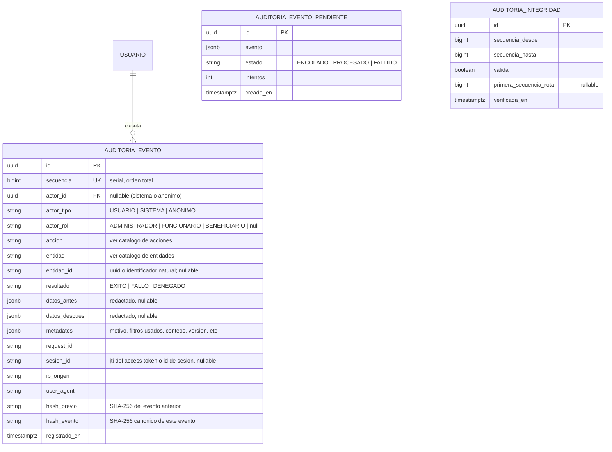
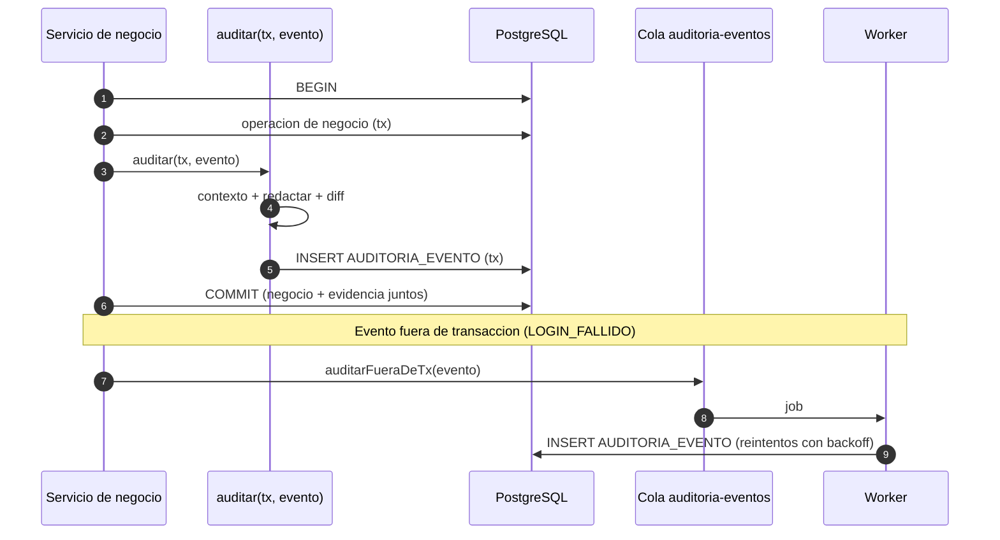

# Módulo: Auditoría — Bitácora Inmutable de Eventos

**Fase:** P0

## Objetivo
Proveer la bitácora de auditoría *append-only* de la plataforma FOEST: un helper transaccional `auditar(tx, evento)` que todos los módulos usan para registrar sus eventos en la misma transacción de negocio, un catálogo ampliado y cerrado de acciones y entidades, redacción automática de campos sensibles, retención configurable, consulta administrativa con filtros y exportación auditada, y un canal por cola para los eventos que ocurren fuera de una transacción de negocio (por ejemplo, un login fallido). Soporta trazabilidad legal, la protección de datos personales (Ley 1581) y la verificación de actuaciones sobre datos sensibles.

Es un módulo fundacional: no depende de módulos de negocio.

## Archivos del Módulo

### Backend (`apps/api/src/modules/auditoria/`)
- `auditoria.service.ts` — Consulta paginada, detalle y exportación; arma los filtros.
- `auditoria.controller.ts` — Handlers de `/auditoria`.
- `auditoria.routes.ts` — Rutas bajo `/api/v1/auditoria`.
- `auditoria.dto.ts` — Zod de filtros y exportación.
- `auditoria.jobs.ts` — Job de retención/archivado, consumidor de la cola de eventos fuera de transacción y verificación de la cadena de integridad.
- `__tests__/auditoria.test.ts`, `__tests__/redaccion.test.ts`.

### Infraestructura transversal (`apps/api/src/shared/audit/`)
- `auditar.ts` — `auditar(tx, evento)`: inserta dentro de la transacción recibida (Prisma `tx`).
- `auditar-async.ts` — `auditarFueraDeTx(evento)`: encola en BullMQ (`auditoria-eventos`) para eventos sin transacción de negocio.
- `redactar.ts` — Redacción de campos sensibles y cálculo de `datos_antes`/`datos_despues` (diff mínimo).
- `catalogo.ts` — Listas cerradas `AccionAuditoria` y `EntidadAuditoria` (reexportadas desde `packages/shared`).
- `contexto.ts` — `AsyncLocalStorage` con `request_id`, `ip`, `user_agent`, `actor_id`, `rol`, `sesion_id`.

### Compartido (`packages/shared/src/auditoria/`)
- `auditoria.enums.ts` (`AccionAuditoria`, `EntidadAuditoria`), `auditoria.schemas.ts`, `auditoria.types.ts`.

### Base de datos
- Migración con `REVOKE UPDATE, DELETE, TRUNCATE ON auditoria_evento FROM app_rw` y trigger `BEFORE UPDATE OR DELETE` que lanza excepción como segunda barrera. Rol `app_audit_ro` de solo lectura para consultas; el rol de la aplicación solo tiene `INSERT` y `SELECT`.

### Frontend (`apps/web/src/modules/auditoria/`)
- `components/AuditoriaLogViewer.tsx` — Tabla con filtros y visor diferencial `datos_antes` vs `datos_despues`.
- `components/AuditoriaFiltros.tsx` — Actor, entidad, acción, rango de fechas, `request_id`.
- `components/ExportarAuditoriaModal.tsx` — Solicita exportación con motivo.
- `hooks/useAuditoria.ts`, `services/auditoriaApi.ts`, `types/auditoria.types.ts`.

## Endpoints Propuestos

Todos bajo `/api/v1`. Solo `ADMINISTRADOR`; no existen endpoints de escritura, actualización ni borrado.

| Método | Ruta | Descripción | Auth | Roles |
|---|---|---|:---:|---|
| `GET` | `/auditoria` | Consulta paginada. Filtros: `actor_id`, `entidad`, `entidad_id`, `accion`, `desde`, `hasta`, `request_id`, `resultado`. Orden por `registrado_en desc` | Sí | `ADMINISTRADOR` |
| `GET` | `/auditoria/:id` | Detalle de un evento con diferencias | Sí | `ADMINISTRADOR` |
| `GET` | `/auditoria/entidad/:entidad/:entidad_id` | Historial completo de una entidad (línea de tiempo) | Sí | `ADMINISTRADOR` |
| `GET` | `/auditoria/catalogo` | Acciones y entidades válidas (para llenar los filtros) | Sí | `ADMINISTRADOR` |
| `POST` | `/auditoria/exportar` | Solicita exportación de un conjunto filtrado `{ filtros, formato: CSV, motivo }`; genera el archivo mediante el mecanismo asíncrono de reportes (ver `export_reports.md`) y registra el evento `EXPORTACION` | Sí | `ADMINISTRADOR` |
| `GET` | `/auditoria/integridad` | Resultado de la última verificación de la cadena de hashes (rango y estado) | Sí | `ADMINISTRADOR` |

Un `FUNCIONARIO` o `BENEFICIARIO` recibe `403`. La consulta de la propia bitácora **también se audita** (`LECTURA_SENSIBLE` sobre `AUDITORIA_EVENTO` solo cuando se consulta detalle de un evento con datos de otro usuario o se usa el filtro por actor; las listas simples no se auditan para evitar ruido recursivo).

Nota de ruta: la v1 ubicaba la consulta en `/dashboard/admin/auditoria`; en la v2 vive en `/auditoria` y el dashboard administrador solo enlaza a ella (ver `admin_dashboard.md`).

## Modelos de Datos



Índices: `(entidad, entidad_id, registrado_en)`, `(actor_id, registrado_en)`, `(accion, registrado_en)`, `(registrado_en)` (con particionado mensual por rango cuando el volumen lo justifique), `(request_id)`.

### Cadena de integridad
Cada evento guarda `hash_previo` (hash del evento con `secuencia - 1`) y `hash_evento = SHA-256(canonico(evento) || hash_previo)`. Un job diario recalcula el rango nuevo y registra `AUDITORIA_INTEGRIDAD`; una ruptura genera notificación crítica a administradores. La asignación de `secuencia` y `hash_previo` se hace con bloqueo de aviso (`pg_advisory_xact_lock`) para serializar la inserción sin interbloqueos entre transacciones de negocio concurrentes (el costo es una sección crítica corta al final de cada transacción). Si el volumen hace inviable el bloqueo, la cadena puede calcularse por lotes en el job en lugar de en línea (decisión de implementación).

## Catálogo de acciones

| Acción | Uso |
|---|---|
| `CREAR` | Alta de cualquier entidad |
| `ACTUALIZAR` | Cambio de campos (con antes/después) |
| `ELIMINAR` | Borrado físico permitido (borradores, festivos, tokens) |
| `DESHABILITAR` | Suspensión de convocatoria o cuenta; baja lógica |
| `REHABILITAR` | Reversión de una suspensión o baja lógica |
| `HABILITAR` | Publicación de convocatoria |
| `AMPLIAR` | Prórroga o reapertura de convocatoria |
| `ARCHIVAR` | Archivado de convocatoria |
| `ENVIAR` | Envío de postulación (cada ciclo) |
| `SUBSANAR` | Reenvío de postulación corregida |
| `DESISTIR` | Desistimiento del beneficiario |
| `TOMAR` | Un funcionario toma un expediente |
| `LIBERAR` | Liberación de la asignación |
| `CONFLICTO_INTERES` | Declaración de impedimento (libera y excluye) |
| `REASIGNAR` | Reasignación individual o masiva (Administrador) |
| `DICTAMINAR` | Dictamen de evaluación (`APROBAR`, `RECHAZAR`, `CORRECCION`) |
| `TRANSICION_ESTADO` | Cambio de estado automático del sistema (por ejemplo `VENCIMIENTO_SUBSANACION`) |
| `SUSPENDER` | Suspensión de un otorgamiento |
| `REVOCAR` | Revocatoria de un otorgamiento |
| `DESEMBOLSAR` | Registro o anulación de desembolso |
| `LOGIN` | Inicio de sesión exitoso |
| `LOGIN_FALLIDO` | Intento fallido (incluye bloqueo de email por fuerza bruta) |
| `LOGOUT` | Cierre de sesión |
| `REFRESH_REUSO` | Reuso de refresh token fuera de la ventana de gracia (revoca todas las sesiones) |
| `CAMBIO_CLAVE` | Cambio, recuperación o restablecimiento de contraseña |
| `INVITACION_EMITIDA` / `INVITACION_ACEPTADA` | Alta de funcionarios por invitación |
| `REVOCAR_SESIONES` | Revocación masiva de sesiones |
| `LECTURA_SENSIBLE` | Acceso a perfil completo, SISBEN/estrato, datos de pago descifrados, expediente de otro usuario |
| `DESCARGA_DOCUMENTO` | Entrega de URL prefirmada de lectura (300 s) |
| `GENERAR_FORMATO` | Generación de GE-F041/GE-F043/GE-F038 |
| `EXPORTACION` | Solicitud y descarga de reportes/exportaciones |
| `CONFIGURACION` | Cambio de parámetros del sistema, festivos, versiones de declaraciones/consentimiento, carga SNIES |
| `ACCESO_DENEGADO` | Intento reiterado sobre recursos ajenos (opcional por umbral; ver reglas) |

El catálogo es una **lista cerrada** compilada (enum compartido). Agregar una acción exige PR y se valida en pruebas.

## Catálogo de entidades

`USUARIO`, `SESION`, `INVITACION`, `BENEFICIARIO`, `FUNCIONARIO`, `ROL_PERMISO`, `CONSENTIMIENTO_DATOS`, `CONVOCATORIA`, `CONVOCATORIA_BENEFICIO`, `AMPLIACION_CONVOCATORIA`, `ASIGNACION_FUNCIONARIO` (comité), `ASIGNACION` (por expediente, `POSTULACION_ASIGNACION`), `POSTULACION`, `POSTULACION_ENVIO`, `DOCUMENTO`, `FORMATO_GENERADO`, `REVISION` (revisión/dictamen), `REVISION_BENEFICIO`, `REVISION_DOCUMENTO`, `OTORGAMIENTO`, `DESEMBOLSO`, `CERTIFICADO_LABOR_SOCIAL`, `REPORTE`, `NOTIFICACION`, `CONFIGURACION`, `FESTIVO`, `CATALOGO_SNIES`, `DECLARACION_JURAMENTADA`, `TEXTO_CONSENTIMIENTO`, `AUDITORIA`.

## Helper `auditar(tx, evento)`

Firma (resumen):

```ts
auditar(tx: Prisma.TransactionClient, evento: {
  accion: AccionAuditoria;
  entidad: EntidadAuditoria;
  entidad_id?: string;
  datos_antes?: unknown;      // se redacta y se recorta al diff
  datos_despues?: unknown;
  metadatos?: Record<string, unknown>;
  resultado?: 'EXITO' | 'FALLO' | 'DENEGADO'; // por defecto EXITO
}): Promise<void>
```

Reglas del helper:
- Inserta con el **mismo `tx`** de la operación de negocio: si la transacción se revierte, el evento también; si confirma, la evidencia queda indeleble. Los actores, `ip`, `user_agent`, `request_id` y `sesion_id` se toman del `AsyncLocalStorage`, no de los parámetros (evita que un módulo falsifique el actor).
- Llamar a `auditar` sin `tx` es un error de tipos. Las operaciones de solo lectura sensible usan `auditar(tx, …)` dentro de una transacción corta de lectura.
- Un fallo al insertar el evento **hace fallar la operación de negocio** (la auditoría no es opcional).
- Las acciones de sistema (jobs) usan `actor_tipo = SISTEMA` y `actor_id = null`.

### Eventos fuera de transacción de negocio
Algunos eventos no pertenecen a ninguna transacción (login fallido, acceso denegado, refresh con token inválido, rate limit). `auditarFueraDeTx(evento)` los publica en la cola BullMQ `auditoria-eventos` con persistencia en `AUDITORIA_EVENTO_PENDIENTE`; un worker los inserta con reintentos y backoff exponencial. Si Redis no está disponible, se escribe directamente a `AUDITORIA_EVENTO_PENDIENTE` (tabla) y el job los recoge. El `registrado_en` del evento es el instante original, no el de procesamiento. Ejemplos: `LOGIN_FALLIDO`, `REFRESH_REUSO` (además revoca sesiones en su propia transacción y audita allí con `auditar(tx, …)`), `ACCESO_DENEGADO`.

## Redacción de campos sensibles

`redactar.ts` aplica antes de persistir (y también al exportar):
- **Eliminación total** (clave y valor): `password`, `password_hash`, `hash`, `token`, `refresh_token`, `access_token`, `token_hash`, `codigo_recuperacion`, `codigo_verificacion`, `secreto`, `api_key`, `clave_privada`.
- **Enmascarado**: números de cuenta o billetera → solo `ultimos4`; documento de identidad → últimos 3 dígitos; correo → `ab***@dominio.com` en eventos de lectura/exportación (en `datos_antes/despues` de la entidad `USUARIO` el correo se conserva completo por requerirse para trazabilidad de cuentas).
- **Campos cifrados**: se registra `"[CIFRADO]"`, nunca el cifrado ni el descifrado.
- **Datos sensibles de perfil** (SISBEN, estrato, discapacidad, etnia, víctima): en `datos_antes/despues` se registra solo qué campos cambiaron (`campos_modificados`), sin valores.
- Lista de claves configurable en código (no en `CONFIGURACION_SISTEMA`, para que un cambio de configuración no pueda debilitar la redacción); una prueba recorre los DTO y falla si un nombre de campo sospechoso aparece sin regla.
- **Tamaño**: cada JSONB se limita a 64 KB; si excede, se almacena el diff por claves y `metadatos.truncado = true`.

## Flujo de registro



## Casos de Uso Especiales y Reglas de Negocio

- **Inmutabilidad:** sin endpoints de modificación/borrado; privilegios de BD (`INSERT`/`SELECT` solamente para el rol de la aplicación) y trigger de bloqueo. Las correcciones se registran como un nuevo evento que referencia al anterior en `metadatos.corrige`.
- **Retención:** `CONFIG.RETENCION_AUDITORIA_ANIOS` (por defecto 10, por confirmar con jurídica). Pasado el plazo, un job mensual exporta la partición al almacenamiento frío (S3 con versionado y *object lock* si está disponible) y la elimina de la tabla viva usando un rol de mantenimiento separado (única vía de borrado, ejecutada manualmente o por job con aprobación del Administrador y registrada en `AUDITORIA_INTEGRIDAD`). No se purga un evento ligado a una postulación con otorgamiento no `CUMPLIDO`.
- **Consulta con filtros:** `actor_id`, `entidad`, `accion`, `desde`/`hasta` (en `America/Bogota`, cierre inclusivo del día), `request_id`; paginación estándar `page`/`page_size` (máximo 100); rango máximo de consulta de 366 días por solicitud.
- **Exportación auditada:** `POST /auditoria/exportar` exige motivo, aplica la misma redacción, genera CSV con saneamiento contra inyección de fórmulas y se entrega por el mecanismo asíncrono de `export_reports` (enlace prefirmado de 300 s). Genera el evento `EXPORTACION` con filtros, conteo de filas y motivo en `metadatos`, y cada descarga posterior registra `DESCARGA_DOCUMENTO`/`EXPORTACION`.
- **Lectura sensible:** los módulos de negocio deben llamar `auditar(tx, { accion: 'LECTURA_SENSIBLE', entidad, entidad_id, metadatos: { campos: [...] } })` al abrir el perfil completo, SISBEN/estrato, datos de pago descifrados y expedientes (el módulo `evaluacion` en cada apertura de expediente; `seguimiento_beneficios` al descifrar cuentas para desembolsar).
- **Anonimato del evaluador:** la auditoría guarda el actor real (uso interno y solo Administrador); ningún DTO hacia el beneficiario lee de este módulo.
- **Ruido y volumen:** `ACCESO_DENEGADO` solo se registra cuando un mismo actor acumula 5 respuestas `404/403` por recurso en 10 minutos (contador en Redis) para no inundar la bitácora; los `LOGIN_FALLIDO` sí se registran todos (con el mismo contador de fuerza bruta de `auth`).
- **Segregación de funciones:** el Administrador consulta pero no modifica la bitácora; la consulta de la bitácora sobre eventos propios es visible para otro administrador.
- **Zona horaria:** `registrado_en` en UTC (`timestamptz`); la UI presenta `America/Bogota`.
- **Confiabilidad de la cadena:** los eventos asíncronos pueden insertarse con retraso; la cadena de hashes se calcula por orden de `secuencia` de inserción real, no por `registrado_en`.

## Dependencias entre Módulos
- **`catalogos_configuracion.md`**: `RETENCION_AUDITORIA_ANIOS`.
- **`notificaciones.md`**: alerta crítica ante ruptura de integridad (notificación `SISTEMA`).
- **`export_reports.md`**: entrega asíncrona de exportaciones de bitácora.
- **Consumidores (escritura):** todos los módulos de negocio vía `auditar(tx, …)`; ninguno lee la bitácora salvo este módulo y `admin_dashboard` (resumen y enlaces).
- **`roles_permissions.md`**: restringe las rutas al `ADMINISTRADOR`.
- Este módulo no depende de módulos de negocio (grafo §16); `export_reports` se invoca por interfaz (`ReportGenerator`) registrada al arranque para no crear dependencia circular.

## Dependencias Externas
- `@prisma/client`: transacciones y `$executeRaw` para el bloqueo de aviso.
- `bullmq` + Redis: cola de eventos fuera de transacción.
- `zod`: validación de filtros.
- `csv-stringify`: exportación CSV.
- `node:crypto`: SHA-256 de la cadena.

## Pruebas de Aceptación
- [ ] Modificar una convocatoria genera un evento `ACTUALIZAR`/`CONVOCATORIA` con `datos_antes` y `datos_despues`, en la misma transacción.
- [ ] Si la transacción de negocio falla y se revierte, no queda evento de auditoría; si confirma, queda exactamente uno.
- [ ] Un `UPDATE` o `DELETE` sobre `auditoria_evento` desde el rol de la aplicación falla por permisos, y también por el trigger.
- [ ] Los eventos no contienen contraseñas, hashes, tokens ni códigos de recuperación; las cuentas bancarias aparecen solo con `ultimos4`; los datos de perfil sensibles solo como lista de campos modificados.
- [ ] `GET /auditoria` filtra por actor, entidad, acción y rango de fechas, y pagina; un rango mayor de 366 días retorna `422`.
- [ ] `FUNCIONARIO` y `BENEFICIARIO` reciben `403` en todos los endpoints de `/auditoria`; no existen rutas de escritura.
- [ ] Un login fallido genera `LOGIN_FALLIDO` mediante la cola aun cuando no haya transacción de negocio, y un reintento tras una caída de Redis no pierde el evento.
- [ ] Un reuso de refresh token genera `REFRESH_REUSO` y la revocación de sesiones queda en el mismo `request_id`.
- [ ] Cada URL de descarga de documento genera `DESCARGA_DOCUMENTO`; cada apertura de perfil completo genera `LECTURA_SENSIBLE`.
- [ ] `POST /auditoria/exportar` genera el evento `EXPORTACION` con filtros y motivo, y el archivo no contiene campos sensibles ni fórmulas ejecutables.
- [ ] El actor, la IP y el `request_id` provienen del contexto del servidor y no pueden ser sobrescritos por el módulo que invoca.
- [ ] La verificación de integridad detecta la alteración manual de una fila (cadena rota) y notifica al Administrador.
- [ ] Una acción o entidad fuera del catálogo es rechazada en compilación y por validación en tiempo de ejecución.
- [ ] La purga por retención solo la ejecuta el rol de mantenimiento y queda registrada.
