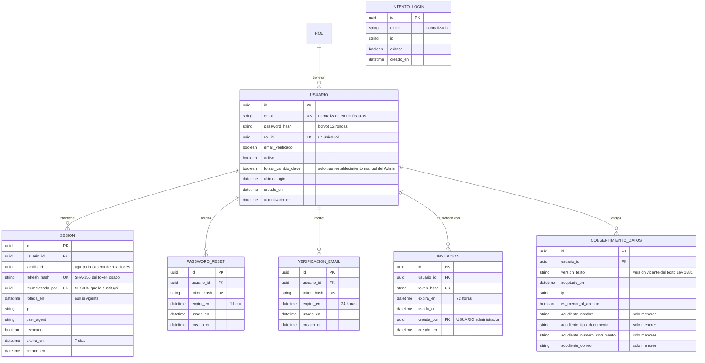

# Módulo: Auth — Autenticación y Sesiones

**Fase:** P1

## Objetivo
Proveer autenticación propia (sin Supabase Auth) con JWT de acceso de corta vida (15 minutos, firmado con **RS256**) y refresh tokens opacos y rotativos en cookie `HttpOnly`. Gestiona registro de beneficiarios, inicio y cierre de sesión, verificación de correo, recuperación y cambio de contraseña, aceptación de invitaciones de funcionarios y revocación inmediata de accesos. Garantiza que ninguna ruta quede expuesta sin `authenticate()` salvo la lista cerrada de rutas públicas, protege contraseñas con bcrypt (12 rondas) y mitiga fuerza bruta, enumeración de usuarios y robo de sesión, conforme a la Ley 1581 de 2012 (Habeas Data).

El token **no lleva permisos**: solo `sub`, `rol` y `jti`. Los permisos se resuelven en el servidor desde la matriz rol→permiso (→ `roles_permissions.md`), de modo que un cambio de matriz aplica sin reautenticar.

## Archivos del Módulo

### Backend (`apps/api/src/modules/auth/`)
- `auth.model.ts` — Tipos Prisma/TypeScript: `Usuario`, `Sesion`, `PasswordReset`, `VerificacionEmail`, `Invitacion`, `IntentoLogin`.
- `auth.service.ts` — Registro, validación de credenciales, emisión y rotación de tokens, ventana de gracia, detección de reuso, flujos de verificación, reseteo, cambio de clave e invitación. Toda escritura relevante llama a `auditar(tx, …)` en la misma transacción; todo correo se encola en el outbox (→ `notificaciones.md`).
- `session.service.ts` — `SessionService`: `revocarTodas(usuarioId, motivo)`, `revocarSesion(id)`, `contarActivas(usuarioId)`. Es la única interfaz que `accounts` usa para revocar sesiones (→ `accounts.md`).
- `token.service.ts` — Firma y verificación RS256 (algoritmo fijado; se rechazan `none` y HS*), rotación de claves por `kid`, generación y hash (SHA-256) de tokens opacos.
- `auth.controller.ts` — Controladores Express con validación Zod y emisión/limpieza de cookies.
- `auth.routes.ts` — Router bajo `/api/v1/auth`.
- `auth.middleware.ts` — `authenticate()` (verifica JWT RS256, carga el usuario en BD y exige `activo = true`), `requirePasswordChanged` (guardia de `forzar_cambio_clave`), `ipRateLimiter`, `emailLoginGuard`.
- `public-routes.ts` — Lista cerrada de rutas públicas (única fuente; la prueba de matriz falla si una ruta no listada omite `authenticate()`).
- `__tests__/auth.test.ts` — Pruebas unitarias e integración (Jest + Supertest).

### Compartido (`packages/shared/src/auth/`)
- `auth.schemas.ts` — Esquemas Zod: `LoginDto`, `RegisterDto`, `ForgotPasswordDto`, `ResetPasswordDto`, `ChangePasswordDto`, `AceptarInvitacionDto`, regla de contraseña.
- `auth.types.ts` — `TokenPayload { sub, rol, jti }`, `AuthResponse`, `UserSession`, códigos de error.

### Frontend (`apps/web/src/modules/auth/`)
- `components/LoginForm.tsx` — Inicio de sesión con mensajes genéricos.
- `components/RegisterForm.tsx` — Autoregistro con fecha de nacimiento, aceptación de consentimiento y bloque de acudiente cuando el titular es menor de edad.
- `components/ForgotPasswordForm.tsx`, `components/ResetPasswordForm.tsx` — Recuperación con medidor de fortaleza.
- `components/ChangePasswordForm.tsx` — Cambio de contraseña autenticado (también usado en el cambio forzado).
- `components/EmailVerification.tsx` — Confirmación de correo y reenvío.
- `components/AcceptInvitation.tsx` — Definición de contraseña desde el enlace de invitación.
- `hooks/useAuth.ts` — Contexto global: usuario, rol, permisos (de `/auth/me`) y estado de carga.
- `hooks/useTokenRefresh.ts` — Interceptor Axios con **cola única de refresh** (una sola petición `/auth/refresh` en vuelo por pestaña; ante `409 REFRESH_CONCURRENTE` reintenta tras breve espera con la cookie ya actualizada).
- `services/authApi.ts` — Cliente HTTP tipado.

## Endpoints Propuestos

| Método | Ruta | Descripción | Auth Requerida | Roles Permitidos |
|---|---|---|:---:|:---:|
| `POST` | `/api/v1/auth/register` | Autoregistro de beneficiario (datos mínimos, consentimiento obligatorio, acudiente si es menor); envía correo de verificación vía outbox | No | Público |
| `POST` | `/api/v1/auth/login` | Emite Access Token (JSON) y Refresh Token (cookie `HttpOnly`) | No | Público |
| `POST` | `/api/v1/auth/refresh` | Rota el refresh token (cookie) y entrega nuevo access token | No (cookie) | Público |
| `POST` | `/api/v1/auth/logout` | Revoca la sesión del refresh token de la cookie; **funciona aunque el access token esté vencido**; limpia la cookie | No (cookie) | Público |
| `POST` | `/api/v1/auth/password/forgot` | Solicita enlace de recuperación (token de 1 h, respuesta siempre `202`) | No | Público |
| `POST` | `/api/v1/auth/password/reset` | Establece nueva contraseña con token de un solo uso; revoca todas las sesiones | No | Público |
| `POST` | `/api/v1/auth/password/change` | Cambia la contraseña del usuario en sesión (exige la actual); revoca las demás sesiones | Sí | Todos |
| `GET` | `/api/v1/auth/verify-email/:token` | Confirma el correo (`email_verificado = true`) | No | Público |
| `POST` | `/api/v1/auth/verify-email/resend` | Reenvía el correo de verificación (respuesta siempre `202`, rate limit) | No | Público |
| `POST` | `/api/v1/auth/invitacion/aceptar` | Valida el token de invitación y define la contraseña; marca `email_verificado = true` | No | Público |
| `GET` | `/api/v1/auth/me` | Datos del usuario en sesión: `id`, `email`, `rol`, `permisos[]` (resueltos en servidor), `forzar_cambio_clave`, y `perfil_completo` si es beneficiario | Sí | Todos |

**Lista cerrada de rutas públicas** (todo lo demás exige `authenticate()`): `/auth/register`, `/auth/login`, `/auth/refresh`, `/auth/logout`, `/auth/password/forgot`, `/auth/password/reset`, `/auth/verify-email/*`, `/auth/invitacion/aceptar`, `GET /publico/convocatorias` (+ `/:id`), `GET /publico/verificar/:codigo`, `GET /catalogos/consentimiento/vigente` y `POST /notificaciones/webhooks/correo` (esta última se autentica por firma HMAC del proveedor, no por JWT).

Códigos de error propios: `CUENTA_INACTIVA`, `EMAIL_NO_VERIFICADO`, `TOKEN_EXPIRED`, `REFRESH_CONCURRENTE`, `CAMBIO_CLAVE_REQUERIDO`, `EMAIL_EN_USO`, `TOKEN_INVALIDO_O_USADO`, `CONSENTIMIENTO_REQUERIDO`, `CUENTA_BLOQUEADA_TEMPORAL`.

## Modelos de Datos

Definición **única** de `USUARIO` (el resto de módulos la referencian, no la redefinen).

Notas:
- `INTENTO_LOGIN` no tiene FK a `USUARIO` (registra también correos inexistentes sin revelar su existencia). Se purga por job pasados 30 días.
- `CONSENTIMIENTO_DATOS` es propiedad de `auth` (se crea en el registro); `accounts` lo consulta y registra re-aceptaciones (→ `accounts.md`).
- Los tokens se almacenan siempre como hash SHA-256; nunca en claro.
- `ROL` y la matriz de permisos se definen en `roles_permissions.md`.

## Flujo de Usuario Crítico

### Registro y verificación
1. El visitante envía correo, contraseña, datos de identificación mínimos (tipo y número de documento, nombres, apellidos, fecha de nacimiento) y `aceptar_consentimiento = true`. Si por `fecha_nacimiento` es menor de edad, debe enviar los datos del acudiente (→ `accounts.md`).
2. En **una sola transacción** se crean `USUARIO` (rol `BENEFICIARIO`), el `BENEFICIARIO` básico, `CONSENTIMIENTO_DATOS` (versión vigente, fecha, IP; datos del acudiente si es menor), `VERIFICACION_EMAIL`, el evento de auditoría `REGISTRO` y el evento de outbox del correo. Sin consentimiento no se completa el registro (`422 CONSENTIMIENTO_REQUERIDO`).
3. El usuario abre `GET /auth/verify-email/:token`; `email_verificado = true`. Si el token venció puede pedir `POST /auth/verify-email/resend`.

### Inicio de sesión
1. Se evalúan los **dos contadores independientes** sobre `INTENTO_LOGIN` (ventana de 15 min): por IP (20 intentos → `429`) y por email (5 fallos → bloqueo de ese email 15 min, `429 CUENTA_BLOQUEADA_TEMPORAL` con `Retry-After`, y aviso por correo al titular vía outbox, una sola vez por bloqueo). El contador por email es independiente de la IP, de modo que rotar IP no evade el bloqueo.
2. `bcrypt.compare()` contra el hash (si el correo no existe se compara contra un hash señuelo para igualar tiempos). Fallo → `401` con mensaje genérico "Credenciales inválidas" y se audita `LOGIN_FALLIDO` (email y IP, sin la contraseña).
3. Credenciales correctas pero `activo = false` → `403 CUENTA_INACTIVA`; `email_verificado = false` → `403 EMAIL_NO_VERIFICADO`.
4. Se emite el access token RS256 (15 min) con claims `sub`, `rol`, `jti` y un refresh token opaco (7 días) cuyo hash se guarda en `SESION`. Cookie: `HttpOnly; Secure; SameSite=Strict; Path=/api/v1/auth`. Se actualiza `ultimo_login` y se audita `LOGIN_EXITOSO`.
5. El frontend guarda el access token solo en memoria y redirige según el rol (`beneficiario_dashboard`, `dashboard_funcionario`, `admin_dashboard`). Si `forzar_cambio_clave = true`, solo se permite `/auth/password/change`, `/auth/me` y `/auth/logout`; el resto responde `403 CAMBIO_CLAVE_REQUERIDO`.

### Rotación del refresh token con ventana de gracia
1. `POST /auth/refresh` busca la `SESION` por hash.
2. Si está vigente y no rotada: se marca `rotada_en = now`, se crea la nueva `SESION` (misma `familia_id`), se llena `reemplazada_por` y se devuelve un nuevo par.
3. Si ya estaba rotada y `now − rotada_en ≤ 10 s` (pestañas concurrentes): se responde `409 REFRESH_CONCURRENTE` **sin revocar**; el cliente reintenta con la cookie nueva ya establecida por la otra pestaña.
4. Si ya estaba rotada o revocada y fuera de la ventana: se considera **reuso**; se revocan todas las sesiones del usuario, se audita `REFRESH_REUSO` y se responde `401`.

### Recuperación, cambio de contraseña e invitación
- **forgot/reset:** `forgot` siempre responde `202` (no revela si el correo existe) y encola el correo con enlace de 1 h. `reset` valida el token de un solo uso, guarda el nuevo hash, apaga `forzar_cambio_clave`, revoca todas las sesiones y audita `PASSWORD_RESET`.
- **change:** autenticado; exige `password_actual`; revoca todas las sesiones excepto la actual, apaga `forzar_cambio_clave` y audita `PASSWORD_CAMBIADA`.
- **invitación:** el Administrador crea al funcionario (→ `accounts.md`), lo que genera `INVITACION` (token de un solo uso, hash en BD, vigencia 72 h). El funcionario abre el enlace y envía `POST /auth/invitacion/aceptar { token, password }`; se guarda el hash, `email_verificado = true`, se marca `usada_en` y se audita `INVITACION_ACEPTADA`. No se envían contraseñas por correo.
- **Primer administrador:** `npm run seed:admin` (variables de entorno `ADMIN_EMAIL` y `ADMIN_PASSWORD_INICIAL`); idempotente; no existe endpoint público para ello.

## Casos de Uso Especiales y Reglas de Seguridad

- **Respuestas de acceso (regla única de `DECISIONES §2`):** sin token o token inválido → `401` (token vencido: `401 TOKEN_EXPIRED`); usuario inactivo → `403 CUENTA_INACTIVA`; rol sin permiso → `403` (→ `roles_permissions.md`); recurso ajeno → `404`; conflicto de estado → `409`; datos inválidos → `422`.
- **Cuenta deshabilitada:** `authenticate()` consulta en cada petición el estado de `USUARIO`; si `activo = false` responde `403 CUENTA_INACTIVA` aunque el JWT siga vigente. Además `accounts` invoca `SessionService.revocarTodas()`.
- **Reuso de refresh token:** descrito arriba; genera auditoría `REFRESH_REUSO` y revoca toda la familia y demás sesiones del usuario.
- **Sesiones concurrentes:** máximo 3 sesiones activas por cuenta; al abrir una cuarta se revoca la más antigua.
- **Contraseña:** 8 a 64 caracteres (límite de bcrypt), al menos una mayúscula, un número y un carácter especial. Validada con Zod en `packages/shared`.
- **Rate limit adicional:** `/auth/register`, `/auth/password/forgot` y `/auth/verify-email/resend` tienen límite por IP y por correo (los valores concretos se configuran en `CONFIG`); excedido → `429`. (El límite de `…/upload-url` lo aplica `documentos.md`.)
- **Auditoría (vía `auditar(tx, …)`):** `REGISTRO`, `LOGIN_EXITOSO`, `LOGIN_FALLIDO`, `CUENTA_BLOQUEADA`, `REFRESH_REUSO`, `LOGOUT`, `PASSWORD_RESET`, `PASSWORD_CAMBIADA`, `INVITACION_ACEPTADA`, `SESIONES_REVOCADAS` (→ `auditoria.md`). `LOGIN_FALLIDO` se registra en su propia transacción corta, aunque el login termine en error.
- **Correo:** verificación, recuperación, invitación y aviso de bloqueo se insertan como `EVENTO_OUTBOX` en la misma transacción que origina el evento (→ `notificaciones.md`); `auth` nunca llama al SMTP.
- **Despliegue same-site:** SPA y API bajo el mismo sitio (`app.<dominio>` / `api.<dominio>`) para que la cookie `SameSite=Strict` funcione; CORS con `credentials` solo para ese origen.
- **Claves JWT:** par RSA por entorno, rotación por `kid` (la verificación acepta la clave anterior durante el período de transición); secretos fuera del repositorio.
- **Enumeración:** mensajes genéricos en login, forgot y resend; el único endpoint que revela existencia de un correo es el registro (`409 EMAIL_EN_USO`), protegido por rate limit.

## Dependencias entre Módulos
- **`accounts.md`**: `auth` lee estado de la cuenta (activo, perfil) y `accounts` revoca sesiones mediante `SessionService` (única dependencia bidireccional permitida, `DECISIONES §16`).
- **`roles_permissions.md`**: provee el rol y la resolución de permisos en servidor usada por `/auth/me`; define `ROL`.
- **`auditoria.md`**: `auditar(tx, evento)`.
- **`notificaciones.md`**: outbox transaccional para correos.
- **`catalogos_configuracion.md`**: parámetros de rate limit y versión vigente del texto de consentimiento.

## Dependencias Externas
- `bcrypt` — hash de contraseñas.
- `jose` — firma y verificación RS256.
- `zod` — validación (esquemas en `packages/shared`).
- `express-rate-limit` (con almacén Redis compartido con BullMQ) — límites por IP y por correo.
- `cookie-parser` — lectura de cookies.
- `apps/api/src/shared/outbox` y `apps/api/src/shared/audit` — infraestructura transversal.

## Pruebas de Aceptación
- [ ] Credenciales incorrectas retornan `401` con mensaje genérico y generan el evento de auditoría `LOGIN_FALLIDO`.
- [ ] Registro con correo ya existente retorna `409 EMAIL_EN_USO`.
- [ ] Registro con contraseña que incumple la regla retorna `422` con el detalle del fallo.
- [ ] Registro sin aceptar el consentimiento retorna `422 CONSENTIMIENTO_REQUERIDO` y no crea ningún registro.
- [ ] Registro de un menor de edad sin datos de acudiente retorna `422`; con datos completos crea `CONSENTIMIENTO_DATOS` con los datos del acudiente.
- [ ] Inicio de sesión exitoso establece la cookie `refresh_token` con `HttpOnly`, `Secure`, `SameSite=Strict` y `Path=/api/v1/auth`.
- [ ] El access token está firmado con RS256, contiene solo `sub`, `rol` y `jti`, y un token con `alg: none` o HS256 es rechazado con `401`.
- [ ] Petición a ruta protegida sin `Authorization: Bearer` retorna `401`; con token vencido retorna `401 TOKEN_EXPIRED`.
- [ ] Un usuario con `activo = false` recibe `403 CUENTA_INACTIVA` inmediatamente, incluso con JWT vigente.
- [ ] Login con `email_verificado = false` retorna `403 EMAIL_NO_VERIFICADO`.
- [ ] `/auth/refresh` con token válido devuelve nuevo access token y rota el refresh token.
- [ ] Un refresh token ya rotado presentado dentro de 10 s retorna `409 REFRESH_CONCURRENTE` y **no** revoca sesiones.
- [ ] Un refresh token ya rotado presentado después de 10 s retorna `401`, revoca todas las sesiones del usuario y audita `REFRESH_REUSO`.
- [ ] 5 fallos de un mismo email en 15 min bloquean ese email (`429`) aunque cambie la IP, y el titular recibe un aviso por correo.
- [ ] 20 intentos desde una misma IP en 15 min (con correos distintos) retornan `429`.
- [ ] `/auth/logout` con access token vencido pero cookie válida revoca la sesión y borra la cookie.
- [ ] `/auth/password/change` exige la contraseña actual, revoca las demás sesiones y apaga `forzar_cambio_clave`.
- [ ] Con `forzar_cambio_clave = true` cualquier ruta distinta de `password/change`, `me` y `logout` retorna `403 CAMBIO_CLAVE_REQUERIDO`.
- [ ] El enlace de recuperación queda inutilizable tras su primer uso o pasada 1 hora; `forgot` responde `202` exista o no el correo.
- [ ] `/auth/verify-email/resend` aplica rate limit y responde `202` genérico.
- [ ] `/auth/invitacion/aceptar` con token válido define la contraseña y marca `email_verificado = true`; con token usado o vencido (72 h) retorna `422 TOKEN_INVALIDO_O_USADO`.
- [ ] La cuarta sesión concurrente revoca la sesión más antigua.
- [ ] Ninguna ruta fuera de la lista cerrada de rutas públicas responde sin `authenticate()` (verificado por la prueba de matriz automática).
- [ ] Todos los correos (verificación, recuperación, invitación, bloqueo) salen del outbox, no directamente del servicio.
