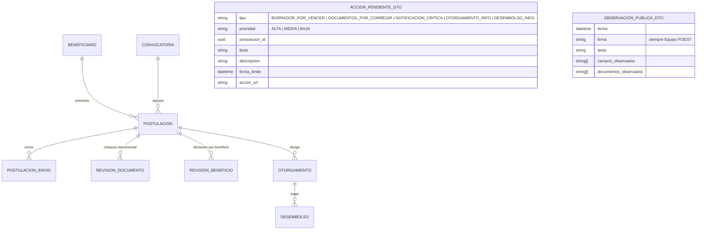
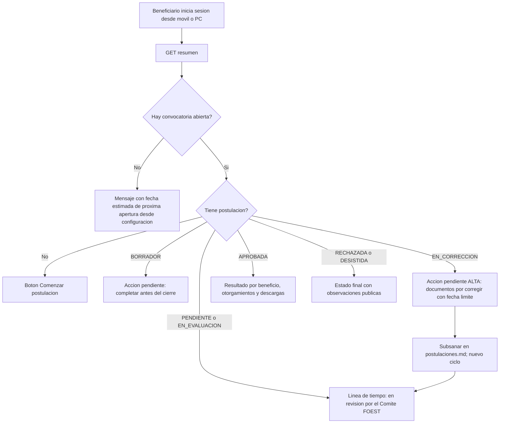

# Módulo: Beneficiario Dashboard — Portal del Estudiante

**Fase:** P2 – Evaluación y seguimiento

## Objetivo
Proveer al beneficiario un portal accesible y *mobile-first* donde consulta las convocatorias abiertas (o la fecha estimada de la próxima), sigue sus postulaciones mediante una línea de tiempo en lenguaje claro, atiende las acciones pendientes (borradores por vencer, documentos por corregir), consulta el estado de sus documentos, descarga los formatos oficiales y ve sus otorgamientos y desembolsos. Protege la identidad de los evaluadores: toda observación se presenta bajo la firma **"Equipo FOEST"**.

El módulo es de solo lectura: agrega y presenta información de otros módulos y **no escribe en sus tablas**. Las **notificaciones no se definen aquí**: la entidad y sus endpoints viven en `notificaciones.md`; este módulo solo las consume.

## Archivos del Módulo

### Backend
- `apps/api/src/modules/beneficiario_dashboard/beneficiario_dashboard.service.ts` — Resumen del estudiante, cálculo de acciones pendientes, línea de tiempo, estado de documentos, descargas y otorgamientos.
- `apps/api/src/modules/beneficiario_dashboard/estados.presentacion.ts` — Traducción de estados técnicos a lenguaje claro (fuente única, también usada por el frontend vía `packages/shared`).
- `apps/api/src/modules/beneficiario_dashboard/beneficiario_dashboard.controller.ts` — Handlers Express.
- `apps/api/src/modules/beneficiario_dashboard/beneficiario_dashboard.routes.ts` — Rutas bajo `/api/v1/dashboard/beneficiario`.
- `apps/api/src/modules/beneficiario_dashboard/beneficiario_dashboard.dto.ts` — Tipos de respuesta y esquemas Zod (reexportados desde `packages/shared/src/beneficiario_dashboard/`).
- `apps/api/src/modules/beneficiario_dashboard/__tests__/beneficiario_dashboard.test.ts` — Pruebas de aislamiento, agregación y anonimato.

### Frontend
- `apps/web/src/modules/beneficiario_dashboard/pages/BeneficiarioHomePage.tsx` — Pantalla principal.
- `apps/web/src/modules/beneficiario_dashboard/components/EstudianteResumenCard.tsx` — Convocatoria vigente o fecha estimada de próxima apertura, y botón destacado "Comenzar postulación".
- `apps/web/src/modules/beneficiario_dashboard/components/AccionesPendientesAlert.tsx` — Lista priorizada de acciones pendientes.
- `apps/web/src/modules/beneficiario_dashboard/components/LineaTiempoExpediente.tsx` — Línea de tiempo con estados y observaciones.
- `apps/web/src/modules/beneficiario_dashboard/components/AprobacionPorBeneficioList.tsx` — Resultado por beneficio en aprobaciones parciales.
- `apps/web/src/modules/beneficiario_dashboard/components/DocumentChecklistStatus.tsx` — Soportes con insignias (Aprobado, Por corregir, Pendiente).
- `apps/web/src/modules/beneficiario_dashboard/components/DescargasOficialesCard.tsx` — Formatos oficiales descargables.
- `apps/web/src/modules/beneficiario_dashboard/components/OtorgamientosCard.tsx` — Otorgamientos y desembolsos.
- `apps/web/src/modules/beneficiario_dashboard/components/NotificacionesResumen.tsx` — Integra el componente de campana de `notificaciones.md` (sin lógica propia de notificaciones).
- `apps/web/src/modules/beneficiario_dashboard/hooks/useBeneficiarioDashboard.ts` — React Query con revalidación periódica.
- `apps/web/src/modules/beneficiario_dashboard/services/beneficiarioDashboardApi.ts` — Cliente HTTP.

## Endpoints Propuestos

Todos requieren autenticación y rol `BENEFICIARIO`.

| Método | Ruta | Descripción |
|---|---|---|
| `GET` | `/api/v1/dashboard/beneficiario/resumen` | Convocatoria abierta (o `proxima_apertura_estimada`), postulaciones propias con estado claro, `acciones_pendientes` y contador de notificaciones críticas no leídas |
| `GET` | `/api/v1/dashboard/beneficiario/postulaciones/:id/linea-tiempo` | Hitos de estado, ciclos, aprobación por beneficio y observaciones públicas |
| `GET` | `/api/v1/dashboard/beneficiario/postulaciones/:id/documentos` | Soportes con badge derivado del chequeo del último ciclo |
| `GET` | `/api/v1/dashboard/beneficiario/descargas` | Formatos oficiales disponibles, con enlaces a los endpoints de `formatos_oficiales.md` y al certificado de `labor_social.md` |
| `GET` | `/api/v1/dashboard/beneficiario/otorgamientos` | Otorgamientos y desembolsos propios (de `seguimiento_beneficios.md`) |

Las notificaciones (listado, marcar leída, marcar todas) usan los endpoints definidos en `notificaciones.md`; este módulo no los duplica.

Códigos de acceso (DECISIONES §2): `ADMINISTRADOR` o `FUNCIONARIO` → `403`; `:id` de una postulación ajena o inexistente → `404`.

## Modelos de Datos

El módulo **no define tablas**; compone DTO a partir de entidades de otros módulos. La entidad `NOTIFICACION` pertenece a `notificaciones.md`.

`ACCION_PENDIENTE_DTO` y `OBSERVACION_PUBLICA_DTO` son objetos calculados, no persistidos. `OBSERVACION_PUBLICA_DTO` se construye exclusivamente con el serializador `ObservacionPublica` de `evaluacion.md`, sin campos de actor.

## Flujo de Usuario Crítico

## Casos de Uso Especiales y Reglas de Negocio

- **Aislamiento por usuario:** toda consulta filtra por el beneficiario del token. Una postulación, documento u otorgamiento ajeno responde **`404`** (oculta existencia). Un rol distinto de `BENEFICIARIO` recibe **`403`**. El beneficiario no puede forzar identificadores de otro usuario por parámetros.
- **Fecha estimada de próxima apertura:** si no hay convocatoria abierta, `resumen` devuelve `proxima_apertura_estimada` leída de `CONFIG.PROXIMA_APERTURA_ESTIMADA` (administrada en `catalogos_configuracion.md`) o, si existe una convocatoria `BORRADOR`/`HABILITADA` con `fecha_apertura` futura, esa fecha. Si no hay ninguna, se muestra un mensaje amigable sin fecha. El estado "abierta" sigue la definición de DECISIONES §5 (`HABILITADA` y dentro de `fecha_apertura <= ahora < fecha_cierre_exclusiva`).
- **Acciones pendientes** (calculadas en cada lectura y ordenadas por prioridad y fecha límite):
  1. `BORRADOR_POR_VENCER`: postulación en `BORRADOR` cuya convocatoria cierra en menos de `CONFIG.RECORDATORIO_BORRADOR_DIAS` días (prioridad `ALTA` en el último día).
  2. `DOCUMENTOS_POR_CORREGIR`: postulación en `EN_CORRECCION` con `fecha_limite_subsanacion` vigente; lista los tipos de documento en `NO_PRESENTA` y los campos de `campos_observados`, con la fecha límite en hora de `America/Bogota`. Vencido el plazo la postulación pasa a `RECHAZADA` por el job del sistema y la acción desaparece.
  3. `NOTIFICACION_CRITICA`: notificaciones críticas no leídas (conteo y enlace al buzón de `notificaciones.md`).
  4. `OTORGAMIENTO_INFO` y `DESEMBOLSO_INFO` (informativas, prioridad `BAJA`): otorgamiento nuevo o desembolso `PROGRAMADO`/`PAGADO` reciente.
- **Línea de tiempo:** hitos construidos con el historial de transiciones y los envíos de `postulaciones.md`: `BORRADOR` → `PENDIENTE` (enviada, ciclo n) → `EN_EVALUACION` → resultado `APROBADA` | `RECHAZADA` | `EN_CORRECCION` (→ `PENDIENTE` en nuevo ciclo al subsanar) | `DESISTIDA`. Incluye cada ciclo con su fecha de envío y dictamen. En `APROBADA`, se muestra el resultado **por beneficio** (aprobado/rechazado con motivo público) y se indica "aprobación parcial" cuando `aprobacion_parcial = true`. Un regreso de `EN_EVALUACION` a `PENDIENTE` por liberación o reasignación se presenta como "En revisión por el Comité FOEST" sin exponer el movimiento interno.
- **Traducción de estados a lenguaje claro** (fuente única `estados.presentacion.ts`):

| Estado técnico | Texto al beneficiario |
|---|---|
| `BORRADOR` | "Borrador sin enviar" |
| `PENDIENTE` | "Recibida, en espera de revisión" |
| `EN_EVALUACION` | "En revisión por el Comité FOEST" |
| `EN_CORRECCION` | "Documentos pendientes de corrección" |
| `APROBADA` (total) | "¡Aprobada! Felicitaciones" |
| `APROBADA` (`aprobacion_parcial`) | "Aprobada parcialmente: revisa el resultado por beneficio" |
| `RECHAZADA` | "No aprobada (revisa las observaciones)" |
| `DESISTIDA` | "Desistida por ti" |

- **Badges de documentos:** se derivan del chequeo documental (`REVISION_DOCUMENTO`) del **último ciclo**: `PRESENTA` → **Aprobado**; `NO_PRESENTA` → **Por corregir**; sin chequeo en ese ciclo → **Pendiente**. `NO_APLICA` no se muestra como pendiente. No existe `DOCUMENTO.estado_revision`. Los documentos con `estado_carga` distinto de `DISPONIBLE` se muestran como "Procesando" o "Archivo rechazado" según corresponda.
- **Anonimato del evaluador:** las observaciones se entregan solo mediante el serializador `ObservacionPublica` (definido en `evaluacion.md`), con firma **"Equipo FOEST"** y sin nombre, correo, identificador ni rol del actor. Una prueba de contrato recorre recursivamente la respuesta buscando campos de actor.
- **Descargas de formatos oficiales:** `descargas` lista los GE-F041 y GE-F043 generados (con su estado vigente o desactualizado) con enlaces a los endpoints de `formatos_oficiales.md`, y el GE-F038 de `labor_social.md` cuando aplica. Este módulo no genera ni almacena archivos.
- **Otorgamientos y desembolsos:** `otorgamientos` devuelve por beneficio `{ beneficio, estado (ACTIVO | SUSPENDIDO | REVOCADO | CUMPLIDO), monto_aprobado, desembolsos: [{ fecha, estado (PROGRAMADO | PAGADO | ANULADO), referencia_pago }] }`. Los datos de pago aparecen solo enmascarados (`ultimos4`); nunca el número completo. Si un otorgamiento fue `REVOCADO` o `SUSPENDIDO` se muestra el motivo público definido en `seguimiento_beneficios.md`.
- **Notificaciones:** el portal muestra el contador de críticas no leídas y enlaza al centro de notificaciones de `notificaciones.md`; marcar leída o leer todas se hace con los endpoints de ese módulo.
- **Accesibilidad y diseño adaptable:** contraste WCAG AA, navegación por teclado, etiquetas ARIA en la línea de tiempo y las insignias (no depender solo del color), tamaños de fuente legibles y **áreas táctiles mínimas de 44×44 px**. Diseño *mobile-first*; la línea de tiempo es vertical en móvil.
- **Solo lectura:** no escribe en tablas de otros módulos. Subsanar, desistir y enviar se hacen en `postulaciones.md`.

## Dependencias entre Módulos
- **`postulaciones.md`**: estado, ciclos, historial de transiciones y documentos de la postulación (lectura).
- **`convocatorias.md`**: calendario, vigencia y próxima apertura.
- **`documentos.md`**: estado de carga y tipos de documento.
- **`evaluacion.md`**: chequeo documental (`REVISION_DOCUMENTO`), dictamen por beneficio y serializador `ObservacionPublica`.
- **`formatos_oficiales.md`**: formatos GE-F041 y GE-F043 y sus enlaces de descarga.
- **`labor_social.md`**: certificado GE-F038 y avance de horas (enlace).
- **`seguimiento_beneficios.md`**: otorgamientos y desembolsos.
- **`notificaciones.md`**: buzón y contador de notificaciones (consumo).
- **`catalogos_configuracion.md`**: `PROXIMA_APERTURA_ESTIMADA`, `RECORDATORIO_BORRADOR_DIAS`.
- **`roles_permissions.md`**: acceso exclusivo del rol `BENEFICIARIO`.

## Dependencias Externas
- `@tanstack/react-query`: caché y revalidación.
- `lucide-react`: iconografía de estados.
- `date-fns` y `date-fns-tz`: fechas relativas y zona `America/Bogota`.
- `zod`: validación de DTO.

## Pruebas de Aceptación
- [ ] Un beneficiario solo consulta sus propias postulaciones y otorgamientos; un `:id` ajeno responde `404`.
- [ ] Un `ADMINISTRADOR` o `FUNCIONARIO` recibe `403` en todas las rutas del módulo.
- [ ] Un borrador con cierre a menos de `RECORDATORIO_BORRADOR_DIAS` días aparece en `acciones_pendientes`; uno con cierre posterior no.
- [ ] Una postulación en `EN_CORRECCION` muestra los documentos `NO_PRESENTA`, los campos observados y la `fecha_limite_subsanacion` vigente; tras vencer, la acción desaparece.
- [ ] Las notificaciones críticas no leídas aparecen como acción pendiente y el contador baja al marcarlas con el endpoint de `notificaciones.md`.
- [ ] Los otorgamientos y desembolsos nuevos aparecen como acciones informativas.
- [ ] La línea de tiempo muestra `EN_EVALUACION`, `EN_CORRECCION`, `RECHAZADA`, `DESISTIDA` y, en aprobación parcial, el resultado por beneficio.
- [ ] Cada estado técnico se muestra con el texto de la tabla de traducción, incluida la aprobación parcial.
- [ ] Un documento con chequeo `PRESENTA` se muestra "Aprobado"; `NO_PRESENTA`, "Por corregir"; sin chequeo en el último ciclo, "Pendiente".
- [ ] En ninguna respuesta aparece nombre, correo, id o rol del evaluador; las observaciones llevan la firma "Equipo FOEST" (prueba de contrato recursiva).
- [ ] `descargas` enlaza a los formatos de `formatos_oficiales.md`; un formato desactualizado se indica como tal.
- [ ] Los desembolsos muestran solo datos de pago enmascarados (`ultimos4`).
- [ ] Sin convocatoria abierta se muestra la fecha estimada de la próxima apertura (o mensaje amigable si no hay fecha).
- [ ] Los controles interactivos miden al menos 44×44 px y el contraste cumple WCAG AA (auditoría automática con axe en el E2E).
