# Módulo: Catálogos y Configuración del Sistema

**Fase:** P0

## Objetivo
Centralizar los parámetros editables del FOEST y los catálogos de referencia que usan todos los módulos: configuración versionada (`CONFIGURACION_SISTEMA`), calendario de festivos y utilidad de días hábiles, catálogo SNIES de instituciones y programas, declaraciones juramentadas versionadas, textos de consentimiento versionados y siembra de catálogos cerrados (`BENEFICIO`, `TIPO_DOCUMENTO`). Evita valores cableados (por ejemplo el acuerdo vigente: Acuerdo 023 de 2025, con concordancia al 037 en algunos pagarés).

Este módulo es fundacional: no depende de ningún módulo de negocio; todos los demás pueden depender de él.

## Archivos del Módulo

### Backend (`apps/api/src/modules/catalogos_configuracion/`)
- `configuracion.service.ts` — Lectura tipada con caché en memoria (invalidada al escribir), escritura con control de versión, validación por clave.
- `configuracion.defaults.ts` — Catálogo completo de claves, tipo, valor por defecto, rango y descripción (fuente del seed).
- `festivo.service.ts` — CRUD de festivos y carga anual.
- `snies.service.ts` — Búsqueda e importación de IES y programas.
- `declaracion.service.ts` — Declaraciones juramentadas y textos de consentimiento versionados.
- `catalogos.controller.ts`, `catalogos.routes.ts` — Rutas bajo `/api/v1` (`/configuracion`, `/festivos`, `/catalogos/*`).
- `catalogos.dto.ts` — Zod (reexporta desde `packages/shared`).
- `seeds/` — `configuracion.seed.ts`, `festivos.seed.ts` (año en curso y siguiente), `declaraciones.seed.ts`, `consentimiento.seed.ts`.
- `__tests__/configuracion.test.ts`, `festivo.test.ts`, `snies.test.ts`.

### Utilidades transversales (`apps/api/src/shared/business-days/`)
- `business-days.ts` — `addBusinessDays(fecha, n)`, `diffBusinessDays(a, b)`, `isBusinessDay(fecha)`, `nextBusinessDay(fecha)`. Usa la tabla `FESTIVO`, sábados y domingos como no hábiles, zona `America/Bogota`.
- `index.ts` — Exporta la API pública.

### Scripts (`apps/api/scripts/`)
- `import-snies.ts` — Importa el listado oficial del MEN a `IES_SNIES` y `PROGRAMA_SNIES` (`npm run snies:import -- <archivo.csv>`).
- `seed-festivos.ts` — Genera/carga los festivos de un año (`npm run festivos:seed -- 2026`).

### Compartido (`packages/shared/src/catalogos_configuracion/`)
- `configuracion.keys.ts` (enum `ClaveConfiguracion`), `configuracion.schemas.ts`, `snies.schemas.ts`, `declaracion.types.ts`.

### Frontend (`apps/web/src/modules/catalogos_configuracion/`)
- `components/ConfiguracionTable.tsx` — Edición por categoría con control de versión y confirmación.
- `components/FestivosManager.tsx` — Calendario anual con alta/baja de festivos.
- `components/SniesImportPanel.tsx` — Carga de CSV con resumen de resultados.
- `components/DeclaracionesEditor.tsx` — Versionado de declaraciones y consentimiento.
- `components/IesProgramaSelect.tsx` — Selector con búsqueda (autocompletado) reutilizado por el formulario GE-F041.
- `hooks/useConfiguracion.ts`, `hooks/useSnies.ts`, `services/catalogosApi.ts`, `types/catalogos.types.ts`.

## Endpoints Propuestos

Todos bajo `/api/v1`. Escrituras: solo `ADMINISTRADOR`, siempre con `auditar(tx, …)`.

### Configuración

| Método | Ruta | Descripción | Auth | Roles |
|---|---|---|:---:|---|
| `GET` | `/configuracion` | Lista todas las claves con valor, tipo, categoría, descripción y `version`. Filtro `?categoria=` | Sí | `ADMINISTRADOR` |
| `GET` | `/configuracion/:clave` | Valor y versión de una clave | Sí | `ADMINISTRADOR` |
| `PUT` | `/configuracion/:clave` | Actualiza `{ valor, version, motivo? }`; `409 VERSION_DESACTUALIZADA` si `version` no coincide | Sí | `ADMINISTRADOR` |
| `GET` | `/configuracion/publica` | Subconjunto no sensible para la UI: `ACUERDO_VIGENTE_CODIGO`, `ACUERDO_VIGENTE_TEXTO`, `MAX_TAMANO_ARCHIVO_MB`, `CUOTA_POSTULACION_MB`, `FECHA_PROXIMA_APERTURA_ESTIMADA`, `CONSENTIMIENTO_TEXTO_VERSION_VIGENTE`, `SUBSANACION_DIAS_HABILES` | Sí | Todos (también público en el registro: ver nota) |

Nota: el registro de cuentas necesita el texto de consentimiento antes de autenticarse; por eso se publica `GET /catalogos/consentimiento/vigente` (ver más abajo) como ruta de lectura mínima sin auth, que **debe agregarse a la lista cerrada de rutas públicas** de DECISIONES §7 (ver `PENDIENTES.md`). `/configuracion/publica` sí exige autenticación.

### Festivos

| Método | Ruta | Descripción | Auth | Roles |
|---|---|---|:---:|---|
| `GET` | `/festivos?anio=2026` | Lista festivos del año | Sí | `ADMINISTRADOR` |
| `POST` | `/festivos` | Crea festivo `{ fecha, nombre }` | Sí | `ADMINISTRADOR` |
| `POST` | `/festivos/carga-anual` | Carga masiva de un año `{ anio, festivos: [{fecha, nombre}] }` (reemplaza solo los de ese año con confirmación) | Sí | `ADMINISTRADOR` |
| `DELETE` | `/festivos/:id` | Elimina festivo (borrado físico; auditado con snapshot) | Sí | `ADMINISTRADOR` |
| `GET` | `/festivos/dias-habiles?desde=&n=` | Utilidad de consulta: fecha resultante de sumar `n` días hábiles | Sí | `ADMINISTRADOR`, `FUNCIONARIO` |

### SNIES (IES y programas)

| Método | Ruta | Descripción | Auth | Roles |
|---|---|---|:---:|---|
| `GET` | `/catalogos/ies?q=&page=` | Búsqueda de instituciones por nombre o código SNIES (prefijo, sin tildes, paginada) | Sí | Todos |
| `GET` | `/catalogos/ies/:codigo_snies/programas?q=&page=` | Programas activos de una IES | Sí | Todos |
| `GET` | `/catalogos/programas/:codigo_snies` | Detalle de un programa (valida que exista y esté activo) | Sí | Todos |
| `POST` | `/admin/catalogos/snies/importar` | Carga CSV (multipart) del listado oficial; `?modo=simulacion` valida sin escribir; retorna resumen `{ insertados, actualizados, desactivados, errores[] }` | Sí | `ADMINISTRADOR` |
| `GET` | `/admin/catalogos/snies/importaciones` | Historial de importaciones | Sí | `ADMINISTRADOR` |

### Declaraciones y consentimiento

| Método | Ruta | Descripción | Auth | Roles |
|---|---|---|:---:|---|
| `GET` | `/catalogos/declaraciones/vigentes` | Las 6 declaraciones juramentadas en su versión vigente (para el formulario) | Sí | Todos |
| `GET` | `/admin/catalogos/declaraciones` | Todas las versiones | Sí | `ADMINISTRADOR` |
| `POST` | `/admin/catalogos/declaraciones/:codigo/versiones` | Publica una nueva versión del texto (la anterior queda inactiva, no se modifica) | Sí | `ADMINISTRADOR` |
| `GET` | `/catalogos/consentimiento/vigente` | Texto y versión vigente del consentimiento de datos (Ley 1581) | No | Público |
| `POST` | `/admin/catalogos/consentimiento/versiones` | Publica nueva versión; actualiza `CONSENTIMIENTO_TEXTO_VERSION_VIGENTE` en la misma transacción | Sí | `ADMINISTRADOR` |

`TIPO_DOCUMENTO` y `BENEFICIO` **no** tienen endpoints de escritura: se siembran por migración (ver secciones finales).

## Modelos de Datos

```mermaid
erDiagram
    CONFIGURACION_SISTEMA {
        uuid id PK
        string clave UK
        string valor "serializado segun tipo"
        string tipo "INT | STRING | BOOL | TEXT | DATE | JSON"
        string categoria "ACUERDO | DOCUMENTOS | PLAZOS | ALERTAS | SEGURIDAD | PRIVACIDAD | JURIDICO | LABOR_SOCIAL | NOTIFICACIONES"
        text descripcion
        string valor_defecto
        string valor_min "nullable"
        string valor_max "nullable"
        boolean pendiente_confirmar "valor sujeto a validacion externa"
        int version "bloqueo optimista"
        uuid actualizado_por FK "nullable (seed)"
        timestamptz actualizado_en
    }

    FESTIVO {
        uuid id PK
        date fecha UK
        string nombre
        int anio
        uuid creado_por FK "nullable (seed)"
        timestamptz creado_en
    }

    IES_SNIES {
        string codigo_snies PK
        string nombre
        string caracter "UNIVERSIDAD | INSTITUCION_UNIVERSITARIA | TECNOLOGICA | TECNICA_PROFESIONAL"
        string sector "OFICIAL | PRIVADA"
        string departamento
        string municipio
        boolean activa
        timestamptz actualizado_en
    }

    PROGRAMA_SNIES {
        string codigo_snies PK
        string ies_codigo FK
        string nombre
        string nivel "TECNICO | TECNOLOGICO | PROFESIONAL | ESPECIALIZACION | MAESTRIA | DOCTORADO"
        string modalidad "PRESENCIAL | VIRTUAL | DISTANCIA | DUAL"
        string estado_programa "ACTIVO | INACTIVO"
        string departamento_oferta
        string municipio_oferta
        boolean activo
        timestamptz actualizado_en
    }

    IMPORTACION_SNIES {
        uuid id PK
        uuid admin_id FK
        string archivo_nombre
        string sha256_archivo
        int insertados
        int actualizados
        int desactivados
        jsonb errores
        timestamptz ejecutada_en
    }

    DECLARACION_JURAMENTADA {
        uuid id PK
        string codigo "DECL_1 .. DECL_6"
        int version
        string titulo
        text texto "oficial, cargado por seed desde GE-F041"
        boolean vigente
        boolean texto_oficial_confirmado "false hasta cargar texto del GE-F041"
        date vigente_desde
        uuid creado_por FK
        timestamptz creado_en
    }

    TEXTO_CONSENTIMIENTO {
        uuid id PK
        int version UK
        text texto
        boolean vigente
        date vigente_desde
        uuid creado_por FK
        timestamptz creado_en
    }

    IES_SNIES ||--o{ PROGRAMA_SNIES : "ofrece"
```

Restricciones: una sola fila `vigente = true` por `DECLARACION_JURAMENTADA.codigo` y una sola en `TEXTO_CONSENTIMIENTO` (índice único parcial); las versiones publicadas son **inmutables** (nueva versión = nueva fila). Los formularios guardan la `version` aceptada de cada declaración en su `perfil_snapshot`/envío (responsabilidad de `postulaciones`). `CONSENTIMIENTO_DATOS` (en `accounts`) referencia `TEXTO_CONSENTIMIENTO.version`.

## Catálogo completo de claves de configuración

Se siembra desde `configuracion.defaults.ts`. Toda lectura pasa por `configuracion.service.get(clave)` (tipada y con valor por defecto como respaldo). Los valores marcados "por confirmar" muestran `pendiente_confirmar = true` y una insignia en la UI.

| Clave | Tipo | Defecto | Rango | Categoría | Descripción / consumidor |
|---|---|---|---|---|---|
| `ACUERDO_VIGENTE_CODIGO` | STRING | `ACUERDO-023-2025` | — | ACUERDO | Código del acuerdo aplicable (impreso en formatos). Concordancia con Acuerdo 037 de 2025 por validar |
| `ACUERDO_VIGENTE_TEXTO` | TEXT | "Acuerdo Municipal 023 de 2025" | — | ACUERDO | Texto de referencia mostrado y estampado en los PDF (`formatos_oficiales`) |
| `MAX_TAMANO_ARCHIVO_MB` | INT | `10` | 1–10 | DOCUMENTOS | Tope por archivo (política `content-length-range` del POST prefirmado). No puede exceder 10 (el servidor calcula SHA-256 leyendo el objeto) |
| `CUOTA_POSTULACION_MB` | INT | `30` | 10–200 | DOCUMENTOS | Cuota total de soportes por postulación (`documentos`) |
| `SUBSANACION_DIAS_HABILES` | INT | `5` | 1–`SUBSANACION_DIAS_HABILES_MAX` | PLAZOS | Plazo por defecto de subsanación (días hábiles vía `business-days`) |
| `SUBSANACION_DIAS_HABILES_MAX` | INT | `15` | 1–30 | PLAZOS | Máximo que el funcionario puede fijar al emitir `CORRECCION` |
| `ALERTA_CIERRE_DIAS` | INT | `7` | 1–30 | ALERTAS | Días naturales antes del cierre para alertar y recordar (`convocatorias`) |
| `ALERTA_SOBRECARGA_PENDIENTES` | INT | `50` | 1–1000 | ALERTAS | Postulaciones `PENDIENTE` acumuladas para considerar sobrecarga |
| `ALERTA_SOBRECARGA_DIAS_HABILES` | INT | `5` | 1–30 | ALERTAS | Días hábiles sin revisiones para marcar cuello de botella |
| `ALERTA_ASIGNACION_SIN_MOVIMIENTO_DIAS_HABILES` | INT | `5` | 1–60 | ALERTAS | Días hábiles sin movimiento en una asignación `ACTIVA` antes de alertar (`asignaciones`). Valor inicial propuesto, por confirmar |
| `KANON_UMBRAL` | INT | `5` | 2–50 | PRIVACIDAD | Umbral de k-anonimato en dashboards (§15) |
| `SESIONES_MAX` | INT | `3` | 1–10 | SEGURIDAD | Sesiones (refresh tokens) activas por usuario (`auth`) |
| `RECORDATORIO_BORRADOR_DIAS` | INT | `5` | 1–30 | PLAZOS | Días antes del cierre para recordar al beneficiario con borrador |
| `RECORDATORIO_SUBSANACION_DIAS_HABILES` | INT | `2` | 1–5 | PLAZOS | Días hábiles antes de `fecha_limite_subsanacion` para avisar |
| `FECHA_PROXIMA_APERTURA_ESTIMADA` | DATE | vacío | — | PLAZOS | Fecha estimada mostrada cuando no hay convocatoria abierta (opcional) |
| `CONSENTIMIENTO_TEXTO_VERSION_VIGENTE` | INT | `1` | ≥1 | PRIVACIDAD | Versión vigente del consentimiento; solo se cambia publicando una versión |
| `PAGARE_REQUIERE_CODEUDOR_MENORES` | BOOL | `true` | — | JURIDICO | Activa el bloque de codeudor/acudiente en GE-F043 para menores. **Por validar con jurídica** |
| `RETENCION_DOCUMENTOS_ANIOS` | INT | `5` | 1–30 | JURIDICO | Retención de documentos eliminados lógicamente. **Valor a definir por jurídica** |
| `RETENCION_AUDITORIA_ANIOS` | INT | `10` | 1–30 | JURIDICO | Retención de `AUDITORIA_EVENTO` (ver `auditoria.md`). Por confirmar |
| `RETENCION_NOTIFICACIONES_MESES` | INT | `24` | 3–120 | PRIVACIDAD | Retención de `NOTIFICACION` y `ENTREGA_CORREO` (ver `notificaciones.md`) |
| `LABOR_SOCIAL_HORAS_MINIMAS` | INT | `0` (sin definir) | 0–1000 | LABOR_SOCIAL | Horas mínimas exigidas por período. **Por confirmar con el Acuerdo 023** |
| `AMPLIACION_MOTIVO_MIN_CARACTERES` | INT | `15` | 10–200 | PLAZOS | Longitud mínima del motivo de ampliación/suspensión |
| `PERFIL_EDAD_MAYORIA` | INT | `18` | 18–18 | JURIDICO | Edad de mayoría para derivar `es_menor` (fija; se expone por trazabilidad) |
| `REGISTRO_VERIFICACION_EMAIL_HORAS` | INT | `48` | 1–168 | SEGURIDAD | Vigencia del enlace de verificación de correo (`auth`) |
| `NOTIF_REINTENTOS_MAX` | INT | `8` | 1–20 | NOTIFICACIONES | Reintentos del worker de correo (ver `notificaciones.md`) |

Reglas de configuración:
- Cada clave tiene validación propia (tipo, rango); fuera de rango → `422 VALOR_FUERA_DE_RANGO`.
- `PUT` exige `version`; si cambió → `409 VERSION_DESACTUALIZADA` con el valor actual en `details`.
- Todo cambio genera auditoría `CONFIGURACION` con `datos_antes`/`datos_despues` (claves sin secretos; este módulo **no** guarda secretos: contraseñas SMTP, claves JWT y llaves KMS viven en variables de entorno).
- Los valores de configuración **no** se aplican retroactivamente a plazos ya fijados (por ejemplo `fecha_limite_subsanacion` ya emitida).
- Cambiar `MAX_TAMANO_ARCHIVO_MB` o `CUOTA_POSTULACION_MB` no invalida documentos ya cargados.
- `CONSENTIMIENTO_TEXTO_VERSION_VIGENTE` y las declaraciones no se editan con `PUT`; se alimentan solo al publicar versiones.

## Festivos y días hábiles

- Tabla `FESTIVO` con los festivos de Colombia (Ley Emiliani incluida), cargados cada año: seed de año en curso y siguiente en el despliegue y carga anual por `POST /festivos/carga-anual` o `npm run festivos:seed -- <anio>`.
- Día hábil = lunes a viernes que no esté en `FESTIVO`. Se evalúa en `America/Bogota`.
- `addBusinessDays(fecha, n)`: suma `n` días hábiles; el resultado es el **final del día** (23:59:59.999 locales, o su instante exclusivo siguiente, como se define en cada consumidor). Si la fecha de partida no es hábil, el conteo empieza el siguiente día hábil.
- Si la tabla no tiene festivos del año consultado, la utilidad lanza `FESTIVOS_NO_CARGADOS` (no asume cero festivos) y se genera alerta al Administrador en diciembre y en el arranque si falta el año siguiente.
- Consumidores: `SUBSANACION_DIAS_HABILES`, alertas de sobrecarga y asignaciones sin movimiento, recordatorios de subsanación.

## Catálogo SNIES

- `IES_SNIES` y `PROGRAMA_SNIES` se llenan desde el listado oficial del MEN (SNIES), descargado manualmente por el Administrador como CSV/Excel convertido a CSV.
- **Script** `import-snies.ts` y **endpoint** `POST /admin/catalogos/snies/importar` comparten la misma lógica: lectura en streaming, normalización (trim, mayúsculas, sin tildes en el campo de búsqueda), upsert por `codigo_snies`, desactivación (`activo = false`, nunca borrado) de programas que desaparecen del listado, y `IMPORTACION_SNIES` con resumen y errores por fila.
- Columnas esperadas del CSV (mapeo configurable en `snies.mapping.ts` porque el MEN cambia encabezados): código IES, nombre IES, carácter, sector, código programa, nombre programa, nivel de formación, modalidad, estado, departamento y municipio de oferta.
- Las búsquedas usan índice `pg_trgm` sobre el nombre normalizado y `LIMIT` máximo 50; el formulario (GE-F041) valida que el par IES/programa exista y esté activo. Un programa desactivado después de que la postulación fue enviada **no** invalida la postulación.
- Si la IES o el programa no aparecen (casos de IES extranjeras o programas muy recientes), se permite registro manual marcado `snies_verificado = false` (decisión de `postulaciones`; este módulo solo informa la ausencia). Por confirmar.

## Declaraciones juramentadas (GE-F041)

Seis declaraciones versionadas (`DECL_1` … `DECL_6`) que el beneficiario acepta en la sección final del formulario. **El texto oficial debe obtenerse del formato GE-F041 y es un pendiente**: el seed crea los seis registros con `texto_oficial_confirmado = false` y un texto marcador, y el envío en producción debe bloquearse (`422 DECLARACIONES_SIN_TEXTO_OFICIAL`) mientras alguna esté sin confirmar. Una vez cargado el texto, se publica la versión 1 con `texto_oficial_confirmado = true`.

## Consentimiento de tratamiento de datos (Ley 1581)

`TEXTO_CONSENTIMIENTO` versionado e inmutable. `GET /catalogos/consentimiento/vigente` entrega texto y versión para el registro; `accounts` guarda en `CONSENTIMIENTO_DATOS` la versión aceptada. Publicar una versión nueva no invalida consentimientos previos pero exige re-aceptación en el siguiente ingreso (política de re-consentimiento a confirmar con jurídica).

## Siembra de catálogos cerrados

- **`BENEFICIO`**: 12 códigos (`S11`, `EA`, `DEP`, `CUL`, `SUP`, `ST`, `LE1`…`LE6`), detallados en `convocatorias.md`. Sembrado por migración Prisma.
- **`TIPO_DOCUMENTO`** y **`REQUISITO_DOCUMENTO`** (incluye `FORM_INS` y `PAG_CART`): sembrados por migración; contenido y matriz completa en `documentos.md`.
- Ningún catálogo cerrado tiene endpoints de escritura; ampliarlos implica migración revisada (trazable en el repositorio).

## Casos de Uso Especiales y Reglas de Negocio

- **Caché:** `configuracion.service` mantiene caché en memoria con invalidación por evento (publicación en Redis `config:invalidate`) para entornos multi-instancia; TTL de respaldo 60 s.
- **Lectura sin acceso a BD en hot paths:** los módulos leen configuración vía el servicio, nunca con consultas directas.
- **Segregación:** solo el Administrador edita; el funcionario solo lee lo que le exponen las rutas utilitarias (días hábiles, SNIES, declaraciones).
- **Confirmación explícita:** cambios sobre claves de categoría `JURIDICO`, `SEGURIDAD` o `DOCUMENTOS` exigen `confirmar: true` en el cuerpo.
- **Auditoría:** `PUT /configuracion/:clave`, cargas de festivos, importaciones SNIES y publicación de versiones generan evento (`CONFIGURACION`, `CREAR`) con `auditar(tx, …)` en la misma transacción.
- **Valores pendientes de confirmar** (`LABOR_SOCIAL_HORAS_MINIMAS`, `RETENCION_DOCUMENTOS_ANIOS`, `PAGARE_REQUIERE_CODEUDOR_MENORES`, `ALERTA_ASIGNACION_SIN_MOVIMIENTO_DIAS_HABILES`, `RETENCION_AUDITORIA_ANIOS`) se documentan en `PENDIENTES.md`.

## Dependencias entre Módulos
- **`auditoria.md`**: `auditar(tx, …)` en toda escritura.
- **`notificaciones.md`**: alerta a administradores si faltan festivos del año siguiente (notificación `SISTEMA`).
- **Consumidores (lectura):** `auth` (`SESIONES_MAX`, verificación de correo), `accounts` (consentimiento), `convocatorias` (`ALERTA_CIERRE_DIAS`, próxima apertura), `documentos` (tamaños, cuota, retención), `formatos_oficiales` (acuerdo, codeudor), `postulaciones` (SNIES, declaraciones), `asignaciones`, `evaluacion` (subsanación), `labor_social`, dashboards (`KANON_UMBRAL`, alertas).
- Este módulo **no** depende de ningún módulo de negocio (grafo §16).

## Dependencias Externas
- `zod`: validación por clave y de CSV.
- `csv-parse` (streaming) y `multer`: carga del listado SNIES.
- `date-fns` y `date-fns-tz`: cálculo de días hábiles en `America/Bogota`.
- PostgreSQL `pg_trgm` y `unaccent`: búsqueda de IES/programas.
- Redis (pub/sub): invalidación de caché de configuración.

## Pruebas de Aceptación
- [ ] `PUT /configuracion/:clave` con `version` desactualizada retorna `409 VERSION_DESACTUALIZADA`; con la versión correcta incrementa `version` y audita antes/después.
- [ ] Un valor fuera de rango (por ejemplo `MAX_TAMANO_ARCHIVO_MB = 50`) retorna `422`.
- [ ] `FUNCIONARIO` y `BENEFICIARIO` reciben `403` en `PUT /configuracion/:clave` y `POST /festivos`.
- [ ] El seed crea todas las claves del catálogo con sus valores por defecto y es idempotente.
- [ ] Cambiar la configuración invalida la caché en todas las instancias (lectura posterior devuelve el valor nuevo).
- [ ] `addBusinessDays` omite sábados, domingos y festivos; falla con `FESTIVOS_NO_CARGADOS` si el año no está cargado.
- [ ] `POST /festivos/carga-anual` es auditado y reemplaza solo los festivos del año indicado.
- [ ] La importación SNIES con modo `simulacion` no escribe datos; una importación real inserta, actualiza y desactiva, y registra `IMPORTACION_SNIES` con errores por fila.
- [ ] `GET /catalogos/ies?q=universidad` devuelve resultados paginados sin tildes ni distinción de mayúsculas.
- [ ] `GET /catalogos/consentimiento/vigente` funciona sin token y devuelve la versión coherente con `CONSENTIMIENTO_TEXTO_VERSION_VIGENTE`.
- [ ] Publicar una nueva versión de declaración no modifica versiones anteriores y deja una sola vigente.
- [ ] Mientras una declaración esté con `texto_oficial_confirmado = false`, el envío de postulaciones en entorno productivo es bloqueado.
- [ ] No existen endpoints de escritura para `BENEFICIO` ni `TIPO_DOCUMENTO`.
- [ ] La configuración no almacena secretos y los eventos de auditoría de configuración no los incluyen.
