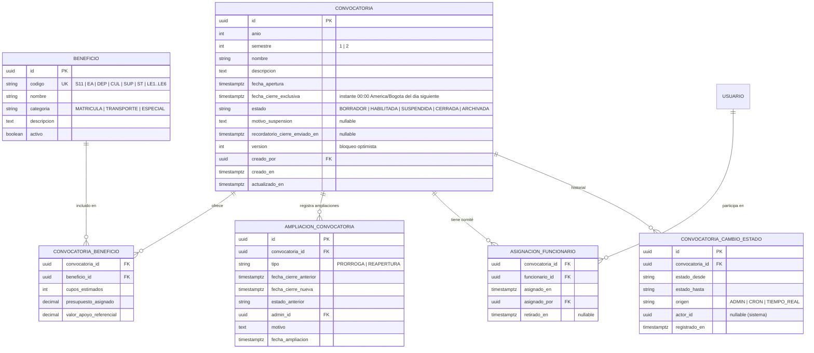
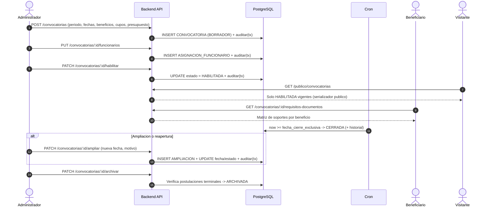

# Módulo: Convocatorias — Ciclo de Vida, Beneficios y Comité

**Fase:** P1

## Objetivo
Gestionar el ciclo de vida de las convocatorias semestrales del Fondo para la Educación Superior de Tocancipá (FOEST) bajo el Acuerdo Municipal 023 de 2025: parametrizar el período, ofertar beneficios del catálogo único con cupos y presupuesto, conformar el comité evaluador, habilitar/suspender/cerrar/archivar, y conceder ampliaciones motivadas (incluida la reapertura de una convocatoria `CERRADA`). Garantiza que el beneficiario solo vea y se postule a convocatorias vigentes, y expone una vista pública (sin autenticación) de las convocatorias abiertas.

Este módulo **no** define la matriz de soportes por beneficio (vive en `documentos.md`); solo la expone por convocatoria.

## Archivos del Módulo

### Backend (`apps/api/src/modules/convocatorias/`)
- `convocatoria.service.ts` — Reglas de estado, validación de fechas en `America/Bogota`, cálculo en tiempo real de "abierta", ampliaciones, comité, archivado. Toda mutación llama a `auditar(tx, …)`.
- `convocatoria.controller.ts` — Handlers Express (autenticados).
- `convocatoria.publico.controller.ts` — Handlers de `/publico/convocatorias` (sin auth; serializador reducido).
- `convocatoria.routes.ts` — Rutas bajo `/api/v1/convocatorias` y `/api/v1/publico/convocatorias`.
- `convocatoria.dto.ts` — Zod (reexporta desde `packages/shared`).
- `convocatoria.jobs.ts` — Jobs: sincronización de cierre y recordatorio de cierre.
- `beneficio.seed.ts` — Seed/migración del catálogo `BENEFICIO` (12 códigos).
- `__tests__/convocatoria.test.ts` — Jest + Supertest.

### Compartido (`packages/shared/src/convocatorias/`)
- `convocatoria.schemas.ts` (Zod), `convocatoria.enums.ts` (`EstadoConvocatoria`, `CodigoBeneficio`), `convocatoria.types.ts`.

### Frontend (`apps/web/src/modules/convocatorias/`)
- `components/ConvocatoriaCard.tsx` — Tarjeta pública con beneficios y cuenta regresiva.
- `components/ConvocatoriaTableAdmin.tsx` — Tabla de gestión con estado, postulaciones y acciones.
- `components/ConvocatoriaFormModal.tsx` — Creación/edición con selección de beneficios, cupos y presupuesto.
- `components/AmpliacionModal.tsx` — Ampliar plazo / reabrir (exige motivo).
- `components/DeshabilitarModal.tsx` — Suspensión con confirmación explícita y motivo.
- `components/AsignarComiteModal.tsx` — Selector de funcionarios del comité (muestra advertencia de expedientes en curso).
- `components/RequisitosDocumentosTable.tsx` — Tabla de soportes exigidos por beneficio.
- `pages/ConvocatoriasPublicasPage.tsx` — Página pública sin login.
- `hooks/useConvocatorias.ts`, `services/convocatoriasApi.ts`, `types/convocatoria.types.ts`.

## Estados y transiciones

Estados: `BORRADOR`, `HABILITADA`, `SUSPENDIDA`, `CERRADA`, `ARCHIVADA`.

| Desde | Hacia | Acción / Disparador | Actor | Condiciones |
|---|---|---|---|---|
| (nueva) | `BORRADOR` | `POST /convocatorias` | Administrador | `UNIQUE(anio, semestre)` |
| `BORRADOR` | `HABILITADA` | `PATCH /:id/habilitar` | Administrador | Al menos 1 beneficio ofertado; fechas válidas; al menos 1 funcionario en el comité; `fecha_cierre` futura |
| `HABILITADA` | `SUSPENDIDA` | `PATCH /:id/deshabilitar` | Administrador | Motivo obligatorio y confirmación explícita |
| `SUSPENDIDA` | `HABILITADA` | `PATCH /:id/rehabilitar` | Administrador | `fecha_cierre` aún futura; si ya venció, solo se puede cerrar (ver nota) |
| `HABILITADA` | `CERRADA` | Cron + cálculo en tiempo real al llegar `fecha_cierre_exclusiva` | Sistema | — |
| `SUSPENDIDA` | `CERRADA` | Cron al llegar `fecha_cierre_exclusiva` | Sistema | — |
| `CERRADA` | `HABILITADA` | `PATCH /:id/ampliar` (reabrir) | Administrador | Motivo obligatorio; nueva fecha de cierre posterior a `now`; solo antes de archivar |
| `HABILITADA` | `HABILITADA` | `PATCH /:id/ampliar` (prórroga) | Administrador | Nueva fecha posterior al cierre vigente; motivo obligatorio |
| `CERRADA` | `ARCHIVADA` | `PATCH /:id/archivar` | Administrador | Todas las postulaciones de la convocatoria en estado terminal (`APROBADA`, `RECHAZADA`, `DESISTIDA`) y sin borradores vivos |

Reglas:
- `ARCHIVADA` es terminal y solo lectura.
- Una convocatoria `SUSPENDIDA` cuyo plazo vence pasa a `CERRADA` (no queda suspendida indefinidamente).
- `PUT /:id` solo edita campos estructurales (beneficios, cupos, período) en `BORRADOR`; en `HABILITADA` solo permite editar `nombre`, `descripcion` y valores informativos (`valor_apoyo_referencial`), nunca fechas (las fechas se cambian por `ampliar`).
- Cada transición se audita con `auditar(tx, { accion, entidad: 'CONVOCATORIA', … })` incluyendo `datos_antes`/`datos_despues` y se registra en la misma transacción que el cambio.

## Endpoints Propuestos

Todos bajo `/api/v1`. Códigos de acceso según regla única (401 sin token, 403 rol sin permiso, 404 recurso ajeno/no visible, 409/422 reglas de negocio).

| Método | Ruta | Descripción | Auth | Roles |
|---|---|---|:---:|---|
| `POST` | `/convocatorias` | Crea convocatoria en `BORRADOR` con beneficios (cupos, presupuesto, valor referencial) | Sí | `ADMINISTRADOR` |
| `PUT` | `/convocatorias/:id` | Edita parámetros (alcance según estado) | Sí | `ADMINISTRADOR` |
| `PATCH` | `/convocatorias/:id/habilitar` | `BORRADOR → HABILITADA` | Sí | `ADMINISTRADOR` |
| `PATCH` | `/convocatorias/:id/deshabilitar` | `HABILITADA → SUSPENDIDA` (motivo, `confirmar: true`) | Sí | `ADMINISTRADOR` |
| `PATCH` | `/convocatorias/:id/rehabilitar` | `SUSPENDIDA → HABILITADA` | Sí | `ADMINISTRADOR` |
| `PATCH` | `/convocatorias/:id/ampliar` | Prórroga de cierre o reapertura desde `CERRADA`; `{ fecha_cierre_nueva, motivo, confirmar: true }` | Sí | `ADMINISTRADOR` |
| `PATCH` | `/convocatorias/:id/archivar` | `CERRADA → ARCHIVADA` | Sí | `ADMINISTRADOR` |
| `PUT` | `/convocatorias/:id/funcionarios` | Define el comité (reemplaza la lista) | Sí | `ADMINISTRADOR` |
| `GET` | `/convocatorias/:id/funcionarios` | Lista el comité | Sí | `ADMINISTRADOR` |
| `GET` | `/convocatorias` | Autenticado. `BENEFICIARIO`: solo abiertas. `FUNCIONARIO`: las de su comité. `ADMINISTRADOR`: todas, con filtros `estado`, `anio`, `semestre` y paginación estándar | Sí | Todos |
| `GET` | `/convocatorias/:id` | Detalle con beneficios, cupos y fechas. Beneficiario: solo si está abierta; funcionario: solo si es de su comité (si no, `404`) | Sí | Todos |
| `GET` | `/convocatorias/:id/requisitos-documentos` | Expone la matriz `REQUISITO_DOCUMENTO` filtrada por la convocatoria (beneficios ofertados) y tipo de trámite opcional (`?tipo_tramite=`). La matriz y su seed viven en `documentos.md`; este endpoint es de solo lectura y delega en el servicio de `documentos` | Sí | Todos |
| `GET` | `/publico/convocatorias` | Lista pública: solo `HABILITADA` vigentes. Sin autenticación | No | Público |
| `GET` | `/publico/convocatorias/:id` | Detalle público (misma restricción; si no está vigente, `404`) | No | Público |
| `GET` | `/beneficios` | Catálogo de beneficios (códigos, nombre, categoría, descripción) | Sí | Todos |

Serializador público: solo `id`, `nombre`, `anio`, `semestre`, `descripcion`, `fecha_apertura`, `fecha_cierre` (presentada 23:59:59), `beneficios[{codigo, nombre, descripcion, cupos_estimados?}]` y `fecha_proxima_apertura_estimada` cuando no hay convocatorias abiertas. Nunca presupuestos internos, comité ni datos de postulaciones. Con rate limit por IP y caché corta (60 s).

Cuando no hay convocatorias abiertas, la respuesta de la lista (pública y autenticada) incluye `proxima_apertura_estimada` leída de `CONFIGURACION_SISTEMA.FECHA_PROXIMA_APERTURA_ESTIMADA` (ver `catalogos_configuracion.md`); el módulo no la persiste.

## Modelos de Datos

Restricciones: `UNIQUE(anio, semestre)` (**pendiente de confirmar** si deben existir convocatorias paralelas por línea; si se confirma, se amplía a `UNIQUE(anio, semestre, linea)` por migración, ver `PENDIENTES.md`); `PK(convocatoria_id, beneficio_id)` en `CONVOCATORIA_BENEFICIO`; `cupos_estimados >= 0`, `presupuesto_asignado >= 0`, `valor_apoyo_referencial >= 0`; `fecha_cierre_exclusiva > fecha_apertura`; `UNIQUE(convocatoria_id, funcionario_id) WHERE retirado_en IS NULL`.

## Catálogo único de beneficios

Sembrado por migración en `BENEFICIO`. Los códigos `AS`, `AM`, `AI` **no existen**. Cualquier ampliación se hace por seed/migración.

| Código | Nombre | Categoría | Descripción |
|---|---|---|---|
| `S11` | Saber 11 | `ESPECIAL` | Reconocimiento económico a los mejores puntajes del examen de Estado de estudiantes de Tocancipá |
| `EA` | Excelencia Académica | `ESPECIAL` | Estímulo para estudiantes con promedios sobresalientes en educación superior |
| `DEP` | Deporte | `ESPECIAL` | Estímulo para deportistas destacados de rendimiento municipal, departamental o nacional |
| `CUL` | Cultura | `ESPECIAL` | Estímulo para talentos artísticos y culturales del municipio |
| `SUP` | Matrícula Educación Superior | `MATRICULA` | Apoyo a la matrícula en instituciones de educación superior |
| `ST` | Subsidio de Transporte | `TRANSPORTE` | Apoyo económico para desplazamiento hacia sedes fuera del municipio |
| `LE1`…`LE6` | Líneas Especiales 1 a 6 | `ESPECIAL` | Apoyos focalizados a población vulnerable, víctimas, comunidades étnicas y personas con discapacidad, según Acuerdo 023 de 2025 |

La asignación exacta de cada Línea Especial (LE1…LE6) a su población objetivo debe validarse contra el Acuerdo 023 de 2025 y se carga en `BENEFICIO.descripcion` por seed. Los montos y porcentajes **no** son parte del catálogo: son `valor_apoyo_referencial` por convocatoria.

## Flujo crítico

## Casos de Uso Especiales y Reglas de Negocio

- **Cierre exclusivo y zona horaria:** `fecha_cierre` se presenta siempre como las 23:59:59 locales del día elegido; internamente se guarda `fecha_cierre_exclusiva` = 00:00 `America/Bogota` del día siguiente, como `timestamptz`. La condición de cierre es `now >= fecha_cierre_exclusiva`. La conversión se hace en un único helper con `date-fns-tz`; el cliente envía solo la fecha (`YYYY-MM-DD`) y el servidor calcula el instante.
- **Estado operativo "abierta" en tiempo real:** `estado = 'HABILITADA' AND fecha_apertura <= now < fecha_cierre_exclusiva`. Se evalúa en cada consulta y en cada envío de postulación (el módulo exporta `convocatoriaService.estaAbierta(convocatoriaId, tx?)` para `postulaciones`). Si al evaluar se detecta `HABILITADA` vencida, el servicio la marca `CERRADA` de forma oportunista (idempotente).
- **Cron de cierre:** `convocatoria.jobs.ts` ejecuta cada minuto la sincronización a `CERRADA` (con bloqueo por `version`/`FOR UPDATE SKIP LOCKED` para evitar doble ejecución entre instancias) y registra `CONVOCATORIA_CAMBIO_ESTADO` con origen `CRON`. El cron es redundante con el cálculo en tiempo real; ninguna regla de negocio depende solo del cron.
- **Ampliación motivada:** solo `ADMINISTRADOR`; motivo obligatorio (mínimo 15 caracteres) y `confirmar: true`. Desde `HABILITADA` extiende el cierre (la nueva fecha debe ser posterior a la vigente). Desde `CERRADA` **reabre** la convocatoria (`CERRADA → HABILITADA`) con tipo `REAPERTURA`, siempre que no esté `ARCHIVADA` y la nueva fecha sea futura. Registra `AMPLIACION_CONVOCATORIA` y audita con acción `AMPLIAR`. Al reabrir, los borradores existentes vuelven a poder enviarse.
- **Deshabilitar con postulaciones en curso:** al pasar a `SUSPENDIDA`, los `BORRADOR` **no pueden enviarse** (`409 CONVOCATORIA_NO_ABIERTA` en `POST /postulaciones/:id/enviar`) pero se conservan; las postulaciones `PENDIENTE`, `EN_EVALUACION` y `EN_CORRECCION` siguen su curso normal (evaluación, subsanación, dictamen). Se notifica al beneficiario con borrador (`CONVOCATORIA_SUSPENDIDA`), con plantilla neutral. La respuesta del endpoint incluye el conteo de borradores y postulaciones en curso afectadas para el modal de confirmación.
- **Comité de la convocatoria (`ASIGNACION_FUNCIONARIO`):** `PUT /:id/funcionarios` reemplaza la lista. Solo se aceptan usuarios con rol `FUNCIONARIO` y `activo = true` (estado leído de `accounts` vía servicio). Efectos al **cambiar el comité con expedientes en curso** (detalle operativo en `asignaciones.md`):
  - Funcionario **agregado**: ve el *pool* `PENDIENTE` de la convocatoria desde ese momento.
  - Funcionario **retirado**: pierde acceso al pool; sus asignaciones `ACTIVA` **no se liberan automáticamente**, pero se marcan como "fuera de comité" y el servicio devuelve en la respuesta la lista de expedientes afectados para que el Administrador los reasigne (reasignación individual o masiva) o decidir en la misma petición con `asignaciones: LIBERAR | MANTENER` (`LIBERAR` las libera con motivo `CAMBIO_COMITE`; `MANTENER` las deja "fuera de comité"; sin el campo → `409 ASIGNACIONES_PENDIENTES`). No se puede retirar a un funcionario si el comité quedaría vacío en una convocatoria `HABILITADA` con postulaciones `PENDIENTE` o `EN_EVALUACION`.
  - Se mantiene el historial (`retirado_en`) para conservar la visibilidad de solo lectura sobre expedientes ya evaluados por ese funcionario.
  - Cada cambio se audita (`CREAR`/`ACTUALIZAR` sobre `ASIGNACION_FUNCIONARIO`).
- **Fecha estimada de próxima apertura:** se lee de `CONFIGURACION_SISTEMA` (`FECHA_PROXIMA_APERTURA_ESTIMADA`) y se incluye en las respuestas de listado cuando no hay convocatorias abiertas.
- **Matriz de documentos:** `GET /:id/requisitos-documentos` no duplica datos; consulta `documentos` (matriz `REQUISITO_DOCUMENTO`) filtrando por los beneficios ofertados de la convocatoria.
- **Job de recordatorio de cierre:** diario a las 08:00 `America/Bogota`, busca convocatorias `HABILITADA` con `fecha_cierre_exclusiva` a menos de `CONFIG.ALERTA_CIERRE_DIAS` días (default 7) y `recordatorio_cierre_enviado_en IS NULL`; crea notificación `CONVOCATORIA_POR_CERRAR` para administradores y funcionarios del comité (vía outbox, ver `notificaciones.md`). El borrador de beneficiarios se recuerda por el job `RECORDATORIO_BORRADOR` de `postulaciones`/`notificaciones`. Si se amplía el plazo, `recordatorio_cierre_enviado_en` se reinicia a `NULL`.
- **Archivado:** exige que no existan postulaciones en `BORRADOR`, `PENDIENTE`, `EN_EVALUACION` ni `EN_CORRECCION` para la convocatoria; si las hay, `409 POSTULACIONES_EN_CURSO` con el conteo por estado.
- **Concurrencia:** las mutaciones envían `version`; si no coincide, `409 VERSION_DESACTUALIZADA`.
- **Auditoría:** acciones `CREAR`, `ACTUALIZAR`, `HABILITAR`, `DESHABILITAR`, `REHABILITAR`, `AMPLIAR`, `ARCHIVAR` y cambios de comité (`ACTUALIZAR` sobre `ASIGNACION_FUNCIONARIO`), siempre con `auditar(tx, …)` dentro de la transacción del cambio (ver `auditoria.md`).

## Dependencias entre Módulos
- **`catalogos_configuracion.md`**: `FECHA_PROXIMA_APERTURA_ESTIMADA`, `ALERTA_CIERRE_DIAS`, utilidad `business-days`.
- **`auditoria.md`**: `auditar(tx, …)` en toda mutación.
- **`notificaciones.md`**: recordatorio de cierre y aviso de suspensión (outbox).
- **`accounts.md`**: valida y lista funcionarios activos para el comité.
- **`documentos.md`**: provee la matriz `REQUISITO_DOCUMENTO` para `/requisitos-documentos`.
- **`postulaciones.md`**: consume `estaAbierta()` para crear y enviar; nunca es importada por este módulo (consulta de conteos para archivar vía vista de solo lectura/servicio de consulta de `postulaciones`).
- **`asignaciones.md`**: reacciona a los cambios de comité (expedientes afectados).
- **`roles_permissions.md`**: restringe mutaciones al rol `ADMINISTRADOR`.

## Dependencias Externas
- `date-fns-tz`: conversión exacta a `America/Bogota`.
- `node-cron` (o repetible de BullMQ): jobs de cierre y recordatorio.
- `zod`: validación de períodos, fechas y motivos.
- `@prisma/client`: transacciones y bloqueo optimista.

## Pruebas de Aceptación
- [ ] Crear dos convocatorias con el mismo `anio` y `semestre` retorna `409`.
- [ ] `FUNCIONARIO` o `BENEFICIARIO` que intente crear, habilitar, deshabilitar, ampliar o archivar recibe `403`.
- [ ] `GET /publico/convocatorias` funciona sin token y solo lista `HABILITADA` con `fecha_apertura <= now < fecha_cierre_exclusiva`; no expone `BORRADOR`, `SUSPENDIDA`, `CERRADA`, `ARCHIVADA`.
- [ ] `GET /publico/convocatorias/:id` de una convocatoria no vigente retorna `404`.
- [ ] Un beneficiario que consulta `GET /convocatorias/:id` de una convocatoria no abierta recibe `404`; un funcionario que consulta una convocatoria ajena a su comité recibe `404`.
- [ ] Un envío a las 23:59:59 locales del último día es aceptado; a las 00:00:00 del día siguiente es rechazado con `409 CONVOCATORIA_NO_ABIERTA`.
- [ ] Habilitar sin beneficios o sin comité retorna `422`.
- [ ] Deshabilitar con borradores y postulaciones `PENDIENTE`: los borradores no se pueden enviar, las `PENDIENTE` siguen siendo evaluables y los beneficiarios con borrador reciben notificación.
- [ ] `rehabilitar` devuelve la convocatoria a `HABILITADA` si el plazo no venció; con plazo vencido responde `409`.
- [ ] `ampliar` sin `motivo` o con motivo corto retorna `422`; con nueva fecha anterior a la vigente retorna `422`.
- [ ] `ampliar` sobre una convocatoria `CERRADA` la reabre a `HABILITADA`, registra `AMPLIACION_CONVOCATORIA` tipo `REAPERTURA` y reinicia el recordatorio de cierre; sobre `ARCHIVADA` retorna `409`.
- [ ] `archivar` con postulaciones no terminales retorna `409 POSTULACIONES_EN_CURSO`; con todas terminales pasa a `ARCHIVADA`.
- [ ] El cron marca `CERRADA` las vencidas, de forma idempotente y sin doble ejecución con dos instancias.
- [ ] Una convocatoria `HABILITADA` vencida se trata como cerrada aun si el cron no ha corrido.
- [ ] `CONVOCATORIA_BENEFICIO` persiste `cupos_estimados`, `presupuesto_asignado` y `valor_apoyo_referencial`; crear un beneficio con código `AS`, `AM` o `AI` es rechazado.
- [ ] Retirar del comité a un funcionario con asignaciones `ACTIVA` devuelve la lista de expedientes afectados y responde `409 ASIGNACIONES_PENDIENTES` si no se indica `asignaciones: LIBERAR | MANTENER`; no se permite dejar el comité vacío con expedientes en curso.
- [ ] `GET /convocatorias/:id/requisitos-documentos` devuelve los soportes exigidos por cada beneficio ofertado.
- [ ] Sin convocatorias abiertas, el listado incluye `proxima_apertura_estimada` desde la configuración.
- [ ] El job de recordatorio notifica a administradores y comité una sola vez cuando faltan `ALERTA_CIERRE_DIAS` días.
- [ ] Toda mutación genera un evento de auditoría en la misma transacción; si la transacción falla, no queda evento.
- [ ] Mutaciones con `version` desactualizada retornan `409 VERSION_DESACTUALIZADA`.
