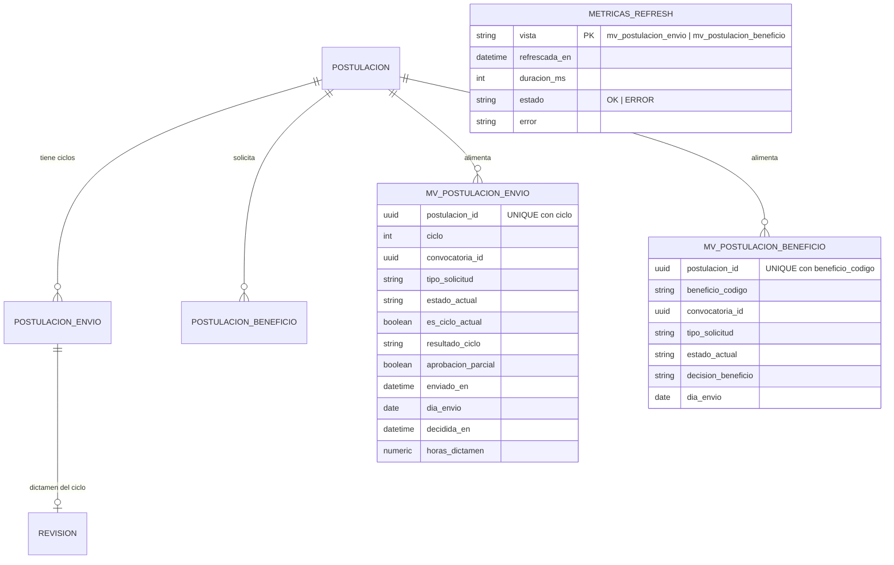

# Módulo: Dashboard Funcionario — Métricas y Gestión Operativa

**Fase:** P2 – Evaluación y seguimiento

## Objetivo
Proveer al funcionario una consola analítica de solo lectura para monitorear el avance de las convocatorias donde pertenece formalmente al comité: solicitudes pendientes, en evaluación, aprobadas, en corrección y rechazadas; distribución por beneficio y tipo de trámite; serie temporal de envíos; tiempo promedio y percentil 90 de dictamen; y la carga propia frente al promedio del comité. Aplica k-anonimato, vistas materializadas y caché Redis. **No exporta**: la exportación es exclusiva de `export_reports.md`.

Los dashboards solo leen: este módulo no escribe en tablas de otros módulos (solo en `METRICAS_REFRESH`, que es suya).

## Archivos del Módulo

### Backend
- `apps/api/src/modules/dashboard_funcionario/metricas.queries.ts` — Consultas SQL (Prisma `$queryRaw` parametrizado) sobre `mv_postulacion_envio`, `mv_postulacion_beneficio` y `POSTULACION_ASIGNACION`.
- `apps/api/src/modules/dashboard_funcionario/metricas.service.ts` — Alcance por comité, agregaciones, promedio/p90, k-anonimato con supresión complementaria y caché Redis (TTL 60 s).
- `apps/api/src/modules/dashboard_funcionario/kanon.ts` — Algoritmo de agrupación "Otros / Casos aislados" y supresión complementaria.
- `apps/api/src/modules/dashboard_funcionario/metricas.refresh.job.ts` — Job BullMQ repetible (cada 5 minutos) que ejecuta `REFRESH MATERIALIZED VIEW CONCURRENTLY` y registra en `METRICAS_REFRESH`.
- `apps/api/src/modules/dashboard_funcionario/metricas.controller.ts` — Handlers con validación de filtros.
- `apps/api/src/modules/dashboard_funcionario/metricas.routes.ts` — Rutas bajo `/api/v1/dashboard/funcionario`.
- `apps/api/src/modules/dashboard_funcionario/metricas.dto.ts` — Esquemas Zod de filtros (reexportados desde `packages/shared/src/dashboard_funcionario/`).
- `apps/api/prisma/migrations/<timestamp>_metricas_mv/migration.sql` — DDL de las vistas, índices y `METRICAS_REFRESH`.
- `apps/api/src/modules/dashboard_funcionario/__tests__/metricas.test.ts` — Pruebas de agregación, alcance, k-anonimato y refresco.

### Frontend
- `apps/web/src/modules/dashboard_funcionario/components/FuncionarioKPIGrid.tsx` — Tarjetas (Asignadas, Pendientes, En evaluación, Aprobadas, En corrección, Rechazadas) con enlaces a la bandeja de `evaluacion.md` con filtros precargados.
- `apps/web/src/modules/dashboard_funcionario/components/GraficoDistribucionBeneficios.tsx` — Dona/barras por beneficio (Recharts).
- `apps/web/src/modules/dashboard_funcionario/components/GraficoTipoSolicitud.tsx` — Distribución `PRIMERA_VEZ | RENOVACION | REINTEGRO`.
- `apps/web/src/modules/dashboard_funcionario/components/GraficoTendenciaTemporal.tsx` — Línea diaria de envíos.
- `apps/web/src/modules/dashboard_funcionario/components/MetricasTiemposRevision.tsx` — Promedio y p90 en horas.
- `apps/web/src/modules/dashboard_funcionario/components/CargaComiteChart.tsx` — Carga propia vs promedio del comité (sin nombres de otros evaluadores).
- `apps/web/src/modules/dashboard_funcionario/components/FiltrosConvocatoriaBar.tsx` — Convocatoria, rango de fechas y beneficio.
- `apps/web/src/modules/dashboard_funcionario/components/SelloActualizacion.tsx` — Texto "Datos actualizados a hh:mm:ss".
- `apps/web/src/modules/dashboard_funcionario/components/BotonExportar.tsx` — Enlaza a `ExportarConsolidadoButton` de `export_reports` (no tiene lógica propia de exportación).
- `apps/web/src/modules/dashboard_funcionario/hooks/useFuncionarioDashboard.ts` — React Query con revalidación en segundo plano.
- `apps/web/src/modules/dashboard_funcionario/services/funcionarioDashboardApi.ts` — Cliente HTTP.

## Endpoints Propuestos

Todos exigen autenticación, rol `FUNCIONARIO` y el permiso `dashboard:metricas`. Filtros comunes: `convocatoria_id?`, `desde?`, `hasta?` (ambos inclusive, fechas locales `America/Bogota`), `beneficio?`.

| Método | Ruta | Descripción |
|---|---|---|
| `GET` | `/api/v1/dashboard/funcionario/resumen` | Totales por estado (`PENDIENTE`, `EN_EVALUACION`, `EN_CORRECCION`, `APROBADA`, `RECHAZADA`, `DESISTIDA`) de las convocatorias del comité, más `sello` de actualización |
| `GET` | `/api/v1/dashboard/funcionario/por-beneficio` | Postulaciones distintas por código de beneficio (con k-anonimato) |
| `GET` | `/api/v1/dashboard/funcionario/por-tipo-solicitud` | Distribución `PRIMERA_VEZ`, `RENOVACION`, `REINTEGRO` (con k-anonimato) |
| `GET` | `/api/v1/dashboard/funcionario/serie-temporal` | Postulaciones distintas enviadas por día en el rango |
| `GET` | `/api/v1/dashboard/funcionario/tiempos-revision` | Promedio y p90 de horas de dictamen, y tamaño de la muestra |
| `GET` | `/api/v1/dashboard/funcionario/carga` | Carga propia (asignaciones `ACTIVA`, dictaminadas en el periodo) frente al promedio del comité |

**No existe `/exportar`.** Para exportar, el funcionario usa `POST /api/v1/reportes/convocatorias/:id/consolidado` (`export_reports.md`).

Códigos de acceso (DECISIONES §2): `BENEFICIARIO` o `ADMINISTRADOR` → `403`; `convocatoria_id` que no pertenece al comité del funcionario → `404`.

Forma de las respuestas: `resumen` devuelve `{ sello: { refrescada_en }, totales: { asignadas, pendientes, en_evaluacion, en_correccion, aprobadas, rechazadas, desistidas } }`; las distribuciones devuelven `{ sello, items: [{ clave, total }], suprimido: boolean }`; `tiempos-revision` devuelve `{ sello, n, promedio_horas, p90_horas }` (valores `null` si `n < KANON_UMBRAL` o `n = 0`).

## Modelos de Datos y Vistas Materializadas



Supuestos de esquema (definidos en `postulaciones.md` y `evaluacion.md`): `POSTULACION.ciclo` es el ciclo vigente; `POSTULACION_ENVIO(postulacion_id, ciclo, enviado_en)` es único por `(postulacion_id, ciclo)`; `REVISION(postulacion_id, ciclo, resultado, decidida_en)` guarda el dictamen del ciclo y es único por `(postulacion_id, ciclo)`; `REVISION_BENEFICIO(postulacion_id, ciclo, beneficio_codigo, decision)` guarda el dictamen por beneficio.

### SQL final

```sql
-- 1) Una fila por (postulacion_id, ciclo): evita duplicar postulaciones por beneficio o por revision
CREATE MATERIALIZED VIEW mv_postulacion_envio AS
SELECT
    pe.postulacion_id,
    pe.ciclo,
    p.convocatoria_id,
    p.tipo_solicitud,
    p.estado                                                   AS estado_actual,
    (pe.ciclo = p.ciclo)                                       AS es_ciclo_actual,
    p.aprobacion_parcial,
    r.resultado                                                AS resultado_ciclo,   -- APROBAR | RECHAZAR | CORRECCION | NULL
    pe.enviado_en,
    (pe.enviado_en AT TIME ZONE 'America/Bogota')::date        AS dia_envio,
    r.decidida_en,
    CASE WHEN r.decidida_en IS NOT NULL
         THEN EXTRACT(EPOCH FROM (r.decidida_en - pe.enviado_en)) / 3600.0
    END::numeric(12,2)                                         AS horas_dictamen
FROM postulacion_envio pe
JOIN postulacion p ON p.id = pe.postulacion_id
LEFT JOIN revision r
       ON r.postulacion_id = pe.postulacion_id
      AND r.ciclo          = pe.ciclo          -- mismo ciclo: nunca cruza ciclos distintos
WHERE p.estado <> 'BORRADOR'
WITH DATA;

-- Requisito de REFRESH ... CONCURRENTLY: indice unico sin predicado ni expresiones
CREATE UNIQUE INDEX ux_mv_postulacion_envio
    ON mv_postulacion_envio (postulacion_id, ciclo);
CREATE INDEX ix_mv_envio_convocatoria
    ON mv_postulacion_envio (convocatoria_id, es_ciclo_actual, estado_actual);
CREATE INDEX ix_mv_envio_dia
    ON mv_postulacion_envio (convocatoria_id, dia_envio);

-- 2) Auxiliar: una fila por (postulacion_id, beneficio_codigo) con la decision del ultimo ciclo
CREATE MATERIALIZED VIEW mv_postulacion_beneficio AS
SELECT
    pb.postulacion_id,
    pb.beneficio_codigo,
    p.convocatoria_id,
    p.tipo_solicitud,
    p.estado                                                   AS estado_actual,
    COALESCE(rb.decision, 'SIN_DECISION')                      AS decision_beneficio, -- APROBADO | RECHAZADO | SIN_DECISION
    (pe.enviado_en AT TIME ZONE 'America/Bogota')::date        AS dia_envio
FROM postulacion_beneficio pb
JOIN postulacion p        ON p.id = pb.postulacion_id
JOIN postulacion_envio pe ON pe.postulacion_id = p.id AND pe.ciclo = p.ciclo
LEFT JOIN revision_beneficio rb
       ON rb.postulacion_id  = pb.postulacion_id
      AND rb.beneficio_codigo = pb.beneficio_codigo
      AND rb.ciclo           = p.ciclo
WHERE p.estado <> 'BORRADOR'
WITH DATA;

CREATE UNIQUE INDEX ux_mv_postulacion_beneficio
    ON mv_postulacion_beneficio (postulacion_id, beneficio_codigo);
CREATE INDEX ix_mv_beneficio_convocatoria
    ON mv_postulacion_beneficio (convocatoria_id, beneficio_codigo);

-- 3) Sello de actualizacion
CREATE TABLE metricas_refresh (
    vista         text PRIMARY KEY,
    refrescada_en timestamptz NOT NULL,
    duracion_ms   integer     NOT NULL,
    estado        text        NOT NULL CHECK (estado IN ('OK','ERROR')),
    error         text
);
```

El job de refresco ejecuta, en este orden y fuera de una transacción explícita (`REFRESH … CONCURRENTLY` no puede correr dentro de una):

```sql
REFRESH MATERIALIZED VIEW CONCURRENTLY mv_postulacion_envio;
REFRESH MATERIALIZED VIEW CONCURRENTLY mv_postulacion_beneficio;
-- tras cada una: UPSERT en metricas_refresh (vista, refrescada_en = now(), duracion_ms, estado)
```

### Consultas de lectura (parámetros `:convocatorias` = ids del comité del funcionario, `:desde`, `:hasta`)

```sql
-- resumen: totales por estado (una fila por postulacion, solo ciclo vigente)
SELECT estado_actual, COUNT(DISTINCT postulacion_id) AS total
FROM mv_postulacion_envio
WHERE es_ciclo_actual
  AND convocatoria_id = ANY(:convocatorias)
  AND dia_envio BETWEEN :desde AND :hasta
GROUP BY estado_actual;

-- por-beneficio: nunca se suman estas filas para obtener totales de postulaciones
SELECT beneficio_codigo, COUNT(DISTINCT postulacion_id) AS total
FROM mv_postulacion_beneficio
WHERE convocatoria_id = ANY(:convocatorias)
  AND dia_envio BETWEEN :desde AND :hasta
GROUP BY beneficio_codigo;

-- por-tipo-solicitud
SELECT tipo_solicitud, COUNT(DISTINCT postulacion_id) AS total
FROM mv_postulacion_envio
WHERE es_ciclo_actual
  AND convocatoria_id = ANY(:convocatorias)
  AND dia_envio BETWEEN :desde AND :hasta
GROUP BY tipo_solicitud;

-- serie-temporal: envios por dia (incluye reenvios por subsanacion; un dia cuenta cada postulacion una vez)
SELECT dia_envio, COUNT(DISTINCT postulacion_id) AS total
FROM mv_postulacion_envio
WHERE convocatoria_id = ANY(:convocatorias)
  AND dia_envio BETWEEN :desde AND :hasta
GROUP BY dia_envio
ORDER BY dia_envio;

-- tiempos-revision: promedio y p90 calculados EN CONSULTA sobre filas (postulacion, ciclo) ya filtradas
SELECT COUNT(*)                                                       AS n,
       AVG(horas_dictamen)::numeric(10,2)                             AS promedio_horas,
       (PERCENTILE_CONT(0.90) WITHIN GROUP (ORDER BY horas_dictamen))::numeric(10,2) AS p90_horas
FROM mv_postulacion_envio
WHERE decidida_en IS NOT NULL
  AND convocatoria_id = ANY(:convocatorias)
  AND dia_envio BETWEEN :desde AND :hasta;
```

Reglas de las consultas: se usa siempre `COUNT(DISTINCT postulacion_id)`; el tiempo es `decidida_en − enviado_en` del **mismo ciclo** (horas naturales); si `:convocatorias` es vacío, la consulta no se ejecuta y se devuelven ceros.

**Por qué se descartó el p90 dentro de la vista materializada:** (1) un percentil no es re-agregable: el p90 de una fila agrupada por estado/día/beneficio no permite obtener el p90 de otra combinación de filtros, y promediar percentiles es incorrecto; (2) la vista original agrupaba por `beneficio_codigo`, por lo que una postulación con varios beneficios generaba varias filas y sesgaba promedio y percentil; (3) calcularlo en consulta sobre filas de grano `(postulacion_id, ciclo)` ya filtradas es barato (miles de filas por convocatoria) y respeta cualquier combinación de filtros y el k-anonimato.

## Flujo de Usuario Crítico

1. El funcionario entra; el servicio resuelve sus convocatorias desde `ASIGNACION_FUNCIONARIO`. Sin asignaciones se responde con ceros.
2. Se pintan las tarjetas y el sello "Datos actualizados a hh:mm:ss" (mínimo de `refrescada_en` de las dos vistas).
3. Explora distribución por beneficio y tipo de trámite, serie temporal y tiempos de revisión.
4. Al hacer clic en "Pendientes", navega a la bandeja de `evaluacion.md` con el filtro precargado.
5. Si necesita exportar, usa "Exportar", que delega en `export_reports.md`.

## Casos de Uso Especiales y Reglas de Negocio

- **Alcance por comité:** solo se consideran convocatorias donde el funcionario figura en `ASIGNACION_FUNCIONARIO`. Un `convocatoria_id` ajeno → `404`. Sin asignaciones, todos los endpoints responden `200` con contadores en cero, listas vacías y valores nulos en tiempos; **nunca** `500`.
- **K-anonimato (`CONFIG.KANON_UMBRAL`, por defecto 5):** en `por-beneficio` y `por-tipo-solicitud` toda celda con conteo menor al umbral se agrupa en "Otros / Casos aislados". **Supresión complementaria:** si tras agrupar el bucket "Otros" queda con menos del umbral (o con una sola celda suprimida) y el total publicado permitiría deducir su valor por resta, se incorpora al bucket la menor celda visible siguiente, repitiendo hasta que "Otros" ≥ umbral o no quede ninguna celda visible; si el total completo es menor al umbral, se responde `suprimido: true` y sin desglose. `tiempos-revision` devuelve promedio y p90 `null` si la muestra `n` es menor al umbral. El `resumen` (conteo por estado del propio comité) y la serie temporal no desglosan atributos socioeconómicos y no se suprimen, para que las tarjetas sumen exactamente el total asignado.
- **Carga:** `carga` devuelve, sin nombres, `{ propia: { activas, dictaminadas_periodo }, promedio_comite: { activas, dictaminadas_periodo }, miembros_comite }` calculado sobre `POSTULACION_ASIGNACION`. La comparativa nominal por evaluador es **solo del Administrador** (`admin_dashboard.md`). Si el comité tiene menos de 3 miembros, el promedio se omite (`null`), porque con 2 miembros el promedio permitiría deducir la carga del otro evaluador.
- **Caché:** Redis con TTL de 60 segundos, clave por `usuario_id + endpoint + filtros normalizados`; invalidación implícita por expiración. Objetivo de latencia < 1 s (pruebas k6).
- **Frescura:** el job BullMQ `metricas:refresh` corre cada 5 minutos con `REFRESH … CONCURRENTLY` (no bloquea lecturas); si falla, `metricas_refresh.estado = ERROR`, se conservan los datos anteriores y el sello muestra la última hora válida; se alerta por la cola de observabilidad.
- **Solo lectura:** el módulo no escribe en tablas de otros módulos; sus únicos escritos son `metricas_refresh`.
- **Control de acceso:** `BENEFICIARIO`/`ADMINISTRADOR` → `403`; permiso `dashboard:metricas` requerido.

## Dependencias entre Módulos
- **`convocatorias.md`**: `ASIGNACION_FUNCIONARIO` define el alcance.
- **`postulaciones.md`**: `POSTULACION`, `POSTULACION_ENVIO`, `POSTULACION_BENEFICIO` (lectura).
- **`asignaciones.md`**: `POSTULACION_ASIGNACION` para la carga (lectura).
- **`evaluacion.md`**: `REVISION`, `REVISION_BENEFICIO` (lectura) y destino de los enlaces de la bandeja.
- **`export_reports.md`**: único mecanismo de exportación.
- **`catalogos_configuracion.md`**: `KANON_UMBRAL`.
- **`roles_permissions.md`**: permiso `dashboard:metricas`.

## Dependencias Externas
- `recharts`: gráficos.
- `@tanstack/react-query`: caché y revalidación.
- `bullmq` + `ioredis`: job de refresco y caché.
- `zod`: validación de filtros.

## Pruebas de Aceptación
- [ ] La suma de las tarjetas por estado coincide exactamente con el total de postulaciones no borrador del comité en el rango.
- [ ] Una postulación con tres beneficios cuenta 1 en `resumen` y 1 por cada beneficio en `por-beneficio`; la suma de `por-beneficio` puede exceder el total sin que `resumen` cambie.
- [ ] Una postulación con dos ciclos genera dos filas en `mv_postulacion_envio` y cuenta una sola vez en `resumen`.
- [ ] El tiempo de revisión usa `decidida_en − enviado_en` del mismo ciclo; no cruza ciclos distintos.
- [ ] El promedio y el p90 de `tiempos-revision` cambian al aplicar filtros de fecha, calculados sobre las filas filtradas.
- [ ] `REFRESH MATERIALIZED VIEW CONCURRENTLY` se ejecuta sin error (índice único presente) y `metricas_refresh` se actualiza; la UI muestra "Datos actualizados a hh:mm:ss".
- [ ] Un fallo del refresco conserva los datos previos y marca `ERROR`.
- [ ] Un funcionario sin asignaciones recibe `200` con ceros en todos los endpoints.
- [ ] Un `convocatoria_id` fuera del comité responde `404`; un `BENEFICIARIO` o `ADMINISTRADOR` recibe `403`.
- [ ] Celdas con menos de 5 casos se agrupan en "Otros / Casos aislados"; si "Otros" quedaría deducible por resta, se aplica supresión complementaria.
- [ ] Los límites inferior y superior del rango de fechas se incluyen.
- [ ] La segunda llamada idéntica dentro de 60 s sale de la caché (prueba k6: p95 < 1 s).
- [ ] No existe la ruta `/dashboard/funcionario/exportar` (responde `404`) y el botón de exportar usa `export_reports`.
- [ ] La carga muestra solo la carga propia y el promedio del comité, sin nombres de otros evaluadores.
