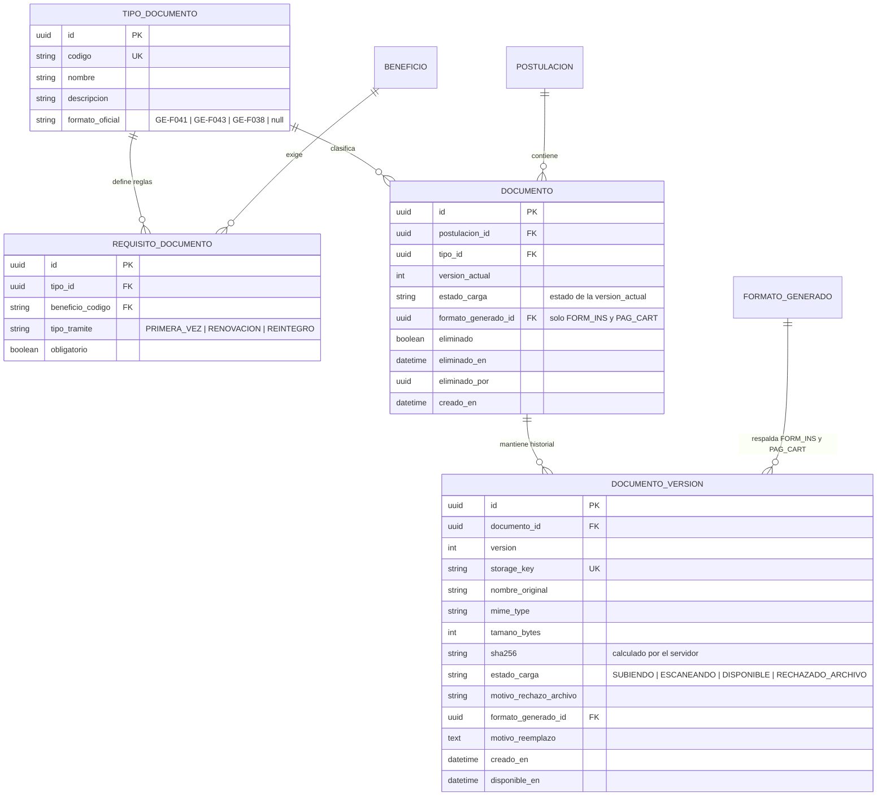
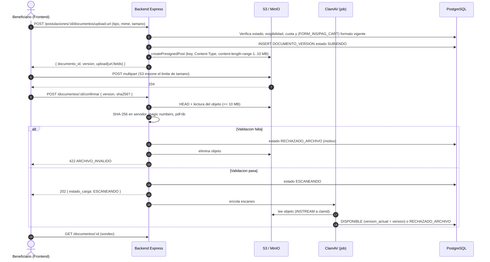

# Módulo: Documentos — Soportes Adjuntos y Almacenamiento Seguro

**Fase:** P1

## Objetivo
Administrar la recepción, validación, versionado y almacenamiento seguro de los soportes de las postulaciones al FOEST, y definir **qué soporte exige cada beneficio según el tipo de trámite** (matriz `REQUISITO_DOCUMENTO`). Usa almacenamiento compatible con S3 en buckets privados con cifrado en reposo. La subida va directo del cliente al bucket mediante **POST prefirmado** con condiciones (`content-length-range`, `Content-Type`), de modo que el límite de tamaño lo impone el almacenamiento y no el cliente. La lectura se entrega por URL prefirmada de 300 s tras verificar alcance, y cada entrega se audita.

Marco normativo: Ley 1581 de 2012 (los soportes contienen datos personales y sensibles: acceso mínimo y auditado), Acuerdo 023 de 2025 (soportes exigidos), Ley 527 de 1999 (los soportes son mensajes de datos; se conserva el SHA-256 como evidencia de integridad).

## Archivos del Módulo

### Backend
- `apps/api/src/modules/documentos/documento.service.ts` — Solicitud de subida, confirmación, listado, versionado, eliminación lógica, entrega de URL de lectura y cuota por postulación.
- `apps/api/src/modules/documentos/requisitos.service.ts` — Cálculo de documentos exigibles dados beneficios + tipo de trámite; endpoint de requisitos por convocatoria.
- `apps/api/src/modules/documentos/file-validator.ts` — Validación binaria: *magic numbers* (`file-type`), coincidencia con el MIME declarado, inspección de PDF con `pdf-lib` (sin cifrado ni JavaScript).
- `apps/api/src/modules/documentos/antivirus.service.ts` — Cliente ClamAV (`clamd`, comando `INSTREAM`).
- `apps/api/src/modules/documentos/jobs/escaneo-documento.job.ts` — Job BullMQ de escaneo antivirus asíncrono.
- `apps/api/src/modules/documentos/jobs/purga-subiendo.job.ts` — Purga de cargas en `SUBIENDO` con más de 24 h (objeto y fila).
- `apps/api/src/modules/documentos/jobs/retencion.job.ts` — Purga de objetos eliminados lógicamente tras `CONFIG.RETENCION_DOCUMENTOS_ANIOS` (no actúa si la configuración está vacía).
- `apps/api/src/modules/documentos/ports/expediente-access.port.ts` — Puerto `ExpedienteAccessPolicy`: decide si un funcionario puede ver un expediente (asignación `ACTIVA` o histórica propia). Lo implementa `asignaciones`; este módulo no lo importa.
- `apps/api/src/modules/documentos/documento.controller.ts` y `documento.routes.ts` — Handlers y rutas.
- `apps/api/src/modules/documentos/seeds/requisito-documento.seed.ts` — Seed idempotente de `TIPO_DOCUMENTO` y `REQUISITO_DOCUMENTO` (matriz de este documento).
- `apps/api/src/modules/documentos/__tests__/` — Pruebas unitarias e integración (Jest + Supertest, S3 y ClamAV simulados).

### Compartido
- `packages/shared/src/documentos/enums.ts` — `EstadoCarga`, códigos de `TipoDocumento`.
- `packages/shared/src/documentos/documento.schema.ts` — Zod de `upload-url` y `confirmar`.

### Frontend
- `apps/web/src/modules/documentos/components/FileUploader.tsx` — Drag & drop con validación local, `POST` multipart al bucket con `XMLHttpRequest` y progreso.
- `apps/web/src/modules/documentos/components/DocumentChecklist.tsx` — Lista de documentos exigibles según beneficios y trámite, con estado de carga y badge de revisión.
- `apps/web/src/modules/documentos/components/DocumentViewerModal.tsx` — Previsualización de PDF e imágenes usando la URL de 300 s.
- `apps/web/src/modules/documentos/hooks/useDocumentUpload.ts` — Orquesta `upload-url`, subida, `confirmar` y sondeo del estado de escaneo.
- `apps/web/src/modules/documentos/services/documentosApi.ts` — Cliente HTTP.
- `apps/web/src/modules/documentos/types/documento.types.ts` — Tipos.

## Endpoints Propuestos

Prefijo `/api/v1`. Todos exigen autenticación. Acceso según `DECISIONES.md` §2: el dueño (o el funcionario con alcance, o el administrador) accede; un recurso ajeno devuelve `404`.

| Método | Ruta | Descripción | Roles Permitidos |
|---|---|---|:---:|
| `POST` | `/postulaciones/:id/documentos/upload-url` | Reserva el documento (o una nueva versión) y devuelve el POST prefirmado `{ tipo_codigo, mime, tamano_bytes, formato_generado_id? }` → `{ documento_id, version, upload: { url, fields }, expira_en }`. Con rate limit | `BENEFICIARIO` |
| `POST` | `/documentos/:id/confirmar` | `{ version, sha256? }`. Valida, calcula el hash en servidor, pasa a `ESCANEANDO` | `BENEFICIARIO` |
| `GET` | `/postulaciones/:id/documentos` | Documentos de la postulación y los **exigibles** con su estado: `{ exigibles[], documentos[] }` | `BENEFICIARIO`, `FUNCIONARIO` (con alcance), `ADMINISTRADOR` |
| `GET` | `/documentos/:id` | Metadatos y `estado_carga` (para sondeo del escaneo) | `BENEFICIARIO`, `FUNCIONARIO` (con alcance), `ADMINISTRADOR` |
| `GET` | `/documentos/:id/url` | URL prefirmada de lectura (300 s). Solo versiones `DISPONIBLE`. Audita `DESCARGA_DOCUMENTO` | `BENEFICIARIO`, `FUNCIONARIO` (con alcance), `ADMINISTRADOR` |
| `DELETE` | `/documentos/:id` | Eliminación lógica. Solo en `BORRADOR` o `EN_CORRECCION` dentro de `fecha_limite_subsanacion`; en otros estados `409` | `BENEFICIARIO` |
| `GET` | `/tipos-documento` | Catálogo de tipos de documento | Todos los autenticados |
| `GET` | `/convocatorias/:id/requisitos-documentos` | Documentos exigibles de la convocatoria, filtrables con `?beneficios=SUP,ST&tipo_tramite=RENOVACION`. Se declara aquí; lo consume `convocatorias.md` | Todos los autenticados |

### Códigos de error propios
| HTTP | `code` | Cuándo |
|---|---|---|
| `409` | `DOCUMENTO_BLOQUEADO` | Subir, reemplazar o eliminar fuera de `BORRADOR` / `EN_CORRECCION` en plazo |
| `409` | `DOCUMENTO_NO_DISPONIBLE` | Pedir URL de una versión no `DISPONIBLE` |
| `422` | `TIPO_NO_EXIGIBLE` | El tipo no corresponde a los beneficios o trámite de la postulación |
| `422` | `ARCHIVO_INVALIDO` | MIME no permitido, firma binaria distinta de la declarada, PDF cifrado o con JavaScript |
| `422` | `TAMANO_EXCEDIDO` | Archivo > `DOCUMENTOS_MAX_MB_ARCHIVO` |
| `422` | `CUOTA_EXCEDIDA` | Suma de la postulación > `DOCUMENTOS_MAX_MB_POSTULACION` |
| `422` | `HASH_NO_COINCIDE` | `sha256` del cliente distinto del calculado por el servidor |
| `422` | `FORMATO_NO_VIGENTE` | `FORM_INS`/`PAG_CART` sin `formato_generado_id` válido y vigente del tipo correcto |

## Configuración (desde `CONFIG`)

| Clave | Valor inicial | Uso |
|---|---|---|
| `DOCUMENTOS_MAX_MB_ARCHIVO` | `10` | Tope por archivo (`content-length-range`) |
| `DOCUMENTOS_MAX_MB_POSTULACION` | `30` | Tope acumulado de versiones vigentes por postulación |
| `DOCUMENTOS_URL_LECTURA_SEG` | `300` | Vigencia de la URL de lectura |
| `DOCUMENTOS_URL_SUBIDA_SEG` | `600` | Vigencia del POST prefirmado |
| `DOCUMENTOS_PURGA_SUBIENDO_HORAS` | `24` | Umbral de purga |
| `RETENCION_DOCUMENTOS_ANIOS` | (a definir por jurídica) | Retención de eliminados lógicamente |

Formatos permitidos: `application/pdf`, `image/jpeg`, `image/png`.

## Modelos de Datos

Restricciones:
- `UNIQUE(tipo_id, beneficio_codigo, tipo_tramite)` en `REQUISITO_DOCUMENTO`.
- `UNIQUE(postulacion_id, tipo_id)` entre documentos no eliminados: un documento por tipo; los reemplazos crean versiones.
- **No existe `DOCUMENTO.estado_revision`.** El estado de revisión se deriva del chequeo documental del módulo `evaluacion` (`REVISION_DOCUMENTO` por tipo, último ciclo): `PRESENTA` → Aprobado, `NO_PRESENTA` → Por corregir, sin chequeo → Pendiente. Este módulo no lo almacena ni lo escribe.
- `DOCUMENTO.estado_carga` es siempre el de la `version_actual`. Una versión nueva en `SUBIENDO`, `ESCANEANDO` o `RECHAZADO_ARCHIVO` **no reemplaza** a la vigente hasta quedar `DISPONIBLE`.
- Clave de almacenamiento: `postulaciones/{postulacion_id}/{documento_id}/v{version}.bin`; nunca incluye nombre original ni cédula. El nombre original se sanea y queda solo en BD.

## Catálogo de Tipos de Documento (13)

| Código | Documento | Notas |
|---|---|---|
| `DOC_ID` | Documento de identidad | Cédula o tarjeta de identidad ampliada al 150 % |
| `DIP_BACH` | Diploma de bachiller / acta de grado | Primera vez |
| `RES_ICFES` | Resultados Saber 11 | Certificado oficial del ICFES |
| `CERT_ESC` | Certificado de escolaridad (5 años en Tocancipá) | Primera vez |
| `SISBEN` | Certificado SISBEN IV | Consulta oficial del DNP |
| `CERT_RES` | Certificado de residencia | Secretaría de Gobierno |
| `LIQ_MAT` | Recibo / liquidación de matrícula | Período a cursar |
| `PAG_CART` | Pagaré y carta de instrucciones firmados (GE-F043) | Vinculado a `formato_generado_id` |
| `FORM_INS` | Formulario de inscripción firmado (GE-F041) | Vinculado a `formato_generado_id` |
| `CERT_NOT` | Certificado oficial de notas | Promedio semestral y acumulado |
| `LAB_SOC` | Certificado de labor social (GE-F038) | Renovaciones |
| `HOR_CLA` | Horario de clases oficial | Justifica el subsidio de transporte |
| `SOP_ESP` | Soportes de línea especial | Discapacidad, pertenencia étnica, víctima |

## Matriz `REQUISITO_DOCUMENTO` — seed inicial

> **Propuesta inicial a validar contra el Acuerdo 023 de 2025.** Los valores son una hipótesis de trabajo para poblar el seed; ninguna fila es definitiva hasta la validación jurídica. Cambiar una fila se hace por migración/seed en `REQUISITO_DOCUMENTO`, sin cambiar código.

Beneficios del catálogo: `S11`, `EA`, `DEP`, `CUL`, `SUP`, `ST`, `LE1`, `LE2`, `LE3`, `LE4`, `LE5`, `LE6`. Trámites: `PRIMERA_VEZ` (PV), `RENOVACION` (RN), `REINTEGRO` (RI). Todas las filas del seed son `obligatorio = true`; lo que no aparece **no se exige** (no hay documentos opcionales en la propuesta inicial).

El seed se define por reglas compactas que el script expande a filas `(tipo, beneficio, trámite)` (producto cartesiano de las columnas "Beneficios" y "Trámites"):

| # | Tipo | Beneficios | Trámites | Obligatorio |
|---|---|---|---|:---:|
| 1 | `DOC_ID` | Todos (12) | PV, RN, RI | Sí |
| 2 | `FORM_INS` | Todos (12) | PV, RN, RI | Sí |
| 3 | `PAG_CART` | Todos (12) | PV, RN, RI | Sí |
| 4 | `SISBEN` | Todos (12) | PV, RN, RI | Sí |
| 5 | `CERT_RES` | Todos (12) | PV, RN, RI | Sí |
| 6 | `DIP_BACH` | Todos (12) | PV | Sí |
| 7 | `RES_ICFES` | Todos (12) | PV | Sí |
| 8 | `RES_ICFES` | `S11` | RN, RI | Sí |
| 9 | `CERT_ESC` | Todos (12) | PV | Sí |
| 10 | `LIQ_MAT` | `SUP`, `ST`, `EA` | PV, RN, RI | Sí |
| 11 | `CERT_NOT` | Todos (12) | RN, RI | Sí |
| 12 | `CERT_NOT` | `EA` | PV | Sí |
| 13 | `LAB_SOC` | Todos (12) | RN | Sí |
| 14 | `HOR_CLA` | `ST` | PV, RN, RI | Sí |
| 15 | `SOP_ESP` | `LE1`, `LE2`, `LE3`, `LE4`, `LE5`, `LE6` | PV, RN, RI | Sí |

Notas de interpretación de la propuesta:
- Filas 6, 7, 9 (solo primera vez) y 8 (`RES_ICFES` también en renovación y reintegro, pero solo para `S11`).
- Fila 11 y 12: `CERT_NOT` se exige a renovación y reintegro de cualquier beneficio y, para `EA`, también en primera vez.
- Fila 13: `LAB_SOC` solo en renovación.
- Cantidad de filas del seed: 12×3 (filas 1–5 = 180) + 12 (6) + 12 (7) + 2 (8) + 12 (9) + 9 (10) + 24 (11) + 1 (12) + 12 (13) + 3 (14) + 18 (15) = 285 filas.

### Resultado por trámite (referencia para pruebas)

| Trámite | Documentos exigidos para un beneficio sin reglas propias (p. ej. `DEP`) |
|---|---|
| `PRIMERA_VEZ` | `DOC_ID`, `FORM_INS`, `PAG_CART`, `SISBEN`, `CERT_RES`, `DIP_BACH`, `RES_ICFES`, `CERT_ESC` |
| `RENOVACION` | `DOC_ID`, `FORM_INS`, `PAG_CART`, `SISBEN`, `CERT_RES`, `CERT_NOT`, `LAB_SOC` |
| `REINTEGRO` | `DOC_ID`, `FORM_INS`, `PAG_CART`, `SISBEN`, `CERT_RES`, `CERT_NOT` |

Con `SUP`/`ST`/`EA` se suma `LIQ_MAT`; con `ST`, `HOR_CLA`; con `S11` en renovación/reintegro, `RES_ICFES`; con `LE1`–`LE6`, `SOP_ESP`; con `EA` en primera vez, `CERT_NOT`.

## Regla de Cálculo de Documentos Exigibles

Entrada: conjunto de beneficios solicitados `B` y `tipo_tramite` `T`.

1. Filtrar `REQUISITO_DOCUMENTO` con `beneficio_codigo ∈ B` y `tipo_tramite = T`.
2. Agrupar por `tipo_id`. Un tipo es **exigible** si aparece en al menos una fila; es **obligatorio** si alguna de sus filas es `obligatorio = true` (OR).
3. Por cada exigible se informa `beneficios_que_lo_exigen` (para explicarlo al usuario y para la evaluación por beneficio).
4. Los tipos fuera del resultado no pueden cargarse (`422 TIPO_NO_EXIGIBLE`), salvo `SOP_ESP`, que siempre admite carga adicional voluntaria.

El mismo servicio (`requisitos.service.ts`) lo consumen `postulaciones` (validación y envío) y `evaluacion`: aprobar un beneficio exige que los documentos obligatorios **de ese beneficio** estén `PRESENTA` o `NO_APLICA`.

`GET /convocatorias/:id/requisitos-documentos` devuelve la matriz restringida a los beneficios de la convocatoria (`CONVOCATORIA_BENEFICIO`); con `beneficios` y `tipo_tramite` devuelve el resultado ya calculado.

## Flujo de Carga con POST Prefirmado

## Casos de Uso Especiales y Reglas

- **Estados de carga:** `SUBIENDO` (reservado, sin confirmar) → `ESCANEANDO` (validado, esperando antivirus) → `DISPONIBLE` | `RECHAZADO_ARCHIVO`. Solo `DISPONIBLE` cuenta para la validación y el envío de `postulaciones` y puede previsualizarse o descargarse. Un archivo en `ESCANEANDO` no puede verse por nadie.
- **Hash calculado por el servidor:** en `confirmar` el servidor lee el objeto (≤ 10 MB) y calcula el SHA-256; es el único que se guarda. El `sha256` del cliente es solo verificación cruzada opcional (`422 HASH_NO_COINCIDE` si difiere).
- **Validación de contenido:** `file-type` verifica la firma real (`%PDF-`, `FF D8 FF`, `89 50 4E 47`) y que coincida con el MIME declarado; `pdf-lib` rechaza PDFs cifrados o con JavaScript/acciones. Un `.exe` renombrado `.pdf` termina en `RECHAZADO_ARCHIVO` con `422 ARCHIVO_INVALIDO`.
- **Antivirus asíncrono (ClamAV):** el job envía el objeto a `clamd`. Limpio → `DISPONIBLE`; infectado → `RECHAZADO_ARCHIVO`, el objeto se elimina y se audita. Si `clamd` no responde, el job reintenta con backoff; mientras tanto la versión sigue en `ESCANEANDO` (falla cerrada: nunca pasa a `DISPONIBLE` sin escaneo) y una alerta de operación avisa si la cola se atasca.
- **Límites:** 10 MB por archivo (se impone en la política del POST prefirmado) y 30 MB por postulación (suma de versiones vigentes más cargas en curso; se valida al reservar en `upload-url`). Ambos valores salen de `CONFIG`.
- **Purga de `SUBIENDO`:** un job elimina objeto y fila de las versiones en `SUBIENDO` con más de 24 h (también la fila `DOCUMENTO` si queda sin versiones).
- **Lectura segura:** el bucket bloquea todo acceso público. `GET /documentos/:id/url` verifica alcance (dueño; funcionario vía `ExpedienteAccessPolicy`; administrador), exige `DISPONIBLE`, entrega una URL de **300 s** y registra `DESCARGA_DOCUMENTO` con actor, documento, versión e IP. Documento ajeno o sin alcance: `404`.
- **Versionado en subsanación:** reemplazar un tipo ya existente crea `DOCUMENTO_VERSION` con `version = version_actual + 1` y exige `motivo_reemplazo`. La versión anterior se conserva intacta. La nueva pasa a ser `version_actual` solo al quedar `DISPONIBLE`. Los chequeos de `evaluacion` registran qué versión revisaron (`documento_version`).
- **Eliminación lógica:** solo en `BORRADOR` o en `EN_CORRECCION` dentro de `fecha_limite_subsanacion`. En `PENDIENTE`, `EN_EVALUACION`, `APROBADA`, `RECHAZADA` o `DESISTIDA` devuelve `409 DOCUMENTO_BLOQUEADO`. Marca `eliminado`, `eliminado_en` y `eliminado_por`; el objeto se conserva durante `CONFIG.RETENCION_DOCUMENTOS_ANIOS` y luego lo purga el job de retención. El borrado físico de un `BORRADOR` completo lo ejecuta `postulaciones` (sin efectos legales).
- **`FORM_INS` y `PAG_CART` vinculados a su formato:** al reservar la subida de estos tipos, `formato_generado_id` es obligatorio y debe ser un `FORMATO_GENERADO` **vigente** de la misma postulación y del tipo correcto (`GE-F041` para `FORM_INS`, `GE-F043` para `PAG_CART`); si no, `422 FORMATO_NO_VIGENTE`. El vínculo se guarda en la versión y se refleja en `DOCUMENTO`. Si luego los datos cambian y se regenera el formato, el documento queda desactualizado y `postulaciones` responde `422 FORMATOS_DESACTUALIZADOS` al enviar (ver `formatos_oficiales.md`). Este módulo no recalcula hashes: solo guarda el vínculo.
- **Alcance de postulación:** subir, reemplazar o eliminar exige que la postulación sea del beneficiario (si no, `404`) y esté en un estado que lo permita (si no, `409`).
- **Rate limit:** `upload-url` limitado por usuario e IP (`DECISIONES.md` §7).
- **Auditoría:** `DOCUMENTO_RESERVADO`, `DOCUMENTO_CONFIRMADO`, `DOCUMENTO_RECHAZADO_ARCHIVO` (con motivo, incluido hallazgo de virus), `DOCUMENTO_ELIMINADO`, `DESCARGA_DOCUMENTO`, siempre con `auditar(tx, …)`.
- **Datos sensibles:** SISBEN, identidad y demás soportes son datos personales; no se loguea su contenido ni el nombre original en logs de aplicación.

## Dependencias entre Módulos
- **`convocatorias.md`:** beneficios ofertados para filtrar la matriz; consume `GET /convocatorias/:id/requisitos-documentos`.
- **`postulaciones.md`:** lee estado, ciclo, `fecha_limite_subsanacion`, tipo de trámite y beneficios (solo lectura). `postulaciones` consume el servicio de requisitos y el estado `DISPONIBLE` en la validación y el envío, y pide purga de documentos al eliminar un borrador.
- **`formatos_oficiales.md`:** provee `FORMATO_GENERADO` para vincular `FORM_INS` y `PAG_CART`. `formatos_oficiales` usa la infraestructura de almacenamiento compartida.
- **`evaluacion.md`:** consume la matriz para el chequeo por tipo y por beneficio, y el listado de documentos y versiones. No se escribe estado de revisión aquí.
- **`asignaciones.md`:** implementa `ExpedienteAccessPolicy` (inversión de dependencia: `documentos` no importa de `asignaciones`).
- **`catalogos_configuracion.md`**, **`auditoria.md`**, **`notificaciones.md`:** `CONFIG`, auditoría y alertas.

## Dependencias Externas
- `@aws-sdk/client-s3`, `@aws-sdk/s3-presigned-post` y `@aws-sdk/s3-request-presigner`: POST prefirmado, HEAD/GET, URL de lectura.
- `file-type`: detección de tipo real.
- `pdf-lib`: inspección de PDF.
- `clamav` (`clamd`) y cliente `clamscan`/`clamd.js`: escaneo antivirus.
- `bullmq` + `ioredis`: escaneo y purgas.
- `zod`: validación de DTOs.

## Pruebas de Aceptación
- [ ] La política del POST prefirmado incluye `content-length-range` ≤ 10 MB; subir 11 MB directo al bucket es rechazado por S3.
- [ ] `upload-url` con un archivo declarado > 10 MB devuelve `422 TAMANO_EXCEDIDO`; superar 30 MB acumulados devuelve `422 CUOTA_EXCEDIDA`.
- [ ] Un `.exe` renombrado a `.pdf` termina en `RECHAZADO_ARCHIVO` con `422 ARCHIVO_INVALIDO`.
- [ ] Un PDF cifrado o con JavaScript es rechazado.
- [ ] El SHA-256 almacenado es el calculado por el servidor; un `sha256` del cliente distinto devuelve `422 HASH_NO_COINCIDE`.
- [ ] Un archivo con firma de prueba EICAR queda en `RECHAZADO_ARCHIVO`, su objeto se elimina y se audita.
- [ ] Con `clamd` caído el documento permanece en `ESCANEANDO` y no cuenta como `DISPONIBLE`.
- [ ] Solo los documentos `DISPONIBLE` permiten `GET /documentos/:id/url`; en otros estados devuelve `409 DOCUMENTO_NO_DISPONIBLE`.
- [ ] La URL de lectura expira a los 300 s y cada entrega crea un evento `DESCARGA_DOCUMENTO`.
- [ ] Un beneficiario ajeno o un funcionario sin asignación reciben `404` al pedir la URL o los metadatos de un documento.
- [ ] Un job elimina objeto y fila de los registros en `SUBIENDO` con más de 24 h.
- [ ] Reemplazar un documento en `EN_CORRECCION` crea `DOCUMENTO_VERSION` n+1 y conserva la anterior; hasta quedar `DISPONIBLE` la vigente sigue siendo la anterior.
- [ ] Eliminar o reemplazar un documento en `PENDIENTE`, `EN_EVALUACION` o estados terminales devuelve `409`; en `EN_CORRECCION` fuera de plazo también.
- [ ] Eliminar en `BORRADOR` o en `EN_CORRECCION` dentro de plazo marca `eliminado` y conserva el objeto hasta la retención.
- [ ] Subir `FORM_INS` o `PAG_CART` sin `formato_generado_id` vigente del tipo correcto devuelve `422 FORMATO_NO_VIGENTE`.
- [ ] `DOCUMENTO` no tiene columna `estado_revision`; el badge del beneficiario se deriva del chequeo de `evaluacion`.
- [ ] Para `PRIMERA_VEZ` + `DEP` los exigibles son exactamente los de la tabla de referencia; para `RENOVACION` + `SUP` + `ST` se suman `LIQ_MAT` y `HOR_CLA` y se exige `LAB_SOC` y `CERT_NOT`.
- [ ] Un tipo exigido por dos beneficios aparece una sola vez con ambos en `beneficios_que_lo_exigen`.
- [ ] Subir un tipo no exigible para el trámite y beneficios devuelve `422 TIPO_NO_EXIGIBLE`.
- [ ] El seed de `REQUISITO_DOCUMENTO` es idempotente y genera 285 filas.
- [ ] `GET /convocatorias/:id/requisitos-documentos` devuelve la matriz filtrada por los beneficios de la convocatoria.
