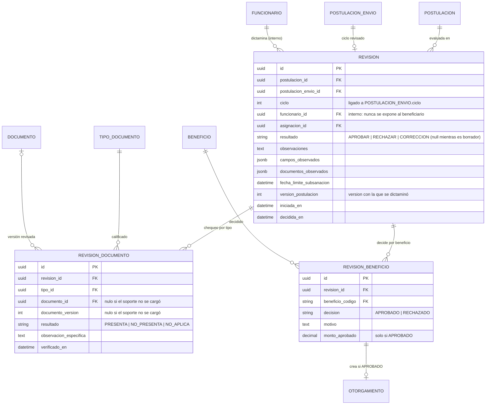
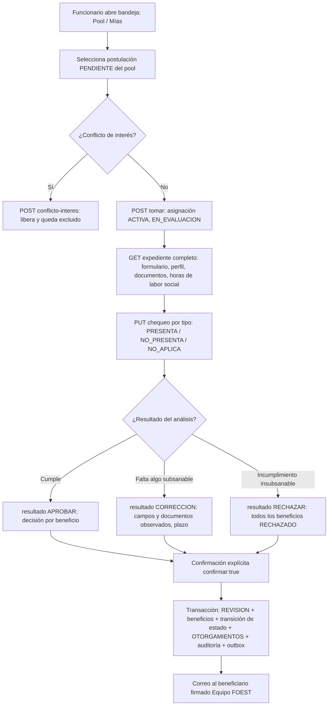

# Módulo: Evaluación — Revisión Documental y Dictamen de Solicitudes

**Fase:** P2

## Objetivo
Proveer la consola operativa para que los funcionarios evalúen las postulaciones de las convocatorias de su comité. Implementa el formato oficial de revisión municipal **"Chequeo de Documentos — Uso Exclusivo FOEST"** con el vocabulario único `PRESENTA | NO_PRESENTA | NO_APLICA` calificado **por tipo de documento**, un **único endpoint de dictamen** con decisión **por beneficio** (aprobación parcial), observaciones motivadas obligatorias, confirmación explícita, bloqueo optimista por `version`, ciclos de revisión ligados a los envíos de la postulación, irreversibilidad de los estados terminales y anonimato del evaluador frente al beneficiario.

Este módulo **no gestiona la asignación**: `tomar`, `liberar`, la bandeja, el conflicto de interés y el alcance al expediente (`requireScope`) están definidos en `asignaciones.md`; aquí se exponen las rutas y se consumen. Tampoco es dueño de la máquina de estados: el dictamen invoca `postulacion.service.transicionar()`. Al aprobar cada beneficio crea el `OTORGAMIENTO` correspondiente (`seguimiento_beneficios.md`) en la misma transacción.

## Archivos del Módulo

### Backend
- `apps/api/src/modules/evaluacion/revision.model.ts` — Entidades Prisma/TypeScript: `Revision`, `RevisionDocumento`, `RevisionBeneficio`, enums `ResultadoDictamen` (`APROBAR | RECHAZAR | CORRECCION`), `ResultadoDocumento` (`PRESENTA | NO_PRESENTA | NO_APLICA`), `DecisionBeneficio` (`APROBADO | RECHAZADO`).
- `apps/api/src/modules/evaluacion/evaluacion.service.ts` — Lógica de negocio: expediente del evaluador, guardado del chequeo, validación del dictamen, aprobación parcial, cálculo de `fecha_limite_subsanacion`, invocación de `postulacion.service.transicionar()`, creación de `OTORGAMIENTO`, outbox y auditoría.
- `apps/api/src/modules/evaluacion/evaluacion.controller.ts` — Handlers Express de bandeja, expediente, chequeo, dictamen e historial (delegan `tomar`, `liberar` y `conflicto-interes` en `asignaciones`).
- `apps/api/src/modules/evaluacion/evaluacion.routes.ts` — Rutas Express bajo `/api/v1/evaluacion`; aplican `authenticate()`, permisos por rol y `requireScope('expediente')` (de `asignaciones`).
- `apps/api/src/modules/evaluacion/evaluacion.dto.ts` — Schemas Zod: `ChequeoDocumentosDto`, `DictamenDto`, `DictamenBeneficioDto`.
- `apps/api/src/modules/evaluacion/evaluacion.serializer.ts` — `ExpedienteEvaluadorDto` (con datos de pago enmascarados) y **`ObservacionPublica`** (serializador explícito hacia el beneficiario, sin campos de actor).
- `apps/api/src/modules/evaluacion/evaluacion.emails.ts` — Plantillas fijas de correo firmadas "Equipo FOEST".
- `apps/api/src/modules/evaluacion/__tests__/evaluacion.test.ts` — Pruebas unitarias e integración con Jest + Supertest.
- `packages/shared/src/evaluacion/` — Enums y esquemas Zod compartidos (`DictamenDto`, resultados, decisiones) y tipo `ObservacionPublica`.

### Frontend
- `apps/web/src/modules/evaluacion/components/BandejaPostulaciones.tsx` — Bandeja con dos pestañas: **Pool** (pendientes del comité) y **Mías** (activas e históricas); filtros por convocatoria, tipo de solicitud, beneficio y días hábiles de espera.
- `apps/web/src/modules/evaluacion/components/VisorExpedienteEvaluador.tsx` — Pantalla dividida: datos del formulario GE-F041 y perfil congelado a la izquierda; visor de documentos a la derecha (URL prefirmada de 300 s, auditada).
- `apps/web/src/modules/evaluacion/components/TablaChequeoDocumental.tsx` — Matriz por **tipo de documento** con `PRESENTA | NO_PRESENTA | NO_APLICA`, observación por ítem e indicación de soportes no cargados.
- `apps/web/src/modules/evaluacion/components/DecisionPorBeneficioPanel.tsx` — Decisión `APROBADO | RECHAZADO` por beneficio con motivo y `monto_aprobado`; muestra los documentos obligatorios faltantes de cada beneficio.
- `apps/web/src/modules/evaluacion/components/PanelLaborSocial.tsx` — Horas de labor social acumuladas del estudiante (solo lectura).
- `apps/web/src/modules/evaluacion/components/DictamenFinalModal.tsx` — Resumen del dictamen y casilla de confirmación explícita (`confirmar: true`).
- `apps/web/src/modules/evaluacion/components/ConflictoInteresModal.tsx` — Declaración de impedimento (remite a `asignaciones`).
- `apps/web/src/modules/evaluacion/components/HistorialRevisionesPanel.tsx` — Ciclos previos y observaciones.
- `apps/web/src/modules/evaluacion/hooks/useEvaluacion.ts` — Hook para tomar, guardar avance y dictaminar con manejo de `409`.
- `apps/web/src/modules/evaluacion/services/evaluacionApi.ts` — Cliente HTTP.
- `apps/web/src/modules/evaluacion/types/evaluacion.types.ts` — Interfaces tipadas.

## Endpoints Propuestos

| Método | Ruta | Descripción | Auth | Roles | Alcance / errores |
|---|---|---|:---:|:---:|---|
| `GET` | `/api/v1/evaluacion/postulaciones` | Bandeja: pool `PENDIENTE` de su comité + postulaciones propias (resumen mínimo, ver `asignaciones.md`) | Sí | `FUNCIONARIO` | Paginado estándar; filtros `scope=pool|mias`, `convocatoria_id`, `estado` |
| `GET` | `/api/v1/evaluacion/postulaciones/:id` | Expediente completo: formulario, `perfil_snapshot`, documentos, chequeo vigente, decisiones previas | Sí | `FUNCIONARIO`, `ADMINISTRADOR` (lectura) | Funcionario: solo asignación activa propia (escritura) o histórica propia (lectura); admin: lectura; resto `404`. Datos de pago **enmascarados** |
| `POST` | `/api/v1/evaluacion/postulaciones/:id/tomar` | Toma el expediente (→ `EN_EVALUACION`) | Sí | `FUNCIONARIO` | Ver `asignaciones.md`; `409` al segundo que toma |
| `POST` | `/api/v1/evaluacion/postulaciones/:id/liberar` | Libera la asignación activa (→ `PENDIENTE`) | Sí | `FUNCIONARIO` | Ver `asignaciones.md` |
| `PUT` | `/api/v1/evaluacion/postulaciones/:id/chequeo` | Guarda el chequeo documental por tipo de documento (borrador del ciclo vigente) | Sí | `FUNCIONARIO` | Solo titular de asignación activa; `404` otros; `409` versión |
| `POST` | `/api/v1/evaluacion/postulaciones/:id/dictamen` | Dictamen único: `APROBAR`, `RECHAZAR` o `CORRECCION`, con decisión por beneficio | Sí | `FUNCIONARIO` | Solo titular activo; `404` otros; `403` otros roles; `409` versión/estado; `422` validación |
| `POST` | `/api/v1/evaluacion/postulaciones/:id/conflicto-interes` | Declara impedimento; libera y excluye (ver `asignaciones.md`) | Sí | `FUNCIONARIO` | `404` si no tiene alcance |
| `GET` | `/api/v1/evaluacion/postulaciones/:id/historial-revisiones` | Revisiones de ciclos anteriores con observaciones y chequeos | Sí | `FUNCIONARIO` (propia asignación o histórica), `ADMINISTRADOR` | `404` sin alcance |

### Cuerpo de `PUT /chequeo`
```json
{
  "version": 7,
  "items": [
    { "tipo_codigo": "FORM_INS", "resultado": "PRESENTA", "observacion": null },
    { "tipo_codigo": "PAG_CART", "resultado": "NO_PRESENTA", "observacion": "No se cargó el pagaré firmado." }
  ]
}
```
El chequeo es **por tipo** (`tipo_id`), no por archivo. Si el soporte nunca se cargó, `documento_id` y `documento_version` quedan en `NULL`; si se cargó, se guardan el `documento_id` y la `documento_version` revisados, de modo que un reemplazo posterior no altere lo que el funcionario calificó. Un tipo que no corresponde a ningún beneficio solicitado ni al tipo de trámite → `422`. Guardar el chequeo es idempotente (`PUT` reemplaza los ítems enviados) y no cambia estado ni incrementa `POSTULACION.version`.

### Cuerpo de `POST /dictamen` (contrato de `DECISIONES.md` §9)
```json
{
  "version": 7,
  "confirmar": true,
  "resultado": "APROBAR",
  "beneficios": [
    { "codigo": "SUP", "decision": "APROBADO", "motivo": "Cumple requisitos del Acuerdo 023.", "monto_aprobado": 1500000 },
    { "codigo": "ST",  "decision": "RECHAZADO", "motivo": "El destino no cumple la distancia exigida por el Acuerdo." }
  ],
  "observaciones": "Texto motivado de al menos 15 caracteres.",
  "campos_observados": ["datos_formulario.programa_academico"],
  "documentos_observados": ["CERT_MAT"],
  "fecha_limite_subsanacion": "2026-03-20"
}
```

## Modelos de Datos



Restricciones:
- `UNIQUE(postulacion_envio_id)` en `REVISION` con `decidida_en` no nulo: un solo dictamen por ciclo. Puede existir un borrador por ciclo (`decidida_en` nulo) que acumula el chequeo.
- `UNIQUE(revision_id, tipo_id)` en `REVISION_DOCUMENTO` y `UNIQUE(revision_id, beneficio_codigo)` en `REVISION_BENEFICIO`.
- `REVISION` y sus hijas son **inmutables** una vez `decidida_en` no es nulo (trigger de BD).
- Trigger de BD que impide cambiar `POSTULACION.estado` desde `APROBADA`, `RECHAZADA` o `DESISTIDA`.
- `REVISION.funcionario_id` se conserva **internamente** (auditoría, historial de administrador, métricas de carga); ningún DTO hacia el beneficiario lo incluye.
- Vocabulario único: no existe `DOCUMENTO.estado_revision`. El badge del beneficiario se deriva del chequeo del último ciclo (`PRESENTA` → Aprobado, `NO_PRESENTA` → Por corregir, sin chequeo → Pendiente).

## Flujo de Usuario Crítico



```mermaid
sequenceDiagram
    autonumber
    actor F as Funcionario titular
    participant API as evaluacion.service
    participant DB as PostgreSQL
    participant PS as postulacion.service
    participant SB as seguimiento_beneficios
    participant OB as Outbox

    F->>API: POST /evaluacion/postulaciones/:id/dictamen {version, confirmar, resultado, beneficios...}
    API->>API: requireScope (asignación ACTIVA propia) y validación Zod
    API->>DB: BEGIN; SELECT postulación FOR UPDATE; verifica version y estado EN_EVALUACION
    API->>DB: Valida chequeo completo y obligatorios por beneficio
    API->>DB: INSERT REVISION, REVISION_DOCUMENTO, REVISION_BENEFICIO
    API->>PS: transicionar(EN_EVALUACION → APROBADA | RECHAZADA | EN_CORRECCION)
    API->>SB: crearOtorgamiento() por cada beneficio APROBADO
    API->>DB: cerrar asignación (DICTAMEN_EMITIDO), auditar(DICTAMEN_EMITIDO), INSERT EVENTO_OUTBOX
    API->>DB: COMMIT
    API-->>F: 200 resumen del dictamen
```

## Casos de Uso Especiales y Reglas de Negocio

### Tabla de acceso (regla única de `DECISIONES.md` §2)

| Situación | Respuesta |
|---|---|
| Rol `BENEFICIARIO` en cualquier ruta de `/evaluacion` | `403` |
| Rol `FUNCIONARIO` sobre postulación no asignada a él / en pool sin tomar / asignada a otro / excluido por conflicto / inexistente | `404` |
| `ADMINISTRADOR` en `tomar`, `liberar`, `chequeo`, `dictamen`, `conflicto-interes` | `403` (solo lectura: `GET` de expediente e historial) |
| Funcionario con asignación histórica propia intentando escribir | `404` |
| `version` desactualizada, estado distinto de `EN_EVALUACION`, estado terminal | `409` |
| Observaciones cortas, falta `confirmar`, obligatorios no cumplidos | `422` |

### Reglas del expediente
- **Expediente completo solo con alcance:** `GET /postulaciones/:id` devuelve el formulario, el `perfil_snapshot` del ciclo y los documentos únicamente con asignación `ACTIVA` propia; con asignación histórica propia es solo lectura de lo ocurrido en sus ciclos; el Administrador tiene lectura. Cada apertura registra `LECTURA_SENSIBLE` y cada URL de documento entregada registra `DESCARGA_DOCUMENTO`.
- **Datos de pago enmascarados:** el expediente muestra solo `ultimos4` y el tipo de cuenta/billetera; el descifrado completo ocurre únicamente en `seguimiento_beneficios.md`.
- **Horas de labor social:** el expediente incluye el total de horas de labor social del estudiante (consulta a `labor_social.md`, solo lectura). Es informativo para el evaluador; la regla de exigencia no se evalúa aquí.

### Reglas del chequeo y dictamen
- **Bloqueo optimista:** `version` obligatorio; si no coincide con `POSTULACION.version` → `409`. El cliente debe recargar el expediente.
- **Confirmación explícita:** `confirmar: true` es obligatorio en `dictamen`; ausente o `false` → `422`.
- **Observaciones:** mínimo 15 caracteres en `RECHAZAR` y `CORRECCION`, y un `motivo` de al menos 15 caracteres por cada beneficio `RECHAZADO`. Las observaciones se muestran al beneficiario (a través de `ObservacionPublica`); los motivos por beneficio también.
- **Resultado y coherencia con beneficios:**
  - `APROBAR`: al menos un beneficio `APROBADO`; los demás pueden ser `RECHAZADO` (**aprobación parcial**). Si alguno es rechazado, `aprobacion_parcial = true`. Estado resultante: `APROBADA`.
  - `RECHAZAR`: todos los beneficios `RECHAZADO`. Estado resultante: `RECHAZADA` (terminal, no subsanable).
  - `CORRECCION`: no se decide ningún beneficio de forma definitiva (`beneficios` puede ir vacío o con decisiones previstas ignoradas); exige `campos_observados` y/o `documentos_observados` (al menos uno). Estado: `EN_CORRECCION`.
  - Todos los beneficios solicitados deben aparecer en `beneficios` salvo en `CORRECCION`; un código no solicitado → `422`.
- **Aprobar un beneficio exige documentos:** todos los documentos obligatorios **de ese beneficio** (según `REQUISITO_DOCUMENTO` de `documentos.md`, filtrado por beneficio y tipo de trámite) deben estar `PRESENTA` o `NO_APLICA` en el chequeo del ciclo. Un obligatorio `NO_PRESENTA` o sin calificar → `422` con el detalle `{ beneficio, tipo_codigo }`. Un documento pendiente de un beneficio rechazado no impide aprobar otro beneficio.
- **`monto_aprobado`:** obligatorio y mayor que cero para `APROBADO`; no aplica en `RECHAZADO`. Se advierte (no se bloquea) si excede `valor_apoyo_referencial` de `CONVOCATORIA_BENEFICIO`; el control de cupos y presupuesto lo realiza `seguimiento_beneficios.md`.
- **Documentos solo `DISPONIBLE`:** el chequeo solo puede marcar `PRESENTA` sobre documentos con `estado_carga = DISPONIBLE` (el escaneo antivirus terminó). Uno en `ESCANEANDO` o `RECHAZADO_ARCHIVO` se trata como no presentado.
- **Fecha límite de subsanación:** si el cuerpo no trae `fecha_limite_subsanacion`, se calcula como `now + CONFIG.SUBSANACION_DIAS_HABILES` días hábiles (utilidad `business-days`, default 5). El funcionario puede ajustarla hasta un máximo de `CONFIG.SUBSANACION_DIAS_HABILES_MAX` días hábiles (valor inicial propuesto: 10); un valor mayor, en el pasado o no hábil → `422`. El cierre del plazo es a las 23:59:59 `America/Bogota`. Vencido el plazo, un job del sistema transiciona `EN_CORRECCION → RECHAZADA` con motivo `VENCIMIENTO_SUBSANACION` (lo define `postulaciones.md`).
- **Ciclos de revisión:** `REVISION.ciclo` está ligado a `POSTULACION_ENVIO` (un registro inmutable por envío, ver `postulaciones.md`). El primer envío es ciclo 1; cada `subsanar` crea un nuevo envío y, al ser tomada otra vez, una nueva `REVISION` con `ciclo + 1`. Las revisiones de ciclos anteriores se conservan intactas y se consultan en `historial-revisiones`. Al comenzar un ciclo el chequeo parte vacío, con una vista informativa del ciclo anterior.
- **Irreversibilidad de estados terminales:** `APROBADA`, `RECHAZADA` y `DESISTIDA` no admiten ninguna transición. Lo impone el servicio (`409`) y un trigger de BD. Una revisión decidida es inmutable; no existe endpoint de "corregir dictamen" (una equivocación se maneja por vía administrativa/jurídica fuera de la plataforma, ver punto abierto).
- **Transacción única:** el dictamen inserta `REVISION` + `REVISION_DOCUMENTO` + `REVISION_BENEFICIO`, ejecuta la transición de estado, crea los `OTORGAMIENTO`, cierra la asignación (`DICTAMEN_EMITIDO`), audita e inserta el evento de outbox, todo en la misma transacción; cualquier fallo revierte todo.
- **Creación de `OTORGAMIENTO`:** por cada beneficio `APROBADO`, el servicio llama a `seguimiento_beneficios.crearOtorgamiento(tx, { postulacion_id, beneficio_codigo, convocatoria_id, monto_aprobado })`. El estado inicial es `ACTIVO`. Si el control de presupuesto de la convocatoria se excede, el dictamen **no se bloquea** (solo alerta al Administrador; ver `seguimiento_beneficios.md`).
- **Conflicto de interés:** `POST …/conflicto-interes` se limita a validar el alcance y remitir a `asignaciones.service.declararConflicto()` (libera, registra, excluye y devuelve a `PENDIENTE`). El borrador de chequeo del evaluador excluido se conserva en el historial pero no se hereda al siguiente evaluador.

### Anonimato del evaluador
- Ningún DTO hacia el beneficiario incluye `funcionario_id`, nombre, correo, cargo ni la asignación. Las observaciones, los motivos por beneficio, los campos y documentos observados y la fecha límite se entregan mediante el serializador explícito **`ObservacionPublica`** (lista blanca de campos: `ciclo`, `resultado`, `observaciones`, `beneficios[{codigo, decision, motivo, monto_aprobado}]`, `campos_observados`, `documentos_observados`, `fecha_limite_subsanacion`, `decidida_en`, `firmante: "Equipo FOEST"`). Una prueba automática recorre las respuestas del beneficiario y falla si aparece cualquier clave de actor.
- Los correos usan plantillas fijas (`evaluacion.emails.ts`) firmadas **"Equipo FOEST"**, sin variables que contengan datos del evaluador.
- `REVISION.funcionario_id` se **conserva internamente** (auditoría, historial del Administrador, métricas de carga del comité) para trazabilidad ante entes de control; el anonimato es de **exposición**, no de registro.
- Los registros de auditoría `DICTAMEN_EMITIDO` guardan el actor real; solo el Administrador puede consultarlos.

### Notificaciones, outbox y auditoría
- El dictamen inserta un `EVENTO_OUTBOX` en la misma transacción; el worker envía el correo al correo principal y al alternativo/acudiente (`DECISIONES.md` §13) con la plantilla correspondiente (aprobada total, aprobada parcial, en corrección con fecha límite, rechazada). Además se crea una `NOTIFICACION` en la plataforma.
- Eventos de auditoría: `EXPEDIENTE_ABIERTO` (`LECTURA_SENSIBLE`), `CHEQUEO_GUARDADO`, `DICTAMEN_EMITIDO` (resultado, beneficios, monto, ciclo, actor), `HISTORIAL_REVISIONES_CONSULTADO`. Los eventos de asignación se registran en `asignaciones.md`.

> **Punto abierto para el área jurídica (no implementado).** Se debe definir si el rechazo (y eventualmente la aprobación parcial) constituye un **acto administrativo** sujeto a **recurso de reposición** y a **firma del acto** por la autoridad competente, y si el **anonimato del evaluador** es compatible con la motivación y notificación exigidas para ese acto (el notificado puede tener derecho a conocer quién lo firma). Mientras se resuelve, el diseño deja el hook previsto: un futuro campo `recurso_estado` en `POSTULACION` (o en una tabla `RECURSO` propia) que **NO está implementado** en este plan y solo se documenta como pendiente; las revisiones inmutables y el `funcionario_id` conservado internamente permiten atribuir el acto sin cambiar el modelo. Hasta la decisión, `RECHAZADA` se mantiene terminal sin vía de recurso en la plataforma.

## Dependencias entre Módulos
- **`asignaciones.md`**: bandeja, `tomar`, `liberar`, conflicto de interés, `registrarMovimiento` y middleware `requireScope('expediente')`.
- **`postulaciones.md`**: `postulacion.service.transicionar()`; lectura de `POSTULACION_ENVIO`, `ciclo`, `version`, `datos_formulario` y `perfil_snapshot`. `postulaciones` no importa de `evaluacion`.
- **`documentos.md`**: `REQUISITO_DOCUMENTO`, `TIPO_DOCUMENTO`, estado de carga y URLs prefirmadas de lectura (auditadas).
- **`seguimiento_beneficios.md`**: `crearOtorgamiento()` por beneficio aprobado y consulta de cupos/presupuesto.
- **`labor_social.md`**: consulta de solo lectura de horas acumuladas del estudiante.
- **`catalogos_configuracion.md`**: `CONFIG.SUBSANACION_DIAS_HABILES`, `CONFIG.SUBSANACION_DIAS_HABILES_MAX`, `FESTIVO`.
- **`notificaciones.md`** y **`auditoria.md`**: outbox transaccional y eventos auditables.

Conforme al grafo de `DECISIONES.md` §16: `evaluacion → asignaciones, postulaciones, documentos, seguimiento_beneficios`; la consulta a `labor_social` es de solo lectura vía su servicio de consulta.

## Dependencias Externas
- `zod`: validación de dictamen, chequeo, observaciones mínimas y `confirmar`.
- `@prisma/client`: transacciones, `SELECT … FOR UPDATE`, restricciones únicas.
- `shared/mailer` vía `shared/outbox` + BullMQ: envío de correos con reintentos.
- `shared/business-days`, `shared/audit`, `shared/crypto` (solo enmascarado de pago).

## Pruebas de Aceptación
- [ ] Un funcionario sin asignación activa sobre la postulación recibe `404` al abrir el expediente, guardar el chequeo o dictaminar; un funcionario con asignación en curso de otro recibe `404`.
- [ ] Un `BENEFICIARIO` en cualquier ruta de `/evaluacion` recibe `403`; un `ADMINISTRADOR` recibe `403` en `chequeo` y `dictamen` y `200` en `GET` de expediente e historial.
- [ ] La bandeja devuelve el pool `PENDIENTE` de las convocatorias del comité y las postulaciones propias, sin datos sensibles.
- [ ] `tomar` por dos funcionarios a la vez: el segundo recibe `409`.
- [ ] El expediente muestra los datos de pago solo enmascarados (`ultimos4`) y registra el evento de lectura sensible.
- [ ] El expediente incluye las horas de labor social acumuladas del estudiante.
- [ ] Guardar un chequeo con `NO_PRESENTA` sobre un tipo de documento nunca cargado crea `REVISION_DOCUMENTO` con `documento_id` y `documento_version` nulos.
- [ ] `dictamen` con `confirmar` ausente o falso responde `422`.
- [ ] `RECHAZAR` o `CORRECCION` con observaciones de menos de 15 caracteres responde `422`; un beneficio `RECHAZADO` sin motivo suficiente también.
- [ ] Aprobar un beneficio cuyo documento obligatorio está `NO_PRESENTA` o sin calificar responde `422` con el detalle del beneficio y el tipo faltante.
- [ ] Una aprobación parcial (un beneficio `APROBADO`, otro `RECHAZADO`) deja la postulación en `APROBADA` con `aprobacion_parcial = true` y crea `OTORGAMIENTO` solo para el aprobado, en la misma transacción.
- [ ] `RECHAZAR` con algún beneficio `APROBADO` o `APROBAR` con todos rechazados responde `422`.
- [ ] `CORRECCION` sin campos ni documentos observados responde `422`; con ellos deja la postulación en `EN_CORRECCION` y calcula `fecha_limite_subsanacion` en días hábiles configurados.
- [ ] Una `fecha_limite_subsanacion` superior al máximo configurable o que no sea un día hábil responde `422`.
- [ ] Un `version` anterior al actual responde `409` y no se escribe ninguna revisión.
- [ ] Tras `APROBADA` o `RECHAZADA`, cualquier intento de dictamen o cambio de estado responde `409` (servicio) y un `UPDATE` directo es rechazado por el trigger de BD.
- [ ] Tras una subsanación, la nueva revisión tiene `ciclo + 1`, el chequeo parte vacío y el historial conserva intactas las revisiones previas.
- [ ] Un fallo al crear el `OTORGAMIENTO` revierte todo el dictamen (la postulación sigue `EN_EVALUACION`).
- [ ] Las respuestas hacia el beneficiario se construyen con `ObservacionPublica` y no contienen ningún campo del evaluador; el correo está firmado "Equipo FOEST" y no incluye nombre ni correo del funcionario.
- [ ] `REVISION.funcionario_id` permanece guardado y es visible solo en consultas de administrador y auditoría.
- [ ] El evento de correo se inserta en `EVENTO_OUTBOX` en la misma transacción del dictamen y se envía al correo principal y al alternativo.
- [ ] El conflicto de interés remite a `asignaciones`: libera, registra el impedimento y el funcionario recibe `404` en adelante sobre esa postulación.
