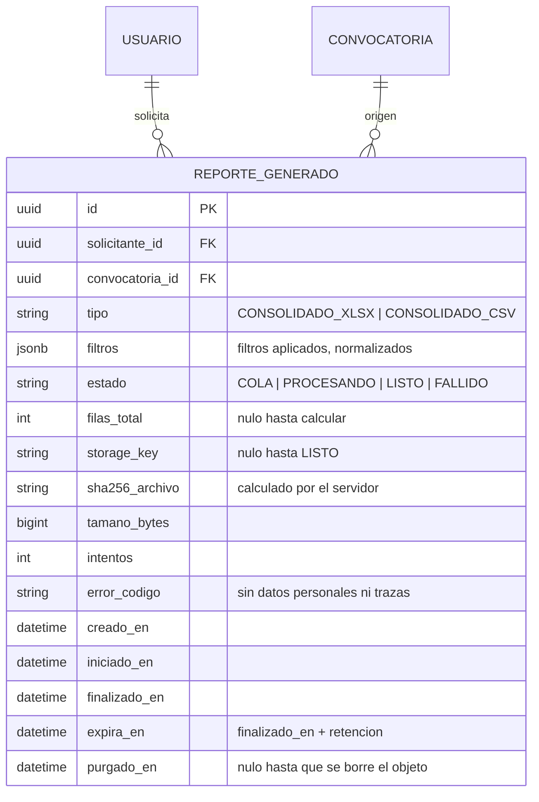
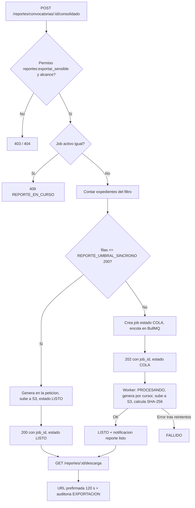

# Módulo: Export Reports — Resumen PDF, Consolidados y Jobs Asíncronos

**Fase:** P3 – Reportes

## Objetivo
Ser el **único mecanismo de exportación** de la plataforma: genera el resumen ejecutivo en PDF de una postulación (`resumen.pdf`) y los consolidados por convocatoria en XLSX/CSV, mediante **jobs asíncronos** con estado, descarga por URL prefirmada de corta vida, auditoría `EXPORTACION`, notificación de "reporte listo" y purga del archivo generado. Los dashboards no exportan por su cuenta.

Quedan fuera de este módulo: los formatos GE-F041 y GE-F043 (`formatos_oficiales.md`) y el certificado GE-F038 (`labor_social.md`).

## Archivos del Módulo

### Backend
- `apps/api/src/modules/export_reports/reportes.model.ts` — Entidad Prisma/TypeScript: `ReporteGenerado`.
- `apps/api/src/modules/export_reports/reportes.service.ts` — Orquestación: validación de alcance, umbral síncrono/asíncrono, creación del job, emisión de URL prefirmada y auditoría.
- `apps/api/src/modules/export_reports/resumen.service.ts` — Armado de datos y renderizado de `resumen.pdf` con Puppeteer + Handlebars.
- `apps/api/src/modules/export_reports/consolidado.columnas.ts` — Lista blanca y **tipado de columnas** del consolidado (`TEXTO`, `ENTERO`, `DECIMAL`, `MONEDA`, `FECHA`, `TELEFONO`).
- `apps/api/src/modules/export_reports/consolidado.query.ts` — Consulta paginada por cursor de postulaciones de la convocatoria (solo lectura).
- `apps/api/src/modules/export_reports/csv_export.service.ts` — Escritor CSV con sanitización de fórmulas.
- `apps/api/src/modules/export_reports/excel_export.service.ts` — Escritor XLSX en modo streaming con `exceljs` (celdas tipadas).
- `apps/api/src/modules/export_reports/sanitizacion.ts` — Funciones `sanitizarTextoCsv`, `normalizarTelefono` y verificación de que ninguna celda XLSX es fórmula.
- `apps/api/src/modules/export_reports/reportes.worker.ts` — Worker BullMQ (cola `reportes`): transiciones `COLA → PROCESANDO → LISTO | FALLIDO`, reintentos con backoff, subida a S3, notificación.
- `apps/api/src/modules/export_reports/reportes.purga.job.ts` — Job periódico que borra archivos expirados y vigila jobs atascados.
- `apps/api/src/modules/export_reports/reportes.controller.ts` — Handlers Express.
- `apps/api/src/modules/export_reports/reportes.routes.ts` — Rutas bajo `/api/v1/reportes`.
- `apps/api/src/modules/export_reports/plantillas/resumen.hbs` — **Plantilla obligatoria** del resumen. Una prueba de arranque/CI falla si el archivo no existe o no compila.
- `apps/api/src/modules/export_reports/__tests__/export_reports.test.ts` — Pruebas unitarias e integración.
- `packages/shared/src/export_reports/` — Enums (`EstadoReporte`, `FormatoReporte`) y esquemas Zod de filtros.

### Frontend
- `apps/web/src/modules/export_reports/components/ExportarConsolidadoButton.tsx` — Botón (formato XLSX/CSV + filtros) para funcionario y administrador.
- `apps/web/src/modules/export_reports/components/DescargarResumenButton.tsx` — Descarga del `resumen.pdf` en el detalle de una postulación.
- `apps/web/src/modules/export_reports/components/ReporteJobStatus.tsx` — Seguimiento del job (polling suave de `GET /reportes/jobs/:id`) y botón de descarga cuando está `LISTO`.
- `apps/web/src/modules/export_reports/pages/MisReportesPage.tsx` — Historial de reportes solicitados por el usuario, con estado y expiración.
- `apps/web/src/modules/export_reports/services/exportReportsApi.ts` — Cliente HTTP.

## Endpoints Propuestos

| Método | Ruta | Descripción | Auth | Roles |
|---|---|---|:---:|:---:|
| `GET` | `/api/v1/reportes/postulaciones/:id/resumen.pdf` | Resumen ejecutivo del trámite (se genera en la petición, no se almacena) | Sí | `BENEFICIARIO` (propia), `FUNCIONARIO` (asignación propia activa o histórica), `ADMINISTRADOR` |
| `POST` | `/api/v1/reportes/convocatorias/:id/consolidado` | Solicita un consolidado (`{ formato: "XLSX" \| "CSV", filtros? }`). Crea el job; ver umbral | Sí | `FUNCIONARIO` (convocatorias asignadas), `ADMINISTRADOR` |
| `GET` | `/api/v1/reportes/jobs/:id` | Estado del job: `{ id, estado, filas, creado_en, finalizado_en, expira_en, error? }` | Sí | Solicitante del job |
| `GET` | `/api/v1/reportes/:id/descarga` | Entrega `{ url, expira_en }` con **URL prefirmada de 120 s**; audita cada entrega | Sí | Solicitante del job |
| `GET` | `/api/v1/reportes/me` | Lista paginada de los reportes del usuario (paginación estándar) | Sí | `FUNCIONARIO`, `ADMINISTRADOR` |

Reglas de respuesta (DECISIONES §2):
- `POST consolidado` por un `BENEFICIARIO` → `403`. Sin el permiso específico `reportes:exportar_sensible` → `403`.
- Funcionario sobre una convocatoria que no tiene asignada → `404`. Administrador: todas.
- `GET jobs/:id` y `GET :id/descarga` sobre un job de otro usuario → `404`.
- Archivo ya purgado → `410 REPORTE_EXPIRADO`. Job no `LISTO` → `409 REPORTE_NO_LISTO`.
- Ya existe un job activo (`COLA`/`PROCESANDO`) del mismo usuario para la misma convocatoria y formato → `409 REPORTE_EN_CURSO` (con el `job_id` existente en `details`).

## Modelos de Datos

`resumen.pdf` no genera fila en `REPORTE_GENERADO` (no se almacena), pero sí evento de auditoría.

## Flujo del Consolidado

## Casos de Uso Especiales y Reglas

- **Umbral de 200 expedientes** (`CONFIG.REPORTE_UMBRAL_SINCRONO`, por defecto 200): hasta 200 filas se genera dentro de la petición y se responde `200 { job_id, estado: "LISTO" }`; por encima se responde `202 { job_id, estado: "COLA" }`. En ambos casos existe el registro `REPORTE_GENERADO` y la descarga usa el mismo endpoint, de modo que el cliente tiene un único contrato.
- **Jobs asíncronos:**
  - Cola BullMQ `reportes` con 3 intentos y backoff exponencial; el worker lee por cursor (lotes de 500) y escribe en streaming para no cargar todo en memoria.
  - Un job en `PROCESANDO` por más de 15 minutos lo marca `FALLIDO` el job de vigilancia (`error_codigo = TIMEOUT`).
  - `FALLIDO` conserva `error_codigo` genérico (sin datos personales); el detalle técnico va a logs con `request_id`. Los jobs fallidos aparecen como alerta en `admin_dashboard.md`.
- **Notificación "reporte listo":** al pasar a `LISTO` se crea, en la misma transacción, una notificación para el solicitante (cualquier rol) mediante `notificaciones.md` con enlace al job. Si el solicitante sigue en la pantalla, el polling del estado la recoge antes.
- **Descarga por URL prefirmada de corta vida:** el objeto nunca es público. `GET /reportes/:id/descarga` verifica que el solicitante sea el mismo, que el job esté `LISTO` y no purgado, y emite una URL de **120 s** con `Content-Disposition: attachment`. **Cada entrega** de URL se audita.
- **Expiración y purga:** el archivo expira a `CONFIG.REPORTE_RETENCION_HORAS` (por defecto 24 h) desde `finalizado_en`. Un job diario borra el objeto de S3, fija `purgado_en` y deja la fila (para trazabilidad). Después, la descarga responde `410`. El bucket de reportes tiene además una regla de ciclo de vida de respaldo a 7 días.
- **Alcance:** el funcionario solo exporta convocatorias que tiene asignadas en `ASIGNACION_FUNCIONARIO`; el administrador exporta todas. El alcance se verifica al solicitar y se reverifica en el worker (si el funcionario fue desasignado entre tanto, el job termina `FALLIDO` con `error_codigo = SIN_ALCANCE`).
- **Datos sensibles y permiso específico:** el consolidado incluye datos socioeconómicos (SISBEN, estrato), por lo que exige el permiso `reportes:exportar_sensible` (distinto del de consulta de dashboards), y se audita. **Nunca** se incluyen datos de pago completos: solo el campo enmascarado (`ultimos4`) de la cuenta o billetera; el descifrado de datos de pago ocurre solo en `seguimiento_beneficios.md`. Tampoco se exportan hashes de contraseña, tokens, claves de almacenamiento ni observaciones internas con nombre del evaluador.
- **Auditoría `EXPORTACION`** (`auditoria.md`): se registra en la misma transacción con actor, `convocatoria_id`, formato, filtros, `filas_total`, `job_id`, y en la entrega de descarga con `fase = DESCARGA` y `sha256_archivo`. `resumen.pdf` audita con `fase = RESUMEN`.
- **Resumen PDF (`resumen.pdf`):** plantilla `resumen.hbs` (debe existir); contiene identificación del trámite, convocatoria, ciclo, beneficios solicitados con su decisión, línea de estados con fechas y, para el beneficiario, observaciones solo mediante `ObservacionPublica` (firma "Equipo FOEST"); para staff incluye el actor real. Es informativo y no sustituye los formatos oficiales ni constituye acto administrativo. No contiene datos de pago ni SISBEN. Codificación UTF-8 y fuentes incrustadas ($ COP, ñ, tildes).
- **Sanitización contra inyección de fórmulas (formula injection):**
  - Cada columna se declara en `consolidado.columnas.ts` con un tipo. Las columnas **numéricas, de moneda y de fecha se escriben como número/fecha tipados** (no como texto) y por tanto **no se prefijan**: un valor negativo legítimo no se altera.
  - **CSV, columnas de TEXTO:** si el valor, tras quitar espacios iniciales, empieza con `=`, `+`, `-`, `@`, tabulador (`\t`) o retorno de carro (`\r`), se antepone `'`. Se aplica RFC 4180 (comillas dobles escapadas), UTF-8 con BOM y fin de línea CRLF.
  - **Teléfonos:** columna `TELEFONO`, escrita como texto en formato **solo dígitos con prefijo de país y sin `+` inicial** (p. ej. `573001234567`); `normalizarTelefono` elimina `+`, espacios, guiones y paréntesis. Así no se confunden con fórmulas ni se pierde el cero o el prefijo. Si el dato no se puede normalizar a dígitos, se trata como TEXTO y se sanitiza.
  - **XLSX:** todas las celdas de texto se escriben con `exceljs` como **cadena tipada** (`cell.value = string`, tipo `String`, formato `@`); jamás se construye un objeto `{ formula }`, `{ sharedFormula }` ni hipervínculos a partir de datos de usuario. Una prueba abre el XLSX generado y verifica que no existe ningún elemento `<f>` en las hojas.
- **Lista blanca de columnas:** el consolidado exporta solo las columnas definidas en `consolidado.columnas.ts` (identificación, programa, tipo de solicitud, estado, ciclo, beneficios y decisión, montos aprobados, estrato, SISBEN, fechas de envío y dictamen). Añadir columnas exige cambio de código revisado.
- **Único mecanismo:** `dashboard_funcionario.md` y `admin_dashboard.md` no exportan; sus botones "Exportar" llaman a `POST /reportes/convocatorias/:id/consolidado`.

## Dependencias entre Módulos
- **`postulaciones.md`**: datos de postulaciones, ciclos y beneficios (lectura).
- **`convocatorias.md`**: validación de la convocatoria y asignaciones del comité (`ASIGNACION_FUNCIONARIO`).
- **`accounts.md`** y **`roles_permissions.md`**: perfil del beneficiario y permiso `reportes:exportar_sensible`.
- **`seguimiento_beneficios.md`**: montos aprobados (lectura; sin datos de pago completos).
- **`catalogos_configuracion.md`**: `REPORTE_UMBRAL_SINCRONO`, `REPORTE_RETENCION_HORAS`.
- **`auditoria.md`** y **`notificaciones.md`**: eventos `EXPORTACION` y aviso de reporte listo.
- Solo lee; no escribe en tablas de otros módulos (salvo la creación de notificaciones y auditoría por sus servicios).

## Dependencias Externas
- `puppeteer` y `handlebars`: resumen PDF.
- `exceljs`: libros XLSX en streaming.
- `bullmq` + `ioredis`: cola y worker.
- `@aws-sdk/client-s3` y `@aws-sdk/s3-request-presigner`: almacenamiento y URL prefirmada.
- `csv-stringify` (o escritor propio RFC 4180): salida CSV.

## Pruebas de Aceptación
- [ ] `resumen.hbs` existe y compila; la prueba de arranque falla si falta.
- [ ] El `resumen.pdf` de una postulación ajena responde `404` al beneficiario y a un funcionario sin asignación; el propietario lo descarga.
- [ ] El `resumen.pdf` mostrado al beneficiario nunca contiene nombre ni correo del evaluador.
- [ ] `POST consolidado` con 200 expedientes responde `200` con estado `LISTO`; con 201 responde `202` con estado `COLA`.
- [ ] El job pasa por `COLA → PROCESANDO → LISTO`, crea la notificación "reporte listo" y `GET /reportes/jobs/:id` refleja cada estado.
- [ ] Un fallo del worker tras 3 intentos deja el job en `FALLIDO` con `error_codigo` sin datos personales.
- [ ] `GET /reportes/:id/descarga` entrega una URL que expira a los 120 s; cada entrega queda auditada como `EXPORTACION`.
- [ ] Un job de otro usuario responde `404` en `jobs/:id` y en `descarga`.
- [ ] Un archivo pasado `REPORTE_RETENCION_HORAS` es purgado y la descarga responde `410`.
- [ ] Un `FUNCIONARIO` no puede exportar una convocatoria sin asignación (`404`); un `ADMINISTRADOR` sí; un `BENEFICIARIO` recibe `403`; un funcionario sin `reportes:exportar_sensible` recibe `403`.
- [ ] El consolidado no contiene números completos de cuenta o billetera, solo `ultimos4`.
- [ ] En CSV, un nombre de texto `=HYPERLINK(...)` sale como `'=HYPERLINK(...)`; un valor monetario negativo numérico sale sin prefijo; un teléfono sale como `573001234567`.
- [ ] En XLSX, abrir el archivo no ejecuta fórmulas y el XML de las hojas no contiene elementos `<f>`.
- [ ] Una segunda solicitud idéntica con un job activo responde `409 REPORTE_EN_CURSO`.
- [ ] No existe ninguna ruta de exportación en los módulos de dashboard.
