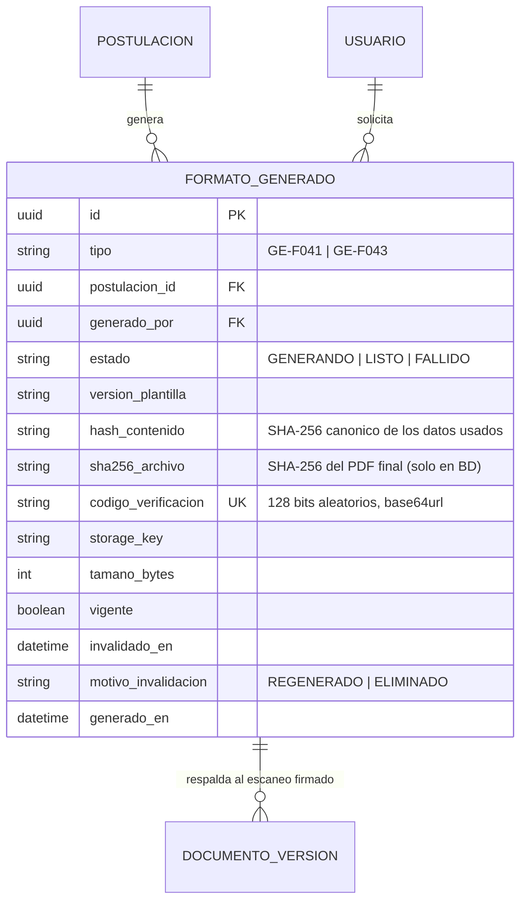

# Módulo: Formatos Oficiales — Generación de GE-F041 y GE-F043 y Verificación Pública

**Fase:** P1

## Objetivo
Generar, **antes del envío**, los dos formatos oficiales de la Alcaldía de Tocancipá que el beneficiario debe firmar a mano: el **Formulario de Solicitud GE-F041** (prellenado con los datos de la postulación en borrador o enviada) y el **Pagaré con Carta de Instrucciones GE-F043** (pagaré en blanco). Cada generación queda registrada con un `hash_contenido` de los datos usados, un `codigo_verificacion` aleatorio impreso en QR y el `sha256_archivo` del PDF final, de forma que (a) el sistema detecte cuando un formato firmado quedó desactualizado frente a los datos y (b) cualquier tercero pueda comprobar que un PDF fue emitido por la plataforma, sin exponer datos personales.

Marco normativo: Acuerdo Municipal 023 de 2025; Código de Comercio art. 622 (título valor en blanco completado según instrucciones); Ley 527 de 1999 (mensajes de datos y firmas); Ley 1581 de 2012 (el endpoint público no revela datos personales).

> **Aclaración sobre la Ley 527 de 1999.** El QR y el hash **no constituyen firma digital certificada** (que requiere una entidad de certificación acreditada). Solo acreditan que la plataforma emitió ese archivo y permiten detectar alteraciones. La validez del formato como compromiso del beneficiario proviene de la **firma manuscrita**, y la plataforma opera un flujo híbrido: generar → imprimir y firmar a mano → escanear → cargar como `FORM_INS` / `PAG_CART`.

## Archivos del Módulo

### Backend
- `apps/api/src/modules/formatos_oficiales/formato.service.ts` — Orquestación: validaciones previas, cálculo de `hash_contenido`, invalidación de vigentes, persistencia y entrega de URL de descarga.
- `apps/api/src/modules/formatos_oficiales/hash-contenido.ts` — Serialización canónica (claves ordenadas, sin marcas de tiempo) y SHA-256 por tipo de formato.
- `apps/api/src/modules/formatos_oficiales/render.service.ts` — Handlebars → HTML → PDF con Puppeteer (pool de navegador reutilizado, fuentes incrustadas).
- `apps/api/src/modules/formatos_oficiales/qr.service.ts` — Genera el QR (SVG) del `codigo_verificacion` antes del render.
- `apps/api/src/modules/formatos_oficiales/verificacion.service.ts` — Consulta pública por código.
- `apps/api/src/modules/formatos_oficiales/vigencia.service.ts` — Implementa `FormatosVigenciaPort` de `postulaciones`: compara el `hash_contenido` actual con el de los formatos vinculados.
- `apps/api/src/modules/formatos_oficiales/formato.controller.ts` y `formato.routes.ts` — Rutas autenticadas y ruta pública.
- `apps/api/src/modules/formatos_oficiales/jobs/generar-formato.worker.ts` — Worker BullMQ para generaciones que superen el límite síncrono.
- `apps/api/src/modules/formatos_oficiales/plantillas/GE-F041.hbs` y `GE-F043.hbs` — Plantillas HTML/Handlebars con CSS de impresión y fuentes incrustadas.
- `apps/api/src/modules/formatos_oficiales/plantillas/fonts/` — Fuentes en WOFF2 embebidas en base64 al compilar la plantilla.
- `apps/api/src/modules/formatos_oficiales/__tests__/` — Pruebas unitarias e integración.

### Compartido
- `packages/shared/src/formatos_oficiales/enums.ts` — `TipoFormato` (`GE-F041`, `GE-F043`), `EstadoFormato`.
- `packages/shared/src/formatos_oficiales/formato.schema.ts` — Zod de respuestas.

### Frontend
- `apps/web/src/modules/formatos_oficiales/components/DescargarFormulariosCard.tsx` — Genera y descarga GE-F041 y GE-F043 con instrucciones de firma y carga.
- `apps/web/src/modules/formatos_oficiales/components/FormatoEstadoBadge.tsx` — "Vigente", "Desactualizado, regenerar y firmar de nuevo", "Generando".
- `apps/web/src/modules/formatos_oficiales/pages/VerificarDocumentoPage.tsx` — Página pública `/verificar/:codigo`: muestra el resultado y permite arrastrar el PDF para calcular su SHA-256 **en el navegador** (no se sube el archivo) y compararlo con el registrado.
- `apps/web/src/modules/formatos_oficiales/hooks/useGenerarFormato.ts` — Generación con sondeo si la respuesta es `202`.
- `apps/web/src/modules/formatos_oficiales/services/formatosApi.ts` — Cliente HTTP.

## Endpoints Propuestos

Prefijo `/api/v1`.

| Método | Ruta | Descripción | Auth | Roles Permitidos |
|---|---|---|:---:|:---:|
| `POST` | `/postulaciones/:id/formatos/:tipo/generar` | Genera `GE-F041` o `GE-F043` (`:tipo`). `201` con el formato si fue síncrono; `200` si ya existía uno vigente con el mismo `hash_contenido`; `202` si pasó a cola. Rate limit | Sí | `BENEFICIARIO` (dueño) |
| `GET` | `/postulaciones/:id/formatos` | Formatos de la postulación con `vigente`, `estado` y `desactualizado` (el hash actual difiere del generado) | Sí | `BENEFICIARIO` (dueño), `ADMINISTRADOR` |
| `GET` | `/formatos/:id` | Estado de un formato (sondeo de `GENERANDO`) | Sí | `BENEFICIARIO` (dueño), `ADMINISTRADOR` |
| `GET` | `/formatos/:id/descarga` | `{ url, expira_en }` con URL prefirmada de 300 s. Audita `DESCARGA_FORMATO` | Sí | `BENEFICIARIO` (dueño), `FUNCIONARIO` (con alcance al expediente), `ADMINISTRADOR` |
| `GET` | `/publico/verificar/:codigo` | Verificación pública: `{ valido, tipo, generado_en, sha256 }` sin datos personales. Rate limit por IP | **No** | Público |

Acceso (`DECISIONES.md` §2): postulación o formato ajenos → `404`. El `FUNCIONARIO` accede solo con alcance al expediente (asignación `ACTIVA` o histórica propia, resuelto por `ExpedienteAccessPolicy`); sin alcance → `404`.

### Códigos de error propios
| HTTP | `code` | Cuándo |
|---|---|---|
| `409` | `GENERACION_NO_PERMITIDA` | La postulación no está en `BORRADOR` ni en `EN_CORRECCION` dentro de plazo |
| `422` | `PERFIL_INCOMPLETO` | `perfil_completo = false` |
| `422` | `FORMULARIO_INCOMPLETO` | Para `GE-F041`: el formulario no pasó la validación de campos |
| `422` | `ACUDIENTE_REQUERIDO` | Menor de edad sin datos de acudiente cuando `CONFIG.PAGARE_REQUIERE_CODEUDOR_MENORES` está activo |
| `409` | `GENERACION_EN_CURSO` | Ya hay una generación del mismo tipo para la postulación |
| `429` | `RATE_LIMIT` | Exceso de generaciones |

## Modelos de Datos



Restricciones:
- Índice único parcial `UNIQUE(postulacion_id, tipo) WHERE vigente = true AND estado = 'LISTO'`: a lo sumo un formato vigente por tipo.
- `codigo_verificacion` se genera con CSPRNG (16 bytes, base64url de 22 caracteres); no es derivable ni secuencial.
- `sha256_archivo` y `codigo_verificacion` son inmutables una vez `LISTO`.
- Clave de almacenamiento: `formatos/{postulacion_id}/{formato_id}.pdf` (sin PII).

## Flujo de Generación y Firma

```mermaid
sequenceDiagram
    autonumber
    actor Est as Beneficiario
    participant API as formatos_oficiales
    participant POS as postulaciones (lectura)
    participant PUP as Puppeteer + Handlebars
    participant S3 as Almacenamiento
    participant DB as PostgreSQL

    Est->>API: POST /postulaciones/:id/formatos/GE-F041/generar
    API->>POS: Lee datos efectivos (formulario, perfil)
    API->>API: Valida estado y completitud; calcula hash_contenido
    alt Existe vigente con el mismo hash
        API-->>Est: 200 formato existente
    else Nuevo contenido
        API->>API: codigo_verificacion (128 bits) + QR (SVG)
        API->>PUP: Render HTML a PDF (limite sincrono)
        alt Termina a tiempo
            PUP-->>API: PDF final
            API->>API: sha256_archivo del PDF final
            API->>S3: guarda PDF
            API->>DB: tx: invalida vigente previo, inserta LISTO vigente, audita
            API-->>Est: 201 { formato_id, codigo_verificacion, hash_contenido }
        else Supera el limite
            API->>DB: inserta GENERANDO y encola
            API-->>Est: 202 { formato_id, estado: GENERANDO }
        end
    end
    Est->>API: GET /formatos/:id/descarga
    API-->>Est: URL prefirmada 300 s
    Note over Est: Imprime, firma a mano y escanea
    Est->>API: Carga FORM_INS / PAG_CART con formato_generado_id (modulo documentos)
```

## Casos de Uso Especiales y Reglas

### GE-F041 — Formulario de Solicitud
- Prellenado con las 9 secciones de `postulaciones.md`: datos del perfil (de `perfil_snapshot` si ya fue enviada; del perfil vigente en `BORRADOR`), beneficios, hogar, programa superior (nombre de IES y programa derivados del catálogo SNIES), educación media o desempeño según trámite, matrícula con `valor_matricula_letras` generado por el servidor, ST (solo datos de pago **enmascarados**) y declaraciones con su versión.
- Se genera cuando el formulario supera la validación de campos (`422 FORMULARIO_INCOMPLETO` si no): firmar un formulario incompleto no tiene sentido y produciría hashes inestables.
- La declaración de cada sección se imprime tal cual está en el catálogo `DECLARACION_JURAMENTADA` vigente.

### GE-F043 — Pagaré en blanco y Carta de Instrucciones
- Conforme al art. 622 del Código de Comercio y las directrices del Acuerdo 023 de 2025, solo se prellena la **identificación del deudor** (nombre completo, tipo y número de documento, dirección y teléfono). La **suma, los intereses y la fecha de exigibilidad se imprimen en blanco**; la carta de instrucciones autoriza al Municipio a completarlos en los supuestos allí previstos. La plataforma **no diligencia** el pagaré ni lo ejecuta.
- **Codeudor / acudiente para menores:** el bloque se incluye si `BENEFICIARIO.es_menor` y `CONFIG.PAGARE_REQUIERE_CODEUDOR_MENORES` está activo. Esa política está **pendiente de validación jurídica**; hasta entonces el bloque se imprime con los campos en blanco (no se prellena) para que lo diligencie el codeudor a mano. Si está activo y el menor no tiene datos de acudiente en su perfil, `422 ACUDIENTE_REQUERIDO`.
- Solo requiere `perfil_completo = true`; no depende del formulario.

### `hash_contenido` y vigencia
- Es el SHA-256 de una **serialización canónica** (claves ordenadas, sin fechas de generación ni códigos) de lo que se imprime:
  - `GE-F041`: `{ version_plantilla, tipo_solicitud, convocatoria (anio, semestre), beneficios ordenados, datos_formulario normalizado (datos de pago solo con ultimos4), perfil efectivo, versiones de declaraciones }`.
  - `GE-F043`: `{ version_plantilla, identificación del deudor, bloque de codeudor/acudiente (si aplica) y estado de CONFIG.PAGARE_REQUIERE_CODEUDOR_MENORES }`.
- "Perfil efectivo": en `BORRADOR`, el perfil vigente del beneficiario; en `EN_CORRECCION`, el último `perfil_snapshot` más las `correcciones_perfil` pendientes.
- **Invalidación al regenerar:** al quedar `LISTO` un formato nuevo del mismo tipo, en la misma transacción el anterior pasa a `vigente = false` con `motivo_invalidacion = REGENERADO`. Si el hash coincide con el vigente, no se regenera: se devuelve el existente (evita invalidar un formato ya firmado).
- **Regla `FORMATOS_DESACTUALIZADOS`:** `FormatosVigenciaPort.verificar(postulacionId)` recalcula el `hash_contenido` actual de cada tipo y lo compara con el del formato vinculado a `FORM_INS` y `PAG_CART` (por `formato_generado_id`). Si no coincide, o el formato vinculado no es vigente, `postulaciones` responde `422 FORMATOS_DESACTUALIZADOS` en `/enviar` y `/subsanar` y la validación previa lo reporta. El beneficiario debe regenerar, firmar de nuevo y volver a cargar.
- **Alcance:** la generación solo es posible en `BORRADOR` y en `EN_CORRECCION` dentro de `fecha_limite_subsanacion`. En el resto de estados solo es posible descargar los formatos existentes; no se generan nuevos.

### Verificación pública y firma
- El PDF imprime en el pie el `codigo_verificacion` en texto legible y un QR que apunta a `https://app.<dominio>/verificar/{codigo}`, página que consulta `GET /publico/verificar/:codigo`.
- La respuesta contiene **únicamente** `{ valido, tipo, generado_en, sha256 }`. Un código inexistente devuelve `200` con `{ valido: false }` y tiempos similares, para no revelar existencia. `valido: true` significa "la plataforma emitió un archivo con este código"; no implica que el formato esté vigente ni firmado. Un formato invalidado por regeneración sigue siendo auténtico.
- Quien verifica calcula el SHA-256 de su PDF (la página lo hace en el navegador) y lo compara con `sha256`. Esto solo aplica al **PDF generado por la plataforma**: el escaneo con firma manuscrita es un archivo distinto cuyo hash no coincide, y su vínculo con el formato se establece mediante `formato_generado_id` (y el QR visible en el escaneo).
- **El SHA-256 del archivo final nunca se estampa dentro del propio archivo** (sería circular). Se calcula **después** del render sobre el PDF definitivo, se guarda solo en BD (`sha256_archivo`) y no se hace post-procesamiento del PDF que lo altere.
- El QR contiene únicamente el código aleatorio; no incluye hash, identificadores ni datos personales.

### Render, rendimiento y robustez
- **Tipografía:** plantillas UTF-8 con fuentes incrustadas (WOFF2 en base64) y `@page` A4/Carta para garantizar ñ, tildes, diéresis y el signo `$ COP`. El render no depende de recursos externos (se bloquean las peticiones de red de la página).
- **Generación síncrona con límite:** el controlador espera hasta `CONFIG.FORMATOS_GENERACION_TIMEOUT_MS` (10 000 ms). Si el render lo supera, el trabajo continúa en BullMQ, la respuesta es `202` con estado `GENERANDO` y el frontend sondea `GET /formatos/:id`. Un fallo del render deja el formato en `FALLIDO` (no vigente) sin invalidar el anterior.
- **Concurrencia:** un bloqueo por `(postulacion_id, tipo)` evita generaciones simultáneas (`409 GENERACION_EN_CURSO`). El navegador Chromium se reutiliza (una página por render, cerrada al terminar).
- **Seguridad de plantillas:** Handlebars escapa HTML por defecto; los datos del usuario nunca se interpolan con `{{{ }}}`.
- **Rate limit:** `generar` limitado a 5 por postulación y tipo cada 10 minutos y 20 por usuario por hora; `GET /publico/verificar/:codigo` limitado por IP.
- **Auditoría:** `FORMATO_GENERADO` (tipo, postulación, hash, vigente previo invalidado), `DESCARGA_FORMATO` por cada URL entregada, y `VERIFICACION_FORMATO` (agregado, sin PII) para el endpoint público. Siempre con `auditar(tx, …)` cuando hay transacción.
- **Retención:** los PDF no se purgan antes de `CONFIG.RETENCION_DOCUMENTOS_ANIOS`. Al eliminarse físicamente un `BORRADOR`, sus formatos se eliminan con él.

## Dependencias entre Módulos
- **`postulaciones.md`:** `formatos_oficiales` lee datos efectivos mediante `PostulacionLecturaService` (solo lectura). `postulaciones` consume `FormatosVigenciaPort` en validación, envío y subsanación. La referencia circular se resuelve con inyección del puerto en el arranque, sin importaciones cruzadas directas.
- **`documentos.md`:** `FORM_INS` y `PAG_CART` se vinculan a `formato_generado_id`; documentos valida que el formato sea vigente y del tipo correcto.
- **`accounts.md`:** perfil, `es_menor`, datos de acudiente.
- **`catalogos_configuracion.md`:** catálogo SNIES, `DECLARACION_JURAMENTADA`, `CONFIG` (`PAGARE_REQUIERE_CODEUDOR_MENORES`, tiempos y retención).
- **`asignaciones.md`:** implementa `ExpedienteAccessPolicy` para el acceso del funcionario.
- **`auditoria.md`**, **`notificaciones.md`:** auditoría y alertas de cola/fallos.

## Dependencias Externas
- `puppeteer`: render de HTML a PDF.
- `handlebars`: motor de plantillas.
- `qrcode`: QR en SVG.
- `bullmq` + `ioredis`: cola de generación asíncrona.
- `@aws-sdk/client-s3` y `@aws-sdk/s3-request-presigner`: almacenamiento y URL de descarga.
- `node:crypto`: CSPRNG para el código y SHA-256.

## Pruebas de Aceptación
- [ ] `GE-F041` generado coincide con los datos de la postulación (incluye el valor en letras y ST con datos de pago enmascarados).
- [ ] `GE-F041` con formulario incompleto devuelve `422 FORMULARIO_INCOMPLETO`; con perfil incompleto, `422 PERFIL_INCOMPLETO`.
- [ ] `GE-F043` prellena solo la identificación del deudor; suma, intereses y fecha de exigibilidad quedan en blanco.
- [ ] Con `PAGARE_REQUIERE_CODEUDOR_MENORES` activo y un beneficiario menor, `GE-F043` incluye el bloque de codeudor/acudiente en blanco; inactivo, no lo incluye; activo sin datos de acudiente devuelve `422 ACUDIENTE_REQUERIDO`.
- [ ] Regenerar con datos distintos deja el formato anterior con `vigente = false` y solo uno vigente por tipo.
- [ ] Regenerar sin cambios en los datos devuelve el formato vigente existente (`200`) sin invalidarlo.
- [ ] Cambiar un dato del formulario después de generar `GE-F041` provoca `422 FORMATOS_DESACTUALIZADOS` al enviar, y la validación previa lo reporta.
- [ ] Cambiar un dato de perfil después de generar `GE-F043` provoca `FORMATOS_DESACTUALIZADOS`.
- [ ] Generar en `PENDIENTE`, `EN_EVALUACION` o estados terminales devuelve `409 GENERACION_NO_PERMITIDA`; en `EN_CORRECCION` fuera de plazo también.
- [ ] El PDF contiene el `codigo_verificacion` y un QR que resuelve a la página de verificación; el PDF no contiene su propio SHA-256.
- [ ] `sha256_archivo` en BD coincide con el SHA-256 del PDF descargado.
- [ ] `GET /publico/verificar/:codigo` sin autenticación devuelve únicamente `valido`, `tipo`, `generado_en` y `sha256`; un código inexistente devuelve `{ valido: false }` sin datos.
- [ ] El código de verificación tiene 128 bits aleatorios y no se repite entre generaciones.
- [ ] El endpoint público respeta el rate limit por IP; `generar` respeta el límite por postulación y tipo.
- [ ] Una generación que supera el límite síncrono responde `202` y el formato queda `LISTO` al terminar el worker.
- [ ] Los caracteres ñ, tildes, diéresis y `$` se renderizan correctamente en ambos formatos.
- [ ] Postulación o formato ajenos devuelven `404`; un `FUNCIONARIO` sin alcance recibe `404`; un rol sin permiso, `403`.
- [ ] Cada generación y cada entrega de URL de descarga producen su evento de auditoría.
- [ ] La documentación de la interfaz y la respuesta aclaran que el QR y el hash no sustituyen la firma manuscrita ni equivalen a firma digital certificada.
