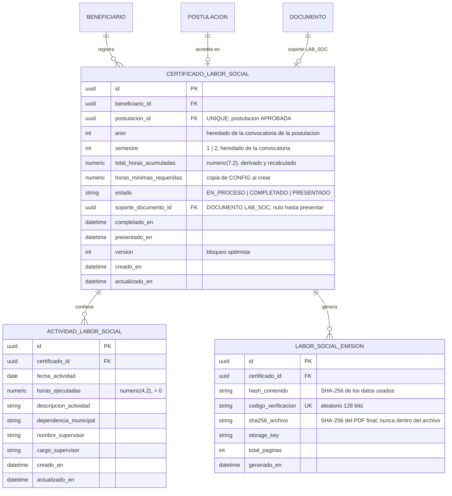
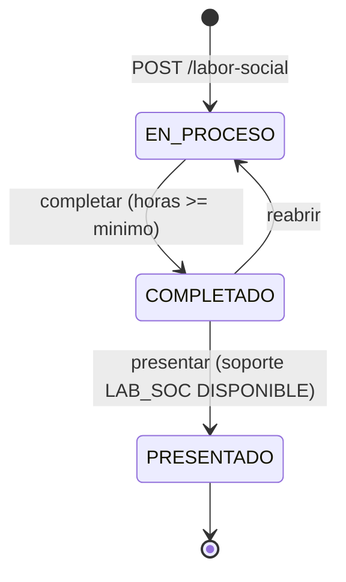

# Módulo: Labor Social — Registro de Horas y Certificado GE-F038

**Fase:** P2 – Evaluación y seguimiento

## Objetivo
Permitir que el beneficiario con apoyo aprobado registre las actividades de labor social que cumple en las dependencias de la Alcaldía de Tocancipá, lleve el acumulado de horas por semestre frente al mínimo exigido y genere el **Certificado de Labor Social (GE-F038)** con el detalle pormenorizado de actividades, listo para la firma física de los secretarios de despacho (Acuerdo Municipal 023 de 2025). El módulo se extrae del antiguo `export_reports` porque es un flujo transaccional del beneficiario (con estados, edición y reglas propias) y no un reporte.

La plataforma **no sustituye la firma**: el estudiante imprime el GE-F038, lo hace firmar físicamente, lo escanea y sube el soporte como documento `LAB_SOC` a `documentos.md`. El módulo solo registra el vínculo con ese soporte y el estado del certificado.

## Archivos del Módulo

### Backend
- `apps/api/src/modules/labor_social/labor_social.model.ts` — Entidades Prisma/TypeScript: `CertificadoLaborSocial`, `ActividadLaborSocial`, `LaborSocialEmision`.
- `apps/api/src/modules/labor_social/labor_social.service.ts` — Creación del certificado, alta/edición/baja de actividades, recálculo de horas en transacción, transiciones de estado (`completar`, `presentar`, `reabrir`) y validaciones.
- `apps/api/src/modules/labor_social/labor_social.pdf.service.ts` — Armado del modelo de datos del GE-F038: paginación (15 filas por página), resumen por dependencia, suma exacta de horas, hash de contenido, `codigo_verificacion` y renderizado con Puppeteer + Handlebars.
- `apps/api/src/modules/labor_social/labor_social.lectura.ts` — Lector de solo lectura (`resumenPorBeneficiario`, `resumenPorPostulacion`) que consume `evaluacion.md` para mostrar horas y estado en el expediente.
- `apps/api/src/modules/labor_social/labor_social.controller.ts` — Handlers Express.
- `apps/api/src/modules/labor_social/labor_social.routes.ts` — Rutas bajo `/api/v1/labor-social`.
- `apps/api/src/modules/labor_social/labor_social.dto.ts` — Esquemas Zod (reexportados desde `packages/shared/src/labor_social/`).
- `apps/api/src/modules/labor_social/plantillas/GE-F038.hbs` y `GE-F038.resumen-dependencias.hbs` — Plantillas oficiales con CSS de impresión.
- `apps/api/src/modules/labor_social/__tests__/labor_social.test.ts` — Pruebas unitarias e integración.
- `packages/shared/src/labor_social/` — Enums (`EstadoLaborSocial`), esquemas Zod y tipos compartidos con el frontend.

### Frontend
- `apps/web/src/modules/labor_social/pages/LaborSocialPage.tsx` — Vista del semestre: acumulado vs mínimo, lista de actividades y acciones.
- `apps/web/src/modules/labor_social/components/ActividadFormModal.tsx` — Alta/edición de actividad (fecha, horas, tarea, dependencia, supervisor, cargo).
- `apps/web/src/modules/labor_social/components/ProgresoHorasCard.tsx` — Barra de progreso de horas (accesible, con texto alternativo).
- `apps/web/src/modules/labor_social/components/CertificadoAcciones.tsx` — Botones "Descargar GE-F038", "Marcar como completado", "Reabrir", "Presentar" con instrucciones de firma física y carga del soporte `LAB_SOC`.
- `apps/web/src/modules/labor_social/services/laborSocialApi.ts` — Cliente HTTP.

## Endpoints Propuestos

| Método | Ruta | Descripción | Auth | Roles |
|---|---|---|:---:|:---:|
| `POST` | `/api/v1/labor-social` | Crea el certificado del semestre para una postulación `APROBADA` propia (`{ postulacion_id }`) | Sí | `BENEFICIARIO` |
| `POST` | `/api/v1/labor-social/:id/actividades` | Agrega una actividad (fecha, horas, descripción, dependencia, supervisor, cargo) | Sí | `BENEFICIARIO` |
| `PATCH` | `/api/v1/labor-social/:id/actividades/:actividadId` | Edita una actividad (solo `EN_PROCESO`) | Sí | `BENEFICIARIO` |
| `DELETE` | `/api/v1/labor-social/:id/actividades/:actividadId` | Elimina una actividad (solo `EN_PROCESO`) | Sí | `BENEFICIARIO` |
| `GET` | `/api/v1/labor-social/me` | Lista los certificados del estudiante con actividades, horas acumuladas y mínimo del semestre | Sí | `BENEFICIARIO` |
| `GET` | `/api/v1/labor-social/:id/certificado.pdf` | Descarga el GE-F038 (borrador con marca de agua si `EN_PROCESO`; definitivo con QR si `COMPLETADO`/`PRESENTADO`) | Sí | `BENEFICIARIO`, `FUNCIONARIO` (con asignación propia sobre la postulación), `ADMINISTRADOR` |
| `PATCH` | `/api/v1/labor-social/:id/completar` | Cierra la edición y valida horas ≥ mínimo (`EN_PROCESO → COMPLETADO`) | Sí | `BENEFICIARIO` |
| `PATCH` | `/api/v1/labor-social/:id/reabrir` | Reabre la edición mientras no esté `PRESENTADO` (`COMPLETADO → EN_PROCESO`) | Sí | `BENEFICIARIO` |
| `PATCH` | `/api/v1/labor-social/:id/presentar` | Marca como presentado vinculando el soporte `LAB_SOC` (`{ documento_id }`) (`COMPLETADO → PRESENTADO`) | Sí | `BENEFICIARIO` |

Respuestas de acceso según DECISIONES §2: rol sin permiso → `403`; certificado ajeno → `404`; edición fuera de `EN_PROCESO` → `409 CERTIFICADO_NO_EDITABLE`; datos inválidos → `422`.

## Modelos de Datos

Notas de modelo:
- `anio` y `semestre` se heredan de la convocatoria de la postulación; `UNIQUE(postulacion_id)` garantiza un certificado por postulación y, por tanto, por semestre.
- Las horas se guardan como `numeric` (no `float`) para que la suma sea exacta; el total del PDF se recalcula desde las filas, no desde el campo denormalizado.
- `horas_minimas_requeridas` es una copia de `CONFIG.LABOR_SOCIAL_HORAS_MINIMAS` al crear el certificado; un cambio posterior de la configuración no altera certificados ya creados.

## Flujo de Estados

`PRESENTADO` es terminal. Solo en `EN_PROCESO` se pueden crear, editar o eliminar actividades.

## Casos de Uso Especiales y Reglas

- **Horas mínimas por semestre:** `CONFIG.LABOR_SOCIAL_HORAS_MINIMAS` (**valor por confirmar** con el Acuerdo 023 y la Alcaldía; puede variar por beneficio). `completar` responde `422 HORAS_INSUFICIENTES` si el total es menor. El estudiante puede generar el borrador del GE-F038 en cualquier momento.
- **Creación:** solo sobre una postulación propia en estado `APROBADA` con al menos un `OTORGAMIENTO` `ACTIVO` o `CUMPLIDO` (lectura de `postulaciones.md` y `seguimiento_beneficios.md`). Ajena → `404`; no aprobada → `409`; certificado ya existente → `409`. Qué beneficios exigen labor social queda como parametrización por confirmar.
- **Validación de actividades:** fecha no futura; `horas_ejecutadas` > 0 y como máximo `CONFIG.LABOR_SOCIAL_HORAS_MAX_DIA` por día sumando todas las actividades de esa fecha (por confirmar); descripción de 10 a 500 caracteres; dependencia y supervisor obligatorios. Cada alta, edición o baja recalcula `total_horas_acumuladas` y `version` en la misma transacción.
- **Edición solo mientras `EN_PROCESO`:** en `COMPLETADO` o `PRESENTADO`, cualquier alta/edición/baja → `409 CERTIFICADO_NO_EDITABLE`. Para corregir un `COMPLETADO` el estudiante usa `reabrir`.
- **Generación del GE-F038 (Puppeteer + Handlebars):**
  - Hasta **15 filas de actividades por página**; si hay más, se generan páginas anexas **numeradas** ("Anexo 1", "Anexo 2"…), con encabezado repetido y subtotal por página.
  - Si las actividades se ejecutaron en **más de 4 dependencias** distintas, el **resumen por dependencia** se imprime en una **hoja adicional**, para preservar el espacio de las firmas originales de los secretarios de despacho.
  - **Suma exacta de horas:** el total impreso es la suma decimal de todas las actividades; la suma de subtotales por página y la suma del resumen por dependencia deben coincidir con él (aserción interna: si no coinciden, la generación falla con `500 CERTIFICADO_INCONSISTENTE` y se alerta).
  - Codificación UTF-8 y fuentes incrustadas para ñ, tildes y diéresis.
  - En `EN_PROCESO` el PDF es un **borrador** con marca de agua "BORRADOR – SIN VALIDEZ", sin QR y sin registro de emisión. En `COMPLETADO`/`PRESENTADO` es definitivo.
- **Verificación de autenticidad (mismo esquema de `formatos_oficiales.md`):** cada emisión definitiva guarda `hash_contenido`, un `codigo_verificacion` aleatorio de 128 bits impreso como **QR** y el `sha256_archivo` del PDF final en `LABOR_SOCIAL_EMISION`; el hash **nunca va dentro del propio archivo**. `GET /publico/verificar/:codigo` (ruta pública de `formatos_oficiales`) devuelve solo `{ valido, tipo: "GE-F038", generado_en, sha256 }`, sin datos personales. Si las actividades cambian después de una emisión (por `reabrir`), las emisiones anteriores siguen siendo verificables como emitidas, pero la presentación exige que el `hash_contenido` actual coincida con el de la última emisión que se firmó (ver siguiente punto).
- **Relación con el documento `LAB_SOC`:** el estudiante descarga el GE-F038 definitivo, lo imprime, lo firma físicamente con los secretarios, lo escanea y lo sube a `documentos.md` como tipo `LAB_SOC` (con el flujo de carga prefirmada, escaneo antivirus y estado `DISPONIBLE`). `presentar` exige `documento_id` de tipo `LAB_SOC`, `DISPONIBLE`, perteneciente al mismo beneficiario y a la misma postulación; si no, `422`. La plataforma solo registra el vínculo y no valida firmas. Ley 527 de 1999: el PDF generado es un mensaje de datos con código de verificación, pero el acto de firma de los funcionarios municipales es físico y externo.
- **Visibilidad para el evaluador:** `evaluacion.md` consume `labor_social.lectura.ts` para mostrar en el expediente, en **solo lectura**, las horas acumuladas, las horas mínimas y el estado del certificado de la postulación previa del beneficiario (relevante en `RENOVACION` y `REINTEGRO`). No se expone el detalle de actividades ni se permite escritura. El funcionario solo accede si tiene la asignación (activa o histórica) sobre el expediente; en otro caso `404`.
- **Auditoría (`auditoria.md`):** `auditar(tx, evento)` en la misma transacción para `LABOR_SOCIAL_CREAR`, `LABOR_SOCIAL_ACTIVIDAD_CREAR|EDITAR|ELIMINAR` (con datos antes/después), `LABOR_SOCIAL_COMPLETAR`, `LABOR_SOCIAL_REABRIR`, `LABOR_SOCIAL_PRESENTAR` y `LABOR_SOCIAL_EMITIR_PDF` (con `codigo_verificacion` y `sha256_archivo`).
- **Notificaciones:** al pasar a `PRESENTADO` se notifica al beneficiario por `notificaciones.md`; no hay recordatorios propios en esta fase.

## Dependencias entre Módulos
- **`accounts.md`**: datos del beneficiario (nombre, documento, programa) para el encabezado del formato.
- **`postulaciones.md`**: estado `APROBADA`, convocatoria (año, semestre) y propiedad de la postulación.
- **`documentos.md`**: almacena el soporte `LAB_SOC` firmado y valida su estado `DISPONIBLE`. Requiere que `documentos.md` permita cargar `LAB_SOC` sobre una postulación `APROBADA` (excepción a la regla de reemplazo solo en `BORRADOR`/`EN_CORRECCION`, que aplica a soportes del expediente de solicitud).
- **`seguimiento_beneficios.md`** (lectura): comprobación de `OTORGAMIENTO` vigente.
- **`catalogos_configuracion.md`**: `LABOR_SOCIAL_HORAS_MINIMAS`, `LABOR_SOCIAL_HORAS_MAX_DIA`.
- **`auditoria.md`** y **`notificaciones.md`**: eventos y avisos.
- **`evaluacion.md`**: consume el lector de solo lectura (dependencia hacia `labor_social`; debe reflejarse en el grafo de §16).
- **`formatos_oficiales.md`**: su resolutor de `/publico/verificar/:codigo` debe reconocer también los códigos de `LABOR_SOCIAL_EMISION`.

## Dependencias Externas
- `puppeteer`: renderizado headless a PDF.
- `handlebars`: plantillas GE-F038.
- `qrcode`: QR con la URL de verificación.
- `pdf-lib`: numeración de anexos y metadatos del PDF.
- `zod`: validación de entradas.
- `@aws-sdk/client-s3`: almacenamiento del PDF emitido.

## Pruebas de Aceptación
- [ ] Crear un certificado sobre una postulación propia `APROBADA` funciona; sobre una ajena responde `404`; sobre una no aprobada responde `409`.
- [ ] Un segundo certificado para la misma postulación responde `409`.
- [ ] Un `FUNCIONARIO` o `ADMINISTRADOR` que intente crear, agregar actividades o presentar recibe `403`.
- [ ] Agregar, editar y eliminar actividades recalcula `total_horas_acumuladas` con suma decimal exacta (p. ej. 0,25 + 0,5 + 7,25 = 8,00).
- [ ] No se aceptan fechas futuras, horas ≤ 0 ni más de `LABOR_SOCIAL_HORAS_MAX_DIA` horas en un mismo día.
- [ ] Editar o eliminar una actividad en `COMPLETADO` o `PRESENTADO` responde `409`.
- [ ] `completar` con horas por debajo de `LABOR_SOCIAL_HORAS_MINIMAS` responde `422`; con horas suficientes pasa a `COMPLETADO`.
- [ ] El GE-F038 con 16 actividades genera 2 hojas de actividades, anexos numerados y sin cortes visuales; el total impreso coincide con la suma de filas.
- [ ] Con actividades en 5 dependencias distintas, el resumen por dependencia sale en hoja adicional; con 4 o menos, no.
- [ ] El PDF en `EN_PROCESO` lleva marca de agua y no crea registro de emisión; el definitivo lleva QR y crea `LABOR_SOCIAL_EMISION`.
- [ ] `GET /publico/verificar/:codigo` con el código del QR devuelve `{ valido, tipo, generado_en, sha256 }` sin datos personales, y el `sha256` coincide con el del archivo descargado.
- [ ] `presentar` sin `documento_id`, con un documento de otro tipo, ajeno o no `DISPONIBLE` responde `422`; con un `LAB_SOC` válido pasa a `PRESENTADO`.
- [ ] El evaluador asignado ve horas y estado en el expediente (vía `evaluacion.md`) solo en lectura; un funcionario sin asignación recibe `404`.
- [ ] Cada operación de escritura genera su evento de auditoría en la misma transacción.
