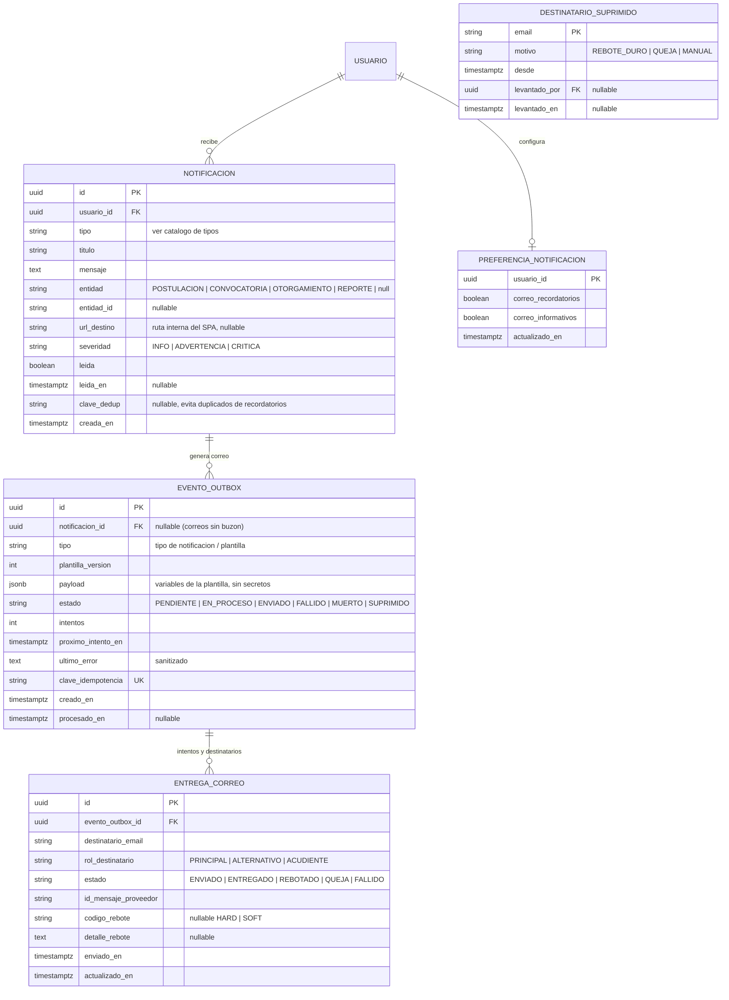
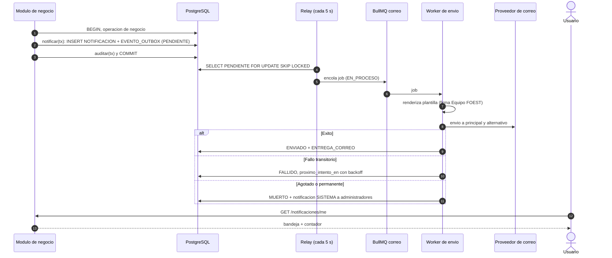

# Módulo: Notificaciones — Buzón in-app, Outbox de Correo y Recordatorios

**Fase:** P0

## Objetivo
Proveer a toda la plataforma un servicio único de comunicación: notificaciones in-app para **cualquier usuario** (beneficiario, funcionario, administrador), correo electrónico mediante **outbox transaccional** con worker BullMQ (reintentos, backoff y estados), plantillas versionadas, envío al correo principal y al correo alternativo/acudiente cuando aplique, jobs de recordatorio programados, preferencias mínimas y registro de entregabilidad con manejo de rebotes. Ningún módulo llama al SMTP directamente: todos invocan `notificar(tx, …)` dentro de su transacción de negocio.

Las comunicaciones hacia beneficiarios van firmadas **"Equipo FOEST"** y nunca incluyen el nombre, correo ni identificador del evaluador.

Es un módulo fundacional: no depende de módulos de negocio. Los datos necesarios para componer un mensaje llegan en el *payload* del evento; los jobs de recordatorio usan consultas de solo lectura a través de interfaces registradas al arranque por cada módulo propietario (patrón `ReminderSource`), sin importar sus servicios.

## Archivos del Módulo

### Backend (`apps/api/src/modules/notificaciones/`)
- `notificacion.service.ts` — Bandeja del usuario: listado, marcado de leída, contador de no leídas, preferencias.
- `notificacion.controller.ts`, `notificacion.routes.ts` — Rutas bajo `/api/v1/notificaciones`.
- `notificacion.dto.ts` — Zod (reexporta desde `packages/shared`).
- `notificacion.jobs.ts` — Jobs programados de recordatorio y limpieza.
- `entregabilidad.service.ts` — Rebotes, quejas y supresión de destinatarios.
- `plantillas/` — Plantillas Handlebars (`.hbs`) por tipo, con versión: `layout.hbs`, `ENVIO_RECIBIDO.hbs`, etc.
- `plantillas/render.ts` — Render con escape HTML, texto plano alterno y verificación de variables obligatorias.
- `__tests__/notificacion.test.ts`, `__tests__/outbox.test.ts`, `__tests__/plantillas.test.ts`.

### Infraestructura transversal
- `apps/api/src/shared/outbox/outbox.ts` — `notificar(tx, input)` y `encolarCorreo(tx, input)`: insertan `NOTIFICACION` y/o `EVENTO_OUTBOX` en la misma transacción.
- `apps/api/src/shared/outbox/outbox.worker.ts` — Relevo (*relay*) del outbox a BullMQ, y consumidor de envío.
- `apps/api/src/shared/mailer/mailer.ts` — Cliente SMTP/Resend (única pieza que habla con el proveedor), adaptador sustituible.
- `apps/api/src/shared/mailer/mailer.mock.ts` — Mock para pruebas y entorno de desarrollo (captura de mensajes).

### Compartido (`packages/shared/src/notificaciones/`)
- `notificacion.enums.ts` (`TipoNotificacion`, `EstadoOutbox`, `CanalNotificacion`), `notificacion.schemas.ts`, `notificacion.types.ts`.

### Frontend (`apps/web/src/modules/notificaciones/`)
- `components/NotificacionesBellDropdown.tsx` — Campana con contador de no leídas (los tres roles).
- `components/NotificacionesPage.tsx` — Bandeja completa paginada con filtros.
- `components/PreferenciasNotificaciones.tsx` — Preferencias mínimas.
- `hooks/useNotificaciones.ts` (React Query con revalidación periódica), `services/notificacionesApi.ts`, `types/notificacion.types.ts`.

## Endpoints Propuestos

Todos bajo `/api/v1`. Un usuario solo ve sus propias notificaciones; un ID ajeno devuelve `404`.

| Método | Ruta | Descripción | Auth | Roles |
|---|---|---|:---:|---|
| `GET` | `/notificaciones/me` | Lista paginada del usuario autenticado, más recientes primero. Filtros `?leida=false`, `?tipo=` | Sí | `ADMINISTRADOR`, `FUNCIONARIO`, `BENEFICIARIO` |
| `GET` | `/notificaciones/me/no-leidas/contador` | `{ no_leidas: n }` para la campana | Sí | los tres roles |
| `PATCH` | `/notificaciones/:id/leida` | Marca una notificación como leída (idempotente) | Sí | los tres roles |
| `PATCH` | `/notificaciones/leer-todas` | Marca todas las del usuario como leídas; devuelve cantidad afectada | Sí | los tres roles |
| `GET` | `/notificaciones/preferencias` | Preferencias del usuario | Sí | los tres roles |
| `PUT` | `/notificaciones/preferencias` | Actualiza preferencias (ver reglas) | Sí | los tres roles |
| `GET` | `/notificaciones/admin/outbox` | Estado del outbox: conteos por estado, eventos `FALLIDO`/`MUERTO` con filtros y paginación | Sí | `ADMINISTRADOR` |
| `POST` | `/notificaciones/admin/outbox/:id/reintentar` | Reencola un evento `MUERTO` o `FALLIDO` | Sí | `ADMINISTRADOR` |
| `GET` | `/notificaciones/admin/entregabilidad` | Resumen de rebotes, quejas y destinatarios suprimidos | Sí | `ADMINISTRADOR` |
| `POST` | `/notificaciones/webhooks/correo` | Webhook del proveedor de correo (rebotes y quejas), autenticado por firma HMAC, no por JWT. **Debe agregarse como excepción a la lista cerrada de rutas públicas** (ver `PENDIENTES.md`); si el proveedor lo permite se prefiere polling del job `SYNC_REBOTES` y se elimina el webhook | Firma | Proveedor |

La creación de notificaciones **no** tiene endpoint: solo se crea desde el servidor mediante `notificar(tx, …)`.

El endpoint de contador existe para los tres roles; la ruta del dashboard beneficiario (`/dashboard/beneficiario/resumen`) puede incluirlo pero la fuente única es esta.

## Modelos de Datos

Restricciones: `NOTIFICACION` índice `(usuario_id, leida, creada_en desc)`; `UNIQUE(usuario_id, clave_dedup)` parcial cuando `clave_dedup` no es nulo; `EVENTO_OUTBOX` índice `(estado, proximo_intento_en)`; `UNIQUE(clave_idempotencia)` evita que un reintento de transacción duplique el correo.

## Outbox transaccional

`notificar(tx, { usuario_id, tipo, payload, entidad?, entidad_id?, correo?: boolean, destinatarios_extra? })` (llamada dentro de la transacción de negocio):

1. Inserta `NOTIFICACION` (buzón in-app) con título y mensaje renderizados desde la plantilla in-app del tipo.
2. Si el tipo envía correo y el usuario no lo ha desactivado (ver preferencias), inserta `EVENTO_OUTBOX` en estado `PENDIENTE` con `clave_idempotencia = tipo + entidad_id + ciclo/destinatario`.
3. Ambos registros confirman o se revierten junto con la operación de negocio. **Nada se envía dentro de la transacción.**

Worker (`outbox.worker.ts`):
- *Relay*: cada 5 s toma lotes `PENDIENTE` con `proximo_intento_en <= now` usando `FOR UPDATE SKIP LOCKED`, los marca `EN_PROCESO` y publica el job en la cola BullMQ `correo`.
- Consumidor: resuelve destinatarios, renderiza la plantilla (HTML + texto), envía por `mailer` y registra `ENTREGA_CORREO` por destinatario.
- **Estados**: `PENDIENTE → EN_PROCESO → ENVIADO`; fallo transitorio → `FALLIDO` con `proximo_intento_en` según backoff y reintento; agotados `CONFIG.NOTIF_REINTENTOS_MAX` (por defecto 8) → `MUERTO` (alerta al Administrador); destinatario suprimido → `SUPRIMIDO`.
- **Backoff exponencial con jitter**: 30 s, 2 min, 10 min, 30 min, 1 h, 3 h, 6 h, 12 h.
- **Recuperación**: un job detecta eventos `EN_PROCESO` por más de 10 minutos (worker caído) y los devuelve a `PENDIENTE`. El envío es *at-least-once*; la idempotencia se apoya en `clave_idempotencia` y en el ID de mensaje del proveedor.
- Errores permanentes del proveedor (dirección inválida, 5xx de destinatario) no se reintentan: pasan directo a `MUERTO` y registran rebote duro.
- Métricas: tamaño de cola, edad del evento más antiguo `PENDIENTE`, tasa de fallos; alerta si la cola está atascada o la tasa de fallo supera el umbral (ver §17).

## Destinatarios

- Beneficiario: correo principal de la cuenta (`USUARIO.email`) **y** correo alternativo/acudiente registrado en el perfil/formulario. Para menores de edad, el acudiente recibe copia de toda notificación de estado de la postulación.
- Funcionarios y administradores: su correo de cuenta.
- Los correos alternativos y de acudiente se resuelven a través de una interfaz `ResolverDestinatarios` registrada por `accounts` al arranque (el módulo no importa `accounts`); si el módulo no está disponible se usa el correo del payload.
- Cada destinatario recibe una `ENTREGA_CORREO` independiente; el fallo de uno no bloquea al otro.
- Un correo alternativo no verificado se usa solo para avisos de estado, nunca para enlaces de verificación o restablecimiento de contraseña (esos van únicamente al correo principal y no pasan por este catálogo de notificaciones de negocio, sino por plantillas de `auth` enviadas con el mismo outbox).

## Catálogo de tipos de notificación

Columnas: destinatario, canal (App/Correo), severidad. Todos los correos a beneficiarios van firmados "Equipo FOEST".

| Tipo | Destinatario | Canales | Severidad | Origen |
|---|---|---|---|---|
| `POSTULACION_ENVIADA` | Beneficiario | App + Correo | INFO | `postulaciones` (envío y cada nuevo ciclo) |
| `POSTULACION_EN_REVISION` | Beneficiario | App + Correo | INFO | `evaluacion` (al tomar el expediente; plantilla neutral, sin datos del evaluador) |
| `CORRECCION_SOLICITADA` | Beneficiario | App + Correo | ADVERTENCIA | `evaluacion` (incluye `fecha_limite_subsanacion`, campos y documentos observados como `ObservacionPublica`) |
| `POSTULACION_APROBADA` | Beneficiario | App + Correo | INFO | `evaluacion` (indica si es parcial) |
| `POSTULACION_RECHAZADA` | Beneficiario | App + Correo | INFO | `evaluacion` (incluye rechazo por vencimiento de subsanación con motivo `VENCIMIENTO_SUBSANACION`) |
| `SUBSANACION_POR_VENCER` | Beneficiario | App + Correo | ADVERTENCIA | Job |
| `RECORDATORIO_BORRADOR` | Beneficiario | App + Correo | INFO | Job |
| `POSTULACION_DESISTIDA` | Beneficiario | App + Correo | INFO | `postulaciones` |
| `CONVOCATORIA_ABIERTA` | Beneficiarios con perfil activo (opcional, según preferencia) | Correo | INFO | `convocatorias` (al habilitar) |
| `CONVOCATORIA_SUSPENDIDA` | Beneficiarios con borrador | App + Correo | ADVERTENCIA | `convocatorias` |
| `CONVOCATORIA_POR_CERRAR` | Administrador y comité | App + Correo | ADVERTENCIA | Job |
| `OTORGAMIENTO_REGISTRADO` | Beneficiario | App + Correo | INFO | `seguimiento_beneficios` |
| `OTORGAMIENTO_SUSPENDIDO` / `OTORGAMIENTO_REVOCADO` | Beneficiario | App + Correo | ADVERTENCIA | `seguimiento_beneficios` |
| `DESEMBOLSO_PAGADO` | Beneficiario | App + Correo | INFO | `seguimiento_beneficios` |
| `LABOR_SOCIAL_REGISTRADA` | Beneficiario | App | INFO | `labor_social` |
| `ASIGNACION_NUEVA` | Funcionario | App | INFO | `asignaciones` (reasignación recibida; interno) |
| `ASIGNACION_REASIGNADA` | Funcionario saliente | App + Correo | INFO | `asignaciones` (expediente reasignado) |
| `ASIGNACION_SIN_MOVIMIENTO` | Funcionario y Administrador | App | ADVERTENCIA | Job |
| `COMITE_CAMBIADO` | Funcionario afectado | App + Correo | INFO | `convocatorias` |
| `ALERTA_SOBRECARGA` | Administrador | App | ADVERTENCIA | Job |
| `REPORTE_LISTO` | Quien lo solicitó | App + Correo | INFO | `export_reports` (enlace interno; descarga por URL prefirmada tras autenticarse) |
| `REPORTE_FALLIDO` | Quien lo solicitó | App | ADVERTENCIA | `export_reports` |
| `INVITACION_FUNCIONARIO` | Funcionario invitado | Correo | INFO | `auth`/`accounts` (enlace de un solo uso, 72 h; sin contraseña) |
| `VERIFICACION_CORREO` | Usuario | Correo | INFO | `auth` |
| `RESTABLECER_CLAVE` | Usuario | Correo | CRITICA | `auth` |
| `BLOQUEO_POR_INTENTOS` | Titular de la cuenta | Correo | CRITICA | `auth` (aviso de bloqueo de 15 min por fuerza bruta) |
| `CAMBIO_CLAVE_CONFIRMACION` | Usuario | Correo | CRITICA | `auth` |
| `CUENTA_DESHABILITADA` | Usuario | Correo | ADVERTENCIA | `accounts` |
| `SISTEMA` | Administrador | App | variable | Infraestructura (cola atascada, rebotes, ruptura de integridad, festivos faltantes, `MUERTO` en outbox) |

Los tipos son una lista cerrada (enum compartido). Los que son de seguridad de cuenta (`VERIFICACION_CORREO`, `RESTABLECER_CLAVE`, `BLOQUEO_POR_INTENTOS`, `CAMBIO_CLAVE_CONFIRMACION`) **no tienen buzón in-app** (solo correo) y no pueden desactivarse.

## Plantillas de correo

- Handlebars con layout institucional común (escudo y datos de contacto de la Alcaldía, aviso de privacidad Ley 1581, enlace al portal). Una plantilla HTML + texto plano por tipo, con `plantilla_version`; el evento guarda la versión usada para reproducibilidad.
- **Firma**: toda comunicación hacia beneficiarios y acudientes se firma **"Equipo FOEST"**. Las plantillas **no tienen variables de actor**: el contexto de renderizado no incluye datos del evaluador (una prueba verifica que el payload y las plantillas no contengan `evaluador`, `funcionario_nombre` ni correos de staff). Las observaciones se incorporan solo desde `ObservacionPublica`.
- Contenido mínimo y sin datos sensibles: no se incluyen número de documento completo, SISBEN, cuentas ni adjuntos. Los correos enlazan al portal; la información detallada se ve autenticado.
- Asuntos con prefijo `[FOEST]`, sin información sensible; todos los textos en lenguaje claro.
- Los enlaces de acción (verificación, restablecimiento, invitación) se construyen con un token de un solo uso cuyo hash vive en el módulo `auth`; el outbox almacena el enlace en el payload cifrado a nivel de campo (AES-256-GCM) y lo borra (`payload` reducido a metadatos) al marcarse `ENVIADO`, para que la tabla no conserve tokens utilizables.
- Escape HTML obligatorio de toda variable; validación de variables requeridas al renderizar (error de plantilla → `MUERTO` con alerta, nunca se envía un correo con campos vacíos).
- Idioma: español (Colombia).

## Jobs programados

Todos con BullMQ repetible o `node-cron`, horarios en `America/Bogota`, idempotentes mediante `clave_dedup`/`clave_idempotencia`.

| Job | Frecuencia | Lógica |
|---|---|---|
| `RECORDATORIO_BORRADOR` | Diario 08:00 | Beneficiarios con postulación en `BORRADOR` de una convocatoria que cierra en ≤ `CONFIG.RECORDATORIO_BORRADOR_DIAS` días (una vez por borrador y convocatoria; reinicia si se amplía el plazo) |
| `SUBSANACION_POR_VENCER` | Diario 08:00 | Postulaciones `EN_CORRECCION` cuya `fecha_limite_subsanacion` esté a ≤ `CONFIG.RECORDATORIO_SUBSANACION_DIAS_HABILES` días hábiles (utilidad `business-days`); un solo aviso por ciclo |
| `CONVOCATORIA_POR_CERRAR` | Diario 08:00 | Lo ejecuta `convocatorias` (ver `convocatorias.md`) usando `notificar`; este módulo solo provee el servicio |
| `ASIGNACION_SIN_MOVIMIENTO` y `ALERTA_SOBRECARGA` | Diario 07:30 | Fuentes de `asignaciones`/`evaluacion` (umbrales en `CONFIG.ALERTA_*`) |
| `SYNC_REBOTES` | Cada 15 min | Consulta al proveedor rebotes y quejas si no hay webhook |
| `RECUPERAR_OUTBOX_ATASCADO` | Cada 5 min | Devuelve a `PENDIENTE` los eventos `EN_PROCESO` > 10 min |
| `LIMPIEZA_NOTIFICACIONES` | Mensual | Elimina notificaciones leídas con más de `CONFIG.RETENCION_NOTIFICACIONES_MESES` y compacta el outbox `ENVIADO` (borra `payload`) |

Los recordatorios con fuentes de datos de otros módulos se implementan con la interfaz `ReminderSource` (cada módulo registra su consulta de solo lectura al arrancar); así `notificaciones` no importa módulos de negocio. Las fuentes se ejecutan en el horario del job y devuelven `{ usuario_id, tipo, payload, clave_dedup }[]`.

## Preferencias mínimas

- `correo_recordatorios` (por defecto `true`): recordatorios de borrador y avisos de convocatoria.
- `correo_informativos` (por defecto `true`): avisos informativos de estado.
- **No desactivables**: correos de seguridad de cuenta, `CORRECCION_SOLICITADA`, `SUBSANACION_POR_VENCER`, resultados (`POSTULACION_APROBADA`/`RECHAZADA`) y avisos de otorgamiento (obligatorios por tener efectos en plazos y derechos; el buzón in-app siempre se genera).
- No hay preferencias por tipo individual en esta versión.

## Entregabilidad y rebotes

- Cada intento registra `ENTREGA_CORREO` con el ID del proveedor. Estados: `ENVIADO` → `ENTREGADO` (si el proveedor confirma) o `REBOTADO` / `QUEJA` / `FALLIDO`.
- **Rebote duro** o queja: el email se agrega a `DESTINATARIO_SUPRIMIDO`; los envíos posteriores quedan `SUPRIMIDO` (no se intenta, no se cuenta como fallo) y se genera `SISTEMA` para el Administrador con el usuario afectado.
- **Rebote blando** (buzón lleno): reintento con backoff; tras el máximo, `MUERTO`.
- Si el rebote afecta el correo principal de un beneficiario, la plataforma muestra un banner "Verifica tu correo" en el portal (in-app) y la notificación sigue disponible en el buzón. Si afecta al alternativo/acudiente, se marca para actualización.
- El Administrador puede levantar la supresión de un email (auditado) tras corrección.
- Los correos de bloqueo por fuerza bruta e invitaciones se envían siempre y su fallo no revela si la cuenta existe (respuestas de `auth` genéricas).

## Flujo de envío

## Casos de Uso Especiales y Reglas de Negocio

- **Aislamiento:** todas las consultas filtran por `usuario_id` del token. Una notificación ajena responde `404` (no `403`).
- **Atomicidad:** la notificación y el evento de correo nacen con la operación de negocio; no existen notificaciones "fantasma" por transacciones revertidas.
- **Idempotencia:** `clave_dedup` evita duplicar recordatorios; `clave_idempotencia` evita duplicar correos al repetir una transacción.
- **Anonimato del evaluador:** los textos in-app y de correo se arman con datos públicos de la postulación; `POSTULACION_EN_REVISION` no revela quién tomó el expediente.
- **Los errores de correo no afectan el negocio:** una caída del proveedor nunca bloquea envíos, dictámenes ni subsanaciones; solo retrasa el correo (el buzón in-app siempre refleja el hecho).
- **Seguridad:** plantillas sin contenido dinámico no escapado; `payload` con enlaces sensibles cifrado y depurado tras el envío; los logs del worker no incluyen cuerpo ni tokens.
- **Auditoría:** el envío ordinario no se audita evento a evento (ya queda en outbox/entrega); se audita con `auditar(tx, …)` el reintento manual de outbox, el levantamiento de supresiones y la edición de preferencias (`ACTUALIZAR`/`NOTIFICACION`).
- **Zona horaria y fechas en texto:** las fechas se formatean en `America/Bogota` ("15 de marzo de 2026, 11:59 p. m.").
- **Contador:** `GET /notificaciones/me/no-leidas/contador` usa índice parcial y caché corto (5 s); es consultado por la campana de los tres roles.
- **Límites:** máximo 100 notificaciones por página; retención definida por `RETENCION_NOTIFICACIONES_MESES`.

## Dependencias entre Módulos
- **`catalogos_configuracion.md`**: `NOTIF_REINTENTOS_MAX`, `RECORDATORIO_BORRADOR_DIAS`, `RECORDATORIO_SUBSANACION_DIAS_HABILES`, `RETENCION_NOTIFICACIONES_MESES`, utilidad `business-days`.
- **`auditoria.md`**: `auditar(tx, …)` en reintentos manuales, supresiones y preferencias.
- **Consumidores:** todos los módulos que notifican (`auth`, `accounts`, `convocatorias`, `postulaciones`, `asignaciones`, `evaluacion`, `labor_social`, `seguimiento_beneficios`, `export_reports`, dashboards) invocan `notificar(tx, …)`; los datos que necesita este módulo de ellos llegan por `payload` o por interfaces registradas (`ResolverDestinatarios`, `ReminderSource`), por lo que **no depende de ningún módulo de negocio** (grafo §16).
- **`roles_permissions.md`**: rutas `/admin/*` restringidas a `ADMINISTRADOR`; el resto exige autenticación.

## Dependencias Externas
- `bullmq` + Redis: cola de correo y jobs repetibles.
- `nodemailer` (SMTP) o SDK de Resend: proveedor tras el adaptador `mailer`.
- `handlebars` y `html-to-text`: plantillas HTML y texto plano.
- `zod`: validación de DTO.
- `date-fns` / `date-fns-tz`: formato de fechas en `America/Bogota`.
- `@prisma/client`: transacciones y `FOR UPDATE SKIP LOCKED` (`$queryRaw`).

## Pruebas de Aceptación
- [ ] Cada usuario (de los tres roles) solo lista y marca sus propias notificaciones; un ID ajeno devuelve `404`.
- [ ] `PATCH /notificaciones/:id/leida` es idempotente y decrementa el contador; `PATCH /notificaciones/leer-todas` lo deja en cero.
- [ ] Sin token, todos los endpoints de `/notificaciones/me` devuelven `401`.
- [ ] Si la transacción de negocio se revierte, no quedan `NOTIFICACION` ni `EVENTO_OUTBOX`.
- [ ] Una caída del proveedor de correo no impide el envío de la postulación ni el dictamen; el evento queda `FALLIDO` y se reintenta con backoff exponencial.
- [ ] Tras agotar `NOTIF_REINTENTOS_MAX` el evento pasa a `MUERTO` y se genera alerta `SISTEMA` al Administrador; `POST /notificaciones/admin/outbox/:id/reintentar` lo reencola.
- [ ] Un evento `EN_PROCESO` por más de 10 minutos vuelve a `PENDIENTE` y no se envía dos veces (idempotencia).
- [ ] Un beneficiario recibe el correo en su dirección principal y en la alternativa/acudiente; si una falla, la otra se entrega.
- [ ] Ningún correo ni notificación hacia el beneficiario contiene nombre, correo o identificador del evaluador; todos están firmados "Equipo FOEST".
- [ ] Renderizar una plantilla con variable obligatoria faltante no envía el correo y marca el evento `MUERTO` con alerta.
- [ ] Los correos de seguridad (verificación, restablecimiento, bloqueo, cambio de clave) se envían aunque el usuario desactive preferencias.
- [ ] El job `RECORDATORIO_BORRADOR` envía un solo aviso por borrador y convocatoria; si se amplía el plazo se puede volver a enviar.
- [ ] El job `SUBSANACION_POR_VENCER` calcula el umbral en días hábiles (omite fines de semana y festivos).
- [ ] Un rebote duro agrega el email a `DESTINATARIO_SUPRIMIDO`; envíos posteriores quedan `SUPRIMIDO` y el Administrador es alertado.
- [ ] El webhook de rebotes rechaza peticiones con firma HMAC inválida.
- [ ] Tras el envío, el `payload` del evento no conserva enlaces con tokens utilizables.
- [ ] `FUNCIONARIO` y `BENEFICIARIO` reciben `403` en `/notificaciones/admin/*`.
