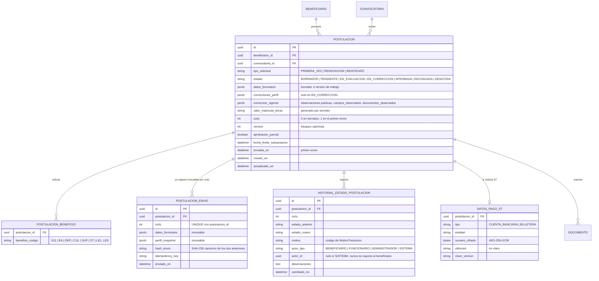
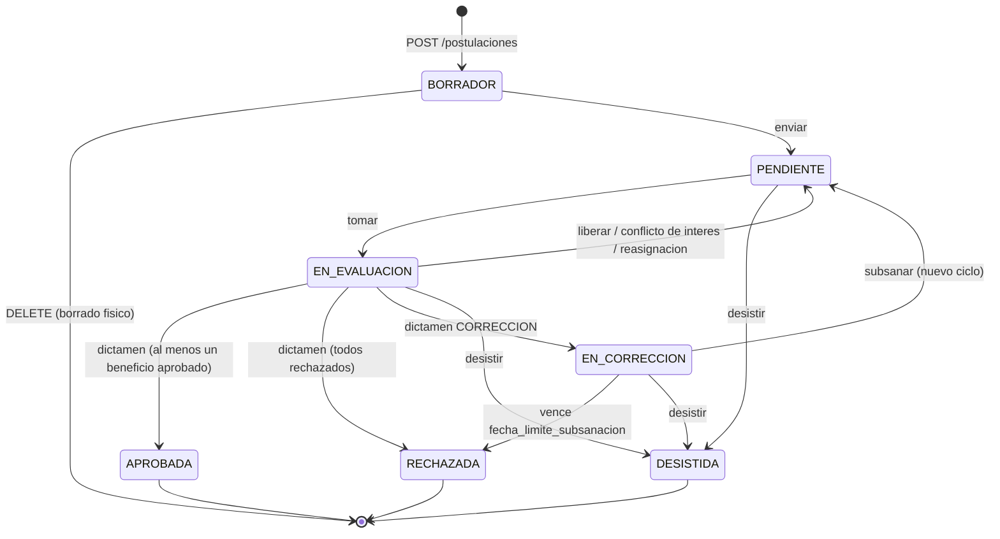
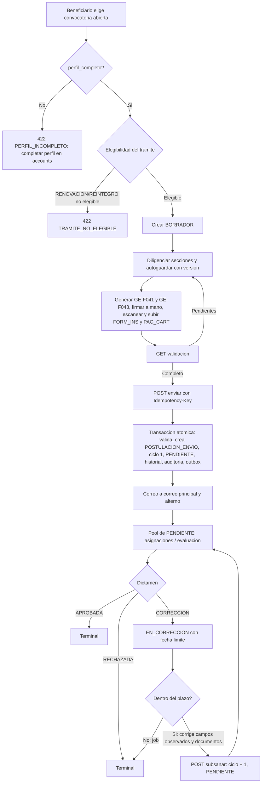

# Módulo: Postulaciones — Ciclo de Vida de la Solicitud

**Fase:** P1

## Objetivo
Gestionar el ciclo de vida de la solicitud al FOEST, estructurada según las 9 secciones del formato municipal **GE-F041**, para los trámites `PRIMERA_VEZ`, `RENOVACION` y `REINTEGRO`. Permite guardado parcial en borrador, validación previa del expediente, envío atómico e idempotente con congelamiento del perfil (`perfil_snapshot`), subsanación por ciclos y desistimiento. Impone que un beneficiario solo puede tener una postulación por convocatoria.

Este módulo es **dueño de la máquina de estados** (`DECISIONES.md` §4): el único punto de cambio de estado es `postulacion.service.transicionar()`, que usan `evaluacion`, `asignaciones` y los jobs del sistema. `postulaciones` nunca importa de `evaluacion` ni de `asignaciones`.

Marco normativo: Ley 1581 de 2012 (datos personales; los datos de pago y el perfil se tratan como sensibles), Acuerdo Municipal 023 de 2025, formatos GE-F041 y GE-F043.

## Archivos del Módulo

### Backend
- `apps/api/src/modules/postulaciones/postulacion.service.ts` — Casos de uso: crear, guardar borrador, eliminar borrador, validar, enviar, subsanar, desistir, listar. Expone `transicionar()`.
- `apps/api/src/modules/postulaciones/postulacion.state-machine.ts` — Tabla de transiciones permitidas (fuente única), guardas y efectos asociados a cada transición.
- `apps/api/src/modules/postulaciones/validacion.service.ts` — Cálculo de la validación previa (`GET /:id/validacion`): campos faltantes, documentos exigibles, formatos vigentes.
- `apps/api/src/modules/postulaciones/postulacion.schema.ts` — Esquemas Zod condicionales por tipo de trámite y beneficios (reutiliza los de `packages/shared`).
- `apps/api/src/modules/postulaciones/postulacion.serializer.ts` — Serializadores explícitos: `PostulacionBeneficiarioDTO`, `PostulacionAdminDTO`, `ObservacionPublica` (sin campos de actor).
- `apps/api/src/modules/postulaciones/postulacion.controller.ts` y `postulacion.routes.ts` — Handlers y rutas bajo `/api/v1/postulaciones`.
- `apps/api/src/modules/postulaciones/postulacion.middleware.ts` — Carga el recurso y aplica la regla de acceso (§2): dueño o `404`.
- `apps/api/src/modules/postulaciones/datos-pago.service.ts` — Cifrado AES-256-GCM a nivel de campo de los datos de pago del ST (usa `apps/api/src/shared/crypto`).
- `apps/api/src/modules/postulaciones/ports/` — Puertos de integración: `ElegibilidadPort` (implementado por `seguimiento_beneficios`), `FormatosVigenciaPort` (implementado por `formatos_oficiales`).
- `apps/api/src/modules/postulaciones/jobs/vencimiento-subsanacion.job.ts` — Job BullMQ que rechaza postulaciones `EN_CORRECCION` con `fecha_limite_subsanacion` vencida.
- `apps/api/src/modules/postulaciones/jobs/recordatorios.job.ts` — Recordatorios de borrador próximo a cierre y subsanación por vencer (vía outbox).
- `apps/api/src/modules/postulaciones/__tests__/` — Pruebas unitarias e integración (Jest + Supertest), incluida la tabla de transiciones.

### Compartido
- `packages/shared/src/postulaciones/enums.ts` — `TipoSolicitud`, `EstadoPostulacion`, `MotivoTransicion`.
- `packages/shared/src/postulaciones/transiciones.ts` — Tabla de transiciones (la consume el backend y el frontend para habilitar botones).
- `packages/shared/src/postulaciones/formulario.schema.ts` — Esquemas Zod de las 9 secciones de `datos_formulario`.

### Frontend
- `apps/web/src/modules/postulaciones/components/FormularioMultiPaso.tsx` — Wizard de las 9 secciones GE-F041.
- `apps/web/src/modules/postulaciones/components/ChecklistValidacion.tsx` — Panel de campos, documentos y formatos pendientes.
- `apps/web/src/modules/postulaciones/components/ConfirmacionEnvioModal.tsx` — Resumen y confirmación explícita previa al envío.
- `apps/web/src/modules/postulaciones/components/SubsanacionForm.tsx` — Edita solo los campos observados y reemplaza documentos observados.
- `apps/web/src/modules/postulaciones/components/DesistirModal.tsx` — Confirmación de desistimiento (acción irreversible).
- `apps/web/src/modules/postulaciones/components/HistorialTimeline.tsx` — Línea de tiempo sin identidad del evaluador.
- `apps/web/src/modules/postulaciones/hooks/usePostulacion.ts` — Autoguardado con control de `version`.
- `apps/web/src/modules/postulaciones/services/postulacionesApi.ts` — Cliente HTTP.
- `apps/web/src/modules/postulaciones/types/postulacion.types.ts` — Tipos de respuesta.

## Endpoints Propuestos

Prefijo `/api/v1`. Todos exigen autenticación. Códigos de acceso según `DECISIONES.md` §2.

| Método | Ruta | Descripción | Roles Permitidos |
|---|---|---|:---:|
| `POST` | `/postulaciones` | Crea el expediente en `BORRADOR` `{ convocatoria_id, tipo_solicitud, beneficios[] }`. Exige convocatoria abierta, `perfil_completo = true` (si no, `422 PERFIL_INCOMPLETO`) y elegibilidad del trámite. Duplicado: `409 POSTULACION_DUPLICADA` | `BENEFICIARIO` |
| `PUT` | `/postulaciones/:id` | Guardado parcial `{ version, datos_formulario?, beneficios?, perfil_correcciones?, datos_pago? }`. En `BORRADOR` edita todo; en `EN_CORRECCION` solo lo listado en `campos_observados` | `BENEFICIARIO` |
| `DELETE` | `/postulaciones/:id` | Borrado físico de un `BORRADOR` (sin efectos legales; elimina documentos y formatos). Otro estado: `409` | `BENEFICIARIO` |
| `GET` | `/postulaciones/me` | Lista las postulaciones propias (paginada) | `BENEFICIARIO` |
| `GET` | `/postulaciones` | Listado administrativo, solo lectura, filtros `convocatoria_id`, `estado`, `tipo_solicitud`, `q` (texto); paginado y auditado | `ADMINISTRADOR` |
| `GET` | `/postulaciones/:id` | Detalle del expediente. Beneficiario: el propio (sin actor de evaluación). Administrador: lectura completa, genera `LECTURA_SENSIBLE` | `BENEFICIARIO`, `ADMINISTRADOR` |
| `GET` | `/postulaciones/:id/validacion` | Validación previa: campos, documentos y formatos pendientes | `BENEFICIARIO` |
| `POST` | `/postulaciones/:id/enviar` | Envío atómico e idempotente `{ version, confirmar: true }` con header `Idempotency-Key`. `BORRADOR → PENDIENTE` | `BENEFICIARIO` |
| `POST` | `/postulaciones/:id/subsanar` | Reenvío de correcciones `{ version, confirmar: true }`. `EN_CORRECCION → PENDIENTE` (nuevo ciclo) | `BENEFICIARIO` |
| `POST` | `/postulaciones/:id/desistir` | Desistimiento `{ version, motivo? }`. Desde `PENDIENTE`, `EN_EVALUACION` o `EN_CORRECCION` hacia `DESISTIDA` | `BENEFICIARIO` |
| `GET` | `/postulaciones/:id/historial` | Historial de transiciones. Beneficiario: sin actor. Administrador: con actor | `BENEFICIARIO`, `ADMINISTRADOR` |

Notas de acceso:
- El expediente completo para el funcionario **no** se sirve desde este módulo: lo abre `asignaciones`/`evaluacion` sobre una asignación `ACTIVA` o histórica propia (`DECISIONES.md` §8). Un `FUNCIONARIO` que llame a `/postulaciones/:id` recibe `403` (el rol no tiene el permiso).
- Beneficiario sobre postulación ajena: `404`. Administrador sobre el listado: `200` solo lectura; no puede modificar desde estos endpoints.

### Códigos de error propios
| HTTP | `code` | Cuándo |
|---|---|---|
| `409` | `POSTULACION_DUPLICADA` | Ya existe `(beneficiario, convocatoria)` |
| `409` | `VERSION_CONFLICTO` | `version` enviada distinta de la actual |
| `409` | `TRANSICION_INVALIDA` | La transición no está en la tabla o el estado es terminal |
| `409` | `PLAZO_SUBSANACION_VENCIDO` | `subsanar` o edición pasada `fecha_limite_subsanacion` |
| `422` | `PERFIL_INCOMPLETO` | `BENEFICIARIO.perfil_completo = false` al crear (y al enviar) |
| `422` | `CONVOCATORIA_CERRADA` | Convocatoria no abierta al crear, guardar borrador o enviar |
| `422` | `TRAMITE_NO_ELEGIBLE` | `seguimiento_beneficios` rechaza `RENOVACION` o `REINTEGRO` |
| `422` | `EXPEDIENTE_INCOMPLETO` | Faltan campos o documentos (con `details`) |
| `422` | `FORMATOS_DESACTUALIZADOS` | Hash de formatos vinculados distinto del actual (ver `formatos_oficiales.md`) |
| `422` | `CAMPO_NO_EDITABLE` | En `EN_CORRECCION` se intenta modificar un campo no observado |

## Modelos de Datos



Restricciones clave:
- `UNIQUE(beneficiario_id, convocatoria_id)` en `POSTULACION`. Consecuencia: quien desiste no puede abrir otra postulación en la misma convocatoria.
- `UNIQUE(postulacion_id, ciclo)` en `POSTULACION_ENVIO`. Un **trigger de BD** rechaza `UPDATE` y `DELETE` sobre esta tabla (inmutabilidad probatoria).
- Un **trigger de BD** rechaza cualquier cambio de `estado` cuando el estado actual es `APROBADA`, `RECHAZADA` o `DESISTIDA`.
- Perfil y estrato/SISBEN viven **solo** en `BENEFICIARIO`; llegan al expediente únicamente dentro de `perfil_snapshot`. No existe columna `perfil_snapshot` en `POSTULACION`: el vigente es el del último `POSTULACION_ENVIO`.

## Máquina de Estados

Estados: `BORRADOR`, `PENDIENTE`, `EN_EVALUACION`, `EN_CORRECCION`, `APROBADA`, `RECHAZADA`, `DESISTIDA`. Terminales: `APROBADA`, `RECHAZADA`, `DESISTIDA`.



### Tabla de transiciones (fuente única; `postulacion.state-machine.ts`)

| Desde | Hacia | Disparador | Actor | Motivo registrado |
|---|---|---|---|---|
| (nuevo) | `BORRADOR` | `POST /postulaciones` | Beneficiario | `CREACION` |
| `BORRADOR` | (eliminado) | `DELETE /postulaciones/:id` | Beneficiario | no aplica (se audita `POSTULACION_BORRADOR_ELIMINADO`) |
| `BORRADOR` | `PENDIENTE` | `POST /postulaciones/:id/enviar` | Beneficiario | `ENVIO` |
| `PENDIENTE` | `EN_EVALUACION` | `POST /evaluacion/postulaciones/:id/tomar` | Funcionario | `TOMA` |
| `EN_EVALUACION` | `PENDIENTE` | liberar / conflicto de interés / reasignación | Funcionario / Administrador | `LIBERACION`, `CONFLICTO_INTERES`, `REASIGNACION` |
| `EN_EVALUACION` | `APROBADA` | `POST …/dictamen` con ≥ 1 beneficio aprobado | Funcionario | `DICTAMEN_APROBADO` |
| `EN_EVALUACION` | `RECHAZADA` | `POST …/dictamen` con todos rechazados | Funcionario | `DICTAMEN_RECHAZADO` |
| `EN_EVALUACION` | `EN_CORRECCION` | `POST …/dictamen` resultado `CORRECCION` | Funcionario | `DICTAMEN_CORRECCION` |
| `EN_CORRECCION` | `PENDIENTE` | `POST /postulaciones/:id/subsanar` | Beneficiario | `SUBSANACION` |
| `EN_CORRECCION` | `RECHAZADA` | Vence `fecha_limite_subsanacion` (job) | Sistema | `VENCIMIENTO_SUBSANACION` |
| `PENDIENTE` / `EN_EVALUACION` / `EN_CORRECCION` | `DESISTIDA` | `POST /postulaciones/:id/desistir` | Beneficiario | `DESISTIMIENTO` |

Reglas:
- Cualquier par no listado produce `409 TRANSICION_INVALIDA`. Desde `APROBADA`, `RECHAZADA` o `DESISTIDA` no sale ninguna transición (servicio + trigger).
- **`RECHAZADA` es terminal y no subsanable.** Lo subsanable solo existe a través de `EN_CORRECCION`.
- **Subsanar** solo es válido desde `EN_CORRECCION` y mientras `now <= fecha_limite_subsanacion`. Si el plazo venció pero el job aún no corrió, `subsanar` responde `409 PLAZO_SUBSANACION_VENCIDO` (la verificación en el servicio no depende del job). La subsanación es independiente de que la convocatoria siga abierta.
- **Vencimiento por job:** `vencimiento-subsanacion.job.ts` corre cada 15 minutos, busca `EN_CORRECCION` con `fecha_limite_subsanacion < now` y llama a `transicionar(... RECHAZADA, motivo VENCIMIENTO_SUBSANACION, actor SISTEMA)`.
- **Aprobación parcial:** el dictamen es por beneficio (`REVISION_BENEFICIO`, módulo `evaluacion`). `APROBADA` con `aprobacion_parcial = true` si algún beneficio fue rechazado.
- **Desistir** cancela la asignación `ACTIVA` si existe (a través del evento que `asignaciones` consume; ver Dependencias) y no puede deshacerse.

### `postulacion.service.transicionar()` — único punto de cambio de estado

```ts
transicionar(tx, {
  postulacionId, hacia, versionEsperada, motivo,
  actor: { tipo, id? },            // SISTEMA no lleva id
  observaciones?,                   // texto interno
  payload?: {                       // según destino
    fechaLimiteSubsanacion?, correccionVigente?, aprobacionParcial?
  }
}): Postulacion
```

Responsabilidades, siempre dentro de la transacción recibida:
1. `SELECT … FOR UPDATE` de la fila y comparación de `version` (`409 VERSION_CONFLICTO` si difiere).
2. Validación contra la tabla de transiciones (`409 TRANSICION_INVALIDA`).
3. Efectos propios del destino: `EN_CORRECCION` fija `fecha_limite_subsanacion` y `correccion_vigente`; `PENDIENTE` por subsanación incrementa `ciclo`; `RECHAZADA/APROBADA` fijan `decidida_en` en el historial.
4. Incremento de `version`, escritura de `HISTORIAL_ESTADO_POSTULACION` y `auditar(tx, …)`.
5. Inserción de `EVENTO_OUTBOX` cuando la transición notifica al beneficiario (ver Notificaciones).

`evaluacion`, `asignaciones` y los jobs **no** actualizan `POSTULACION.estado` por otra vía.

## Estructura del Formulario GE-F041 (`datos_formulario`)

Esquema Zod único en `packages/shared/src/postulaciones/formulario.schema.ts`, usado por API y web.

1. **Identificación del solicitante (solo lectura):** nombre, documento, expedición, fecha de nacimiento, dirección, sector, estrato, grupo SISBEN IV y los dos correos. No se captura aquí: se toma de `BENEFICIARIO` y se congela en `perfil_snapshot` al enviar. Estrato y SISBEN **solo** residen en `BENEFICIARIO`.
2. **Selección de beneficios:** códigos del catálogo (`S11`, `EA`, `DEP`, `CUL`, `SUP`, `ST`, `LE1`..`LE6`) que además estén en `CONVOCATORIA_BENEFICIO` de la convocatoria. Se guardan en `POSTULACION_BENEFICIO`.
3. **Hogar y situación personal (sin perfil):** personas a cargo, situación laboral y contacto de emergencia. No contiene estrato ni SISBEN.
4. **Programa superior:** código SNIES **validado contra el catálogo** (`catalogos_configuracion.md`; nombre de IES y programa se derivan del catálogo, no se aceptan libres), semestre que ingresa o cursa y modalidad.
5. **Educación media (solo `PRIMERA_VEZ`):** colegio de Tocancipá, año de graduación y registro Saber 11 / ICFES.
6. **Desempeño académico (solo `RENOVACION` y `REINTEGRO`):** promedio del semestre anterior, promedio acumulado, créditos o materias cursadas, aprobadas y perdidas.
7. **Matrícula:** valor numérico de la matrícula ordinaria (COP, entero positivo). El servidor genera `valor_matricula_letras` con `numero-a-letras` en cada guardado que cambie el valor; el cliente nunca lo envía.
8. **Subsidio de transporte (solo si se seleccionó `ST`):** días de asistencia semanal, municipio destino y datos de pago. Los datos de pago se guardan en `DATOS_PAGO_ST` con **cifrado a nivel de campo** (AES-256-GCM, clave por entorno/KMS, `clave_version`) y `ultimos4` en claro. En `datos_formulario` y en las respuestas solo aparece el valor enmascarado (`•••• 1234`). Evaluadores ven solo el enmascarado; el descifrado completo ocurre únicamente en `seguimiento_beneficios` para desembolsos, con auditoría.
9. **Declaraciones juramentadas:** las **6 declaraciones** provienen del catálogo versionado `DECLARACION_JURAMENTADA` (`catalogos_configuracion.md`). Se guarda `[{ codigo, version, aceptada }]`. Al enviar deben estar las 6 aceptadas **en la versión vigente** del catálogo.

## Flujo de Usuario Crítico



## Casos de Uso Especiales y Reglas de Negocio

- **Postulación única:** `UNIQUE(beneficiario_id, convocatoria_id)`; el segundo intento devuelve `409 POSTULACION_DUPLICADA`. La carrera de dos creaciones simultáneas se resuelve por la restricción de BD.
- **Perfil completo obligatorio:** al crear (y revalidado al enviar) se exige `BENEFICIARIO.perfil_completo = true`; de lo contrario `422 PERFIL_INCOMPLETO` con la lista de campos faltantes. Para menores de edad (`es_menor` derivado de `fecha_nacimiento`) incluye datos de acudiente.
- **Elegibilidad por trámite:** para `RENOVACION` y `REINTEGRO`, `postulaciones` llama a `ElegibilidadPort.validar(beneficiarioId, convocatoriaId, tipoSolicitud)`, implementado por `seguimiento_beneficios`. No decide la regla; solo propaga `422 TRAMITE_NO_ELEGIBLE` con el motivo. En P1, mientras `seguimiento_beneficios` (P2) no existe, el puerto tiene una implementación provisional configurable.
- **Edición del borrador:** solo con la convocatoria abierta; fuera de ella `422 CONVOCATORIA_CERRADA`. Cada `PUT` exige `version` y la incrementa; el cliente que envíe una versión vieja recibe `409 VERSION_CONFLICTO` y debe recargar. Las secciones 5 y 6 se validan según el tipo de trámite y la 8 según se haya elegido `ST`.
- **Eliminar borrador:** `DELETE` físico solo en `BORRADOR`. Elimina la fila, `POSTULACION_BENEFICIO`, `DATOS_PAGO_ST`, documentos y formatos asociados (los objetos de S3 se borran por una cola de limpieza posterior al commit). En cualquier otro estado devuelve `409`. Se audita como `POSTULACION_BORRADOR_ELIMINADO`.
- **Validación previa (`GET /:id/validacion`):** devuelve `{ completo, campos_faltantes[], documentos: [{ tipo, obligatorio, estado }], formatos: [{ tipo, vigente, desactualizado }], errores[] }`. Evalúa: formulario según el trámite, perfil completo, documentos exigibles según la matriz `REQUISITO_DOCUMENTO` (en estado `DISPONIBLE`), declaraciones vigentes y **formatos vigentes** (si el `hash_contenido` actual difiere del de `FORM_INS`/`PAG_CART`, se reporta `FORMATOS_DESACTUALIZADOS`).
- **Envío atómico e idempotente (`POST /:id/enviar`):** en una sola transacción PostgreSQL valida, en este orden: (1) convocatoria abierta, (2) `confirmar = true` y `version`, (3) perfil completo, (4) formulario completo, (5) documentos obligatorios según la matriz en estado `DISPONIBLE`, (6) hash de formatos vigente → `422 FORMATOS_DESACTUALIZADOS`. Si todo pasa: construye el `perfil_snapshot` desde `BENEFICIARIO`, inserta `POSTULACION_ENVIO` (ciclo 1) con `datos_formulario`, `perfil_snapshot`, `hash_envio` e `idempotency_key`, llama a `transicionar(BORRADOR → PENDIENTE)`, escribe auditoría y encola el outbox. Si llega un segundo `enviar` con el mismo `Idempotency-Key` ya aplicado, devuelve `200` con el mismo resultado; con otra llave, `409 TRANSICION_INVALIDA`. Las pestañas concurrentes se serializan por el `FOR UPDATE` y `version`.
- **Inmutabilidad probatoria:** `POSTULACION_ENVIO` es inmutable por ciclo. Cambios posteriores al perfil en `accounts` no alteran ningún envío ya hecho.
- **Subsanación:** al emitir `CORRECCION`, `evaluacion` entrega `campos_observados`, `documentos_observados` y observaciones; `transicionar` guarda esto en `correccion_vigente` y fija `fecha_limite_subsanacion` (días hábiles, `CONFIG.SUBSANACION_DIAS_HABILES`). En `EN_CORRECCION`:
  - `PUT` solo acepta rutas de campo listadas en `campos_observados`; cualquier otra devuelve `422 CAMPO_NO_EDITABLE`. Si un campo observado es de perfil, se envía en `perfil_correcciones` (se guarda en `correcciones_perfil`).
  - Los beneficios solicitados no son editables en subsanación.
  - Documentos: reemplazo y eliminación permitidos solo en este estado y dentro del plazo (`documentos.md`).
  - `POST /:id/subsanar` revalida lo mismo que el envío (formulario, documentos, formatos), aplica las correcciones de perfil a `BENEFICIARIO` mediante el servicio de `accounts`, y **genera un nuevo `perfil_snapshot` solo si se corrigió algún campo de perfil**; si no, reutiliza el del ciclo anterior. Inserta un nuevo `POSTULACION_ENVIO` (`ciclo + 1`) y transiciona a `PENDIENTE`. Los snapshots anteriores quedan intactos.
- **Desistir:** desde `PENDIENTE`, `EN_EVALUACION` o `EN_CORRECCION`. Si hay asignación `ACTIVA`, `asignaciones` la libera al recibir el evento interno `POSTULACION_DESISTIDA`. Es terminal.
- **Anonimato del evaluador:** toda respuesta al beneficiario (detalle, historial, observaciones) se construye con serializadores explícitos; `ObservacionPublica` no contiene ningún campo de actor. El historial para el beneficiario omite `actor_id` y `actor_tipo` de funcionarios y muestra la entidad como "Equipo FOEST". El correo usa plantilla fija. El actor real se conserva internamente y en auditoría.
- **Listado administrativo:** `GET /postulaciones` es solo lectura, con filtros `convocatoria_id`, `estado`, `tipo_solicitud` y `q` (busca por nombre o documento del beneficiario), paginación estándar. Cada consulta genera auditoría (`LISTADO_POSTULACIONES`) y la apertura de un detalle genera `LECTURA_SENSIBLE`. No expone datos de pago.
- **Notificaciones (outbox, `notificaciones.md`):** `POSTULACION_ENVIADA` (confirmación con número de ciclo), `POSTULACION_EN_CORRECCION` (con plazo), `POSTULACION_SUBSANADA`, `POSTULACION_APROBADA`/`POSTULACION_RECHAZADA` (incluye el motivo `VENCIMIENTO_SUBSANACION` cuando aplica), `POSTULACION_DESISTIDA`. Se envían al correo principal y al alterno o acudiente. Recordatorios por job: borrador próximo a cierre y subsanación por vencer.
- **Auditoría:** `auditar(tx, …)` en: creación, edición de campos observados, eliminación de borrador, envío, subsanación, desistimiento, toda transición y las lecturas sensibles del administrador.

## Dependencias entre Módulos
- **`convocatorias.md`:** estado abierto, beneficios ofertados (`CONVOCATORIA_BENEFICIO`) y fechas.
- **`accounts.md`:** perfil, `perfil_completo`, `es_menor`, acudiente; aplicación de correcciones de perfil.
- **`documentos.md`:** matriz `REQUISITO_DOCUMENTO`, documentos `DISPONIBLES`; purga de documentos al eliminar un borrador.
- **`formatos_oficiales.md`:** vigencia de formatos (`FormatosVigenciaPort`); eliminación de formatos al borrar un borrador. `formatos_oficiales` a su vez lee datos de la postulación; la dependencia circular se rompe con el puerto inyectado al arrancar y un servicio de solo lectura (`PostulacionLecturaService`).
- **`seguimiento_beneficios.md`:** elegibilidad de `RENOVACION` y `REINTEGRO` (`ElegibilidadPort`).
- **`catalogos_configuracion.md`:** catálogo SNIES, `DECLARACION_JURAMENTADA`, `BENEFICIO`, `CONFIG`, `FESTIVO`.
- **`notificaciones.md`**, **`auditoria.md`:** outbox y auditoría.
- **Consumidores:** `asignaciones.md` y `evaluacion.md` invocan `transicionar()`; `postulaciones` no importa de ellos.

## Dependencias Externas
- `zod`: validación condicional por trámite y beneficios.
- `numero-a-letras`: texto legal del valor de matrícula.
- `bullmq` + `ioredis`: jobs de vencimiento y recordatorios.
- `node:crypto`: AES-256-GCM (vía `shared/crypto`) y SHA-256 canónico de `hash_envio`.

## Pruebas de Aceptación
- [ ] Crear una postulación con `perfil_completo = false` devuelve `422 PERFIL_INCOMPLETO`.
- [ ] Crear una segunda postulación para la misma convocatoria devuelve `409 POSTULACION_DUPLICADA`, también ante dos peticiones simultáneas.
- [ ] Crear con la convocatoria cerrada devuelve `422 CONVOCATORIA_CERRADA`.
- [ ] `RENOVACION` o `REINTEGRO` sin elegibilidad en `seguimiento_beneficios` devuelve `422 TRAMITE_NO_ELEGIBLE`.
- [ ] Un `PUT` con `version` desactualizada devuelve `409 VERSION_CONFLICTO` y no sobrescribe.
- [ ] `PRIMERA_VEZ` exige sección 5 y `RENOVACION`/`REINTEGRO` exige sección 6; con `ST` la sección 8 es obligatoria.
- [ ] Un código SNIES inexistente en el catálogo devuelve `422`.
- [ ] El valor de matrícula en letras lo genera el servidor; un valor enviado por el cliente se ignora.
- [ ] Los datos de pago del ST se almacenan cifrados y las respuestas solo muestran `ultimos4` enmascarado.
- [ ] La sección 3 no acepta ni devuelve estrato ni SISBEN; esos datos aparecen solo en `perfil_snapshot`.
- [ ] `GET /:id/validacion` lista campos faltantes, documentos obligatorios no `DISPONIBLES` y `FORMATOS_DESACTUALIZADOS`.
- [ ] Enviar con documentos obligatorios en `SUBIENDO`, `ESCANEANDO` o `RECHAZADO_ARCHIVO` devuelve `422 EXPEDIENTE_INCOMPLETO`.
- [ ] Enviar con un `FORM_INS` o `PAG_CART` cuyo `hash_contenido` ya no coincide devuelve `422 FORMATOS_DESACTUALIZADOS`.
- [ ] Enviar con la convocatoria vencida devuelve `422 CONVOCATORIA_CERRADA`.
- [ ] El envío crea `POSTULACION_ENVIO` (ciclo 1) con `datos_formulario`, `perfil_snapshot` y hash, y una fila de historial, auditoría y outbox en la misma transacción.
- [ ] Repetir `enviar` con el mismo `Idempotency-Key` devuelve el mismo resultado sin duplicar envíos; con otra llave devuelve `409`.
- [ ] Un `UPDATE` o `DELETE` directo sobre `POSTULACION_ENVIO` es rechazado por el trigger de BD.
- [ ] `DELETE` de un `BORRADOR` lo elimina físicamente con sus documentos; en `PENDIENTE` devuelve `409`.
- [ ] En `EN_CORRECCION`, modificar un campo no listado en `campos_observados` devuelve `422 CAMPO_NO_EDITABLE`.
- [ ] `subsanar` fuera de `fecha_limite_subsanacion` devuelve `409 PLAZO_SUBSANACION_VENCIDO` aunque el job no haya corrido.
- [ ] `subsanar` desde `PENDIENTE`, `RECHAZADA` o `APROBADA` devuelve `409 TRANSICION_INVALIDA`.
- [ ] `subsanar` suma 1 al `ciclo`, crea un nuevo `POSTULACION_ENVIO` y solo crea nuevo `perfil_snapshot` si se corrigió un campo de perfil.
- [ ] El job marca `RECHAZADA` con motivo `VENCIMIENTO_SUBSANACION` a las postulaciones `EN_CORRECCION` vencidas y notifica al beneficiario.
- [ ] `desistir` desde `PENDIENTE`, `EN_EVALUACION` y `EN_CORRECCION` lleva a `DESISTIDA`; desde `BORRADOR` o estados terminales devuelve `409`.
- [ ] Ningún estado terminal admite transición (verificado por servicio y trigger).
- [ ] Toda transición pasa por `transicionar()`; la prueba de arquitectura falla si otro módulo escribe `estado` directamente.
- [ ] Ninguna respuesta al beneficiario (detalle, historial, observaciones, correo) contiene datos del evaluador.
- [ ] Un beneficiario ajeno recibe `404` sobre una postulación que no es suya; un `FUNCIONARIO` recibe `403` en `/postulaciones/:id`.
- [ ] `GET /postulaciones` con rol `BENEFICIARIO` devuelve `403`; con `ADMINISTRADOR` aplica los filtros, pagina y genera auditoría.
