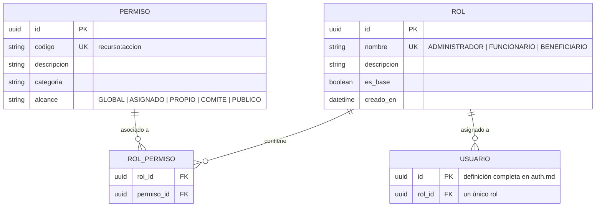
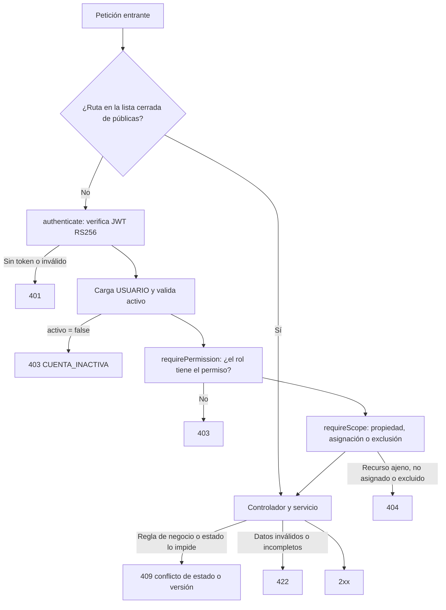

# Módulo: Roles y Permisos — RBAC y Control de Alcance

**Fase:** P1

## Objetivo
Implementar un Control de Acceso Basado en Roles con comprobación en dos niveles: **permiso** (¿el rol puede hacer esta acción?) y **alcance** (¿puede hacerla sobre este recurso?). Garantiza la separación de funciones entre `ADMINISTRADOR`, `FUNCIONARIO` y `BENEFICIARIO`: el Administrador gestiona y supervisa pero no evalúa; el Funcionario dictamina solo sobre expedientes con asignación activa propia; el Beneficiario solo accede a lo suyo. El backend es la única barrera real; el frontend solo oculta opciones.

Reglas de diseño (`DECISIONES §3`):
- Cada `USUARIO` tiene **un único rol** (`USUARIO.rol_id`); no existe `USUARIO_ROL`.
- **Los permisos no viajan en el JWT** (que lleva solo `sub`, `rol`, `jti`): se resuelven en el servidor desde la matriz rol→permiso, cargada en una caché en memoria al arrancar tras ejecutar el seed.
- La matriz es **de solo lectura en runtime**: se modifica únicamente editando `rbac.matrix.ts` y desplegando (el seed idempotente la sincroniza e invalida la caché). No hay endpoints de escritura de roles ni permisos.

## Archivos del Módulo

### Backend (`apps/api/src/modules/roles_permissions/`)
- `rbac.model.ts` — Tipos Prisma/TypeScript: `Rol`, `Permiso`, `RolPermiso`.
- `rbac.matrix.ts` — **Fuente única** de la matriz rol→permiso y de la regla de alcance de cada permiso (la usan el seed, la prueba de matriz y la documentación generada).
- `rbac.service.ts` — Resolución de permisos del rol (caché en memoria, `recargar()` tras el seed), cálculo de privilegios efectivos para `/auth/me` y utilidades de alcance.
- `rbac.controller.ts` — Consulta de roles, permisos y matriz.
- `rbac.routes.ts` — Rutas bajo `/api/v1/roles` y `/api/v1/permisos`.
- `rbac.middleware.ts` — `requirePermission(codigo)` y `requireScope(resolver)`; este último recibe una función por módulo que verifica propiedad o asignación y lanza `404`.
- `rbac.seed.ts` — Seed idempotente: tres roles base, catálogo de permisos y matriz; elimina permisos obsoletos y reemplaza `ROL_PERMISO` en transacción.
- `rls.ts` — Endurecimiento opcional: helper `withUserContext(tx, usuario)` que ejecuta `SET LOCAL app.usuario_id` y `SET LOCAL app.rol` dentro de la transacción Prisma (ver sección RLS).
- `__tests__/matrix.test.ts` — Prueba automática **rol × endpoint**: recorre el registro de rutas de Express y verifica código de respuesta esperado por rol.

### Compartido (`packages/shared/src/roles_permissions/`)
- `roles.ts` — Enum `Rol` (`ADMINISTRADOR | FUNCIONARIO | BENEFICIARIO`).
- `permisos.ts` — Constantes de los códigos `recurso:accion` (tipado para `requirePermission` y `can()`).

### Frontend (`apps/web/src/modules/roles_permissions/`)
- `components/RoleGuard.tsx` — Renderiza UI según rol/permisos (solo ergonomía, no seguridad).
- `components/PermisosMatrixView.tsx` — Vista de solo lectura de la matriz para el Administrador.
- `hooks/usePermissions.ts` — `can('evaluacion:dictaminar')` usando los permisos devueltos por `/auth/me`.
- `types/rbac.types.ts` — Tipos de UI.

## Endpoints Propuestos

| Método | Ruta | Descripción | Auth Requerida | Roles Permitidos |
|---|---|---|:---:|:---:|
| `GET` | `/api/v1/roles` | Lista los roles del sistema y sus descripciones | Sí | `ADMINISTRADOR` |
| `GET` | `/api/v1/roles/:id/permisos` | Lista los permisos de un rol | Sí | `ADMINISTRADOR` |
| `GET` | `/api/v1/permisos` | Catálogo de permisos con categoría y regla de alcance | Sí | `ADMINISTRADOR` |

Los permisos efectivos del usuario en sesión los entrega `GET /api/v1/auth/me` (→ `auth.md`), resueltos en el servidor en cada llamada.

## Modelos de Datos

## Matriz Oficial de Permisos por Rol

Leyenda: **✓** concedido, ✗ no concedido. Un `✓` concede el permiso de **rol**; la columna de alcance indica sobre qué recursos aplica. Un recurso fuera de alcance responde `404`.

### Cuentas, perfiles y habeas data
| Permiso | `ADMINISTRADOR` | `FUNCIONARIO` | `BENEFICIARIO` | Regla de alcance |
|---|:---:|:---:|:---:|---|
| `funcionario:crear` / `editar` / `estado` / `restablecer_clave` | **✓** | ✗ | ✗ | Global |
| `funcionario:consultar` | **✓** | ✗ | ✗ | Global |
| `administrador:consultar` / `estado` | **✓** | ✗ | ✗ | Global; protege al último administrador |
| `beneficiario:consultar` | **✓** (lectura global) | **✓** | ✗ | Funcionario: solo con asignación propia activa o histórica |
| `beneficiario:editar_perfil` | ✗ | ✗ | **✓** | Solo el titular (`/beneficiarios/me`) |
| `beneficiario:estado` / `corregir_documento` | **✓** | ✗ | ✗ | Global, con motivo y auditoría |
| `habeas_data:solicitar` | ✗ | ✗ | **✓** | Solo el titular |
| `habeas_data:gestionar` | **✓** | ✗ | ✗ | Global |

### Convocatorias y catálogos
| Permiso | `ADMINISTRADOR` | `FUNCIONARIO` | `BENEFICIARIO` | Regla de alcance |
|---|:---:|:---:|:---:|---|
| `convocatoria:crear` / `editar` / `habilitar` | **✓** | ✗ | ✗ | Global |
| `convocatoria:deshabilitar` / `rehabilitar` | **✓** | ✗ | ✗ | Global; con motivo |
| `convocatoria:ampliar` | **✓** | ✗ | ✗ | Exclusivo Administrador, con motivo, solo `CERRADA` antes de archivar |
| `convocatoria:archivar` | **✓** | ✗ | ✗ | Solo si todas las postulaciones están en estado terminal |
| `convocatoria:comite` | **✓** | ✗ | ✗ | Asignar/retirar funcionarios del comité (`ASIGNACION_FUNCIONARIO`) |
| `convocatoria:consultar` | **✓** | **✓** | **✓** | Beneficiario: solo `HABILITADA` vigente; Funcionario: las de su comité; Admin: todas |
| `catalogo:consultar` | **✓** | **✓** | **✓** | Público autenticado (lectura) |
| `catalogo:administrar` | **✓** | ✗ | ✗ | Beneficios, festivos, tipos de documento, requisitos |
| `configuracion:consultar` | **✓** | **✓** | ✗ | Funcionario: solo parámetros no sensibles |
| `configuracion:editar` | **✓** | ✗ | ✗ | Global, con auditoría |

### Postulaciones, documentos y formatos
| Permiso | `ADMINISTRADOR` | `FUNCIONARIO` | `BENEFICIARIO` | Regla de alcance |
|---|:---:|:---:|:---:|---|
| `postulacion:crear` / `editar` / `enviar` / `subsanar` / `desistir` / `eliminar_borrador` | ✗ | ✗ | **✓** | Solo el titular |
| `postulacion:consultar` | **✓** (lectura) | **✓** | **✓** | Admin: todas (auditado); Funcionario: asignación propia activa o histórica; Beneficiario: propias |
| `documento:subir` / `reemplazar` / `eliminar` | ✗ | ✗ | **✓** | Titular, solo en `BORRADOR` o `EN_CORRECCION` dentro del plazo |
| `documento:consultar` | **✓** | **✓** | **✓** | URL prefirmada de 300 s tras verificar alcance; cada entrega se audita |
| `formato:generar` | ✗ | ✗ | **✓** | Solo el titular (GE-F041, GE-F043) |

### Asignación y evaluación
| Permiso | `ADMINISTRADOR` | `FUNCIONARIO` | `BENEFICIARIO` | Regla de alcance |
|---|:---:|:---:|:---:|---|
| `asignacion:bandeja` | ✗ | **✓** | ✗ | Resumen mínimo del *pool* `PENDIENTE` de sus convocatorias y asignaciones propias |
| `asignacion:tomar` / `liberar` / `conflicto_interes` | ✗ | **✓** | ✗ | Miembro del comité de la convocatoria |
| `asignacion:reasignar` | **✓** | ✗ | ✗ | Individual y masiva; con motivo |
| `asignacion:consultar` | **✓** | ✗ | ✗ | Global (estado de carga y alertas por inactividad) |
| `evaluacion:revisar` / `dictaminar` | ✗ | **✓** | ✗ | Solo el titular de la asignación `ACTIVA`; excluido o ajeno → `404` |
| `evaluacion:consultar` | **✓** (lectura) | **✓** | ✗ | Admin: global; Funcionario: sus asignaciones |

### Labor social, seguimiento y notificaciones
| Permiso | `ADMINISTRADOR` | `FUNCIONARIO` | `BENEFICIARIO` | Regla de alcance |
|---|:---:|:---:|:---:|---|
| `labor_social:consultar` | **✓** | **✓** | **✓** | Beneficiario: propia; Funcionario: de su comité; Admin: global |
| `labor_social:registrar` | ✗ | ✗ | **✓** | Solo el titular con beneficio de labor social vigente |
| `labor_social:validar` | ✗ | **✓** | ✗ | Funcionario del comité de la convocatoria |
| `labor_social:gestionar` | **✓** | ✗ | ✗ | Global (correcciones y cierre) |
| `seguimiento:consultar` | **✓** | ✗ | **✓** | Beneficiario: sus `OTORGAMIENTO`; Admin: global |
| `seguimiento:desembolsar` | **✓** | ✗ | ✗ | Único punto de descifrado de datos de pago; auditado |
| `seguimiento:revocar` / `suspender` | **✓** | ✗ | ✗ | Con motivo y auditoría |
| `notificacion:consultar` / `marcar_leida` | **✓** | **✓** | **✓** | Solo las propias (cualquier usuario) |
| `notificacion:administrar` | **✓** | ✗ | ✗ | Plantillas, estado del outbox y reintentos |

### Dashboards, reportes y auditoría
| Permiso | `ADMINISTRADOR` | `FUNCIONARIO` | `BENEFICIARIO` | Regla de alcance |
|---|:---:|:---:|:---:|---|
| `dashboard:beneficiario` | ✗ | ✗ | **✓** | Datos propios |
| `dashboard:funcionario` | ✗ | **✓** | ✗ | Carga propia y promedio del comité; sin comparativa nominal |
| `dashboard:admin` | **✓** | ✗ | ✗ | Global, incluida la comparativa nominal por evaluador |
| `reportes:solicitar` | **✓** | **✓** | ✗ | Admin: global; Funcionario: convocatorias de su comité |
| `reportes:descargar` | **✓** | **✓** | ✗ | Solo reportes solicitados por el propio usuario |
| `auditoria:consultar` / `exportar` | **✓** | ✗ | ✗ | Global; la exportación genera `EXPORTACION` |

### Rutas públicas (sin permiso de rol)
`GET /publico/convocatorias` (+ `/:id`), `GET /publico/verificar/:codigo`, `GET /catalogos/consentimiento/vigente` y `POST /notificaciones/webhooks/correo` (firma HMAC) no requieren JWT; son parte de la lista cerrada de rutas públicas de `auth.md`.

## Flujo de Validación de Acceso (Middleware Chain)

Tabla única de respuestas (`DECISIONES §2`):

| Situación | Respuesta |
|---|---|
| Sin token / token inválido | `401` |
| Usuario inactivo | `403` `CUENTA_INACTIVA` |
| El **rol** no tiene el permiso | `403` |
| Rol con permiso pero recurso **ajeno / no asignado / excluido** | `404` |
| Regla de negocio o estado no permite la acción | `409` o `422` |

Ningún módulo usa `403` para recursos ajenos. `requirePermission` es la primera comprobación tras `authenticate`, de modo que un rol sin permiso siempre recibe `403` antes de que se consulte el recurso.

## Casos de Uso Especiales y Reglas de Seguridad

- **Segregación de deberes:** el Administrador no evalúa ni dictamina (no tiene `evaluacion:dictaminar` ni `asignacion:tomar`); el Funcionario no se auto-asigna convocatorias ni altera parámetros del sistema; el Beneficiario solo ve sus expedientes.
- **Prevención de enumeración:** si un funcionario pide una postulación que no le fue asignada, o de la que fue **excluido** por conflicto de interés, responde `404`.
- **Permisos fuera del JWT:** al cambiar la matriz (despliegue + seed) la caché se recarga y el cambio aplica en la siguiente petición, sin reautenticación. Con varias instancias, cada una recarga al arrancar tras el despliegue.
- **Rol inmutable:** los tres roles tienen `es_base = true`; no existen rutas para crearlos, renombrarlos o eliminarlos. Cambiar el rol de una cuenta no es una operación expuesta (el rol se fija al crear la cuenta).
- **Rutas sin declaración:** la prueba de matriz falla si una ruta no declara `requirePermission(...)` y no está en la lista de públicas (→ `auth.md`).
- **Auditoría:** las denegaciones por permiso no se auditan una a una (ruido); los accesos sensibles concedidos se registran como `LECTURA_SENSIBLE`, `DESCARGA_DOCUMENTO` y `EXPORTACION` (→ `auditoria.md`).

### Row Level Security (endurecimiento opcional)
RLS en PostgreSQL **no es el mecanismo principal de autorización** (lo son `requirePermission` y `requireScope`). Si se habilita (`CONFIG`/variable `RLS_ENABLED`), es defensa en profundidad:
- No se usa Supabase Auth ni `auth.uid()`. Cada transacción Prisma abre con `withUserContext`, que ejecuta `SET LOCAL app.usuario_id = '<uuid>'` y `SET LOCAL app.rol = '<rol>'`; las políticas leen `current_setting('app.usuario_id', true)`.
- Candidatas: `postulacion`, `documento` y `beneficiario` (política de propiedad para beneficiarios; el staff se resuelve por la capa de aplicación).
- La aplicación se conecta con un rol de BD sin `BYPASSRLS`; migraciones y jobs usan otro rol.
- Una consulta sin contexto devuelve cero filas (falla cerrada).

## Dependencias entre Módulos
- **`auth.md`**: provee `authenticate()` y `req.user` (`sub`, `rol`); consume `RbacService` para resolver permisos en `/auth/me`.
- **`accounts.md`**: fija el rol al crear la cuenta; aporta el alcance de lectura de perfiles.
- **`asignaciones.md`** y **`evaluacion.md`**: proveen el resolvedor de alcance de expedientes (`requireScope`).
- **`convocatorias.md`**: resolvedor de alcance por comité.
- **`auditoria.md`**, **`notificaciones.md`**, **`catalogos_configuracion.md`**: permisos de consulta/administración incluidos en la matriz.
- Todos los módulos declaran sus permisos con las constantes de `packages/shared/src/roles_permissions/permisos.ts`.

## Dependencias Externas
- `@prisma/client` — roles, permisos y matriz.
- `zod` — validación de parámetros.
- (Opcional) políticas RLS de PostgreSQL mediante migraciones SQL.

## Pruebas de Aceptación
- [ ] Un `BENEFICIARIO` que invoca `POST /api/v1/evaluacion/postulaciones/:id/dictamen` recibe `403`.
- [ ] Un `ADMINISTRADOR` que intenta dictaminar o tomar un expediente recibe `403` (segregación de funciones).
- [ ] Un `FUNCIONARIO` que consulta una postulación sin asignación propia recibe `404`, no `403`.
- [ ] Un `FUNCIONARIO` excluido por conflicto de interés recibe `404` al abrir ese expediente.
- [ ] Un `BENEFICIARIO` que consulta una postulación ajena recibe `404`; lista solo las propias.
- [ ] Un usuario con `activo = false` recibe `403 CUENTA_INACTIVA` antes de evaluar permisos.
- [ ] Sin token o con token inválido toda ruta protegida responde `401`.
- [ ] Cambiar la matriz en `rbac.matrix.ts`, desplegar y ejecutar el seed hace que el nuevo permiso aplique al siguiente request, sin reautenticar (el JWT no contiene permisos).
- [ ] El JWT decodificado contiene solo `sub`, `rol` y `jti`; `/auth/me` devuelve los permisos del rol.
- [ ] Ninguna ruta de la API carece de `requirePermission` salvo las de la lista cerrada de públicas (verificado por la prueba de matriz).
- [ ] El seed se ejecuta de forma idempotente sin duplicar roles, permisos ni `ROL_PERMISO`, y elimina permisos obsoletos.
- [ ] Un usuario tiene exactamente un rol (`USUARIO.rol_id`) y no existe la tabla `USUARIO_ROL`.
- [ ] La prueba parametrizada rol × endpoint cubre los códigos `401`, `403`, `404`, `409` y `422` esperados según la tabla de respuestas.
- [ ] Con `RLS_ENABLED`, una consulta de `postulacion` sin `app.usuario_id` devuelve cero filas y con el contexto de otro beneficiario no devuelve filas ajenas.
