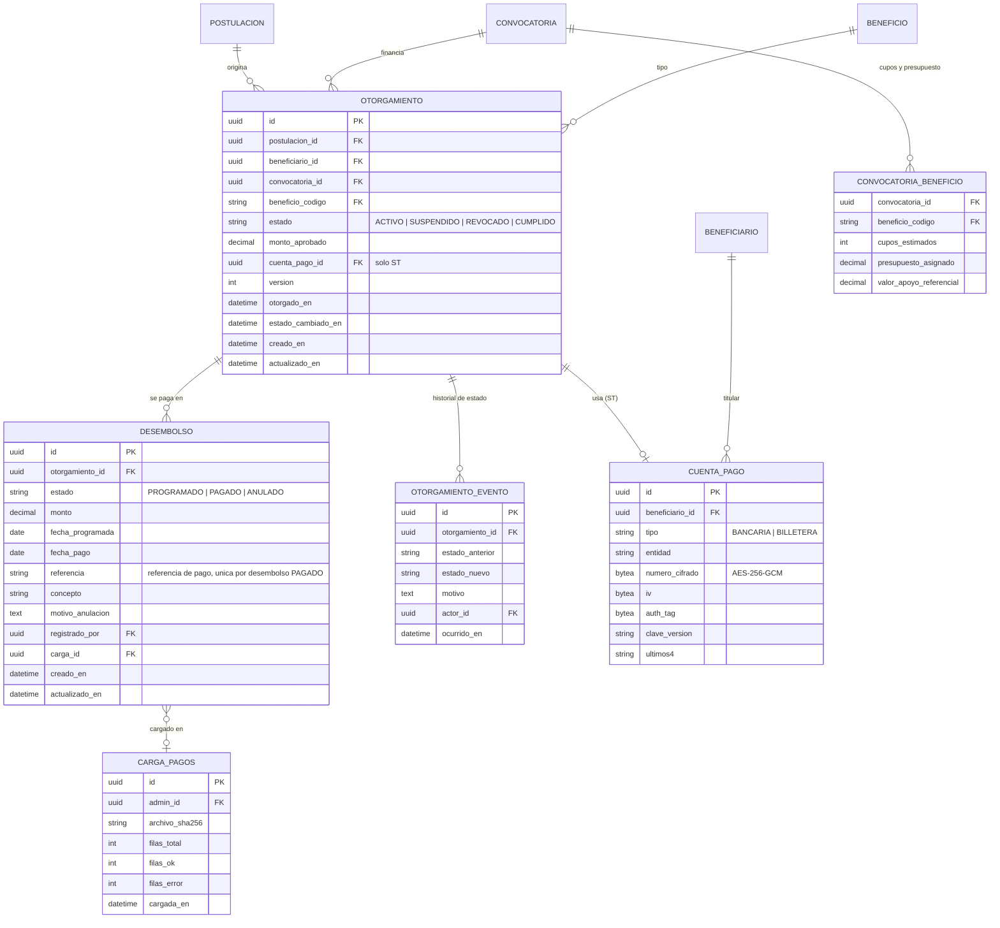
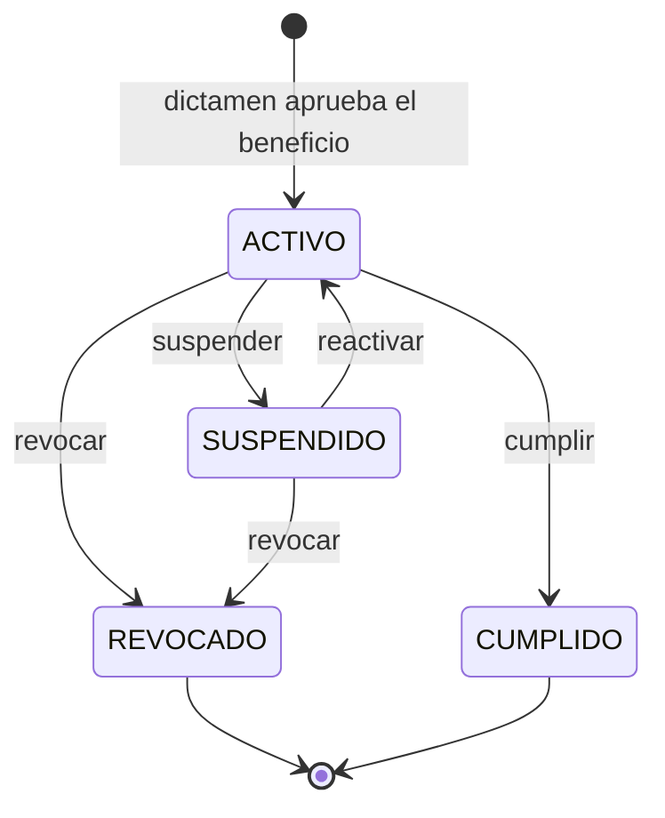
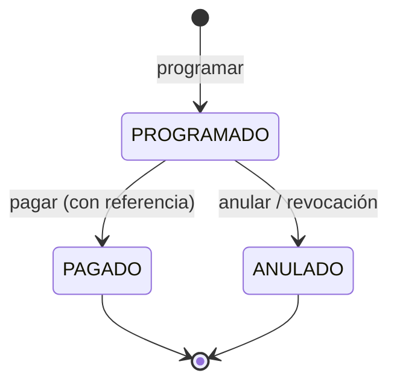
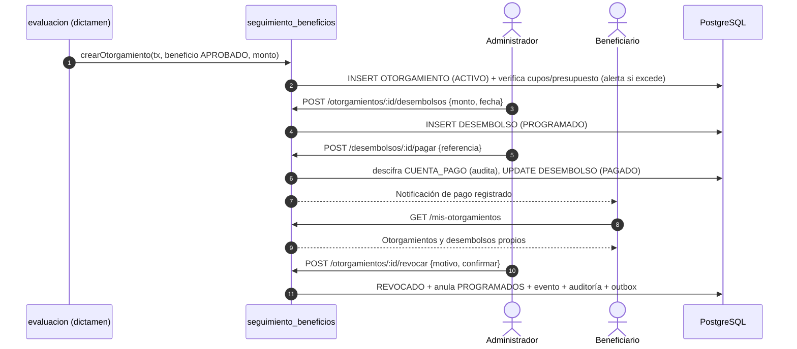

# Módulo: Seguimiento de Beneficios — Otorgamientos, Desembolsos y Elegibilidad

**Fase:** P2

## Objetivo
Gestionar la vida del apoyo **después de la aprobación**: el `OTORGAMIENTO` (uno por postulación y beneficio aprobado), su suspensión, revocación, reactivación o cumplimiento, y los `DESEMBOLSO` (programados, pagados o anulados) con su referencia de pago. Es el único módulo que **descifra** la cuenta de pago del subsidio de transporte (cifrada a nivel de campo), con auditoría de cada acceso. Controla cupos y presupuesto por convocatoria/beneficio, expone el servicio `validarElegibilidad` que consume `postulaciones` para los trámites `RENOVACION` y `REINTEGRO`, y alimenta las métricas de montos de los dashboards. La plataforma **no diligencia el pagaré**: ante una revocación solo registra la pérdida del apoyo, notifica y audita.

## Archivos del Módulo

### Backend
- `apps/api/src/modules/seguimiento_beneficios/otorgamiento.model.ts` — Entidades Prisma/TypeScript: `Otorgamiento`, `Desembolso`, `OtorgamientoEvento`, `CargaPagos`, enums `EstadoOtorgamiento` (`ACTIVO | SUSPENDIDO | REVOCADO | CUMPLIDO`), `EstadoDesembolso` (`PROGRAMADO | PAGADO | ANULADO`).
- `apps/api/src/modules/seguimiento_beneficios/otorgamiento.service.ts` — Lógica de negocio: `crearOtorgamiento()` (invocado por `evaluacion` en su transacción), cambios de estado con motivo, control de cupos/presupuesto, notificaciones y auditoría.
- `apps/api/src/modules/seguimiento_beneficios/desembolso.service.ts` — Programación y registro de desembolsos, anulación, carga masiva CSV, descifrado de cuenta de pago auditado.
- `apps/api/src/modules/seguimiento_beneficios/elegibilidad.service.ts` — `validarElegibilidad(beneficiario, convocatoria, tipo)` con reglas parametrizables.
- `apps/api/src/modules/seguimiento_beneficios/cupos.service.ts` — Cálculo de ocupación de cupos y presupuesto por `(convocatoria, beneficio)`.
- `apps/api/src/modules/seguimiento_beneficios/seguimiento.controller.ts` — Handlers Express administrativos y de consulta del beneficiario.
- `apps/api/src/modules/seguimiento_beneficios/seguimiento.routes.ts` — Rutas Express bajo `/api/v1/seguimiento`.
- `apps/api/src/modules/seguimiento_beneficios/seguimiento.dto.ts` — Schemas Zod: `CambiarEstadoOtorgamientoDto`, `ProgramarDesembolsoDto`, `RegistrarPagoDto`, `CargaPagosCsvDto`.
- `apps/api/src/modules/seguimiento_beneficios/seguimiento.serializer.ts` — DTO administrativo (cuenta enmascarada, descifrado solo en operación de pago) y DTO del beneficiario (`MiOtorgamientoDto`, sin actores ni motivos internos).
- `apps/api/src/modules/seguimiento_beneficios/seguimiento.metricas.ts` — Consultas agregadas de montos para dashboards (solo lectura).
- `apps/api/src/modules/seguimiento_beneficios/__tests__/seguimiento.test.ts` — Pruebas unitarias e integración con Jest + Supertest.
- `packages/shared/src/seguimiento_beneficios/` — Enums, esquemas Zod y columnas del CSV de pagos compartidos.

### Frontend
- `apps/web/src/modules/seguimiento_beneficios/components/OtorgamientosTable.tsx` — Tabla administrativa con filtros por convocatoria, beneficio, estado y búsqueda.
- `apps/web/src/modules/seguimiento_beneficios/components/OtorgamientoDetalle.tsx` — Detalle con línea de tiempo de estados y desembolsos.
- `apps/web/src/modules/seguimiento_beneficios/components/CambioEstadoModal.tsx` — Suspender / revocar / reactivar / cumplir con motivo obligatorio y confirmación.
- `apps/web/src/modules/seguimiento_beneficios/components/DesembolsoFormModal.tsx` — Programar y registrar desembolsos; muestra la cuenta de pago solo durante el registro del pago.
- `apps/web/src/modules/seguimiento_beneficios/components/CargaPagosCsvModal.tsx` — Carga masiva con vista previa y reporte de errores por fila.
- `apps/web/src/modules/seguimiento_beneficios/components/CuposPresupuestoPanel.tsx` — Ocupación de cupos y presupuesto por convocatoria/beneficio con alertas.
- `apps/web/src/modules/seguimiento_beneficios/components/MisBeneficiosPanel.tsx` — Vista del beneficiario: otorgamientos y desembolsos propios.
- `apps/web/src/modules/seguimiento_beneficios/hooks/useSeguimiento.ts` — Hooks de consulta y mutaciones.
- `apps/web/src/modules/seguimiento_beneficios/services/seguimientoApi.ts` — Cliente HTTP.
- `apps/web/src/modules/seguimiento_beneficios/types/seguimiento.types.ts` — Interfaces tipadas.

## Endpoints Propuestos

| Método | Ruta | Descripción | Auth | Roles | Alcance / errores |
|---|---|---|:---:|:---:|---|
| `GET` | `/api/v1/seguimiento/otorgamientos` | Lista paginada con filtros `convocatoria_id`, `beneficio`, `estado`, `q` | Sí | `ADMINISTRADOR` | `403` otros roles |
| `GET` | `/api/v1/seguimiento/otorgamientos/:id` | Detalle con desembolsos, eventos de estado y cuenta enmascarada | Sí | `ADMINISTRADOR` | `404` si no existe |
| `POST` | `/api/v1/seguimiento/otorgamientos/:id/suspender` | `{ motivo, version }`: `ACTIVO → SUSPENDIDO` | Sí | `ADMINISTRADOR` | `409` si el estado no lo permite |
| `POST` | `/api/v1/seguimiento/otorgamientos/:id/revocar` | `{ motivo, version, confirmar: true }`: `ACTIVO\|SUSPENDIDO → REVOCADO` (terminal) | Sí | `ADMINISTRADOR` | Anula desembolsos `PROGRAMADO`; notifica; audita |
| `POST` | `/api/v1/seguimiento/otorgamientos/:id/reactivar` | `{ motivo, version }`: `SUSPENDIDO → ACTIVO` | Sí | `ADMINISTRADOR` | `409` si está `REVOCADO` o `CUMPLIDO` |
| `POST` | `/api/v1/seguimiento/otorgamientos/:id/cumplir` | `{ motivo?, version }`: `ACTIVO → CUMPLIDO` (terminal) | Sí | `ADMINISTRADOR` | `409` con desembolsos `PROGRAMADO` pendientes salvo `forzar: true` |
| `POST` | `/api/v1/seguimiento/otorgamientos/:id/desembolsos` | Programa un desembolso `{ monto, fecha_programada, concepto }` | Sí | `ADMINISTRADOR` | `409` si el otorgamiento no está `ACTIVO`; `422` si el acumulado excede `monto_aprobado` |
| `POST` | `/api/v1/seguimiento/desembolsos/:id/pagar` | Registra el pago `{ referencia, fecha_pago, monto? }`: `PROGRAMADO → PAGADO` | Sí | `ADMINISTRADOR` | Descifra la cuenta y audita |
| `POST` | `/api/v1/seguimiento/desembolsos/:id/anular` | `{ motivo }`: `PROGRAMADO → ANULADO` | Sí | `ADMINISTRADOR` | `409` si ya `PAGADO` |
| `POST` | `/api/v1/seguimiento/desembolsos/carga-masiva` | Carga CSV de pagos (`multipart`, parámetro `dry_run`) | Sí | `ADMINISTRADOR` | Reporte por fila; todo-o-nada con `confirmar: true` |
| `GET` | `/api/v1/seguimiento/cupos` | Ocupación de cupos y presupuesto `?convocatoria_id=` | Sí | `ADMINISTRADOR` | — |
| `GET` | `/api/v1/seguimiento/mis-otorgamientos` | Otorgamientos propios del beneficiario autenticado con sus desembolsos | Sí | `BENEFICIARIO` | Solo propios; el ajeno responde `404` |
| `GET` | `/api/v1/seguimiento/mis-otorgamientos/:id` | Detalle de un otorgamiento propio | Sí | `BENEFICIARIO` | `404` si es de otro |

Notas:
- `crearOtorgamiento()` y `validarElegibilidad()` son **servicios internos** (sin endpoint), invocados por `evaluacion` y `postulaciones` respectivamente.
- Los cuerpos de cambio de estado incluyen `version` del otorgamiento (bloqueo optimista) y `motivo` de al menos 15 caracteres.
- `FUNCIONARIO` no tiene acceso a ninguna ruta de este módulo (`403`); su visión de montos se limita a las métricas de dashboards.

## Modelos de Datos

Restricciones:
- `UNIQUE(postulacion_id, beneficio_codigo)` en `OTORGAMIENTO`: un otorgamiento por beneficio aprobado.
- Estados terminales de `OTORGAMIENTO`: `REVOCADO` y `CUMPLIDO` (servicio + trigger de BD). Estados terminales de `DESEMBOLSO`: `PAGADO` y `ANULADO`.
- `CHECK(monto > 0)` y trigger que impide que `SUM(monto) FILTER (WHERE estado <> 'ANULADO')` supere `OTORGAMIENTO.monto_aprobado`.
- `UNIQUE(referencia)` parcial sobre desembolsos `PAGADO`, para evitar pagos duplicados.
- `OTORGAMIENTO_EVENTO` y `OTORGAMIENTO` son append-only en cuanto al historial: los cambios de estado siempre insertan un evento en la misma transacción.

## Máquinas de estado

## Flujo de Usuario Crítico

## Casos de Uso Especiales y Reglas de Negocio

### Creación del otorgamiento
- `crearOtorgamiento(tx, datos)` solo puede ser invocado por `evaluacion` dentro de la transacción del dictamen. Crea el registro `ACTIVO` con `monto_aprobado`, el `beneficiario_id` y la `convocatoria_id` de la postulación. Si la creación falla, el dictamen completo se revierte.
- Para el beneficio `ST` vincula la `CUENTA_PAGO` declarada por el beneficiario en su postulación. Sin cuenta válida el otorgamiento se crea igualmente, pero los desembolsos quedan bloqueados (`422 CUENTA_PAGO_FALTANTE`) hasta que se registre.

### Cambios de estado (solo Administrador)
- Suspender, revocar, reactivar y cumplir exigen `motivo` (≥ 15 caracteres) y `version`. La revocación exige además `confirmar: true`. Todo cambio inserta `OTORGAMIENTO_EVENTO`, audita (`OTORGAMIENTO_SUSPENDIDO`, `OTORGAMIENTO_REVOCADO`, `OTORGAMIENTO_REACTIVADO`, `OTORGAMIENTO_CUMPLIDO`) y encola notificación en la misma transacción.
- **Suspensión:** impide programar y pagar desembolsos; los `PROGRAMADO` existentes quedan retenidos (no se pagan mientras el otorgamiento no esté `ACTIVO`) y reanudan al reactivar.
- **Revocación:** estado terminal. Anula los desembolsos `PROGRAMADO` (motivo "Revocación del otorgamiento"); los `PAGADO` se conservan intactos. Notifica al beneficiario (correo principal y alternativo/acudiente). Registra la pérdida del apoyo; **la plataforma no diligencia el pagaré ni gestiona el cobro**: eso se realiza por el procedimiento institucional fuera del sistema. El motivo detallado es interno; el beneficiario recibe un texto de plantilla fija firmado "Equipo FOEST".
- **Cumplimiento:** estado terminal; indica que el beneficio se ejecutó completo. Se rechaza si hay desembolsos `PROGRAMADO` pendientes, salvo `forzar: true` (que los anula con motivo).
- Una postulación `APROBADA` con otorgamientos `REVOCADO` mantiene su estado (terminal); el efecto se refleja solo en el otorgamiento.

### Desembolsos y cuenta de pago
- **Programar:** solo con otorgamiento `ACTIVO`; la suma de desembolsos no anulados no puede superar `monto_aprobado` (`422`). Fecha programada hábil o futura según `shared/business-days`.
- **Pagar:** el Administrador registra `referencia` (obligatoria, única) y fecha; el sistema descifra la cuenta, la presenta una sola vez en la respuesta de preparación del pago y registra la auditoría `CUENTA_PAGO_DESCIFRADA` (actor, otorgamiento, desembolso, finalidad). Los listados y detalles muestran siempre la cuenta enmascarada (`ultimos4`).
- **Cifrado a nivel de campo:** AES-256-GCM, clave por entorno/KMS con `clave_version` (`shared/crypto`); el descifrado está **restringido a `desembolso.service.ts`**. Ningún otro módulo (ni `evaluacion`) importa la función de descifrado; una regla de lint y una prueba lo verifican. Los logs nunca registran el valor en claro.
- **Anular:** solo `PROGRAMADO`, con motivo; un pago ya registrado no se anula (se corrige por proceso contable externo y se anota en el otorgamiento).
- **Carga masiva CSV:** columnas `otorgamiento_id|codigo_expediente, desembolso_id?, monto, fecha_pago, referencia`. Primero `dry_run` produce el reporte por fila (errores de formato, referencia duplicada, monto excedido, otorgamiento no `ACTIVO`); la confirmación aplica **todo o nada** en una transacción y guarda `CARGA_PAGOS` con el SHA-256 del archivo (la misma carga no se aplica dos veces). Saneamiento contra inyección de fórmulas CSV al exportar errores; tamaño máximo y número de filas configurables. Genera el evento `EXPORTACION`/`CARGA_PAGOS` en auditoría.

### Cupos y presupuesto
- Para cada `(convocatoria, beneficio)` se calcula ocupación: `cupos_ocupados = COUNT(OTORGAMIENTO)` en estados `ACTIVO|SUSPENDIDO|CUMPLIDO` y `presupuesto_comprometido = SUM(monto_aprobado)` de los mismos; `presupuesto_pagado = SUM(DESEMBOLSO.monto)` en `PAGADO`. Se comparan con `cupos_estimados` y `presupuesto_asignado` de `CONVOCATORIA_BENEFICIO`.
- **Solo alerta, no bloquea:** al exceder cupos o presupuesto, `crearOtorgamiento()` **no impide** el dictamen. Genera una alerta persistente al Administrador (`NOTIFICACION` + evento `CUPO_EXCEDIDO` / `PRESUPUESTO_EXCEDIDO`) y marca el otorgamiento con `excede_cupo`/`excede_presupuesto` para su revisión. La **programación del primer desembolso** de un otorgamiento marcado exige confirmación explícita del Administrador (`confirmar_excedente: true` con motivo), que queda auditada.
- Umbral de pre-alerta configurable (`CONFIG.ALERTA_PRESUPUESTO_PORCENTAJE`, valor inicial propuesto: 90 %).

### Elegibilidad `RENOVACION` y `REINTEGRO`
- Servicio `validarElegibilidad(beneficiario, convocatoria, tipo)` → `{ elegible: boolean, motivos: string[], otorgamiento_referencia_id? }`. Lo consume `postulaciones` **al crear la postulación** (`PRIMERA_VEZ` siempre devuelve elegible, sujeto a la regla de postulación única por convocatoria). Una respuesta no elegible produce `422 NO_ELEGIBLE` con los motivos.
- Reglas por defecto (parametrizables en `CONFIG`; **a confirmar con el Acuerdo 023**):
  - `RENOVACION`: existe un `OTORGAMIENTO` del beneficiario con estado `ACTIVO` o `CUMPLIDO` en la **convocatoria inmediatamente anterior** (por `anio, semestre`).
  - `REINTEGRO`: existe un `OTORGAMIENTO` previo del beneficiario que no esté `REVOCADO` y **al menos un período (convocatoria) sin apoyo** posterior a él y anterior a la actual.
- Claves de configuración: `ELEGIBILIDAD_RENOVACION_ESTADOS`, `ELEGIBILIDAD_REINTEGRO_PERIODOS_SIN_APOYO_MIN`, `ELEGIBILIDAD_REINTEGRO_EXCLUYE_REVOCADOS`. Cambiar la configuración no afecta postulaciones ya creadas.
- Los otorgamientos `REVOCADO` nunca habilitan `RENOVACION` ni `REINTEGRO` en la configuración por defecto.

### Métricas
- `seguimiento.metricas.ts` expone consultas de solo lectura a los dashboards (`admin_dashboard`, `dashboard_funcionario`, `beneficiario_dashboard`): montos aprobados, comprometidos y pagados por convocatoria/beneficio/estado, ocupación de cupos y presupuesto, otorgamientos por estado. Las agregaciones de montos y ocupación salen de `OTORGAMIENTO` y `DESEMBOLSO`; el K-anonimato (`DECISIONES.md` §15) se aplica en el módulo de dashboards, no aquí.

### Vista del beneficiario
- `GET /seguimiento/mis-otorgamientos` devuelve solo los otorgamientos propios con `MiOtorgamientoDto`: beneficio, estado, `monto_aprobado`, desembolsos (estado, monto, fechas, referencia) y cuenta **enmascarada**. Un otorgamiento ajeno responde `404`. No incluye motivos internos, actores ni identificación de evaluadores.

### Notificaciones y auditoría
- Notificaciones (outbox + `NOTIFICACION`): otorgamiento creado, desembolso programado o pagado, suspensión, reactivación, revocación y cumplimiento (al beneficiario, correo principal y alternativo/acudiente); alertas de cupos/presupuesto y resultados de cargas masivas (al Administrador).
- Auditoría: `OTORGAMIENTO_CREADO`, cambios de estado, `DESEMBOLSO_PROGRAMADO`, `DESEMBOLSO_PAGADO`, `DESEMBOLSO_ANULADO`, `CUENTA_PAGO_DESCIFRADA`, `CARGA_PAGOS`, `CUPO_EXCEDIDO`, `PRESUPUESTO_EXCEDIDO`, `LECTURA_SENSIBLE` en detalle administrativo. Todos con `auditar(tx, evento)` dentro de la transacción.

## Dependencias entre Módulos
- **`evaluacion.md`**: invoca `crearOtorgamiento()` en la transacción del dictamen. `seguimiento_beneficios` no importa de `evaluacion`.
- **`postulaciones.md`**: consume `validarElegibilidad()` al crear la postulación; este módulo lee `POSTULACION` y `POSTULACION_BENEFICIO` (solo lectura) y la cuenta de pago declarada.
- **`convocatorias.md`**: lee `CONVOCATORIA_BENEFICIO` (`cupos_estimados`, `presupuesto_asignado`, `valor_apoyo_referencial`) y el orden de períodos.
- **`accounts.md`**: datos de contacto del beneficiario para notificaciones.
- **`catalogos_configuracion.md`**: parámetros de elegibilidad, alertas y `FESTIVO`.
- **`notificaciones.md`**, **`auditoria.md`**: outbox y eventos.
- **Dashboards** (`admin_dashboard`, `dashboard_funcionario`, `beneficiario_dashboard`) y `export_reports`: solo leen las métricas de este módulo.

Conforme al grafo de `DECISIONES.md` §16: `postulaciones → seguimiento_beneficios` (elegibilidad) y `evaluacion → seguimiento_beneficios`; este módulo no depende de ellos.

## Dependencias Externas
- `@prisma/client`: transacciones y restricciones.
- `shared/crypto`: cifrado/descifrado AES-256-GCM (clave por entorno/KMS).
- `csv-parse` (o `papaparse` en servidor): lectura del CSV de pagos con límites de tamaño.
- `multer` (memoria, límite de tamaño): recepción del archivo.
- `zod`: validación de motivos, montos, fechas y filas.
- `shared/outbox`, `shared/audit`, `shared/business-days`.

## Pruebas de Aceptación
- [ ] Al aprobar un beneficio en el dictamen se crea un `OTORGAMIENTO` `ACTIVO` con el `monto_aprobado`; con aprobación parcial solo existe para los beneficios aprobados; si falla, el dictamen se revierte.
- [ ] Dos otorgamientos para el mismo `(postulacion_id, beneficio_codigo)` son rechazados por la restricción única.
- [ ] `FUNCIONARIO` y `BENEFICIARIO` reciben `403` en las rutas administrativas; el administrador recibe `200`.
- [ ] Un beneficiario ve solo sus otorgamientos; consultar el de otro responde `404`.
- [ ] Suspender, revocar y reactivar sin `motivo` suficiente (< 15 caracteres) responden `422`; revocar sin `confirmar: true` responde `422`.
- [ ] Un otorgamiento `REVOCADO` o `CUMPLIDO` rechaza cualquier cambio de estado con `409` (servicio y trigger).
- [ ] Reactivar solo es posible desde `SUSPENDIDO`; con otorgamiento `SUSPENDIDO` no se pueden programar ni pagar desembolsos (`409`).
- [ ] La revocación anula los desembolsos `PROGRAMADO`, conserva los `PAGADO`, notifica al beneficiario con plantilla fija "Equipo FOEST", audita el evento y **no** genera ni diligencia ningún documento de pagaré.
- [ ] No se puede programar desembolsos cuya suma supere `monto_aprobado` (`422`).
- [ ] Registrar un pago con referencia ya usada responde `409`; un desembolso `PAGADO` no puede anularse.
- [ ] La cuenta de pago se descifra solo al registrar el pago, genera el evento `CUENTA_PAGO_DESCIFRADA`, y en cualquier listado o detalle aparece solo enmascarada; una prueba verifica que ningún otro módulo importa la función de descifrado.
- [ ] La carga masiva con `dry_run` reporta errores por fila sin escribir nada; la confirmación aplica todo o nada y la misma carga (mismo SHA-256) no se puede aplicar dos veces.
- [ ] Al superar cupos o presupuesto de un `(convocatoria, beneficio)` el dictamen **no se bloquea**, se genera la alerta al Administrador y el primer desembolso exige `confirmar_excedente` con motivo.
- [ ] `validarElegibilidad` para `RENOVACION` devuelve elegible solo con otorgamiento `ACTIVO` o `CUMPLIDO` en la convocatoria anterior; con `REVOCADO` o sin otorgamiento devuelve `422 NO_ELEGIBLE` al crear la postulación.
- [ ] `validarElegibilidad` para `REINTEGRO` exige un otorgamiento previo no `REVOCADO` y al menos un período sin apoyo; cambiar la configuración modifica el resultado sin alterar postulaciones existentes.
- [ ] Las métricas de montos (aprobado, comprometido, pagado) por convocatoria y beneficio coinciden con la suma de `OTORGAMIENTO` y `DESEMBOLSO`.
- [ ] Cada cambio de estado, desembolso y descifrado queda registrado en auditoría con actor y motivo, y los correos se encolan en el outbox en la misma transacción.
